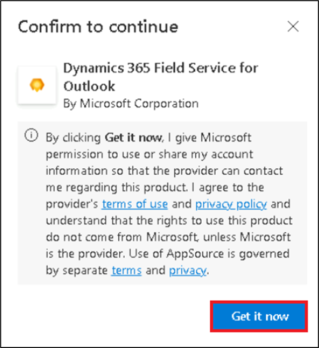
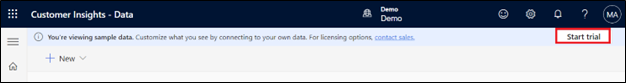

Laboratório 0: Configurando o ambiente de laboratório

Exercício 1: Atribuir licença de teste para o Power Apps

1.  Abra um navegador da Web em sua VM e vá para
    [**https://powerapps.microsoft.com/en-us/free/**](urn:gd:lg:a:send-vm-keys)

> 

2.  Selecione **Start free**.

> 

3.  Insira sua credencial de administrador do Office 365, marque a caixa
    de seleção para aceitar o contrato e clique em **Start your free
    trial**.

> 
>
> **Observação:** verifique se você inseriu a credencial de
> administrador corretamente. Ao colar, você pode perder alguns
> caracteres, então você precisa inseri-los manualmente.

4.  Selecione **Yes** na janela **Stay signed-in**.

> 

5.  Se solicitado, forneça as **Contact Information** conforme abaixo e
    selecione **Submit**.

> Email: **Office 365 admin tenant credentials**
>
> Country/region: **United States**
>
> Phone number: **Your phone number**
>
> 

6.  Agora você pode ver a **página inicial do Power Apps** e o ambiente
    de desenvolvedor **Dev One** foi criado para você.

> 

7.  Abra a nova guia e vá para o centro de administração do Power
    Platform navegando até
    [**https://admin.powerplatform.microsoft.com**](urn:gd:lg:a:send-vm-keys)
    e, se necessário, entre usando suas credenciais de administrador de
    locatários do Office 365. **Feche** a **janela pop-up** dizendo
    ‘Welcome to the new Power Platform admin center’.

> 

8.  No painel de navegação esquerdo, selecione
    **Manage** \> **Environments** e, em seguida, você pode ver que o
    **Dev One** é o seu ambiente do Dataverse.

> 

9.  Agora você pode prosseguir para o próximo exercício.

Exercício 2: Criar uma equipe no Microsoft Teams e habilitar a
Transcrição no Teams

Tarefa 1: Criar uma equipe no Microsoft Teams

1.  Entre no Microsoft Teams usando https://teams.microsoft.com/ com
    suas credenciais de locatário do Office 365.

2.  Em **Get to know Teams**, selecione **Get Started**. Feche a janela
    que está solicitando a leitura do código QR.

> 
>
> 

3.  No lado esquerdo do Teams, clique em **Teams**, em seguida, clique
    em **+** para **Join or create a team**.

> 

4.  Clique em **Create team**.

> 

5.  Insira o Team name como [**Test Team**](urn:gd:lg:a:send-vm-keys).
    No campo **Name the first channel,** digite
    [**TestChannel**](urn:gd:lg:a:send-vm-keys) e clique em **Private**.

> 

- Selecione **Org-wide**.

> 

- Selecione **Create**.

> 

Tarefa 2: Habilitar a transcrição no Teams

1.  Entre no **Microsoft Teams admin center
    [https://admin.teams.microsoft.com/dashboard](urn:gd:lg:a:send-vm-keys)**.

2.  No painel de navegação esquerdo, selecione **Meetings \> Meeting
    policies**.

> 

3.  Selecione **Global (Org-wide default) policy** na guia **Manage
    policies**.

> 

4.  Na seção **Recording and transcription**, alterne o botão
    **Transcription** para **On** e, em seguida, selecione **Save**.

> 

5.  Selecione **Confirm** para fazer alterações.

> 

6.  No painel de navegação à esquerda, selecione **Live events
    policies** em **Meetings**. Selecione a política **Global (Org-wide
    default)**.

> 

7.  Altere o botão **Transcription for attendees** para **On** e, em
    seguida, selecione **Save**.

> 

8.  Selecione **Confirm** para fazer alterações.

> 

9.  No painel de navegação à esquerda, em **Voice**, selecione **Calling
    policies**. Selecione a política **Global (Org-wide default)**.

> 

10. Altere **Transcription** para **On** e, em seguida, selecione
    **Save**.

> 

11. Selecione **Confirm** para fazer alterações.

> 

12. No painel de navegação à esquerda, em **Voice**, selecione
    **Voicemail policies**. Selecione a política **Global (Org-wide
    default)**.

> 

13. Altere **Mask profanity in voicemail transcription** para **On** e,
    em seguida, selecione **Save**.

> 

14. Selecione **Confirm** para fazer alterações.

> 

Exercício 3: Atribuir a licença de teste para o Customer Service e
ativar o Copilot

Tarefa 1: Atribuir a licença de teste para o Customer Service

1.  Abra seu navegador, navegue até
    [**https://dynamics.microsoft.com/en-in/customer-service/overview/**](urn:gd:lg:a:send-vm-keys)
    e selecione **Try for free**.

> 

2.  Insira suas **credenciais de locatário de administrador do Office
    365**, selecione a caixa de seleção para **aceitar o acordo** e
    clique em **Start your free trial**.

> [**admin@M365xXXXXXX.onmicrosoft.com**](urn:gd:lg:a:send-vm-keys)
>
> [**MyAdminPassword**](urn:gd:lg:a:send-vm-keys)
>
> 

3.  Forneça as **Contact Information** conforme abaixo e, em seguida,
    selecione **Submit**.

> Country/region: **United States**
>
> Phone number: **Your phone number**
>
> 

4.  Se solicitado, insira sua **senha de locatário de administrador do
    Office 365**.

> 

5.  Se a tela pop-up aparecer, clique em Launch Trail.

> 

6.  Você será direcionado para o **portal Customer Service Workspace**.

> 

7.  Vá para o **Power Platform admin center** navegando até
    [**https://admin.powerplatform.microsoft.com/**](urn:gd:lg:a:send-vm-keys)
    e, se necessário, entre usando suas credenciais de **administrador
    de locatários do Office 365**. No painel de navegação esquerdo,
    clique em **Manage** \> **Environments** e, em seguida, você pode
    ver que o ambiente **Customer Service Trial foi criado**.

> 

Tarefa 2: Ativar o recurso Copilot

1.  Navegue de volta ao portal **Customer Service workspace**. Selecione
    **Customer Service workspace** no topo.

> 

2.  Em **Apps**, selecione **Copilot Service Admin Center**
    (anteriormente, **Customer Service Admin Center**).

> 

3.  Selecione **Productivity** em **Support experience**.

> 

4.  No painel **Produtividade**, selecione **Gerenciar** para **o
    Copilot para perguntas e e-mails**.

> 

5.  Primeiro, marque a caixa de seleção **Include your organization’s
    knowledge base or SharePoint site as a source** em **Knowledge
    sources**, depois selecione as caixas **Ask a question**, **Suggest
    a response** e **Help pane – write an email**. Role para baixo e
    selecione a caixa de seleção **Let representative translate
    responses** em **Translation**.

> 
>
> 
>
> 

6.  Selecione **Save and close**.

> 

7.  Selecione **Manage** para **Summaries**.

> 

8.  Se solicitado, forneça seu consentimento para usar o Copilot e
    selecione **Opt in** para continuar com a configuração.

> 

9.  Selecione a caixa de seleção **Make case summaries available to
    agents**, marque todas as caixas em **Live conversation summaries**
    e, em seguida, selecione **Save and close**.

> 

Exercício 4: Atribuir a licença de teste para o Field Service e instale
o Field Service Outlook Add-in.

Tarefa 1: Atribuir licença de teste para o Field Service

1.  Navegue até a **página do** **produto Field Service** usando o link
    [**fornecido
    https://www.microsoft.com/en-us/dynamics-365/products/field-service**](urn:gd:lg:a:send-vm-keys)
    e selecione o botão **Try for free**.

> 

2.  Se você for direcionado para a **página de testes gratuitos do**
    **Dynamics 365**, selecione **Dynamics 365 Field Service** e clique
    em **Try for free**, caso contrário, vá para o próximo passo.

> 

3.  Digite seu nome de usuário de **locatário administrador do Office
    365**, marque a caixa de seleção do **service agreement** e, em
    seguida, selecione **Start your free trial**.

> 

4.  Insira as **Contact Information** conforme indicado abaixo e clique
    em **Submit**.

    - Country/region: **United States**

    - Phone number: **Your phone number**

> 

5.  Se aparecer um pop-up com a mensagem **Launch trial**, clique em
    **Launch Trial**. Ou, se aparecer um pop-up sobre **What’s new**,
    **feche-o**.

> 
>
> 

6.  Você será direcionado para o portal do **Dynamics 365 Field
    Service**.

> 

7.  Vá para o **centro de administração do Power Platform** navegando
    até
    [**https://admin.powerplatform.microsoft.com/**](urn:gd:lg:a:send-vm-keys)
    e, se necessário, entre usando suas credenciais de **administrador
    de locatários do Office 365**. No painel de navegação esquerdo,
    clique em **Gerenciar Ambientes \>** e, em seguida, você poderá ver
    que o **ambiente de Field Service Trial** foi criado.

> 

Tarefa 2: Instalar o Field Service Outlook Add-in com o Copilot

1.  Navegue até [**admin.microsoft.com**](urn:gd:lg:a:send-vm-keys) e
    selecione **Show all**, depois, em **Settings**, clique em
    **Integrated apps**. Role para baixo, clique em **Get apps** e
    pesquise por **field service**.

> 
>
> 
>
> 

2.  Na caixa de pesquisa, digite **Field service** e clique em **Get it
    now** em **Dynamics 365 Field Service for Outlook**. Em seguida,
    clique novamente em **Get it now** no pop-up **Confirm your
    information**.

> 
>
> 

3.  Você será direcionado para **Microsoft Admin center \> Integrated
    Apps**. Na página **Assign users**, selecione **Entire
    organization** e, em seguida, clique em **Next**.

> 

4.  Na página **Accept permission requests**, selecione **Accept
    permissions**.

> 

5.  Entre com suas credenciais de **locatário de administrador do Office
    365** na janela pop-up.

> 

6.  Selecione **Next** na página **Accept permission requests**.

> 

7.  Na página **Review and finish deployment**, selecione **Finish
    deployment**.

> 

8.  Selecione **Done** quando a implementação for concluída.

> 

Pode levar até 72 horas para que o aplicativo apareça no Outlook.

Exercício 5: Obter a licença de teste para o Sales Copilot e instalar o
Sales Copilot add-in para Outlook

Tarefa 1: Inscreva-se para um teste gratuito do Dynamics 365 Sales

1.  Vá para a página **Sales overview** usando o
    https://www.microsoft.com/en-us/dynamics-365/products/sales de URL
    fornecido e selecione **Try for free**.

> 

2.  Na página de **testes gratuitos do** **Dynamics 365**, selecione
    **Dynamics 365 Sales** e clique em **Try for free**.

> 

3.  Insira suas credenciais de **locatário de administrador do Office
    365**, marque a caixa de seleção **accept the agreement** e clique
    em **Start your free trial**.

> 

4.  Insira as **Contact Information** conforme indicado abaixo e clique
    em Submit.

- **Country/region**: United States

- **Phone number**: Your phone number

> 

5.  Se solicitado, insira sua senha de **locatário de administrador do
    Office 365**.

> 

6.  Selecione **Launch trial** na janela pop-up.

> 

7.  Você será direcionado para o portal do **Dynamics 365 Sales**.

> 

8.  Vá para o **centro de administração do Power Platform** navegando
    até
    [**https://admin.powerplatform.microsoft.com**](urn:gd:lg:a:send-vm-keys)
    e, se necessário, entre usando suas credenciais de administrador de
    locatários do Office 365. No painel de navegação esquerdo, clique em
    **Manage** \> **Environments** e, em seguida, você pode ver que o
    **ambiente de avaliação de vendas** foi criado.

> 

Tarefa 2: Instalar o Sales Copilot add-in para Outlook

1.  Entre no **Centro de administração do Microsoft 365** com o link
    fornecido
    [**https://admin.microsoft.com/**](urn:gd:lg:a:send-vm-keys).

2.  No painel esquerdo, selecione **Settings \> Integrated apps**.

> 

3.  Na página **Integrated apps**, selecione **Get apps**. O **Microsoft
    AppSource** será aberto em uma janela incorporada.

> 

4.  Na janela do **AppSource**, pesquise por **Copilot for sales**.

5.  Nos resultados da pesquisa, selecione **Copilot for Sales** e, em
    seguida, clique em **Get it now**.

> 

6.  Na página **Confirm to continue**, selecione **Get it now**.

> 

7.  Na etapa de **Configuration**, selecione **Next** na janela **Apps
    to deploy**.

> 

8.  Na etapa **Add Users**, selecione **Entire organization** em
    **Assign users** e, em seguida, clique em **Next**.

> 

9.  Na etapa **Deployment (Permissions)**, leia as permissões e
    capacidades do aplicativo a ser implantado, e selecione **Accept
    permissions for Copilot for Sales**.

> 
>
> 

10. Faça login com suas credenciais de **locatário de administrador do
    Office 365** na janela pop-up.

> 

11. Selecione **Next** na página **Accept permission requests**.

> 

12. Na etapa **Deployment (Finish)**, revise as configurações
    selecionadas e, em seguida, selecione **Finish deployment**.

> 

13. Quando a implementação for concluída, selecione **Done**.

> 

Aguarde até seis horas para que o Sales Copilot apareça na faixa de
opções do Outlook dos usuários.

Exercício 6: Inscreva-se para o período de teste e autorize o uso do
Copilot no Customer Insights - Data

Tarefa 1: Inscreva-se para testar

1.  Vá para
    [**https://dynamics.microsoft.com/en-us/ai/customer-insights/**](urn:gd:lg:a:send-vm-keys)
    escolha o botão **Try for free**.

> 

2.  Insira suas **credenciais de administrador do Office 365**, marque a
    caixa de seleção **accept the agreement** e clique em **Start your
    free trial**.

> [**admin@M365xXXXXXX.onmicrosoft.com**](urn:gd:lg:a:send-vm-keys)
>
> [**MyAdminPassword**](urn:gd:lg:a:send-vm-keys)
>
> 

3.  Insira sua **senha** do locatário de administrador do Office 365.

> 

4.  Selecione **Yes** na janela **'Stay signed in?'**.

> 

5.  Selecione **United States** no campo **Country/region**, insira seu
    **phone number** e, em seguida, selecione **Submit**.

> 

Observação: Se o pop-up Launch trial aparecer, clique no botão Launch
trial.

6.  Escolha **Start Customer Insights - Data.**

> 

7.  Selecione **United States** no campo **Country/region** e, em
    seguida, clique em **Continue**.

> 

8.  Selecione **Start trial** no canto superior direito. Se você receber
    a mensagem de erro **‘Couldn’t create environment’**, siga os passos
    (a até f) indicados abaixo e, em seguida, continue com o Step 9.

> 
>
> a\. Acesse seu ambiente do **Customer Insights - Data** usando o link
> fornecido
> [**https://home.ci.ai.dynamics.com/**](urn:gd:lg:a:send-vm-keys).
> Selecione **Sign up for trial**.
>
> 
>
> b\. **Inscreva-se** usando as credenciais de locatário do **Office
> 365** fornecidas e selecione **Next**.
>
> 
>
> c\. Selecione **Sign in**.
>
> 
>
> d\. Insira **Country/region** como **United States**, seu **job
> title** e **phone number**. Em seguida, selecione **Get Started**.
>
> 
>
> e\. Selecione **Get Started**.
>
> 
>
> f\. Você estará na **página inicial** do portal **Customer Insights –
> Data**. Agora, selecione **Start trial**.
>
> 

9.  Você verá que o ambiente **Marketing Trial** está sendo criado para
    você, e agora pode ir diretamente para a etapa nº 13. Caso o
    ambiente não seja criado e seja solicitado o preenchimento das
    **Basic information**, insira [**Marketing
    Trial**](urn:gd:lg:a:send-vm-keys) no campo **Name,** selecione
    **United States** no campo **Region,** e então selecione **Next**.

> 

10. Selecione **Next** na página **Data storage**.

> 

11. Selecione seu **Dataverse environment** e clique em **Next**.

> 

12. Examine as informações na página **Review** e selecione **Create**.

> 

13. Pode levar algum tempo para criar seu ambiente.

> 

14. Agora você pode ver que seu ambiente está nomeado como **Marketing
    Trial**.

> 

Tarefa 2: Autorizar o uso do Copilot no Customer Insights - Dados

1.  Vá para **Settings** \> **System**.

> 

2.  Selecione a guia **Consent**.

> 

3.  **Ative** a opção **Enable Copilot features powered by Azure
    OpenAI** e, em seguida, selecione **Save.** Ignore se o botão já
    estiver ativado.

> 

Observação: pode levar algum tempo para o aplicativo aparecer no portal
Customer Service - Data.
