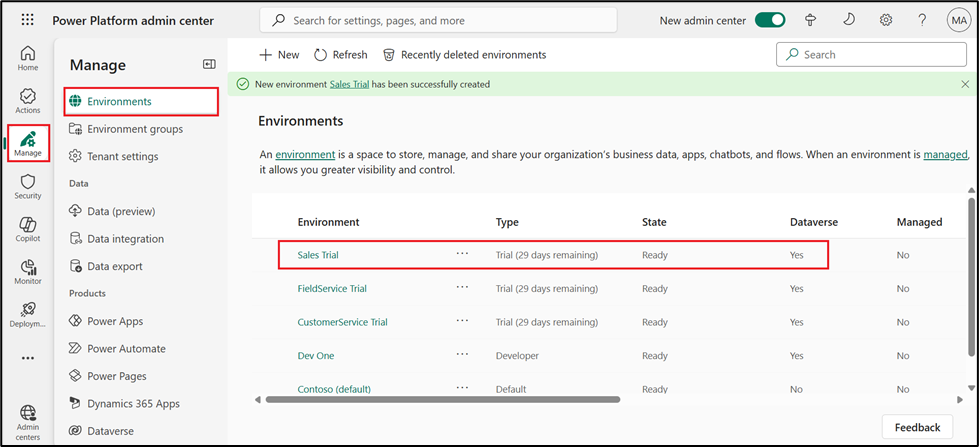

Laboratorio 0: Configuración del entorno de laboratorio

Ejercicio 1: Asignación de licencia de prueba de Power Apps

1.  Abra un navegador web en su máquina virtual y vaya a
    [**https://powerapps.microsoft.com/en-us/free/**](urn:gd:lg:a:send-vm-keys)

> 

2.  Seleccione **Start free**.

> 

3.  Ingrese sus credenciales de administrador de Office 365, marque la
    casilla de verificación para aceptar el acuerdo y haga clic en
    **Start your free trial**.

> 
>
> **Nota:** Verifique que haya ingresado correctamente las credenciales
> de administrador. Al pegar, podría faltar algún carácter, por lo que
> deberá ingresarlo manualmente.

4.  Seleccione **Yes** en la ventana **Stay signed-in**.

> 

5.  Si se le solicita, proporcione **la información de contacto** como
    se muestra a continuación y luego seleccione **Submit**.

> Correo electrónico: **Las credenciales de tenant administrador de
> Office 365.**
>
> País/región: **United States**
>
> Número de teléfono: **Su número de teléfono**
>
> 

6.  Ahora puede ver **la página de inicio de Power Apps** y el entorno
    de desarrollador **Dev One** está creado para usted.

> 

7.  Abra la nueva pestaña y acceda al Centro de administración de Power
    Platform. Para ello, acceda a
    [**https://admin.powerplatform.microsoft.com**](urn:gd:lg:a:send-vm-keys)
    . Si es necesario, inicie sesión con sus credenciales de
    administrador de tenant de Office 365. **Cierre** la **ventana
    emergente** "Welcome to the new Power Platform admin center".

> 

8.  Desde el panel de navegación izquierdo, seleccione
    **Manage** \> **Environments** y luego podrá ver que **Dev One** es
    su entorno de Dataverse.

> 

9.  Ahora puede pasar al siguiente ejercicio.

Ejercicio 2: Crear un equipo en Microsoft Teams y habilitar la
transcripción en Teams

Tarea 1: Crear un equipo en Microsoft Teams

1.  Inicie sesión en Microsoft Teams usando
    [**https://teams.microsoft.com/**](urn:gd:lg:a:send-vm-keys) con sus
    credenciales de tenant de Office 365.

2.  En **Get to know Teams**, seleccione **Get Started**. Cierre la
    ventana que le pide escanear el código QR.

> 
>
> 

3.  En el lado izquierdo de Teams, haga clic en **Teams**, haga clic en
    **+** Para **Join or create a team**.

> 

4.  Haga clic en **Create team**.

> 

5.  Ingrese el nombre del equipo como [**Test
    Team**](urn:gd:lg:a:send-vm-keys). En el campo **Name the first
    channel,** ingrese
    [[**TestChannel**](urn:gd:lg:a:send-vm-keys) ](urn:gd:lg:a:send-vm-keys)
    y haga clic en **Private**.

> 

- Seleccione **Org-wide**.

> 

- Seleccione **Create**.

> 

Tarea 2: Habilitar la transcripción en Teams

1.  Inicie sesión en **Microsoft Teams admin
    center**  [**https://admin.teams.microsoft.com/dashboard**](urn:gd:lg:a:send-vm-keys)
    .

2.  Desde el panel de navegación izquierdo, seleccione **Meetings \>
    Meeting policies**.

> 

3.  Seleccione **Global (Org-wide default) policy** en la pestaña
    **Manage policies**.

> 

4.  En la sección **Recording and transcription**, cambie el botón
    **Transcription** a **On** y luego seleccione **Save.**

> 

5.  Seleccione **Confirm** para realizar cambios.

> 

6.  En el panel de navegación izquierdo, seleccione **Live events
    policies** en **Meetings**. Seleccione **Global (Org-wide default)
    policy**.

> 

7.  **Active** el botón **Transcription for attendees** y luego
    seleccione **Save.**

> 

8.  Seleccione **Confirm** para realizar cambios.

> 

9.  En el panel de navegación izquierdo, en **Voice**, seleccione
    **Calling policies**. Seleccione **Global (Org-wide default)
    policy**.

> 

10. **Active** la **Transcription** y luego seleccione **Save.**

> 

11. Seleccione **Confirm** para realizar cambios.

> 

12. En el panel de navegación izquierdo, en **Voice**, seleccione
    **Voicemail policies**. Seleccione **Global (Org-wide default)
    policy**.

> 

13. **Active** la opción **Mask profanity in voicemail transcription** y
    luego seleccione **Save**.

> 

14. Seleccione **Confirm** para realizar cambios.

> 

Ejercicio 3: Asignación de licencia de prueba de Customer Service y
habilitación de Copilot

Tarea 1: Asignación de licencia de prueba de Customer Service

1.  Abra su navegador y vaya a
    [**https://dynamics.microsoft.com/en-in/customer-service/overview/**](urn:gd:lg:a:send-vm-keys)
    y seleccione **Try for free**.

> 

2.  Ingrese sus **Office 365 admin tenant credentials**, seleccione la
    casilla de verificación para **aceptar el acuerdo** y haga clic en
    **Start your free trial**.

[**admin@M365xXXXXXX.onmicrosoft.com**](urn:gd:lg:a:send-vm-keys)

[**MyAdminPassword**](urn:gd:lg:a:send-vm-keys)

> 

3.  Proporcione **la información de contacto** como se muestra a
    continuación y luego seleccione **Submit**.

> País/región: **United States**
>
> Número de teléfono: **Su número de teléfono**
>
> 

4.  Si se le solicita, ingrese su **Office 365 admin tenant password**.

> 

5.  Si aparece una pantalla emergente, haga clic en **Launch Trail**.

> 

6.  Será dirigido al **Customer Service Workspace portal**.

> 

7.  Vaya al **Power Platform admin center** a través de
    [**https://admin.powerplatform.microsoft.com/**](urn:gd:lg:a:send-vm-keys)
    y, si es necesario, inicie sesión con sus credenciales **de Office
    365 tenant admin.** En el panel de navegación izquierdo, haga clic
    en **Manage** \> **Environments** y verá que se ha creado el
    **Customer Service Trial environment**.

> 

Tarea 2: Habilitar la función Copilot

1.  Regrese al **Customer Service workspace portal**. Seleccione
    **Customer Service workspace** en la parte superior.

> 

2.  En **Apps**, seleccione **Copilot Service Admin
    Center** (anteriormente, **Customer Service Admin Center**).

> 

3.  Seleccione **Productivity** en **Support experience**.

> 

4.  En el panel **Productivity**, seleccione **Manage** para **Copilot
    for questions and emails.**

> 

5.  Primero, marque la casilla **Include a knowledge base or another
    typer of knowledge source** en **Knowledge sources.** Luego, marque
    las casillas **Ask a question**, **Suggest a response** y **Help
    pane – write an email**. Desplácese hacia abajo y marque la casilla
    **Let representative translate response** en **Translation**.

> 
>
> 
>
> 

6.  Seleccione **Save and close**.

> 

7.  Seleccione **Manage** para **Summaries**.

> 

8.  Si se le solicita, proporcione su consentimiento para utilizar
    Copilot y luego seleccione **Opt in** para continuar con la
    configuración.

> 

9.  Seleccione la casilla de verificación **Make case summaries
    available to agents,** seleccione todas las casillas de verificación
    debajo de **Live conversation summaries** y luego seleccione **Save
    and close**.

> 

Ejercicio 4: Asignación de licencia de prueba de Field Service e
instalación del complemento de Outlook para Field Service

Tarea 1: Asignación de licencia de prueba de Field Service.

1.  Vaya a la **página Field Service product** utilizando el enlace
    proporcionado
    [**https://www.microsoft.com/en-us/dynamics-365/products/field-service**](urn:gd:lg:a:send-vm-keys)
    y seleccione el botón **Try for free.**

> 

2.  Si accede a la página **Dynamics 365 free trials**, seleccione
    **Dynamics 365 Field Service** y haga clic en **Try for free;** de
    lo contrario, vaya al siguiente paso.

> 

3.  Ingrese su **Office 365 admin tenant username**, seleccione la
    casilla de verificación del acuerdo de servicio y luego seleccione
    **Start your free trial.**

> 

4.  Proporcione **la información de contacto** como se muestra a
    continuación y luego seleccione **Submit**.

    - País/región: **United States**

    - Número de teléfono: **Su número de teléfono**

> 

5.  Si aparece una ventana emergente que dice **Launch trial**, haga
    clic en **Launch trial**. Si aparece la ventana emergente **Whats
    new**, **ciérrala**.

> 
>
> 

6.  Será dirigido al **Dynamics 365 Field Service portal**.

> 

7.  Vaya al **Power Platform admin center** navegando a
    [**https://admin.powerplatform.microsoft.com/**](urn:gd:lg:a:send-vm-keys)
    y, si es necesario, inicie sesión con sus credenciales **de Office
    365 tenant admin.** En el panel de navegación izquierdo, haga clic
    en **Manage** \> **Environments** y verá que se ha creado **Field
    Service Trial environment**.

> 

Tarea 2: Instalación del complemento de Outlook para Field Service con
Copilot

1.  Vaya a [**admin.microsoft.com**](urn:gd:lg:a:send-vm-keys) y
    seleccione **Show all**. En **Settings**, haga clic en **Integrated
    apps**. Desplácese hacia abajo, haga clic en **Get apps** y busque
    **field service**.

> 
>
> 
>
> 

2.  En el cuadro de búsqueda, ingrese **Field service** y luego haga
    clic en **Get it now** en **Dynamics 365 Field Service for Outlook**
    y, luego, haga clic nuevamente en **Get it now** en la ventana
    emergente **Confirm your information**.

> 
>
> 

3.  Se le dirigirá al **Microsoft Admin center \> Integrated Apps**. En
    la página **Assign users**, seleccione **Entire organization** y, a
    continuación, **Next**.

> 

4.  En la página **Accept permission requests**, seleccione **Accept
    permissions**.

> 

5.  Inicie sesión con sus credenciales **de Office 365 tenant admin** en
    la ventana emergente.

> 

6.  Seleccione **Next** en la página **Accept permission requests**.

> 

7.  En la página **Review and finish deployment**, seleccione **Finish
    deployment**.

> 

8.  Seleccione **Done** una vez completada la implementación.

> 

La aplicación puede tardar hasta 72 horas en aparecer en Outlook.

Ejercicio 5: Obtenga una licencia de prueba de Sales Copilot e instale
el complemento Sales Copilot para Outlook

Tarea 1: Regístrese para una prueba gratuita de Dynamics 365 Sales

1.  Vaya a la página **Sales overview** utilizando la URL proporcionada
    [**https://www.microsoft.com/en-us/dynamics-365/products/sales**](urn:gd:lg:a:send-vm-keys)
    y seleccione **Try for free**.

> 

2.  En la página **Dynamics 365 free trials**, seleccione **Dynamics 365
    Sales** y haga clic en **Try for free**.

> 

3.  Ingrese sus credenciales **Office 365 admin tenant**, seleccione la
    casilla de verificación para **accept the agreement** y haga clic en
    **Start your free trial**.

> 

4.  Proporcione **la información de contacto** como se muestra a
    continuación y luego seleccione Enviar.

- **País/región**: United States

- **Número de teléfono**: Su número de teléfono

> 

5.  Si se le solicita, ingrese su contraseña **Office 365 admin
    tenant**.

> 

6.  Seleccione **Launch trial** en la ventana emergente.

> 

7.  Será dirigido al portal de **Dynamics 365 Sales**.

> 

8.  Vaya al **centro de administración de Power Platform** navegando a
    [**https://admin.powerplatform.microsoft.com**](urn:gd:lg:a:send-vm-keys)
    y, si es necesario, inicie sesión con sus credenciales de
    administrador de inquilino de Office 365. En el panel de navegación
    izquierdo, haga clic en **Manage** \> **Environments** y verá que se
    ha creado **Sales Trial environment**.

> 

Tarea 2: Instalación del complemento Sales Copilot para Outlook

1.  Inicie sesión en **Microsoft 365 admin center** con el vínculo
    proporcionado
    [**https://admin.microsoft.com/**](urn:gd:lg:a:send-vm-keys) .

2.  En el panel izquierdo, seleccione **Settings \> Integrated apps**.

> 

3.  En la página **Integrated apps**, seleccione **Get apps**.
    **Microsoft AppSource** se abrirá en una ventana integrada.

> 

4.  En la ventana **de AppSource**, busque **Copilot for sales**.

5.  En los resultados de la búsqueda, seleccione **Copilot for Sales** y
    luego seleccione **Get it now**.

> 

6.  En **la página Confirm to continue**, seleccione **Get it now**.

> 

7.  En el paso **Configuration** , seleccione **Next** en **Apps to
    deploy window**.

> 

8.  En el paso **Add Users**, seleccione **Entire organization** en
    **Assign users** y luego seleccione **Next**.

> 

9.  En el paso **Deployment (Permissions)**, lea los permisos y las
    capacidades de la aplicación que se implementará y seleccione
    **Accept permissions** para **Copilot for Sales**.

> 
>
> 

10. Inicie sesión con sus credenciales de **Office 365 admin tenant** en
    la ventana emergente.

> 

11. Seleccione **Next** en la página **Accept permission requests**.

> 

12. En el paso **Deployment (Finish**, revise la configuración
    seleccionada y luego seleccione **Finish deployment**.

> 

13. Cuando se complete la implementación, seleccione **Done**.

> 

Espere hasta seis horas para que Sales Copilot aparezca en la cinta de
Outlook de los usuarios.

Ejercicio 6: Regístrese para la prueba y dé su consentimiento para usar
Copilot en Customer Insights - Data

Tarea 1: Regístrese para la prueba

1.  Vaya a
    [**https://dynamics.microsoft.com/en-us/ai/customer-insights/**](urn:gd:lg:a:send-vm-keys)
    y elija el botón **Try for free.**

> 

2.  Ingrese sus **credenciales de Office 365 admin credentials**, marque
    la casilla de verificación para **accept the agreement** y haga clic
    en **Start your free trial**.

[**admin@M365xXXXXXX.onmicrosoft.com**](urn:gd:lg:a:send-vm-keys)

[**MyAdminPassword**](urn:gd:lg:a:send-vm-keys)

> 

3.  Ingrese su **password** del Office 365 admin tenant.

> 

4.  Seleccione **Yes** en la ventana '**Stay signed in?.**

> 

5.  Seleccione **United State**s para el campo **Country/region**,
    ingrese su **phone number** y luego seleccione **Submit**.

> 

Nota: Si aparece la ventana emergente Launch trail, haga clic en el
botón Launch trail.

6.  Seleccione **Start Customer Insights - Data.**

> 

7.  Seleccione **United States**  en el campo **Country/region** y luego
    seleccione **Continue**.

> 

8.  Seleccione **Start trial** en la esquina superior derecha. Si recibe
    el mensaje de error **Couldn’t create environment**, siga los pasos
    (a-f) que se indican a continuación y continúe con el paso 9.

> 
>
> a\. Acceda a su entorno **Customer Insights - Data** mediante el
> enlace
> [**https://home.ci.ai.dynamics.com/**](urn:gd:lg:a:send-vm-keys) .
> Seleccione **Sign up for trial**.
>
> 
>
> b\. **Regístrese** utilizando las credenciales de **Office 365
> tenant** **proporcionadas** y seleccione **Next**.
>
> 
>
> c\. Seleccione **Sign in**.
>
> 
>
> d\. Ingrese **United States** como **Country/region**, su **job
> title** y su **phone number**. Luego, seleccione **Get Started.**
>
> 
>
> e\. Seleccione **Get Started**.
>
> 
>
> f\. Accederá a la página **Home** del portal **Customer Insights –
> Data**. Ahora, seleccione **Start trial**.
>
> 

9.  Puede ver que se está creando el entorno de **Marketing Trial** para
    usted y ahora puede ir directamente al paso n.° 13. En caso de que
    no se haya creado el entorno y se le solicite **Basic information**,
    ingrese [**[Marketing
    Trial](urn:gd:lg:a:send-vm-keys)**](urn:gd:lg:a:send-vm-keys) en el
    campo **Name**, seleccione **United States** para el campo
    **Region** y luego seleccione **Next**.

> 

10. Seleccione **Next** en la página **Data storage**.

> 

11. Seleccione su **Dataverse environment** y luego haga clic **en
    Next**.

> 

12. Revise la información en la página **Review** y luego seleccione
    **Create**.

> 

13. Puede llevar algún tiempo crear su entorno.

> 

14. Ahora puede ver que su entorno se llama **Marketing Trial**.

> 

Tarea 2: Dar consentimiento para utilizar Copilot en Customer Insights -
Data

1.  Vaya a **Settings** \> **System**.

> 

2.  Seleccione la pestaña **Consent**.

> 

3.  **Habilite** las **Copilot features powered by Azure OpenAI** y, a
    continuación, seleccione **Save**. Ignore esta opción si el
    modificador ya está habilitado.

> 

Nota: La aplicación puede tardar un tiempo en aparecer en Atención al
cliente - Portal de datos.
