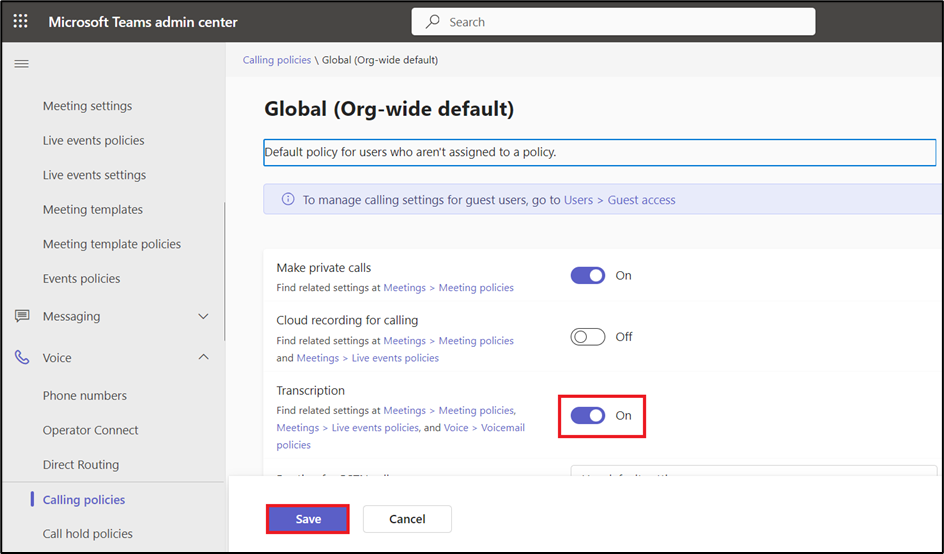

Laboratoire 0 : Configuration de l'environnement de laboratoire

Exercice 1 : Attribuer une licence d'essai Power Apps

1.  Ouvrez un navigateur Web sur votre machine virtuelle et accédez à
    [**https://powerapps.microsoft.com/en-us/free/**](urn:gd:lg:a:send-vm-keys)

> 

2.  Sélectionnez **Start free**.

> 

3.  Entrez vos informations d'identification d'administrateur Office
    365, cochez la case pour accepter l'accord et cliquez sur **Start
    your free trial**.

> 
>
> **Remarque :** Vérifiez que vous avez correctement saisi les
> informations d'identification de l'administrateur. Lors du collage,
> vous risquez de manquer certains caractères, puis vous devez les
> saisir manuellement.

4.  Sélectionnez **Yes** dans la window **Stay signed-in**.

> 

5.  Si vous y êtes invité, fournissez les **Contact Information**
    ci-dessous, puis sélectionnez **Submit**.

> E-mail : **Office 365 admin tenant credentials**
>
> Country/region: **United States**
>
> Phone number: **Votre numéro de téléphone**
>
> 

6.  Vous pouvez maintenant voir **Home page of Power Apps**  et
    l'environnement de développement **Dev One** a été créé pour vous.

> 

7.  Ouvrez le nouvel onglet et accédez au centre d'administration Power
    Platform en accédant à
    [**https://admin.powerplatform.microsoft.com**](urn:gd:lg:a:send-vm-keys)
    et, si nécessaire, connectez-vous à l'aide de vos informations
    d'identification d'administrateur de locataire Office 365. **Close**
    la **Window Pop up** indiquant « Bienvenue dans le nouveau centre
    d'administration Power Platform ».

> 

8.  Dans le volet de navigation de gauche, sélectionnez
    **Manage** \> **Environments**  puis vous pouvez voir que **Dev
    One** est votre environnement Dataverse.

> 

9.  Vous pouvez maintenant passer à l'exercice suivant.

Exercice 2 : Créer une équipe dans Microsoft Teams et activer la
transcription dans Teams

Tâche 1 : Créer une équipe dans Microsoft Teams

1.  Connectez-vous à Microsoft Teams à l'aide [**de
    https://teams.microsoft.com/**](urn:gd:lg:a:send-vm-keys) avec vos
    informations d'identification de locataire Office 365.

2.  Dans **Get to know Teams**, sélectionnez **Get Started**. Fermez la
    window qui demande de scanner le code QR.

> 
>
> 

3.  Sur le côté gauche de Teams, cliquez sur **Teams**, cliquez sur
    **+** pour **Join or create a team**.

> 

4.  Cliquez sur **Create team**

> 

5.  Entrez le nom de l'équipe comme suit
    [**Test**](urn:gd:lg:a:send-vm-keys) **Team**. Dans le champ **Name
    the first channel** entrez
    [**TestChannel**](urn:gd:lg:a:send-vm-keys) et cliquez sur
    **Private**.

> 

- Sélectionnez **Org-wide**

> 

- Sélectionnez **Create**.

> 

Tâche 2 : Activer la transcription dans Teams

1.  Connectez-vous au **Microsoft Teams admin center** 
    [**https://admin.teams.microsoft.com/dashboard**](urn:gd:lg:a:send-vm-keys).

2.  Dans le volet de navigation de gauche, sélectionnez **Meetings \>
    Meeting policies**

> 

3.  Sélectionnez **Global (Org-wide default) policy** sous l'onglet
    **Manage policies**

> 

4.  Sous la section **Recording and transcription** , basculez le bouton
    **Transcription** sur **On**, puis sélectionnez **Save**.

> 

5.  Sélectionnez **Confirm** pour apporter des modifications.

> 

6.  Dans le volet de navigation de gauche, sélectionnez **Live events
    policies** sous **Meetings**. Sélectionnez **Global (Org-wide
    default) policy**.

> 

7.  Basculez le bouton **Transcription for attendees** sur **On**, puis
    sélectionnez **Save.**.

> 

8.  Sélectionnez **Confirm** pour apporter des modifications.

> 

9.  Dans le volet de navigation de gauche, sous **Voice**, sélectionnez
    **Calling policies**. Sélectionnez **Global (Org-wide default)
    policy**.

> 

10. Basculez **Transcription** sur **On**, puis sélectionnez **Save**.

> 

11. Sélectionnez **Confirm** pour apporter des modifications.

> 

12. Dans le volet de navigation de gauche, sous **Voice**, sélectionnez
    **Voicemail policies**. Sélectionnez **Global (Org-wide default)
    policy**.

> 

13. Basculez **Mask profanity in voicemail transcription**  sur **On**,
    puis sélectionnez **Save**.

> 

14. Sélectionnez **Confirm** pour apporter des modifications.

> 

Exercice 3 : Attribuer une licence d'essai Customer Service et activer
Copilot

Tâche 1 : Attribuer une licence d'essai Customer Service

1.  Ouvrez votre navigateur et accédez à
    [**https://dynamics.microsoft.com/en-in/customer-service/overview/,**](urn:gd:lg:a:send-vm-keys)
    puis sélectionnez **Try for free.**

> 

2.  Entrez vos **Office 365 admin tenant credentials**, cochez la case
    pour **accept the agreement**  et cliquez sur **Start your free
    trial**.

> [**admin@M365xXXXXXX.onmicrosoft.com**](urn:gd:lg:a:send-vm-keys)
>
> [**MonAdminPassword**](urn:gd:lg:a:send-vm-keys)
>
> 

3.  Fournissez **Contact Information** ci-dessous, puis sélectionnez
    **Submit**

> Country/region: **United States**
>
> Phone number : **Votre numéro de téléphone**
>
> 

4.  Si vous y êtes invité, entrez votre **Office 365 admin tenant
    password**.

> 

5.  Si l'écran contextuel apparaît, cliquez sur **Launch Trial**

> 

6.  Vous serez redirigé vers le **Customer Service Workspace portal**.

> 

7.  Accédez au **Power Platform admin center**  en accédant à
    [**https://admin.powerplatform.microsoft.com/**](urn:gd:lg:a:send-vm-keys)
    et, si nécessaire, connectez-vous à l'aide de vos informations
    d'identification **Office 365 tenant admin** . Dans le volet de
    navigation de gauche, cliquez sur **Manage** \> **Environments**
    puis vous pouvez voir que **Customer Service Trial environment** 
    est créé.

> 

Tâche 2 : Activer la fonction Copilot

1.  Revenez au **Customer Service workspace portal**. Sélectionnez
    **Customer Service workspace** en haut.

> 

2.  Sous **Apps**, sélectionnez **Copilot Service Admin Center** 
    (Officiellement, **Customer Service Admin Center**.

> 

3.  Sélectionnez **Productivity** sous **Support experience**.

> 

4.  Dans le volet **Productivity**, sélectionnez **Manage** pour
    **Copilot for questions and e-mails**.

> 

5.  Cochez d'abord la case **Knowledge sources**  pour **Include a
    knowledge base or another typer of knowledge source**, puis cochez
    la case **Ask a question**, **Suggest a response**  et **Help pane –
    write an email**. Faites défiler vers le bas, cochez la case Laisser
    **Let representative translate responses** sous **Translation**.

> 
>
> 
>
> 

6.  Sélectionnez **Save and Close**

> 

7.  Sélectionnez **Manage** pour **Summaries**.

> 

8.  Si vous y êtes invité, donnez votre consentement à l'utilisation de
    Copilot, puis sélectionnez **Opt in** pour poursuivre la
    configuration.

> 

9.  Sélectionnez **Make case summaries available to agents** , cochez
    toutes les cases sous **Live conversation summaries** , puis
    sélectionnez **Save and close**.

10. 

Exercice 4 : Attribuer une licence d'évaluation Field Service et
installer le complément Outlook Field Service

Tâche 1 : Attribuer une licence d'essai Field Service

1.  Accédez à la **Field Service product page**  à l'aide du lien
    indiqué
    [**https://www.microsoft.com/en-us/dynamics-365/products/field-service**](urn:gd:lg:a:send-vm-keys)
    et sélectionnez le bouton **Try for free** .

> 

2.  Si vous êtes redirigé vers la page **Dynamics 365 free trials** ,
    sélectionnez **Dynamics 365 Field Service** et cliquez sur **Try for
    free**, sinon passez à l'étape suivante.

> 

3.  Entrez votre **Office 365 admin tenant username**, cochez la case du
    contrat de service, puis sélectionnez **Start your free trial**.

> 

4.  Fournissez **Contact Information** ci-dessous, puis sélectionnez
    **Submit**.

    - Country/region: **United States**

    - Phone number : **Votre numéro de téléphone**

> 

5.  Si une fenêtre contextuelle s'affiche indiquant **Launch trial**,
    cliquez sur **Launch trial**. Ou si la fenêtre contextuelle
    concernant **Whats new** apparaît, close-la.

> 
>
> 

6.  Vous serez dirigé vers le **Dynamics 365 Field Service portal**.

> 

7.  Accédez au **Power Platform admin center**  en accédant à
    [**https://admin.powerplatform.microsoft.com/**](urn:gd:lg:a:send-vm-keys)
    et, si nécessaire, connectez-vous à l'aide de vos informations
    d'identification **Office 365 tenant admin** . Dans le volet de
    navigation de gauche, cliquez sur **Manage** \> **Environments** 
    puis vous pouvez voir que **Field Service Trial environment** est
    créé.

> 

Tâche 2 : Installer le complément Outlook Field Service avec Copilot

1.  Accédez à [**admin.microsoft.com**](urn:gd:lg:a:send-vm-keys) et
    sélectionnez **Show all**, puis sous **Settings**, cliquez sur
    **Integrated apps**. Faites défiler l'écran vers le bas, cliquez sur
    **Get apps** et recherchez **Field Service**.

> 
>
> 
>
> 

2.  Dans la zone de recherche, entrez **Field Service**, puis cliquez
    sur **Get it now** sous **Dynamics 365 Field Service for Outlook**,
    puis cliquez à nouveau sur **Get it now** dans la window pop-up
    **Confirm your information**

  

> 

3.  Vous serez redirigé vers **Microsoft Admin center \> Integrated
    Apps** Sur la page **Assign users** , sélectionnez **Entire
    organization** , puis **Next**.

> 

4.  Sur la page **Accept permission requests** , sélectionnez **Accept
    permissions**.

> 

5.  Connectez-vous avec vos informations d'identification **Office 365
    admin tenant**  dans la window contextuelle.

> 

6.  Sélectionnez **Next** sur la page **Accept permission requests**

> 

7.  Sur la page **Review and finish deployment** , sélectionnez **Finish
    deployment** 

8.  Sélectionnez **Done** une fois le déploiement terminé.

> 

L'affichage de l'application dans Outlook peut prendre jusqu'à 72
heures.

Exercice 5 : Obtenir la licence d'essai de Sales Copilot et installer le
complément Sales Copilot for Outlook

Tâche 1 : S'inscrire à une version d'essai gratuite de Dynamics 365
Sales

1.  Accédez à la page **Sales overview**  à l'aide de l'URL indiquée
    [**https://www.microsoft.com/en-us/dynamics-365/products/sales**](urn:gd:lg:a:send-vm-keys)
    et sélectionnez **Try for free**.

> 

2.  Sur la page **Dynamics 365 free trials** , sélectionnez **Dynamics
    365 Sales** et cliquez sur **Try for free**

> 

3.  Entrez vos informations d'identification de **Office 365 admin
    tenant**  cochez la case pour **accept the agreement** et cliquez
    sur **Start your free trial**.

> 

4.  Fournissez **Contact Information** ci-dessous, puis sélectionnez
    Envoyer.

- **Country/region**: United States

- **Phone number** : Votre numéro de téléphone

> 

5.  Si vous y êtes invité, entrez votre mot de passe de **Office 365
    admin tenant.**

6.  Sélectionnez **Launch trial** dans la window pop-up.

> 

7.  Vous serez redirigé vers le portail **Dynamics 365 Sales**.

> 

8.  Accédez au **Power Platform admin center**  en accédant à
    [**https://admin.powerplatform.microsoft.com**](urn:gd:lg:a:send-vm-keys)
    et, si nécessaire, connectez-vous à l'aide de vos informations
    d'identification d'administrateur de locataire Office 365. Dans le
    volet de navigation de gauche, cliquez sur
    **Manage** \> **Environments** **,** puis vous pouvez voir que
    **Sales Trial environment**  est créé.

> 

Tâche 2 : Installer le complément Sales Copilot pour Outlook

1.  Connectez-vous au **Microsoft 365 admin center**  à l'aide du lien
    indiqué
    [**https://admin.microsoft.com/**](urn:gd:lg:a:send-vm-keys).

2.  Dans le volet gauche, sélectionnez **Settings \> Integrated apps**.

> 

3.  Sur la page **Integrated apps** , sélectionnez **Get
    apps**. **Microsoft AppSource**  s'ouvre dans une window intégrée.

> 

4.  Dans la window **AppSource**, recherchez **Copilot for Sales**

5.  Dans les résultats de la recherche, sélectionnez **Copilot for
    Sales**, puis sélectionnez **Get it now**

> 

6.  Sur la page **Confirm to continue** , sélectionnez **Get it now**.

> 

7.  À l'étape **Configuration**, sélectionnez **Next** dans **Apps to
    deploy window**.

> 

8.  À l'étape **Add Users**, sélectionnez **Entire organization**  sous
    **Assign users**, puis sélectionnez **Next**.

> 

9.  À l'étape **Deployment (Permissions**) lisez les autorisations et
    les fonctionnalités de l'application à déployer, sélectionnez
    **Accept permissions** pour **Copilot for Sales**.

> 
>
> 

10. Connectez-vous avec vos informations d'identification **Office 365
    admin tenant**  dans la window pop-up.

> 

11. Sélectionnez **Next** sur la page **Accept permission
    requests**

12. À l' étape **Deployment (Finish** )passez en revue les paramètres
    sélectionnés, puis sélectionnez **Finish deployment.**

> 

13. Une fois le déploiement terminé, sélectionnez **Done**.

> 

Attendez jusqu'à six heures pour que Sales Copilot apparaisse dans le
ruban Outlook des utilisateurs.

Exercice 6 : S'inscrire à l'essai et donner son consentement pour
utiliser Copilot dans Customer Insights - Data

Tâche 1 : S'inscrire à l'essai

1.  Allez dans
    [**https://dynamics.microsoft.com/en-us/ai/customer-insights/**](urn:gd:lg:a:send-vm-keys)
    choisissez le bouton **Try for free**.

> 

2.  Entrez vos **Office 365 admin credentials**, cochez la case pour
    **accept the agreement** et cliquez sur **Start your free trial**.

> [**admin@M365xXXXXXX.onmicrosoft.com**](urn:gd:lg:a:send-vm-keys)
>
> [**MonAdminPassword**](urn:gd:lg:a:send-vm-keys)
>
> 

3.  Entrez votre **password** du client administrateur Office 365.

> 

4.  Sélectionnez **Yes** sur la window ‘Stay signed in ?’.

> 

5.  Sélectionnez **Unités States** dans le champ **Country/region**,
    entrez votre **phone number**, puis sélectionnez **Submit**.

> 

Remarque : Si la fenêtre contextuelle Lancer le parcours apparaît,
cliquez sur le bouton Lancer le parcours.

6.  Choisissez **Start Customer Insights - Data.**

> 

7.  Sélectionnez **United States** pour **Country/region** , puis
    sélectionnez **Continue**.

> 

8.  Sélectionnez **Start trial** dans le coin supérieur droit. Si vous
    obtenez un message d'erreur comme ‘**Couldn’t create environment**’
    suivez les étapes (a à f) indiquées ci-dessous, puis continuez avec
    Step 9.

> 
>
> a\. Accédez à votre **Customer Insights - Data**  **à** l'aide du lien
> indiqué
> [**https://home.ci.ai.dynamics.com/**](urn:gd:lg:a:send-vm-keys).
> Sélectionnez **Sign up for trial**.
>
> 
>
> b\. **Sign up** à l'aide des **Office 365 tenant** du locataire Office
> 365 et sélectionnez **Next**.
>
> 
>
> c\. Sélectionnez **Sign in.**
>
> 
>
> d\. Entrez **Country/region** comme **United States** l'intitulé de
> votre **job title** et votre **phone number**. Sélectionnez ensuite
> **Get Started**.
>
> 
>
> e\. Sélectionnez **Get Started.**
>
> 
>
> f\. Vous serez sur la page **d’Home** du portail **Customer Insights –
> Data**. Maintenant, sélectionnez **Start trial.**
>
> 

9.  Vous pouvez voir que l'environnement **Marketing Trial** est en
    train d'être créé pour vous et vous pouvez maintenant passer
    directement à l'étape n° 13. Si l'environnement n'est pas créé et
    que vous demandez **Basic information**, entrez **Marketing Trial**
    dans le champ **Name**, sélectionnez **United States** pour le champ
    **Region**, puis sélectionnez **Next.**.

> 

10. Sélectionnez **Next** sur la page **Data storage**

> 

11. Sélectionnez votre **Dataverse environment** , puis cliquez sur
    **Next.**

> 

12. Vérifiez les informations sur la page **Review**, puis sélectionnez
    **Create.**

> 

13. La création de votre environnement peut prendre un certain temps.

> 

14. Vous pouvez maintenant voir que votre environnement est nommé en
    tant que **Marketing Trial**

> 

Tâche 2 : Donner son consentement à l'utilisation de Copilot dans
Customer Insights - Données

1.  Allez dans **Settings** \> **System** 

2.  Sélectionnez l' onglet **Consent**

> 

3.  **Enable** les **Enable Copilot features powered by Azure OpenAI** ,
    puis sélectionnez **Save**. Ignorez si le commutateur est activé
    alredy.

> 

Remarque : L'affichage de l'application dans le portail de données
Service clientèle peut prendre un certain temps.
