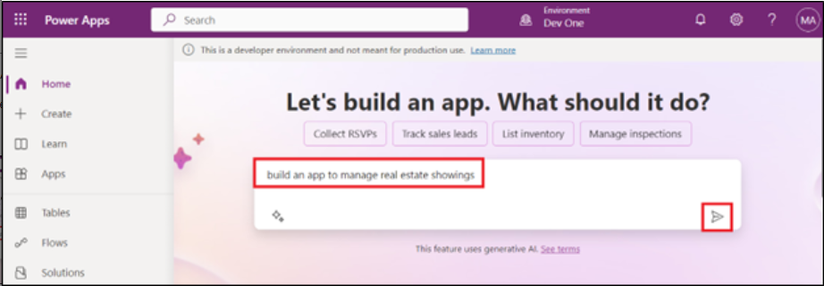
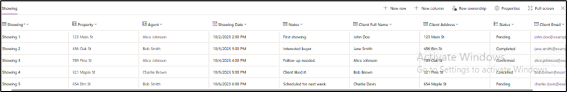

Laboratório 1: Criar um aplicativo Canvas para uma solução imobiliária
com o Copilot no Power Apps

Neste laboratório, você criará um aplicativo móvel usando o Copilot no
Power Apps. Os agentes de campo usarão esse aplicativo para navegar pelo
inventário imobiliário e gerenciar compromissos para visitas, e os dados
serão armazenados no Dataverse.

\*\*Observação: \*\*neste laboratório, seus resultados para os dados
podem diferir daqueles mostrados nas capturas de tela e imagens. Isso
ocorre porque o Power Apps usa o OpenAI para gerar dados para o
laboratório, e os dados mudam diariamente.

1.  Faça login no Power Apps  usando suas credenciais de locatário do
    Office 365.

2.  Certifique-se de que você está no seu ambiente de desenvolvedor -
    **Dev One**. Caso contrário, clique no seletor de ambiente e
    selecione **Dev One**.

3.  Na página inicial do Power Apps, no campo de texto central, insira o
    seguinte prompt para procurar uma tabela gerada por AI:

build an app to manage real estate showings

Selecione o botão **Send**.

4.  Após o Copilot AI gerar as tabelas com base no seu prompt, analise
    as tabelas para visualizar as colunas que foram criadas no início de
    cada tabela.

5.  Para ver mais informações, clique nos três pontos acima da tabela.

As próximas etapas consistem em modificar e adicionar informações à
tabela já gerada.

6.  Agora, clique na **tabela Showings** e, em seguida, no campo de
    texto na parte inferior do painel do Copilot, à direita da tela,
    insira o seguinte texto:

Add a column to track client full name

Isso adicionará uma coluna na tabela Showings. Selecione o botão
**Send**.

7.  O Copilot notificará que a tabela foi atualizada e a nova coluna
    deverá aparecer na tabela Showings (Mova a barra deslizante para a
    direita). Para ver a nova coluna adicionada à tabela, clique em
    **View data** no painel horizontal superior.

8.  Digite o seguinte texto no chat:

add a column to track client email

Selecione o botão **Send**.

Uma nova coluna é adicionada à tabela e exibe o e-mail do cliente.

**Observação:** os dados gerados na tabela podem ser diferentes dos
dados mostrados na tabela nas capturas de tela deste laboratório.

9.  Digite o seguinte texto no chat:

Add columns to track client address and agent name

Selecione o botão **Send**.

Uma nova coluna é adicionada à tabela e exibe o e-mail do cliente.

10. Digite o texto abaixo no chat e selecione o botão Send. Uma nova
    coluna Status é adicionada à tabela e exibe o e-mail do cliente.

Adicione uma coluna chamada Status, com o tipo de dado Opção (Pending,
Completed, Confirmed, Cancelled).

11. Selecione o menu suspenso do nome da coluna **Status** e, em
    seguida, selecione **Edit column.**

12. Você pode visualizar as propriedades da coluna, os detalhes atuais
    do status e os dados. Selecione o **X** no canto superior direito
    deste painel para fechá-lo. 

13. Você pode ver que as novas opções foram adicionadas. Selecione o
    **X** no canto superior direito do painel para fechá-lo.

14. Você pode ver que as novas opções foram adicionadas.
    

15. Feche o \*\*painel do Copilot\*\* usando o ícone \*\*X\*\* no canto
    superior direito do painel do Copilot. 

16. Sua tabela deve conter várias colunas. No entanto, para continuar
    acompanhando os módulos deste caminho de aprendizado, remova as
    colunas que você não utilizará.

As colunas que devem permanecer são:

- Showing

- Address

- Date

- Status

- Agent Name

- Client Full Name

- Client Email

Use o que você aprendeu com a janela do **Copilot Chat** para ajustar
sua tabela e fazê-la corresponder à lista apresentada anteriormente.
Certifique-se de consultar a seção **Suggestions** caso precise remover
uma coluna, renomear uma coluna ou adicionar uma nova coluna.

17. Para criar o aplicativo, selecione o botão \*\***Save and Open
    App\*\*** no canto superior direito da tela. Em seguida, clique
    novamente em \*\***Save and Open App\*\*** na janela pop-up
    **\*\*Done working?\*\*** 

18. Quando o aplicativo for carregado pela primeira vez, pode aparecer
    uma janela de diálogo com a mensagem **Welcome to Power Apps
    Studio**. Se isso acontecer, selecione o botão **Skip**.

19. O aplicativo desenvolvido para você deve ser exibido no modo
    **Edit.**

20. Para uma melhor visualização, feche o painel do Copilot.

21. Selecione o ícone **Data** na barra de navegação à esquerda. O
    Copilot criou uma tabela **Dataverse** que agora está sendo exibida
    na seção **Environments**.

\*\* Observação: \*\*No momento, o Copilot só é compatível com o
Dataverse. Não é possível usar nenhum outro ponto de acesso a dados por
enquanto.

Agora que o aplicativo foi criado, será necessário editar a tabela.

22. No painel \*\***Data**\*\*, passe o cursor do mouse sobre a tabela
    \*\*Showing\*\*. À direita da tabela, selecione os três pontos
    (**...**) e, no menu, selecione \*\***Edit data\*\***. 

**Observação:** Na caixa de diálogo **Edit table**, você pode adicionar
suas próprias colunas à tabela ou modificá-las.

23. Selecione o cabeçalho da coluna \*\*Showing\*\* na tabela. No menu
    suspenso, selecione a opção \*\***Edit column\*\***.

24. Neste exemplo, você não quer que o **Data type** seja **Single line
    of text**. Para alterar esse valor, vá até o painel **Edit column**
    e, no menu suspenso **Data type**, selecione **Autonumber**. Em
    seguida, selecione **Save**.

25. Selecione o botão **Close** no canto inferior direito da caixa de
    diálogo **Edit table**

&nbsp;

26. A tabela deve agora aparecer como **Refreshed** no painel **Data**.

27. Modifique a galeria no aplicativo para que ela exiba os dados
    relevantes. Selecione o ícone **Tree view** para retornar à Tree
    view.

28. Na tela principal do aplicativo, selecione **RecordsGallery2** para
    exibir Showings. Para selecionar RecirdsGallery2, siga a hierarquia
    abaixo.

> (Select Showings Screen \> ScreenContainer3 \> BodyContainer3 \>
> SidebarContainer3 \> RecordsGallery3).

29. Agora selecione o **botão edit** da **RecordsGallery3** para colocar
    a galeria em modo de edição.

30. Clique na seta para baixo em RecordGallery3, selecione o Title3 e,
    em seguida, insira a fórmula abaixo.

!!ThisItem.’Client Address’!!

31. Selecione **Subtitle3** e, em seguida, defina o valor do campo
    **Text** com a seguinte fórmula:

ThisItem.'Client Email'

32. Selecione o **Body3** e, em seguida, defina o valor do campo
    **Text** com a seguinte fórmula: 

ThisItem.Status e, em seguida, nas suggestions, selecione, 

ThisItem.'Status (cra55_status)' 

Se a fórmula acima apresentar um erro, utilize a seguinte 

ThisItem.'Location'

Agora, um único registro na galeria deve se parecer com a seguinte
imagem:

33. Selecione o **Form3** no **ScreenContainer3**, em seguida, na tela,
    selecione **Fields** e remova o campo **Showing**.

Porque você alterou anteriormente o campo **ID** para **Autonumber**,
não é necessário que os usuários insiram seus próprios números; o
Dataverse irá inserir automaticamente os números para você.

34. Faça uma nova solicitação para uma propriedade que será exibida no
    aplicativo, selecionando o botão **Play** na parte superior da tela.

35. No painel esquerdo, selecione o botão +**New**.

36. Embora seja possível modificar o formulário para preencher
    automaticamente os campos, neste laboratório, você completará esta
    etapa manualmente para observar como o aplicativo funciona.

Preencha os campos com as informações a seguir:

- Date: Insira qualquer data futura

- Time: 15:00

- Agent Name: [**Sarah Connor**](urn:gd:lg:a:send-vm-keys)

- Feedback: [**The property is impressive, but the kitchen needs minor
  upgrades.**](urn:gd:lg:a:send-vm-keys)

- Client Full Name: [**John Almeda**](urn:gd:lg:a:send-vm-keys)

- Client Email: [**john.almeda@example.com**](urn:gd:lg:a:send-vm-keys)

- Client Address: [**210 Pine Road, Portland, OR
  97204**](urn:gd:lg:a:send-vm-keys)

- Status: Pending

- Property: Luxury Villa

37. Selecione a marca de seleção no canto superior direito da tela.

38. Selecione o **X** no canto superior direito para sair do aplicativo.

Se aparecer uma caixa de diálogo com a mensagem **Did you know?**,
selecione **OK**.

A nova solicitação é adicionada à esquerda da lista de solicitações.

39. Na parte superior da tela, selecione o botão **Save** para salvar o
    novo aplicativo que você criou.

40. Se o sistema solicitar, salve o nome do aplicativo como **Real
    Estate Showings**.

41. Saia do aplicativo para retornar à página inicial do Power Apps.
