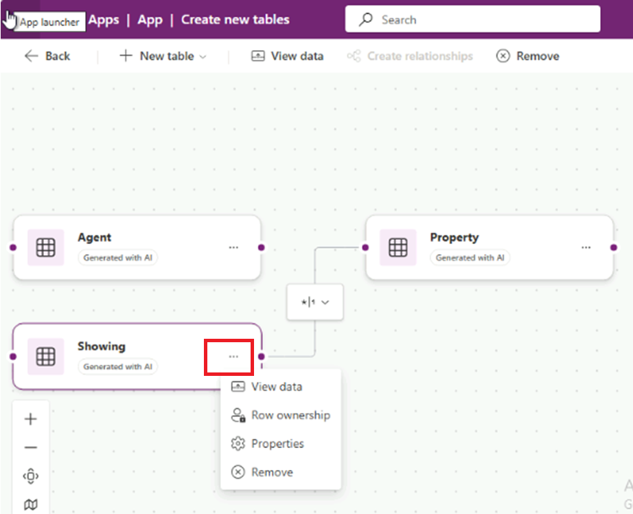
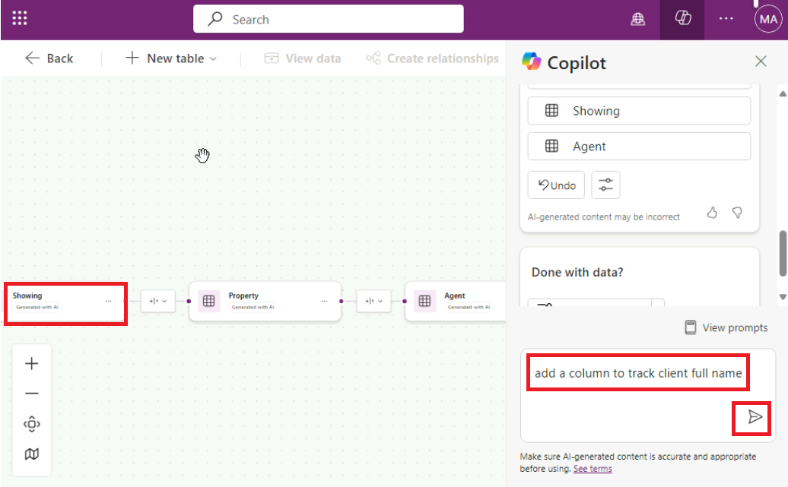
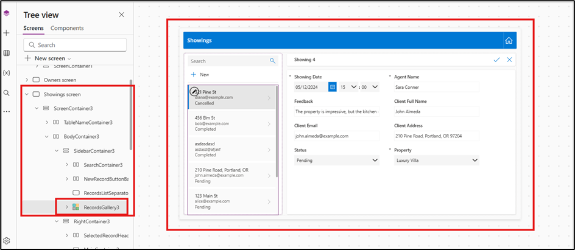

# Atelier 1 : Création d'une application canevas pour une solution immobilière avec Copilot In Power Apps

Dans cet atelier, vous allez créer une application mobile à l'aide de
Copilot in Power Apps. Les agents de terrain utiliseront cette
application pour parcourir l'inventaire immobilier et gérer les
rendez-vous pour les visites, et les données seront stockées dans
Dataverse.

Remarque : Dans cet atelier, les résultats de vos données peuvent
différer de ceux affichés dans les captures d'écran et les images. La
raison en est que Power Apps utilise OpenAI pour générer des données
pour le laboratoire et que les données changent quotidiennement.

1.  Connectez-vous à Power Apps
    [**https://make.powerapps.com/**](urn:gd:lg:a:send-vm-keys) l'aide
    de vos informations d'identification de Office 365 tenant .

2.  Assurez-vous que vous êtes dans votre environnement de
    développement - **Dev One**. Si ce n'est pas le cas, cliquez sur le
    sélecteur d'environnement et sélectionnez **Dev One**.

3.  Sur la page d'accueil de Power Apps, dans le champ de texte central,
    entrez le prompt suivant pour rechercher une table générée par l'IA
    :

Créer une application pour gérer les visites immobilières

Sélectionnez le bouton **Send**.

4.  Une fois que Copilot AI a généré des tables en fonction de votre
    invite, parcourez les tables pour afficher les colonnes créées pour
    le début de vos tables.

5.  Pour voir plus d'informations, cliquez sur les trois points
    au-dessus du tableau.

Les prochaines étapes consistent à modifier et à ajouter à la table déjà
générée.

6.  Cliquez maintenant sur le **Showings table**, puis dans la zone de
    texte, dans la partie inférieure du volet Copilot à droite de
    l'écran, entrez le texte suivant :

Ajouter une colonne pour suivre le nom complet du client

Cela ajoutera une colonne dans le tableau des visites. Sélectionnez le
bouton **Send**.

7.  Copilot vous informe que la table est mise à jour et que la nouvelle
    colonne doit s'afficher comme ayant été ajoutée à la table
    d'affichage. (Déplacez la barre de défilement vers la droite). Pour
    voir la nouvelle colonne ajoutée au tableau, cliquez sur **View
    data** à partir du volet horizontal supérieur.

8.  Entrez le texte suivant dans le chat :

Ajouter une colonne pour suivre les e-mails du client

Sélectionnez le bouton **Send**.

Une nouvelle colonne est ajoutée au tableau et affiche l'adresse e-mail
du client.

**Remarque :** Les données générées dans votre table peuvent différer
des données affichées dans le tableau dans les captures d'écran de cet
atelier.

9.  Entrez le texte suivant dans le chat :

Ajouter des colonnes pour suivre l'adresse du client et le nom de
l'agent

Sélectionnez le bouton **Send**.

Une nouvelle colonne est ajoutée au tableau et affiche l'adresse e-mail
du client.

10. Entrez le texte ci-dessous dans le chat et sélectionnez le bouton
    Envoyer. Une nouvelle colonne Statut est ajoutée au tableau et
    affiche l'adresse e-mail du client.

Ajouter un statut de colonne, le type de données de la colonne est le
choix (En attente, Terminé, Confirmé, Annulé)

11. Sélectionnez le menu déroulant Nom de la colonne **Statut**, puis
    sélectionnez **Edit column.**

12. Vous pouvez afficher les propriétés des colonnes ainsi que les
    détails et les données de l'état actuel. Sélectionnez le **X** dans
    le coin supérieur droit de ce volet pour le fermer.

13. Vous pouvez voir que les nouveaux choix sont maintenant ajoutés.
    Sélectionnez le **X** dans le coin supérieur droit du volet pour le
    fermer.

14. Vous pouvez voir que les nouveaux choix sont maintenant ajoutés.
    

15. Fermez le volet Copilot à l'aide de l'icône X dans le coin supérieur
    droit du volet Copilot.

11. Votre tableau doit comporter plusieurs colonnes. Toutefois, pour
    continuer à suivre les modules de ce parcours d'apprentissage,
    essayez de supprimer certaines colonnes que vous n'utiliserez pas.

La liste des colonnes dont vous avez besoin est la suivante :

- Montrant

- Adresse

- Date

- Statut

- Nom de l'agent

- Nom complet du client

- Courriel du client

Utilisez ce que vous avez appris avec la fenêtre de **Copilot Chat** 
pour ajuster votre table afin qu'elle corresponde à la liste précédente.
Veillez à vous référer à la section **Suggestions** si vous devez
supprimer une colonne, modifier un nom de colonne ou ajouter une
colonne.

16. Pour créer l'application, sélectionnez le bouton \*\* **Save and
    Open App \*\*** dans le coin supérieur droit de l'écran. Cliquez à
    nouveau sur \*\* **Save and Open App \*\* Done working?\*\*** qui
    surgir.

17. Lors du premier chargement de l'application, une boîte de dialogue
    indiquant **Welcome to Power Apps Studio** peut s'afficher. Si c'est
    le cas, sélectionnez le bouton **Skip**.

18. L'application qui a été conçue pour vous doit s'afficher en mode
    **Edit**.

19. Pour une meilleure vue, fermez le volet Copliot.

20. Sélectionnez l' icône **Data** dans la barre de navigation de
    gauche. Copilot a créé une table **Dataverse** qui s'affiche
    maintenant dans la section **Environnements**.

Remarque : Actuellement, Copilot n'est pris en charge que pour
Dataverse. Vous ne pouvez pas utiliser d'autre point d'accès aux données
pour le moment.

Ensuite, vous allez modifier la table maintenant que l'application a été
créée.

21. . Dans le volet **\*\*Data\*\*,** passez le curseur de votre souris
    sur le tableau \*\*Affichage\*\*. À droite du tableau, sélectionnez
    les points de suspension (**...**) et dans le menu, sélectionnez
    **\*\*Edit data\*\***.

**Remarque** : Dans la boîte de dialogue **Edit table,** vous pouvez
ajouter vos propres colonnes à la table ou modifier des colonnes
existantes.

22. Sélectionnez l'en-tête de colonne **\*\*Showing\*\*** dans le
    tableau. Dans le menu déroulant, sélectionnez l'option **\*\*Edit
    column \*\***.

23. Dans cet exemple, vous ne souhaitez pas que le **date type** soit
    une **seule ligne de texte**. Pour modifier cette valeur, accédez au
    volet **Edit column**  puis dans le menu déroulant **date type**,
    sélectionnez **\# Autonumber**. Sélectionnez **Save**.

24. Sélectionnez le bouton **Close** dans le coin inférieur droit de la
    boîte de dialogue **Edit table**.

25. La table doit maintenant s'afficher comme **Refreshed**  dans le
    volet **Data**.

26. Modifiez la galerie dans l'application pour qu'elle affiche les
    données pertinentes. Sélectionnez l' icône **Tree view**  pour
    revenir à l'arborescence.

27. Sur l'écran principal de l'application, sélectionnez
    **RecordsGallery2** pour afficher les visites. Pour sélectionner
    RecirdsGallery2, suivez la hiérarchie ci-dessous.

> (Sélectionnez l'écran Affichages \> ScreenContainer3 \> BodyContainer3
> \> SidebarContainer3 \> RecordsGallery3).

28. Sélectionnez maintenant le **edit** **bouton** de la
    **RecordsGallery3** pour mettre la galerie en mode édition.

29. Cliquez sur la flèche vers le bas sur RecordGallery3, sélectionnez
    le Titre3, puis entrez la formule ci-dessous.

!! ThisItem.'Adresse du client' !!

30. Sélectionnez le **ubtitle3**puis définissez la **v**aleur **Text**
    sur la formule suivante :

ThisItem.'Adresse e-mail du client'

31. Sélectionnez **Body3,** puis définissez la valeur **Text** sur la
    formule suivante :

ThisItem.Status, puis à partir des suggestions, sélectionnez,

ThisItem.'Statut (cra55_status)'

Si la formule ci-dessus vous montre une erreur, utilisez celle
ci-dessous

ThisItem.'Emplacement'

Un seul enregistrement dans la galerie doit maintenant ressembler à
l'image suivante.

32. Sélectionnez le **Form3** dans le **ScreenContainer3**, dans le
    canevas, sélectionnez **C Fields** , puis supprimez **Showing**.

Étant donné que vous avez précédemment remplacé le champ **ID** par
**Autonumber** vous ne souhaitez pas que les utilisateurs saisissent
leur propre numéro. Dataverse saisit automatiquement les numéros pour
vous.

33. Effectuez une nouvelle demande pour une propriété qui s'affiche dans
    l'application en sélectionnant le bouton **Play** dans la partie
    supérieure de l'écran.

34. Dans le volet gauche, sélectionnez le bouton **+New** 

35. Bien que vous puissiez modifier le formulaire pour qu'il remplisse
    automatiquement les champs à votre place, pour cet atelier, vous
    allez effectuer cette étape manuellement pour observer le
    fonctionnement de l'application.

Remplissez les champs avec les informations suivantes :

- Date : Entrez une date future

- Heure : 15:00

- Nom de l'agent : [**Sarah Connor**](urn:gd:lg:a:send-vm-keys)

- Commentaires : [**The property is impressive, but the kitchen needs
  minor upgrades.**](urn:gd:lg:a:send-vm-keys)

- Nom complet du client : [**John Almeda**](urn:gd:lg:a:send-vm-keys)

- Courriel du client :
  [**john.almeda@example.com**](urn:gd:lg:a:send-vm-keys)

- Adresse du client : [**210 Pine Road, Portland, OR
  97204**](urn:gd:lg:a:send-vm-keys)

- Statut : En attente

- Propriété : Villa de luxe

36. Sélectionnez la coche dans le coin supérieur droit de l'écran.

37. Sélectionnez le **X** dans le coin supérieur droit pour fermer
    l'application.

Si une boîte de dialogue s'affiche indiquant **Did you know?**,
sélectionnez **OK**.

La nouvelle requête est ajoutée à gauche de la liste des requêtes.

38. Dans la partie supérieure de votre écran, sélectionnez le bouton
    **Save** pour enregistrer la nouvelle application que vous avez
    créée.

Si le système vous y invite, enregistrez le nom de l'application en tant
que **Real Estate Showings**

39. Quittez l'application pour revenir à la page d'accueil de Power
    Apps.
