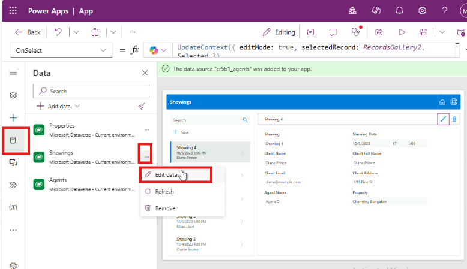

# Laboratorio 1: Construcción de un canvas app para una solución de inmobiliaria con Copilot in Power Apps

En este laboratorio, creará una aplicación móvil mediante Copilot in
Power Apps. Los agentes de campo usarán esta aplicación para explorar el
inventario de inmobiliaria y gestionar las visitas de presentación y los
datos se guardarán en Dataverse.

\*\*Ojo: \*\*En este laboratorio, sus resultados para los datos pueden
variar de los mencionados en estas capturas e imágenes. Eso porque Power
Apps usa OpenAI para generar datos para el laboratorio y para los
cambios de datos diarios.

1.  Inicie sesión en Power
    Apps [**https://make.powerapps.com/**](urn:gd:lg:a:send-vm-keys) con
    sus Office 365 tenant credentials.

2.  Asegure que está en el entorno de desarrollo - **Dev One**. Si no,
    haga clic en el environment selector y seleccione **Dev One**.

3.  En la página de inicio de Power Apps, en el campo central de texto,
    introduzca el siguiente prompt para buscar una tabla generada por la
    IA:

build an app to manage real estate showings

Select the **Send** button.

4.  Después de que el Copilot AI generata tablas en función de su
    prompt, vea a través de las tablas para visualizar las columnas que
    se crearon para el inicio de sus tablas.

5.  Para ver más información, haga clic en tres puntos soble la tabla.

Sus próximos pasos serán modificar y agregarlos a la tabla ya generada.

6.  Ahora haga clic **Showings table** y el cuadro de texto, en la parte
    inferior del panel de Copilot a la parte derecha de la pantalla,
    introduzca el siguiente texto:

Agregue una columna para seguir el client full name

Esto agregará una columna en el showings table. Seleccione el
botón **Send**.

7.  Copilot le notifica cuando se actualiza la tabla, y se debe mostrar
    que se está agregando la nueva columma al showing table. (Deslice el
    slide bar hacia la derecha). Para ver la nueva columna agregada a la
    tabla, haga clic en **View data** desde el panel horizontal en la
    parte superior. 

8.  Introduzca el siguiente texto en el chat:

add a column to track client email

Seleccione el botón **Send**.

Se ha agregado una nueva columna a la tabla y muestra los emails de los
clientes.

**Ojo:** Los datos generados en su tabla pueden variar de los mostrados
en las capturas e imágenes para este laboratorio.

9.  Introduzca el siguiente txto en el chat:

Add columns to track client address and agent name

Seleccione el botón **Send**.

Se agrega una nueva columna a la tabla y muestra los emails de los
clientes.

10. Introduzca el siguiente texto en el chat y seleccione el botón Send.
    Se agrega una columna Status a la tabla y muestra los emails de los
    clientes.

Agregue un column status, se puede elegir el tipo de datos (Pending,
Completed, Confirmed, Cancelled)

11. Seleccione el menú despegable **Status** y seleccione **Edit
    column.**

12. Puede visualizar las propiedades de columnas y detalles de estado
    actual y datos. Seleccione el **X** en la esquina superior derecha
    de este panel para cerrarlo. 

13. Puede ver que se agregan new choices. Seleccione el **X** en la
    esquina superior derecha del panel para cerrarlo.

14. Puede ver que se agregan new choices. 

15. Cierre el \*\*Copilot pane\*\* con \*\*X\*\* icon en la esquina
    superior derecha del panel Copilot. 

11. Su tabla tiene muchas columnas. Sin embargo, para seguir los módulos
    en este learning path, intente quitar unas columnas que no va a
    usar.

La lista de columnas que necesita son:

- Showing

- Address

- Date

- Status

- Agent Name

- Client Full Name

- Client Email

Use lo que ha aprendido con la ventana **Copilot Chat** para ajustar su
tabla para que se parece a esta lista anterior. Asegure que se refiere a
la sección **Suggestions** si necesita quitar una columna, cambiar el
nombre de la columna, o agrefar una columna.

16. Para crear la aplicación, seleccione el botón \*\***Save and Open
    App\*\*** en la esquina superior derecha de la pantalla. De nuevo,
    haga clic en \*\***Save and Open App\*\*** en el pop-up **\*\*Done
    working?\*\*.** 

17. Cuando se carga la aplicación por la primera vez, puede aparecer un
    diálogo dicieno **Welcome to Power Apps Studio**. Si es el caso,
    seleccione el botón **Skip**.

18. La aplicación que se ha construido para usted debe aparecer en
    el **Edit** mode.

19. Para una vista mejor, cierre el panel Copliot.

20. Seleccione el ícono **Data** desde la barra de navegación izquierda.
    Copilot ha creado una tabla **Dataverse** que se muestra en la
    sección **Environments**.

\*\*Ojo: \*\*De momento, Copilot solo admite Dataverse. No se puede usar
ningún otro data access point en este momento.

A continuación, va a editar la tabla ahora que se ha creado la
aplicación.

21. Dentro del panel \*\***Data**\*\*, flote su curso sobre la tabla
    \*\*Showing\*\*. A la derecha de esta tabla, seleccione los tres
    puntos (**...**) y desde el menú, seleccione \*\***Edit data\*\***. 

**Ojo**: En el diálogo **Edit table**, puede agregar sus propias
columnas a la tabla o modifique columnas existentes.

22. Seleccione la columna the \*\*Showing\*\* desde la tabla. Desde el
    menú despegable, seleccione la opción \*\***Edit column\*\***.

23. En este ejemplo, no quiere que el **Data type** sea **Single line of
    text**. Para cambiar el valor, vaya al panel **Edit column**, y
    luego seleccione menú despegable **Date type**, seleccione **\#
    Autonumber**. Seleccione **Save**.

24. Seleccione el botón **Close** en la esquina inferior derecha del
    diálogo **Edit table**.

25. La tabla ahora se ve como **Refreshed** en el panel **Data**.

26. Modifique el gallery en la aplicación para que muestra los datos
    relevantes. Seleccione el ícono **Tree view** para volver a Tree
    view.

27. En la pantalla principal de la aplicación, seleccione
    **RecordsGallery2** para mostrar Showings. Para seleccionar
    RecirdsGallery2 siga la siguiente jerarquía.

> (Select Showings Screen \> ScreenContainer3 \> BodyContainer3 \>
> SidebarContainer3 \> RecordsGallery3).

28. Ahora seleccione el **edit button** del **RecordsGallery3** para
    poner el gallery en edit mode.

29. Haga clic en el down arrow en RecordGallery3, seleccione el Title3 y
    luego introduzca el siguiente fórmula.

!!ThisItem.’Client Address’!!

30. Seleccione el **Subtitle3** y luego establezca el valor
    de **Text** a la fórmula:

ThisItem.'Client Email'

31. Seleccione el **Body3** y luego establezca el valor a la siguiente
    fórmula: 

ThisItem.Status y luego, desde los suggestions, seleccione, 

ThisItem.'Status (cra55_status)' 

Si la fórmula le muestra un error, pues use la siguiente 

ThisItem.'Location' 

Un solo registro en la galería debe parecerse a la siguiente imagen.

32. Seleccione el **Form3** en el **ScreenContainer3**, en el canvas
    seleccione **Fields** y luego quite el **Showing**.

Ya que ha cambiado el campo **ID** a **Autonumber**, no quiere que los
usuarios introduzcan sus proprios números; Dataverse lo hace
automáticamente para usted.

33. Haga una nueva solicitud para una propiedad que se ve en la
    aplicación al seleccionar el botón **Play** desde la parte superior
    de la pantalla.

34. En el panel izquierdo, seleccione el botón **+New**.

35. Pero puede modificar el form para llenar los campos automáticamente,
    para este laboratorio, completará este paso manualmente para
    observar cómo funciona la aplicación.

Llene los campos con la siguiente información:

- Date: Enter any future date

- Time: 15:00

- Agent Name: [**Sarah Connor**](urn:gd:lg:a:send-vm-keys)

- Feedback: [**The property is impressive, but the kitchen needs minor
  upgrades.**](urn:gd:lg:a:send-vm-keys)

- Client Full Name: [**John Almeda**](urn:gd:lg:a:send-vm-keys)

- Client Email: [**john.almeda@example.com**](urn:gd:lg:a:send-vm-keys)

- Client Address: [**210 Pine Road, Portland, OR
  97204**](urn:gd:lg:a:send-vm-keys)

- Status: Pending

- Property: Luxury Villa

36. Seleccione el check mark en la esquina superior derecha de la
    pantalla.

37. Seleccione el **X** en la esquina superior derecha para cerrar la
    aplicación.

Si aparece el diálogo **Did you know?**, seleccione **OK**.

Se agrega una nueva solicitud a la izquierda de la lista de solicitudes.

38. Desde la parte superior de su pantalla, seleccione el
    botón **Save** para guardar la nueva aplicación que creó.

Si su sistema le pide, guarde el nombre de la aplicación como **Real
Estate Showings**.

39. Cierre la aplicación para volver a Power Apps home page.
