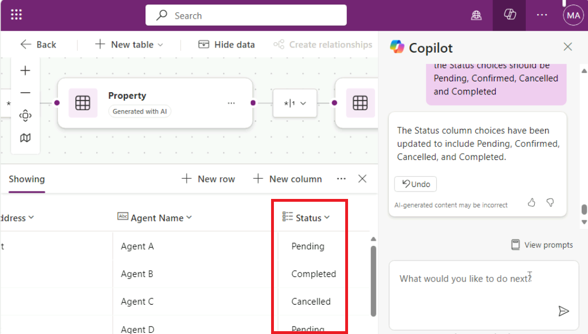

# 실습 1: Power Apps에서 Copilot을 활용한 부동산 솔루션용 캔버스 앱 구축

이 실습에서는 Power Apps의 Copilot을 사용하여 모바일 애플리케이션을
만듭니다. 현장 담당자는 이 앱을 사용하여 부동산 재고를 탐색하고 방문
예약을 관리하며, 데이터는 Dataverse에 저장됩니다.

\*\*참고: \*\*이 랩의 데이터 결과는 스크린샷과 이미지에 표시된 것과 다를
수 있습니다. Power Apps는 OpenAI를 사용하여 랩 데이터를 생성하고
데이터는 매일 변경되기 때문입니다.

1.  Office 365 테넌트 자격 증명을 사용하여 Power Apps
    [**https://make.powerapps.com/**](urn:gd:lg:a:send-vm-keys) 에
    로그인합니다.

2.  개발자 환경**Dev One**에 있는지 확인합니다. 그렇지 않은 경우 환경
    선택기를 클릭하고 **Dev One**을 선택합니다.

3.  Power Apps의 홈페이지에서 가운데 ​​텍스트 필드에 다음 프롬프트를
    입력하여 AI가 생성한 표를 검색:

build an app to manage real estate showings

**Send** 버튼을 선택합니다..

4.  4\. Copilot AI가 사용자의 프롬프트에 따라 표를 생성한 후, 표를
    살펴보면서 표의 시작 부분에 대해 생성된 열을 확인합니다.

5.  자세한 내용을 보려면 표 위에 있는 세 개의 점을 클릭하세요.

다음 단계는 이미 생성된 표를 수정하고 추가하는 것입니다.

6.  이제 **Showings table**를 클릭한 다음, 화면 오른쪽 Copilot 창 하단의
    텍스트 상자에 다음 텍스트를 입력합니다.

Add a column to track client full name

그러면 **Showings table**에 열이 추가됩니다. **Send** 버튼을 선택하세요.

7.  Copilot에서 표가 업데이트되었으며, 새 열이 표시 표에 추가되었음을
    알려줍니다. (슬라이드 바를 오른쪽으로 이동하세요.) 표에 추가된 새
    열을 보려면 위쪽 가로 창에서 **View data**를 클릭하세요.

8.  채팅에 다음 텍스트를 입력하세요:

add a column to track client email

**Send**  버튼을 선택하세요.

표에 새 열이 추가되고 고객의 이메일이 표시됩니다.

**참고**: 표에 생성된 데이터는 이 실습의 스크린샷 표에 표시된 데이터와
다를 수 있습니다.

9.  채팅에 다음 텍스트를 입력하세요:

Add columns to track client address and agent name

**Send** 버튼을 선택합니다.

표에 새 열이 추가되고 고객의 이메일이 표시됩니다.

10. 아래 텍스트를 채팅창에 입력하고 Send버튼을 선택합니다. 테이블에
    Status 열이 새로 추가되고 고객의 이메일 주소가 표시됩니다.

Add a column status, data type of the column is choice (Pending,
Completed, Confirmed, Cancelled)

11. **Status** 열 이름 드롭다운 메뉴를 선택한 다음 **Edit column**를
    선택합니다.

12. 열의 속성과 현재 상태 세부 정보 및 데이터를 볼 수 있습니다. 이 창의
    오른쪽 상단에 있는 **X**를 선택하여 창을 닫습니다.

13. 이제 새로운 선택 사항이 추가된 것을 확인할 수 있습니다. 창 오른쪽
    상단의 **X**를 선택하여 창을 닫습니다.

14. 이제 새로운 선택 사항이 추가된 것을 볼 수
    있습니다.

15. Copilot 창의 오른쪽 상단에 있는 \*\*X\*\* 아이콘을 사용하여
    \*\*Copilot 창\*\*을 닫습니다.

11. 표에는 여러 개의 열이 있어야 합니다. 하지만 이 학습 과정의 모듈을
    계속 진행하려면 사용하지 않을 열을 제거해 보세요.

필요한 열 목록은 다음과 같습니다.:

- Showing

- Address

- Date

- Status

- Agent Name

- Client Full Name

- Client Email

**Copilot Chat** 창에서 배운 내용을 활용하여 이전 목록과 일치하도록 표를
조정합니다. 열을 제거하거나, 열 이름을 변경하거나, 열을 추가해야 하는
경우 **Suggestions**  섹션을 참조합니다.

16. 앱을 생성하려면 화면 오른쪽 상단의 \*\***Save and Open
    App\*\***버튼을 선택합니다. **\*\*Done working?\*\***팝업에서
    \*\***Save and Open App\*\***를 다시 클릭합니다.

17. 앱이 처음 로드될 때 **Welcome to Power Apps Studio**라는 대화 상자가
    나타날 수 있습니다. 이 경우 **Skip** 버튼을 선택합니다.

18. 귀하를 위해 빌드된 앱이 **Edit** 모드에 표시되어야 합니다.

19. 더 잘 보려면 Copliot 창을 닫습니다.

20. 왼쪽 탐색 모음에서 **Data**  아이콘을 선택합니다. Copilot에서
    **Dataverse** 테이블을 생성했으며, 이제 **Environments**  섹션에
    표시됩니다.

\*\*참고: \*\*현재 Copilot은 Dataverse에서만 지원됩니다. 다른 데이터
액세스 지점은 사용할 수 없습니다.

다음으로, 앱이 생성되었으므로 테이블을 편집합니다.

21. \*\* **Data** \*\* 창에서 \*\*표시\*\* 테이블 위로 마우스 커서를
    이동합니다. 테이블 오른쪽의 줄임표(...)를 선택하고 메뉴에서 \*\*
    **Edit data** \*\*을 선택합니다.

**참고**: **Edit table** 대화 상자에서 표에 열을 추가하거나 기존 열을
수정할 수 있습니다.

22. 표에서 \*\* Showing \*\* 열 머리글을 선택합니다. 드롭다운 메뉴에서
    \*\* **Edit column** \*\* 옵션을 선택합니다.

23. 이 예시에서는 **Data type** 를 **Single line of text**로 설정하지
    않습니다. 해당 값을 변경하려면 **Edit column** 창으로 이동한 다음
    **Date type** 드롭다운 메뉴에서 **\# Autonumber**를 선택합니다.
    **Save**를 선택합니다.

24. **Edit table**  대화 상자의 오른쪽 하단에 있는 **Close**버튼을
    선택합니다.

25. 이제 테이블이 **Data** 창에 **Refreshed** 로 표시되어야 합니다.

26. 애플리케이션의 갤러리를 수정하여 관련 데이터를 표시합니다. **Tree
    view** 아이콘을 선택하면 **Tree view** 로 돌아갑니다.

27. 앱 메인 화면에서 **RecordsGallery2**를 선택하여 Showing을
    표시합니다. 'RecordsGallery2'를 선택하려면 아래 계층 구조를
    따릅니다.

> (Showings Screen \> ScreenContainer3 \> BodyContainer3 \>
> SidebarContainer3 \> RecordsGallery3).

28. 이제 **RecordsGallery3**의 **edit button** 을 선택하여 갤러리를 edit
    mode로 전환합니다.

29. RecordGallery3의 아래쪽 화살표를 클릭하고 Title3을 선택한 다음
    아래에 주어진 수식을 입력합니다.

!!ThisItem.’Client Address’!!

30. **Subtitle3**을 선택한 다음 **Text**  값을 다음 수식으로 설정합니다.

ThisItem.'Client Email'

31. **Body3**을 선택한 다음 **Text** value를 다음 수식으로 설정합니다:

ThisItem.Status 그리고 제안 중에서 다음을 선택하세요 

ThisItem.'Status (cra55_status)' 

위 공식에 오류가 표시되면 아래 공식을 사용하세요.

ThisItem.'Location' 

갤러리의 단일 레코드는 이제 다음 이미지와 비슷해야 합니다.

1.  **ScreenContainer3**에서**Form3**을 선택하고, 캔버스에서
    **Fields**를 선택한 다음 **Showing**를 제거합니다.

이전에 **ID** 필드를 **Autonumber**로 변경했기 때문에 사용자가 직접
번호를 입력하는 것을 원하지 않습니다. Dataverse가 자동으로 번호를 입력해
줍니다.

2.  화면 상단의 **Play**버튼을 선택하여 앱에 표시되는 속성에 대한 새
    요청을 만듭니다.

3.  왼쪽 창에서 **+New**  만들기 버튼을 선택합니다.

4.  양식을 수정하여 필드가 자동으로 채워지도록 할 수도 있지만, 이
    실습에서는 앱 작동 방식을 확인하기 위해 이 단계를 수동으로
    완료합니다.

필드에 다음 정보를 입력하세요:

- Date: Enter any future date

- Time: 15:00

- Agent Name: [**Sarah Connor**](urn:gd:lg:a:send-vm-keys)

- Feedback: [**The property is impressive, but the kitchen needs minor
  upgrades.**](urn:gd:lg:a:send-vm-keys)

- Client Full Name: [**John Almeda**](urn:gd:lg:a:send-vm-keys)

- Client Email: [**john.almeda@example.com**](urn:gd:lg:a:send-vm-keys)

- Client Address: [**210 Pine Road, Portland, OR
  97204**](urn:gd:lg:a:send-vm-keys)

- Status: Pending

- Property: Luxury Villa

5.  화면 오른쪽 상단에 있는 체크 표시를 선택합니다.

6.  앱을 닫으려면 오른쪽 상단의 **X**를 선택하세요.

**Did you know?**라는 대화 상자가 나타나면 **OK**를 선택하세요.

새 요청이 요청 목록 왼쪽에 추가됩니다.

7.  화면 상단에서 **Save**버튼을 선택하여 새로 만든 앱을 저장합니다.

저장하라는 메시지가 표시되면 앱 이름을 **Real Estate Showings**로
저장합니다.

8.  앱을 종료하고 Power Apps 홈페이지로 돌아갑니다.
