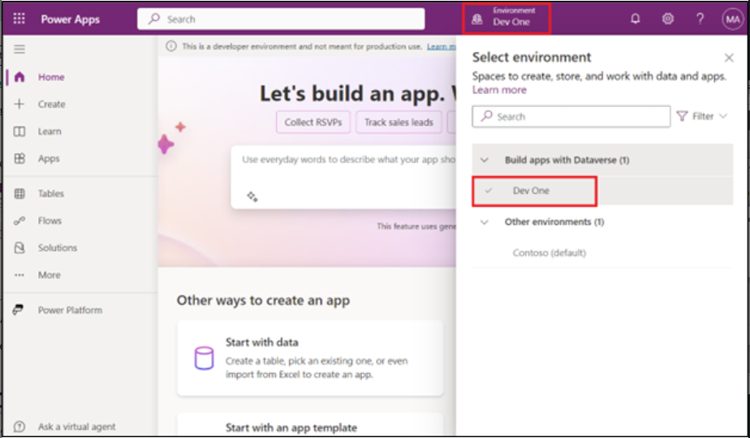
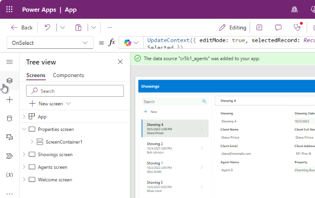

# Lab 1: Erstellen einer Canvas-App für eine Immobilienlösung mit Copilot in Power Apps

In diesem Lab erstellen Sie eine mobile Anwendung, indem Sie Copilot in
Power Apps verwenden. Außendienstmitarbeiter verwenden diese App, um
Immobilieninventar zu durchsuchen und Termine für Besichtigungen zu
verwalten, und die Daten werden in Dataverse gespeichert.

Hinweis: In diesem Lab können die Ergebnisse für Daten von den in den
Screenshots und Bildern gezeigten Ergebnissen abweichen. Der Grund dafür
ist, dass Power Apps OpenAI verwendet, um Daten für das Labor zu
generieren, und sich die Daten täglich ändern.

1.  Melden Sie sich bei Power
    [**Apps-https://make.powerapps.com/**](urn:gd:lg:a:send-vm-keys) mit
    Ihren Office 365-Mandantenanmeldeinformationen an.

2.  Stellen Sie sicher, dass Sie sich in Ihrer Entwicklerumgebung
    befinden - **Dev One**. Wenn nicht, klicken Sie auf die environment
    selector und wählen Sie **Dev One**.

3.  Geben Sie auf der Startseite in Power Apps im mittleren Textfeld die
    folgende Eingabeaufforderung ein, um nach einer AI-generierten
    Tabelle zu suchen:

build an app to manage real estate showings

Wählen Sie die Schaltfläche **Send** aus.

4.  Nachdem Copilot AI Tabellen basierend auf Ihrer Eingabeaufforderung
    generiert hat, durchsuchen Sie die Tabellen, um die Spalten
    anzuzeigen, die für den Anfang Ihrer Tabellen erstellt wurden.

5.  Um weitere Informationen zu sehen, klicken Sie auf die drei Punkte
    über der Tabelle.

Die nächsten Schritte bestehen darin, die bereits generierte Tabelle zu
ändern und zu ergänzen.

6.  Klicken Sie nun auf die **Showings table** und geben Sie dann in das
    Textfeld im unteren Teil des Copilot-Fensters rechts auf dem
    Bildschirm den folgenden Text ein:

Hinzufügen einer Spalte zum Nachverfolgen des vollständigen
Clientnamens.

Dadurch wird eine Spalte in der Tabelle Showing hinzugefügt. Wählen Sie
die Schaltfläche **Send** aus.

7.  Copilot benachrichtigt Sie, dass die Tabelle aktualisiert wurde und
    die neue Spalte als zur angezeigten Tabelle hinzugefügt angezeigt
    werden sollte. (Schieben Sie den Schieberegler nach rechts). Um die
    neue Spalte anzuzeigen, die der Tabelle hinzugefügt wurde, klicken
    Sie auf **View Data** welches im oberen horizontalen Bereich anzeigt
    wird. 

8.  Geben Sie folgenden Text in den Chat ein:

add a column to track client email

Wählen Sie die Schaltfläche **Send** aus.

Der Tabelle wird eine neue Spalte hinzugefügt, in der die E-Mail-Adresse
des Clients angezeigt wird.

**Hinweis:** Die Daten, die in Ihrer Tabelle generiert werden, können
von den Daten abweichen, die in der Tabelle in den Screenshots für
dieses Lab angezeigt werden.

9.  Geben Sie folgenden Text in den Chat ein:

Add columns to track client address and agent name

Wählen Sie die Schaltfläche **Send** aus.

Der Tabelle wird eine neue Spalte hinzugefügt, in der die E-Mail-Adresse
des Clients angezeigt wird.

10. Geben Sie den unten angegebenen Text in den Chat ein und wählen Sie
    die Schaltfläche Send. Der Tabelle wird eine neue Spalte Status
    hinzugefügt, in der die E-Mail-Adresse des Clients angezeigt wird.

Fügen Sie einen Spaltenstatus hinzu, der Datentyp der Spalte ist
ausgewählt (Ausstehend, Abgeschlossen, Bestätigt, Abgebrochen)

11. Wählen Sie das Dropdown-Menü Name der **Status** Spalte aus und
    wählen Sie dann **Edit column.**

12. Sie können die Eigenschaften der Spalten sowie die aktuellen
    Statusdetails und -daten anzeigen. Wählen Sie das **X** in der
    oberen rechten Ecke dieses Fensters aus, um es zu schließen. 

13. Sie können sehen, dass die neuen Optionen jetzt hinzugefügt wurden.
    Wählen Sie das **X** in der oberen rechten Ecke des Bereichs aus, um
    ihn zu schließen.

14. Sie können sehen, dass die neuen Optionen jetzt hinzugefügt wurden.
    

15. Schließen Sie den \*\*Copilot-Bereich\*\* mit dem \*\*X\*\*-Symbol
    in der oberen rechten Ecke des Copilot-Fensters. 

11. Die Tabelle sollte mehrere Spalten enthalten. Wenn Sie jedoch
    weiterhin den Modulen in diesem Lernpfad folgen möchten, versuchen
    Sie, einige Spalten zu entfernen, die Sie nicht verwenden.

Die Liste der Spalten, die Sie benötigen, sind:

- Showing

- Address

- Date

- Status

- Agent Name

- Client Full Name

- Client Email

Verwenden Sie das, was Sie mit dem **Copilot Chat-**Fenster gelernt
haben, um Ihre Tabelle an die vorherige Liste anzupassen. Stellen Sie
sicher, dass Sie sich auf den Abschnitt **Suggestions** beziehen, wenn
Sie eine Spalte entfernen, einen Spaltennamen ändern oder eine Spalte
hinzufügen müssen.

16. Um die App zu erstellen, wählen Sie die Schaltfläche \*\* **Save and
    Open App \*\*** in der oberen rechten Ecke des Bildschirms aus.
    Klicken Sie erneut auf \*\* **Save and Open App \*\*** im Pop-up
    \*\***Done working**?\*\***.** 

17. Wenn die App zum ersten Mal geladen wird, wird möglicherweise ein
    Dialogfeld angezeigt, das besagt, dass **Welcome to Power Apps
    Studio**. Wenn ja, wählen Sie die Schaltfläche **Skip**.

18. Die App, die für Sie erstellt wurde, sollte im **Edit modus**
    angezeigt werden.

19. Schließen Sie für eine bessere Ansicht den Copliot-Bereich.

20. Wählen Sie in der linken Navigationsleiste das Symbol **Data** aus.
    Copilot hat eine **Dataverse-**Tabelle erstellt, die jetzt im
    Abschnitt **Environments** angezeigt wird.

\*\*Hinweis: \*\*Derzeit wird Copilot nur für Dataverse unterstützt. Sie
können derzeit keinen anderen Datenzugriffspunkt verwenden.

Als Nächstes bearbeiten Sie die Tabelle, nachdem die App erstellt wurde.

21. . Zeigen Sie im Bereich **\*\*Data**\*\* mit dem Mauszeiger auf die
    Tabelle \*\*Showing\*. Wählen Sie rechts neben der Tabelle die
    Auslassungspunkte (**...**) und wählen Sie im Menü \*\***Data
    edited\*\***. 

**Hinweis**: Im Dialogfeld **Edit Table** können Sie der Tabelle eigene
Spalten hinzufügen oder vorhandene Spalten ändern.

22. Wählen Sie die Spaltenüberschrift \*\*showing\*\* aus der Tabelle
    aus. Wählen Sie im Dropdown-Menü die Option \*\***Edit Column**\*\*.

23. In diesem Beispiel soll der **Data Type** keine **Single line of
    text**. Um diesen Wert zu ändern, wechseln Sie zum Bereich **Edit
    Column**, und wählen Sie dann im Dropdown-Menü **Date Type** die
    Option **\# Autonumber** aus. Wählen Sie **Save** aus.

24. Wählen Sie die Schaltfläche **Close** in der unteren rechten Ecke
    des Dialogfelds **Edit Table** aus.

25. Die Tabelle sollte jetzt im **Data Pane** als **Refreshed**
    angezeigt werden.

26. Ändern Sie den Katalog in der Anwendung so, dass die relevanten
    Daten angezeigt werden. Wählen Sie das Symbol **Tree View** aus, um
    zu Tree View zurückzukehren.

27. Wählen Sie auf dem Hauptbildschirm der App **RecordsGallery2** aus,
    um Vorführungen anzuzeigen. Um RecirdsGallery2 auszuwählen, folgen
    Sie der unten angegebenen Hierarchie.

> (Wählen Sie Showings Screen \> ScreenContainer3 \> BodyContainer3 \>
> SidebarContainer3 \> RecordsGallery3).

28. Wählen Sie nun den **Edit Button** der **RecordsGallery3,** um die
    Galerie in den Edit Mode zu versetzen.

29. Klicken Sie auf den Abwärtspfeil in RecordGallery3, wählen Sie den
    Titel3 aus und geben Sie dann die unten angegebene Formel ein.

!!ThisItem.’Client Address’!!

30. Wählen Sie **Subtitle3** aus, und legen Sie dann den **Text** Value
    auf die folgende Formel fest:

ThisItem.'Client Email'

31. Wählen Sie **Body3** aus, und legen Sie dann den **Text** Value auf
    die folgende Formel fest:

ThisItem.Status und wählen Sie dann aus den Vorschlägen aus, 

ThisItem.'Status (cra55_status)' 

Wenn die obige Formel einen Fehler anzeigt, verwenden Sie die folgende
Formel

ThisItem.'Location' 

Ein einzelner Datensatz in der Galerie sollte nun der folgenden
Abbildung ähneln.

32. Wählen Sie das **Formular3** im **ScreenContainer3** aus, wählen Sie
    im Zeichenbereich **Fields** aus, und entfernen Sie dann
    **Showing**.

Da Sie das **ID-Feld** zuvor in **Autonumber** geändert haben, möchten
Sie nicht, dass Benutzer ihre eigene Nummer eingeben. Dataverse gibt die
Zahlen automatisch für Sie ein.

33. Stellen Sie eine neue Anforderung für eine Eigenschaft, die in der
    App angezeigt wird, indem Sie im oberen Teil des Bildschirms auf die
    Schaltfläche **Play** klicken.

34. In the left pane, select the **+New** button.

35. Sie können das Formular zwar so ändern, dass die Felder automatisch
    für Sie ausgefüllt werden, aber für dieses Lab führen Sie diesen
    Schritt manuell aus, um zu beobachten, wie die App funktioniert.

Füllen Sie die Felder mit den folgenden Informationen aus:

- Date: Enter any future date

- Time: 15:00

- Agent Name: [**Sarah Connor**](urn:gd:lg:a:send-vm-keys)

- Feedback: [**The property is impressive, but the kitchen needs minor
  upgrades.**](urn:gd:lg:a:send-vm-keys)

- Client Full Name: [**John Almeda**](urn:gd:lg:a:send-vm-keys)

- Client Email: [**john.almeda@example.com**](urn:gd:lg:a:send-vm-keys)

- Client Address: [**210 Pine Road, Portland, OR
  97204**](urn:gd:lg:a:send-vm-keys)

- Status: Pending

- Property: Luxury Villa

36. Aktivieren Sie das Häkchen in der oberen rechten Ecke des
    Bildschirms.

37. Wählen Sie das **X** in der oberen rechten Ecke aus, um die App zu
    schließen.

Wenn ein Dialogfeld mit der Meldung **Did you know?**, wählen Sie **OK**
aus.

Die neue Anforderung wird links neben der Liste der Anforderungen
hinzugefügt.

38. Wählen Sie im oberen Teil des Bildschirms die Schaltfläche **Save**
    aus, um die neue App zu speichern, die Sie erstellt haben.

Wenn Sie vom System dazu aufgefordert werden, speichern Sie den
App-Namen unter **Real Estate Showings**.

39. Beenden Sie die App, um zur Power Apps-Startseite zurückzukehren.
