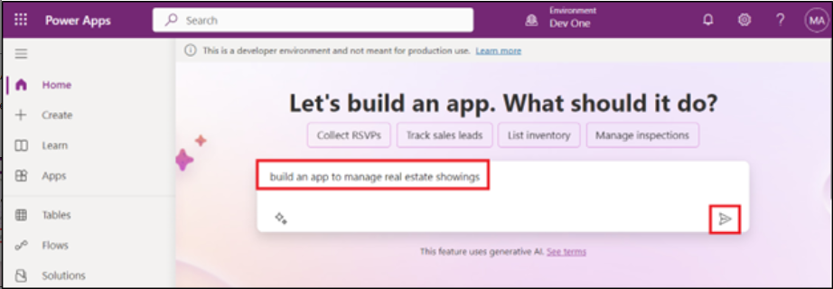
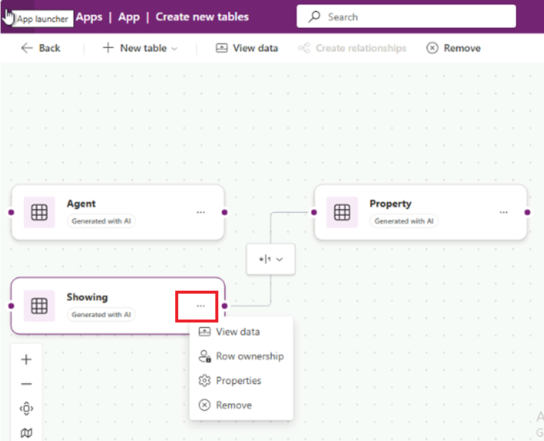
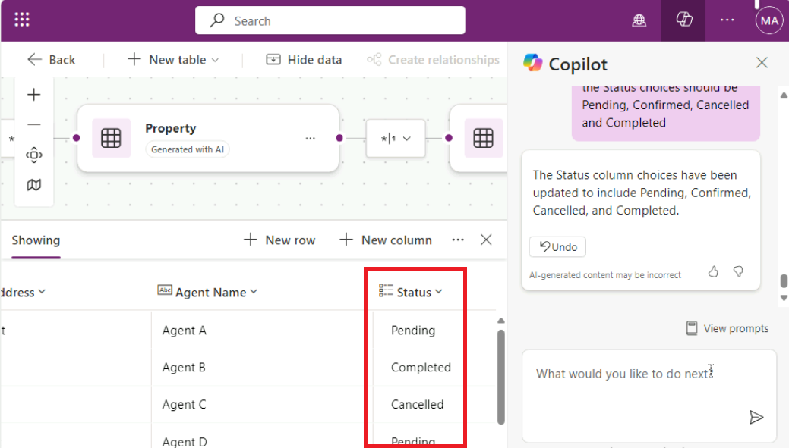
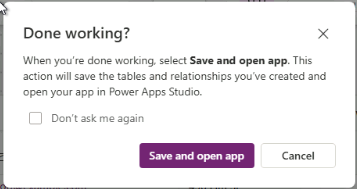
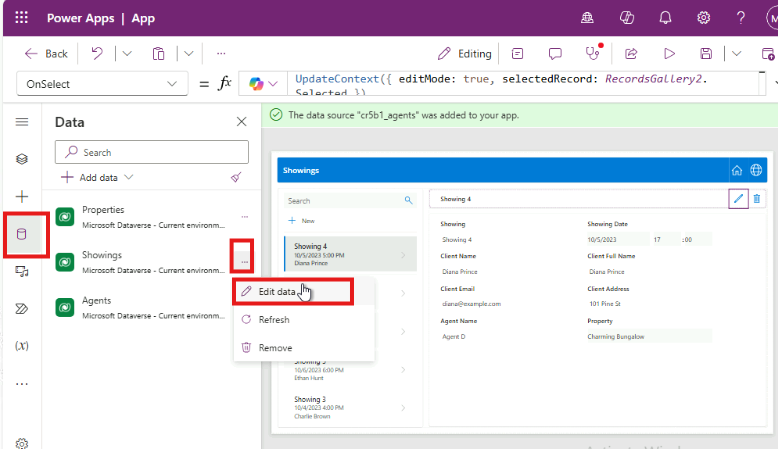
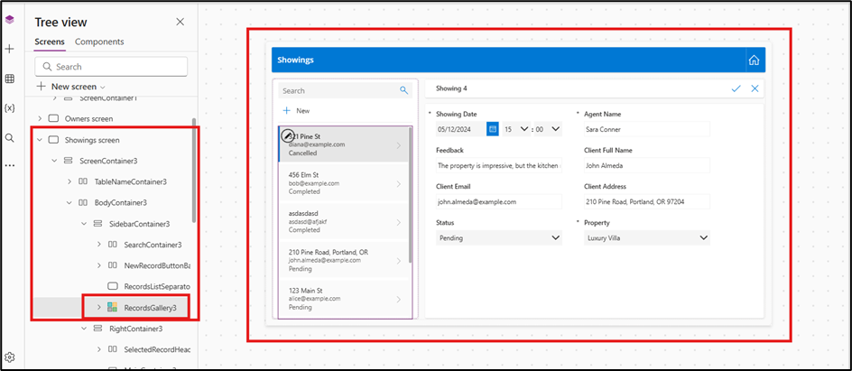
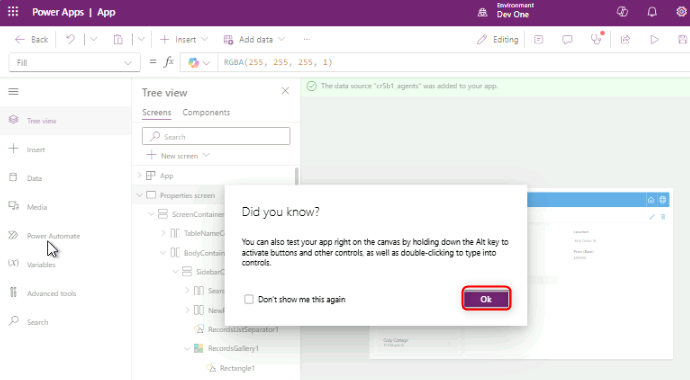

# Lab 1: Building a canvas app for a real estate solution with Copilot in Power Apps

In this lab, you'll create a mobile application by using Copilot in
Power Apps. Field agents will use this app to browse real estate
inventory and manage appointments for showings, and the data will be
stored in Dataverse.

\*\*Note:\*\* In this lab, your results for data might vary from those
shown in the screenshots and images. The reason is because Power Apps
uses AI to generate data for the lab and the data changes daily.

1.  Sign into Power
    Apps [**https://make.powerapps.com/**](urn:gd:lg:a:send-vm-keys) using
    your Office 365 tenant credentials.

2.  Ensure that you are in your developer environment - **Dev One**. If
    not, click on environment selector and select **Dev One**.

3.  On the Home page in Power Apps, in the center text field, enter the
    following prompt to search for an AI-generated table:

build an app to manage real estate showings

Select the **Send** button.

4.  After Copilot AI generates tables based on your prompt, look through
    the tables to view the columns that are created for the start of
    your tables.

5.  To see more information, click on three dots above the table.

Your next steps are to modify and add to the already generated table.

6.  Now click on the **Showings table** and then in the text box, in the
    lower part of the Copilot pane to the right of the screen, enter the
    following text:

Add a column to track client full name

This will add a column in the showings table. Select
the **Send** button.

7.  Copilot notifies you that the table is updated, and the new column
    should show as being added to the showing table. (Move the slide bar
    towards the right). To see the new column added to the table, click
    on **View data** from upper horizontal pane. 

8.  Enter the following text into the chat:

add a column to track client email

Select the **Send** button.

A new column is added to the table and displays the client's email.

**Note:** The data that's generated in your table might vary from the
data that's shown in the table in the screenshots for this lab.

9.  Enter the following text into the chat:

Add columns to track client address and agent name

Select the **Send** button.

A new column is added to the table and displays the client's email.

10. Enter the below given text into the chat and select the Send button.
    A new column Status is added to the table and displays the client's
    email.

Add a column status, data type of the column is choice (Pending,
Completed, Confirmed, Cancelled)

11. Select the **Status** column name dropdown menu and then
    select **Edit column.**

12. You can view the columns' properties and the current status details
    and data. Select the **X** in the upper-right corner of this pane to
    close it. 

13. You can see the new choices are now added. Select the **X** in the
    upper-right corner of the pane to close it.

14. You can see the new choices are now added. 

15. Close the \*\*Copilot pane\*\* by using \*\*X\*\* icon on top right
    corner of the Copilot pane. 

11. Your table should have several columns. However, to continue
    following the modules in this learning path, try to remove some
    columns that you won't use.

The list of columns that you need are:

- Showing

- Address

- Date

- Status

- Agent Name

- Client Full Name

- Client Email

Use what you've learned with the **Copilot Chat** window to adjust your
table to match the preceding list. Make sure that you refer to
the **Suggestions** section if you need to remove a column, change a
column name, or add a column.

16. To create the app, select the \*\***Save and Open App\*\*** button
    on the top-right corner of the screen. Again click on \*\***Save and
    Open App\*\*** on **\*\*Done working?\*\*** pop-up**.** 

17. When the app first loads, a dialog might appear stating **Welcome to
    Power Apps Studio**. If so, select the **Skip** button.

18. The app that has been built for you should show in **Edit** mode.

19. For the better view, close the Copliot pane.

20. Select the **Data** icon from the left navigation bar. Copilot has
    created a **Dataverse** table that's now displaying in
    the **Environments** section.

\*\*Note: \*\*Currently, Copilot is only supported for Dataverse. You
can't use any other data access point at this time.

Next, you'll edit the table now that the app has been created.

21. . Within the \*\***Data**\*\* pane, hover your mouse cursor over the
    \*\*Showing\*\* table. To the right of the table, select the
    ellipsis (**...**) and from the menu, select \*\***Edit data\*\***. 

**Note**: In the **Edit table** dialog, you can add your own columns to
the table or modify existing columns.

22. Select the \*\*Showing\*\* column header from the table. From the
    dropdown menu, select the \*\***Edit column\*\*** option.

23. In this example, you don't want the **Data type** to be a **Single
    line of text**. To change that value, go to the **Edit
    column** pane, and then from the **Date type** dropdown menu,
    select **\# Autonumber**. Select **Save**.

24. Select the **Close** button in the lower-right corner of the **Edit
    table** dialog.

25. The table should now show as **Refreshed** in the **Data** pane.

26. Modify the gallery in the application so that it displays the
    relevant data. Select the **Tree view** icon to return to the Tree
    view.

27. On the app's main screen, select **RecordsGallery3** to display
    Showings. To select RecirdsGallery3 follow the below given
    hierarchy.

> (Select Showings Screen \> ScreenContainer3 \> BodyContainer3 \>
> SidebarContainer3 \> RecordsGallery3).

28. Now select the **edit button** of the **RecordsGallery3** to put the
    gallery in edit mode.

29. Click on the down arrow on RecordGallery3, select the Title3 and
    then enter the below given formula.

!!ThisItem.’Client Address’!!

30. Select the **Subtitle3** and then set the **Text** value to the
    following formula:

ThisItem.'Client Email'

31. Select the **Body3** and then set the **Text** value to the
    following formula: 

ThisItem.Status  and then from the suggestions select, 

ThisItem.'Status (cra55_status)' 

If above formula shows you an error then use the below one 

ThisItem.'Location' 

A single record in the gallery should now resemble the following image.

32. Select the **Form3** in the **ScreenContainer3**, In the canvas
    select **Fields** and then remove **Showing**.

Because you previously changed the **ID** field to **Autonumber**, you
don't want users entering their own number; Dataverse automatically
enters the numbers for you.

33. Make a new request for a property that shows in the app by selecting
    the **Play** button from the upper part of the screen.

34. In the left pane, select the **+New** button.

35. Though you could modify the form to automatically fill in the fields
    for you, for this lab, you'll complete this step manually to observe
    how the app works.

Fill in the fields with the following information:

- Date: Enter any future date

- Time: 15:00

- Agent Name: [**Sarah Connor**](urn:gd:lg:a:send-vm-keys)

- Feedback: [**The property is impressive, but the kitchen needs minor
  upgrades.**](urn:gd:lg:a:send-vm-keys)

- Client Full Name: [**John Almeda**](urn:gd:lg:a:send-vm-keys)

- Client Email: [**john.almeda@example.com**](urn:gd:lg:a:send-vm-keys)

- Client Address: [**210 Pine Road, Portland, OR
  97204**](urn:gd:lg:a:send-vm-keys)

- Status: Pending

- Property: Luxury Villa

36. Select the check mark in the upper-right corner of the screen.

37. Select the **X** in the upper-right corner to close out of the app.

If a dialog appears saying **Did you know?**, select **OK**.

The new request is added to the left of the list of requests.

38. From the upper part of your screen, select the **Save** button to
    save the new app that you created.

If the system prompts you, save the app name as **Real Estate
Showings**.

39. Exit the app to return to the Power Apps home page.
