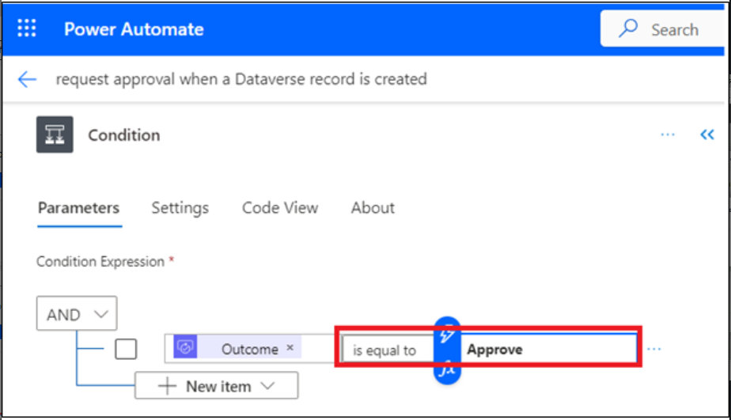
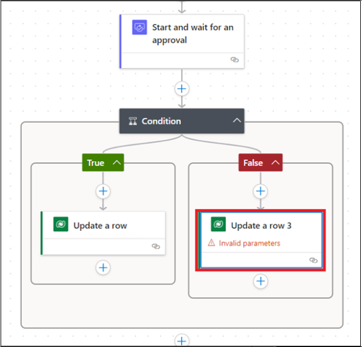
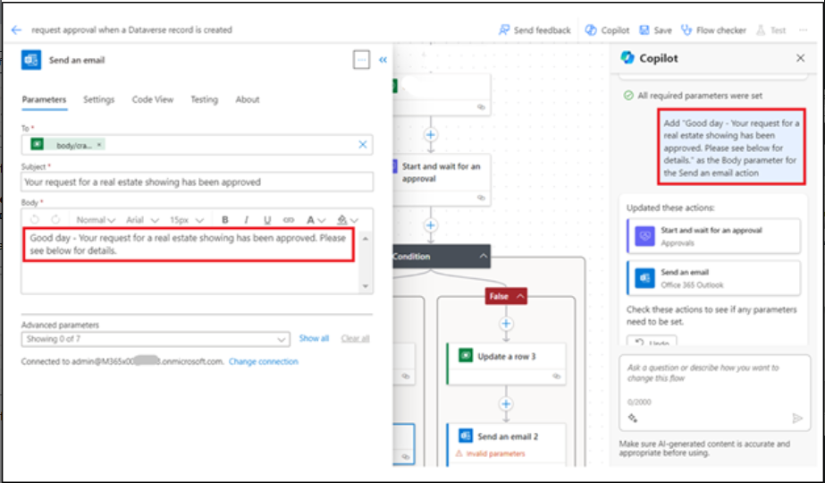
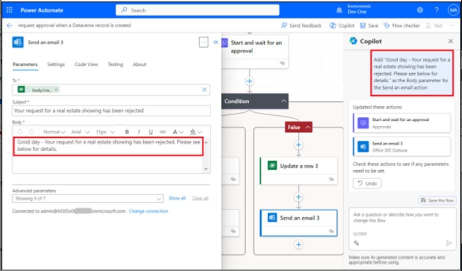
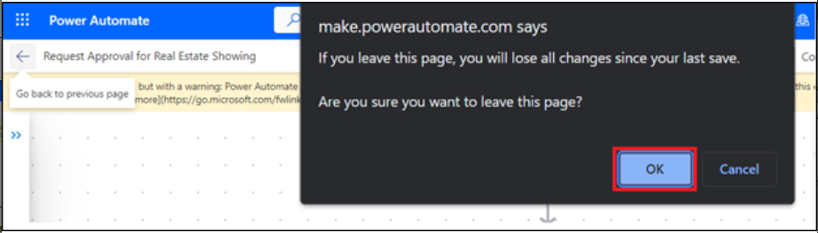

# **实验 2：使用 Copilot 自动执行房地产展示的审批流程**

在本实验中，您将使用 Power Automate 中的 Copilot
创建自动化，以自动执行房地产展示的审批流程。您将使用 Copilot
创建一个流，当请求新的展示时，该流会向房地产经纪人发送电子邮件。然后，代理可以从电子邮件中批准或拒绝显示的请求。

按照以下步骤使用 Copilot 创建流。

1.  使用 [**https://make.powerautomate.com/**](urn:gd:lg:a:send-vm-keys) 和
    Office 365 租户凭据登录 Power Automate。

2.  选择 **United States** 作为国家/地区，然后单击 **Get started**。

3.  单击 **environment selector** 并选择 **Dev One** environment （Dev
    One 环境）。

4.  在 Power Automate 中主页中心的 **Lets automate something. What
    should it do?** 输入以下提示：

[**Start an approval process for a new microsoft dataverse record and
update the record based on the outcome**](urn:gd:lg:a:send-vm-keys)

选择 **Generate** （生成） 按钮。

5.  如果您建议的流程仅包含两个步骤，即 When a row is added， modified，
    or deleted 和 Start and wait for approval，然后单击 **Show a
    different suggestion**。

6.  在提示中，Copilot 提供了您可以查看的建议流程的大纲。要接受流，请选择
    **Next**（下一步）。

7.  查看连接的应用程序和服务。如果尚未建立连接，请编辑或修复它，然后选择
    **Create flow** （创建流）。

“使用 Copilot 编辑”设计器将打开，其中包含您的流程以及右侧的 Copilot
聊天窗口。

8.  通过选择 **When a row is added， modified or deleted**
    触发器来设置一些参数。

屏幕左侧的面板显示触发器详细信息，包括所需的空 **Table Name** 参数。

9.  . 从 **\*\*Table Name\*\*** 下拉菜单中，搜索并选择
    **\*\*Showings\*\***。 

> \*\*注意： \*\* 选择在 lab1 中生成的表。 

10. 折叠 When a row is added， modified or deleted
    面板，使用面板右上角的折叠图标。

11. 从流程中选择 Start and wait for an approval （启动并等待审批）作

请注意，缺少 **Approval Type** 参数。

12. 从 **Approval Type** 下拉菜单中，选择 **Approve/Reject - First to
    respond**。

选择 **Approval Type** （审批类型） 后，现在可以使用更多参数。

13. 在 Copilot 聊天窗口中，输入以下提示：

> 将 “New Request for Showing” 添加为 Start and wait for an approval作的
> Title 参数
>
> \*\*注意： \*\* 请使用我们从中提取数据的表的名称。如果实验室 1
> 生成了其他表，请使用该表的名称。 

Copilot 需要几秒钟来处理提示。处理完成后，**Title** 参数将填充提示文本。

14. 对于 **Assigned To** 参数，输入您用于此实验室的 Office 365
    租户凭据。此电子邮件地址是接收审批请求的地址。

15. 对于 **Details** （详细信息） 参数，输入以下文本：

> 已创建房地产显示的新请求。请查看以下详细信息并批准或拒绝请求：
>
> \*\*Property:\*\* \*\*Client:\*\* \*\*Client Email:\*\* \*\*Date:\*\* 

16. 将 curser 放在 **Details** 参数中的 **Property：**
    旁边，然后选择闪电图标以打开 **Dynamic content** （动态内容） 窗格。

17. 在 **Dynamic content** 窗格中，选择 **See More** 步骤 “When a row is
    added， modified or deleted” 以展开可用动态内容的列表。

18. 向下滚动，直到找到 **Client Address** 字段，然后选择 **Add** 。

**Address** 动态内容字段现已添加到 **Details** 参数中。

19. 对 **Client**、**Client Email** 和 **Date** 字段完成相同的步骤。

完成其余字段后，这些值应类似于下图。

20. 完成 **Details** 参数后，您可以通过选择双箭头图标来折叠 **Start and
    wait for an approval**作。

21. 选择 **Condition** （条件）作。

22. 选择 **Choose a value** 框，然后从 **Dynamic content** 窗格中选择
    **Outcome**。

23. 为条件选择 **is equal to**，然后输入 **Approve** for **Value**。

24. 折叠 **Condition**作。

25. 在条件的 **True** 分支下选择 **Update a row**作。

26. 从 **Table Name** 下拉菜单中，搜索并选择 **Showings**。

27. 选择 **Row ID** 字段，选择 **Dynamic content** ，然后选择 **see
    more** 在添加、修改或删除行时。

28. 现在，从 **Dynamic content** 窗格中选择 **Showings** unique
    identifier 字段，然后单击 **Add**。

每当您在 Microsoft Dataverse
中创建表时，都会自动创建一个与表名称相同的列。此列用作已创建的记录（或行）的唯一查找
ID。

29. 在 **Advanced parameters** （高级参数） 下选择 **Show all**
    （全部显示）。

30. 从 **Status** 下拉菜单中选择 **Confirmed**。

当看房获得批准后，**Real Estate Showings** 表中的 **Status**
字段将更新为 **Confirmed**。

31. 折叠 **Update a row**作。

32. 在条件的 **False** 分支下选择 **Update a row**作。

33. 从 **Table Name** 下拉菜单中，搜索并选择 **Showings**。

34. 选择 **Row ID** 字段，然后从 **Dynamic content** 窗格中选择
    **Showings** unique identifier 字段。

35. 在 **Advanced parameters** （高级参数） 下选择 **Show all**
    （全部显示）。

36. 选择 **Canceled** 从 **Status** 下拉菜单。

当显示被拒绝时，**Real Estate Showings** 表中的 **Status** 字段将更新为
**Canceled**。

37. 折叠 **Update a row**作。

38. 在 Copilot 聊天窗口中，输入以下提示，然后提交：

[**Under the "Update a row" action for both branches in the condition,
add a new "Send an email (V2)" action**](urn:gd:lg:a:send-vm-keys)

几秒钟后，Copilot 应解释它的作用，如下图所示。

39. 在条件的 **True** 分支下选择 **Send an email**作。

40. 在 \*\*To\*\*字段行中选择 \*\*Switch to advanced mode\*\*，选择
    **Enter custom value**，然后从 **Dynamic content** 窗格中选择
    **Client Email** 字段。（选择 When a row is added， modified or
    deleted 前面的 **see more** （查看更多）

41. 对于 **Subject** 字段，在 Copilot
    聊天窗口中输入以下文本，然后按键盘上的 **Enter** 键：

**Add "Your request for a real estate showing has been approved" as the
Subject parameter for the Send an email action**

**Subject** （主题） 字段应填充提示文本。

42. 对于 **Body** 字段，在 Copilot
    聊天窗口中输入以下文本，然后按键盘上的 **Enter** 键：

**Add "Good day - Your request for a real estate showing has been
approved. Please see below for details." as the Body parameter for the
Send an email action**

**Body** 字段应填充提示文本。

43. 在 **Body** 文本后输入以下内容：

**财产：**

**代理名称：**

**显示日期：**

将 **Dynamic content** 窗格中的 **Client Address**、**Agent Name** 和
**Showing Date** 字段添加到 **Body** 文本中的相应行中。

44. 将 **Response summary** 字段从 **Dynamic content** （动态内容）
    窗格添加到 **Body** 文本的末尾。

45. 折叠 **Send an email**作。

46. 在条件的 **False** 分支下选择 **Send an email**作。选择 **To**
    字段，删除 example@example.com 电子邮件地址，然后从 **Dynamic
    content** 窗格中选择 **Client Email** 字段。

47. 对于 **Subject** 字段，在 Copilot
    聊天窗口中输入以下内容，然后按键盘上的 **Enter** 键：

[**Add "Your request for a real estate showing has been rejected" as the
Subject parameter for the Send an email
action**](urn:gd:lg:a:send-vm-keys)

48. 对于 **Body** 字段，在 Copilot
    聊天窗口中输入以下文本，然后按键盘上的 **Enter** 键：

[**Add "Good day - Your request for a real estate showing has been
rejected. Please see below for details." as the Body parameter for the
Send an email action**](urn:gd:lg:a:send-vm-keys)

49. 在 **Body** 文本后输入以下内容：

**财产：**

**代理名称：**

**显示日期：**

将 **Address** （地址） 、 **Agent Name** （代理名称） 和 **Showing
Date** （显示日期） 字段从 **Dynamic content** （动态内容） 窗格添加到
**Body** 文本中的相应行中。

50. 将 **Response summary** 字段从 **Dynamic content** （动态内容）
    窗格添加到 **Body** 文本的末尾。

51. 折叠 **Send an email**作。

52. 通过在屏幕左上角选择 **request approval when a Dataverse record is
    created** 准文本，将流重命名为 **Request Approval for Real Estate
    Showing** 。

53. 通过选择屏幕右上角的 **Save** （保存） 按钮来保存流。

54. 选择流名称前的 **back arrow** 。

55. 选择 **OK**。

56. 要提交房地产显示请求，请使用 [**https://make.powerapps.com/**](urn:gd:lg:a:send-vm-keys) 转到
    Power Apps 中的 Real Estate Showings 应用 。

57. 从左侧导航栏中选择 **Apps**，选择 **Showings** 应用程序，然后选择
    **Play**。

58. Select **+New** to create a new showing request.

59. 在字段中填写以下信息：

    - **代理名称 -** \<随机名称\>

    - **客户全名 -** \<您的姓名 \>

    - **客户端电子邮件 -** \<您的电子邮件\>（您用于此实验的电子邮件）

    - **日期 -** \< 任何将来的日期\>

    - **时间 -** \< 任何将来的时间\>

    - **状态 -** Pending

    - **地址 -** 210 Pine Road, Portland, OR 97204

**注意** 此地址是模块 1 中 Microsoft Excel 文件中的地址之一;
它与您上传并转换为 **Real Estate Properties** 表的文件相同。

通常，您会有一个指向 **Real Estate Properties**
表的查找字段，但本实验并非为了简单起见。

60. 选择屏幕右上角的复选标记。

该流程将运行，并将审批电子邮件发送到您在构建的流程中提供的电子邮件地址。

61. 登录到您用于此实验的电子邮件帐户，然后等待电子邮件到达。

**注意：**如果流没有立即运行，请确保等待它。触发流可能需要长达 10
分钟的时间，尤其是在第一次尝试时。

审批应类似于下图。

62. 选择 **Approve**（批准）。

63. 添加评论，然后选择 **Submit**。

流继续运行;它会更新行并向请求者发送电子邮件。发送给请求者的电子邮件类似于下图。

64. 检查流，并注意该流现在在运行历史记录中标记为 **Succeeded**。

