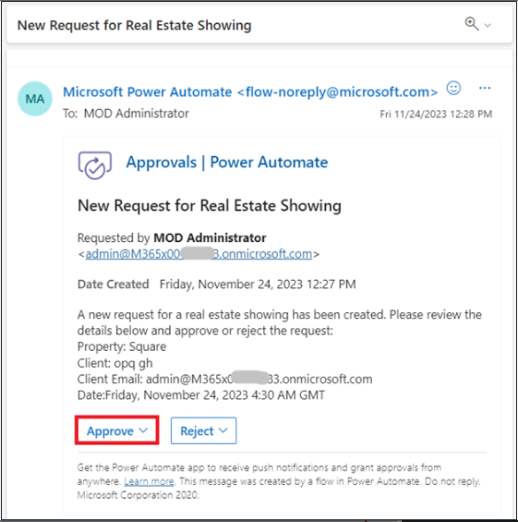

# **Atelier 2 : Automatiser le processus d'approbation d'une visite immobilière à l'aide de Copilot**

Dans cet atelier, vous allez créer une automatisation à l'aide de
Copilot in Power Automate pour automatiser le processus d'approbation
d'une visite immobilière. Vous allez utiliser Copilot pour créer un flux
qui envoie un e-mail à l'agent immobilier lorsqu'une nouvelle visite est
demandée. Ensuite, l'agent peut approuver ou rejeter la demande de
visite à partir de l'e-mail.

Suivez ces étapes pour créer un flux à l'aide de Copilot.

1.  Connectez-vous à Power Automate à l'aide
    [**https://make.powerautomate.com/**](%20https://make.powerautomate.com/)
    avec vos informations d'identification de Office 365 tenant.

2.  Sélectionnez **États-Unis** comme pays/région, puis cliquez sur
    **Get started**.

3.  Cliquez sur **environment selector** , puis sélectionnez
    **l'environnement Dev One**.

4.  Au centre de la page d'**accueil** dans Power Automate, dans le
    champ de texte **Lets automate something. What should it
    do?** Entrez le prompt suivant :

[**Start an approval process for a new microsoft dataverse record and
update the record based on the outcome**](urn:gd:lg:a:send-vm-keys)

Sélectionnez le bouton **Generate**.

5.  Si le flux que vous proposez ne contient que deux étapes,
    c'est-à-dire lors de l'ajout, de la modification ou de la
    suppression d'une ligne et Démarrer et attendre l'approbation, puis
    cliquez sur **Show a different suggestion.**

6.  À partir de prompt Copilot fournit les grandes lignes d'un flux
    suggéré que vous pouvez consulter. Pour accepter le flux,
    sélectionnez **Next**.

7.  Passez en revue les applications et services connectés. Si aucune
    connexion n'a été établie, modifiez-la ou corrigez-la, puis
    sélectionnez **Create flow**.

Le concepteur Modifier avec Copilot s'ouvre avec votre flux avec une
fenêtre de Copilot chat sur la droite.

8.  Configurez certains paramètres en sélectionnant l' option **When a
    row is added, modified or deleted** trigger.

Un panneau sur le côté gauche de l'écran affiche les détails du
déclencheur, y compris un paramètre **Table Name**  vide qui est requis.

9.  . Dans le menu déroulant **\*\*Table Name\*\*** recherchez et
    sélectionnez **\*\* Showings \*\***.

> \*\*note:\*\* Sélectionnez la table qui a été générée dans l’atelier
> 1.

10. Réduisez le panneau Lorsqu'une ligne est ajoutée, modifiée ou
    supprimée à l'aide de l'icône Réduire dans le coin supérieur droit
    du panneau.

11. Sélectionnez l' action **Start and wait for an approval** dans le
    flux

Notez que le paramètre **Approval Type**  est manquant.

12. Dans le menu déroulant **Approval Type**  sélectionnez
    **Approve/Reject - First to respond**.

Une fois que vous avez sélectionné le **Approval Type**,, d'autres
paramètres sont désormais disponibles.

13. Dans la fenêtre de Copilot chat, entrez le prompt suivant :

> Ajoutez « Nouvelle demande d'affichage » comme paramètre Titre pour le
> démarrage et attendez une action d'approbation
>
> \*\*Remarque :\*\* Utilisez le nom de la table à partir de laquelle
> nous ingérons des données. Si l'atelier 1 a généré une autre table,
> utilisez le nom de cette table.

Il faut quelques secondes à Copilot pour traiter le prompt. Une fois le
traitement terminé, le **p**aramètre **Title** est renseigné avec le
texte de prompt.

14. Pour le parameter **Assigned To** , entrez les informations
    d'identification du locataire Office 365 que vous utilisez pour cet
    atelier. Cette adresse e-mail est celle qui reçoit la demande
    d'approbation.

15. Pour le paramètre **Détails**, entrez le texte suivant :

> Une nouvelle demande de visite immobilière a été créée. Veuillez
> consulter les détails ci-dessous et approuver ou rejeter la demande :
>
> \*\*Propriété :\*\* \*\*Client :\*\* \*\*Courriel du client :\*\*
> \*\*Date :\*\*

16. Placez votre curseur en regard de **Property:** dans le paramètre
    **Détails**, puis sélectionnez l'icône en forme d'éclair pour ouvrir
    le volet **Dynamic content** .

17. Dans le volet **Dynamic content** , sélectionnez **See More**  de
    l'étape « Lorsqu'une ligne est ajoutée, modifiée ou supprimée » pour
    développer la liste du contenu dynamique disponible.

18. Faites défiler l'écran vers le bas jusqu'à ce que vous trouviez le
    champ **Client** **Address** , puis sélectionnez **Add**.

Le champ de contenu dynamique **Adresse** est désormais ajouté au
paramètre **Détails**.

19. Procédez comme suit pour les champs **Client**, **Courriel du
    client** et **Date**.

Lorsque vous avez terminé avec le reste des champs, les valeurs doivent
ressembler à l'image suivante.

20. Une fois le paramètre **Détails** terminé, vous pouvez réduire l'
    action **Start and wait for an approval**  une approbation en
    sélectionnant l'icône de la double flèche.

21. Sélectionnez l' action **Condition**.

22. Sélectionnez la zone  **Choose a value** , puis sélectionnez
    **Outcome** dans le volet **Dynamic content**.

23. Sélectionnez **est égal à** pour la condition, puis entrez
    **Approve** pour la **valeu**.

24. Réduire l' action **Condition**.

25. Sélectionnez l' action **Update a row**  sous la branche **True** de
    la condition.

26. Dans le menu déroulant **Table Name** , recherchez et sélectionnez
    **Showings**.

27. Sélectionnez le champ **Row ID** , sélectionnez **Dynamic content** 
    puis sélectionnez **see more**  devant le champ Lorsqu'une ligne est
    ajoutée, modifiée ou supprimée.

28. Maintenant, sélectionnez le champ **Showings** dentifiant unique des
    expositions dans le volet **Dynamic content**  et cliquez sur
    **Add**.

Chaque fois que vous créez une table dans Microsoft Dataverse, une
colonne est automatiquement créée avec le même nom que la table. Cette
colonne sert d'ID de recherche unique pour l'enregistrement (ou la
ligne) qui a été créé.

29. Sélectionnez **Show all**  sous **Advanced parameters**.

30. Sélectionnez **Confirmed** dans le menu déroulant **Status**.

Lorsqu'une visite est approuvée, le champ **Status** de la table **Real
Estate Showings**  est mis à jour sur **Confirmed**.

31. Réduire l' action **Update a row** .

32. Sélectionnez l' action **Update a row**  sous la branche **False**
    de la condition.

33. Dans le menu déroulant **table name** , recherchez et sélectionnez
    **Showings.**

34. Sélectionnez le champ **raw ID** , puis sélectionnez **Showings** le
    champ Identificateur unique dans le volet **Dynamic content** .

35. Sélectionnez **Show all**  sous **Advanced parameters**.

36. Sélectionnez **Canceled** dans le menu déroulant **Status**.

Lorsqu'une visite est rejetée, le champ **Status** de la table **Real
Estate Showings**  est mis à jour sur **Canceled**.

37. Réduire l' action **Update a row** .

38. Dans la fenêtre de Copilot chat, entrez le prompt suivant, puis
    soumettez :

[**Under the "Update a row" action for both branches in the condition,
add a new "Send an email (V2)" action**](urn:gd:lg:a:send-vm-keys)

Après quelques secondes, Copilot devrait expliquer ce qu'il a fait,
comme le montre l'image suivante.

39. Sélectionnez l' action **Send an email**  sous la branche **True**
    de la condition.

40. Sélectionnez \*\*Passer en mode avancé\*\* dans la ligne du champ
    \*\*To\*\*, sélectionnez **Enter custom value**  puis sélectionnez
    le champ **Client Email**  dans le volet **Dynamic content** .
    (Sélectionnez **see more**  en avant de la Quand une ligne est
    ajoutée, modifiée ou supprimée)

41. Pour le champ **Subject**, entrez le texte suivant dans la fenêtre
    de chat Copilot, puis appuyez sur la touche **Enter** de votre
    clavier :

**Ajouter "Your request for a real estate showing has been approved"
comme paramètre Objet pour l'action Envoyer un email**

Le champ **Suject** doit être renseigné avec le texte de Prompt.

42. Pour le champ **Body**, entrez le texte suivant dans la fenêtre de
    chat Copilot, puis appuyez sur la touche **Enter** de votre clavier
    :

**Ajouter " Good day - Your request for a real estate showing has been
approved. Please see below for details." en tant que paramètre Corps
pour l'action Envoyer un e-mail**

Le champ **Body** doit être renseigné avec le texte de Prompt.

43. Entrez le contenu suivant après le **body** de texte :

**Propriété:**

**Nom de l'agent :**

**Date de projection :**

Ajoutez les **champs Adresse du client**, **Nom de l'agent** et **Date
d'affichage** à partir du volet **Dynamic content**  aux lignes
appropriées dans le **Body** du texte.

44. Ajoutez le champ **Response summary**  du volet **Dynamic content** 
    à la fin du **Body** du texte.

45. Réduisez l' action **Send an email** .

46. Sélectionnez le **Send an email**  sous la branche **False** de la
    condition. Sélectionnez le champ **À**, supprimez l'adresse e-mail
    example@example.com, puis sélectionnez le champ **E-mail du client**
    dans le volet **Dynamic content** 

47. Pour le champ **Subject**, entrez le contenu suivant dans la fenêtre
    de chat Copilot, puis appuyez sur la touche **Enter** de votre
    clavier :

[**Add "Your request for a real estate showing has been rejected" as the
Subject parameter for the Send an email
action**](urn:gd:lg:a:send-vm-keys)

48. Pour le champ **body**, entrez le texte suivant dans la fenêtre de
    chat Copilot, puis appuyez sur la touche **Enter** de votre clavier
    :

[**Add "Good day - Your request for a real estate showing has been
rejected. Please see below for details." as the Body parameter for the
Send an email action**](urn:gd:lg:a:send-vm-keys)

49. Entrez le contenu suivant après le **Body** du texte :

**Propriété:**

**Nom de l'agent :**

**Date de projection :**

Ajoutez les **champs Adresse**, **Nom de l'agent** et **Date
d'affichage** du volet **C Dynamic content**  aux lignes appropriées
dans le **Body** du texte.

50. Ajoutez le **champ Résumé** de la réponse du volet **Dynamic
    content**  à la fin du **Body** du texte.

51. Réduisez l' action **Send an email** 

52. Renommez le flux en **Request Approval for Real Estate Showing** 
    sélectionnant le text **request approval when a Dataverse record is
    created**  **dans** le coin supérieur gauche de l'écran.

53. Enregistrez le flux en sélectionnant le bouton  **Save**  dans le
    coin supérieur droit de l'écran.

54. Sélectionnez la **flèche de retour** avant le nom du flux.

55. Sélectionnez **OK**.

56. Pour soumettre une demande de visite immobilière, accédez à
    l'application Visites immobilières dans Power Apps à l'aide
    [**https://make.powerapps.com/**](urn:gd:lg:a:send-vm-keys) .

57. Sélectionnez **Applications** dans le volet de navigation de gauche,
    sélectionnez l'application **Showings**, puis sélectionnez **Play**.

58. Sélectionnez **+New** pour créer une nouvelle demande d'affichage.

59. Remplissez les champs avec les informations suivantes :

    - **Nom de l'agent** - \< nom aléatoire \>

    - **Nom complet du client** - \< Votre nom \>

    - **Adresse e-mail du client** : \< votre email \> de messagerie
      (l'adresse e-mail que vous utilisez pour cet atelier)

    - **Date** - \< Toute date future \>

    - **Heure** - \< Toute heure future \>

    - **Statut** - En attente

    - **Adresse** - 210 Pine Road, Portland, OR 97204

**Remarque** Cette adresse est l'une des adresses du fichier Microsoft
Excel du module 1 ; il s'agit du même fichier que celui que vous avez
téléchargé et transformé dans le tableau **Real Estate Properties** .

En général, vous disposez d'un champ de recherche pour la table **Real
Estate Properties** , mais pas pour que cet atelier reste simple.

60. Sélectionnez la coche dans le coin supérieur droit de l'écran.

Le flux s'exécute et envoie un e-mail d'approbation à l'adresse e-mail
que vous avez fournie dans le flux que vous avez créé.

61. Connectez-vous à l'adresse e-mail que vous utilisez pour cet
    atelier, puis attendez l'arrivée de l'e-mail.

**Remarque :** Si le flux ne s'exécute pas immédiatement, assurez-vous
de l'attendre. Le déclenchement du flux peut prendre jusqu'à 10 minutes,
en particulier lors du premier essai.

L'approbation doit ressembler à l'image suivante.

62. Sélectionnez **Approve**.

63. Ajoutez un commentaire, puis sélectionnez **Send**.

Le flux continue de couler ; Il met à jour la ligne et envoie un e-mail
au demandeur. L'e-mail envoyé au demandeur ressemble à l'image suivante.

64. Vérifiez le flux et notez qu'il est maintenant marqué comme
    **Succeeded** dans l'historique des exécutions.

