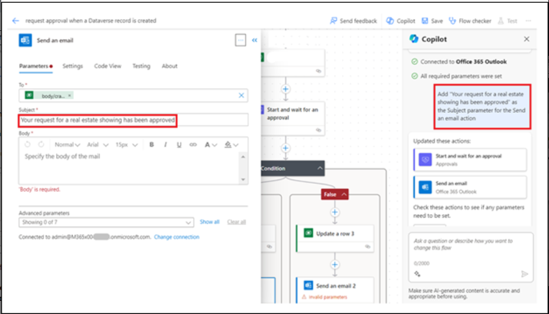

# **實驗 2：使用 Copilot 自動執行房地產展示的審批流程**

在本實驗中，您將使用 Power Automate 中的 Copilot
創建自動化，以自動執行房地產展示的審批流程。您將使用 Copilot
創建一個流，當請求新的展示時，該流會向房地產經紀人發送電子郵件。然後，代理可以從電子郵件中批准或拒絕顯示的請求。

按照以下步驟使用 Copilot 創建流。

1.  使用 [**https://make.powerautomate.com/**](urn:gd:lg:a:send-vm-keys) 和
    Office 365 租戶憑據登錄 Power Automate。

2.  選擇 **United States** 作為國家/地區，然後單擊 **Get started**。

3.  單擊 **environment selector** 並選擇 **Dev One** environment （Dev
    One 環境）。

4.  在 Power Automate 中主頁中心的 **Lets automate something. What
    should it do?** 輸入以下提示：

[**Start an approval process for a new microsoft dataverse record and
update the record based on the outcome**](urn:gd:lg:a:send-vm-keys)

選擇 **Generate** （生成） 按鈕。

5.  如果您建議的流程僅包含兩個步驟，即 When a row is added， modified，
    or deleted 和 Start and wait for approval，然後單擊 **Show a
    different suggestion**。

6.  在提示中，Copilot 提供了您可以查看的建議流程的大綱。要接受流，請選擇
    **Next**（下一步）。

7.  查看連接的應用程序和服務。如果尚未建立連接，請編輯或修復它，然後選擇
    **Create flow** （創建流）。

“使用 Copilot 編輯”設計器將打開，其中包含您的流程以及右側的 Copilot
聊天窗口。

8.  通過選擇 **When a row is added， modified or deleted**
    觸發器來設置一些參數。

屏幕左側的面板顯示觸發器詳細信息，包括所需的空 **Table Name** 參數。

9.  . 從 **\*\*Table Name\*\*** 下拉菜單中，搜索並選擇
    **\*\*Showings\*\***。 

> \*\*注意： \*\* 選擇在 lab1 中生成的表。 

10. 折疊 When a row is added， modified or deleted
    面板，使用面板右上角的折疊圖標。

11. 從流程中選擇 Start and wait for an approval （啟動並等待審批）作

請注意，缺少 **Approval Type** 參數。

12. 從 **Approval Type** 下拉菜單中，選擇 **Approve/Reject - First to
    respond**。

選擇 **Approval Type** （審批類型） 後，現在可以使用更多參數。

13. 在 Copilot 聊天窗口中，輸入以下提示：

> 將 “New Request for Showing” 添加為 Start and wait for an approval作的
> Title 參數
>
> \*\*注意： \*\* 請使用我們從中提取數據的表的名稱。如果實驗室 1
> 生成了其他表，請使用該表的名稱。 

Copilot 需要幾秒鐘來處理提示。處理完成後，**Title** 參數將填充提示文本。

14. 對於 **Assigned To** 參數，輸入您用於此實驗室的 Office 365
    租戶憑據。此電子郵件地址是接收審批請求的地址。

15. 對於 **Details** （詳細信息） 參數，輸入以下文本：

> 已創建房地產顯示的新請求。請查看以下詳細信息並批准或拒絕請求：
>
> \*\*Property:\*\* \*\*Client:\*\* \*\*Client Email:\*\* \*\*Date:\*\* 

16. 將 curser 放在 **Details** 參數中的 **Property：**
    旁邊，然後選擇閃電圖標以打開 **Dynamic content** （動態內容） 窗格。

17. 在 **Dynamic content** 窗格中，選擇 **See More** 步驟 “When a row is
    added， modified or deleted” 以展開可用動態內容的列表。

18. 向下滾動，直到找到 **Client Address** 字段，然後選擇 **Add** 。

**Address** 動態內容字段現已添加到 **Details** 參數中。

19. 對 **Client**、**Client Email** 和 **Date** 字段完成相同的步驟。

完成其餘字段後，這些值應類似於下圖。

20. 完成 **Details** 參數後，您可以通過選擇雙箭頭圖標來折疊 **Start and
    wait for an approval**作。

21. 選擇 **Condition** （條件）作。

22. 選擇 **Choose a value** 框，然後從 **Dynamic content** 窗格中選擇
    **Outcome**。

23. 為條件選擇 **is equal to**，然後輸入 **Approve** for **Value**。

24. 折疊 **Condition**作。

25. 在條件的 **True** 分支下選擇 **Update a row**作。

26. 從 **Table Name** 下拉菜單中，搜索並選擇 **Showings**。

27. 選擇 **Row ID** 字段，選擇 **Dynamic content** ，然後選擇 **see
    more** 在添加、修改或刪除行時。

28. 現在，從 **Dynamic content** 窗格中選擇 **Showings** unique
    identifier 字段，然後單擊 **Add**。

每當您在 Microsoft Dataverse
中創建表時，都會自動創建一個與表名稱相同的列。此列用作已創建的記錄（或行）的唯一查找
ID。

29. 在 **Advanced parameters** （高級參數） 下選擇 **Show all**
    （全部顯示）。

30. 從 **Status** 下拉菜單中選擇 **Confirmed**。

當看房獲得批准後，**Real Estate Showings** 表中的 **Status**
字段將更新為 **Confirmed**。

31. 折疊 **Update a row**作。

32. 在條件的 **False** 分支下選擇 **Update a row**作。

33. 從 **Table Name** 下拉菜單中，搜索並選擇 **Showings**。

34. 選擇 **Row ID** 字段，然後從 **Dynamic content** 窗格中選擇
    **Showings** unique identifier 字段。

35. 在 **Advanced parameters** （高級參數） 下選擇 **Show all**
    （全部顯示）。

36. 選擇 **Canceled** 從 **Status** 下拉菜單。

當顯示被拒絕時，**Real Estate Showings** 表中的 **Status** 字段將更新為
**Canceled**。

37. 折疊 **Update a row**作。

38. 在 Copilot 聊天窗口中，輸入以下提示，然後提交：

[**Under the "Update a row" action for both branches in the condition,
add a new "Send an email (V2)" action**](urn:gd:lg:a:send-vm-keys)

幾秒鐘後，Copilot 應解釋它的作用，如下圖所示。

39. 在條件的 **True** 分支下選擇 **Send an email**作。

40. 在 \*\*To\*\*字段行中選擇 \*\*Switch to advanced mode\*\*，選擇
    **Enter custom value**，然後從 **Dynamic content** 窗格中選擇
    **Client Email** 字段。（選擇 When a row is added， modified or
    deleted 前面的 **see more** （查看更多）

41. 對於 **Subject** 字段，在 Copilot
    聊天窗口中輸入以下文本，然後按鍵盤上的 **Enter** 鍵：

**Add "Your request for a real estate showing has been approved" as the
Subject parameter for the Send an email action**

**Subject** （主題） 字段應填充提示文本。

42. 對於 **Body** 字段，在 Copilot
    聊天窗口中輸入以下文本，然後按鍵盤上的 **Enter** 鍵：

**Add "Good day - Your request for a real estate showing has been
approved. Please see below for details." as the Body parameter for the
Send an email action**

**Body** 字段應填充提示文本。

43. 在 **Body** 文本後輸入以下內容：

**財產：**

**代理名稱：**

**顯示日期：**

將 **Dynamic content** 窗格中的 **Client Address**、**Agent Name** 和
**Showing Date** 字段添加到 **Body** 文本中的相應行中。

44. 將 **Response summary** 字段從 **Dynamic content** （動態內容）
    窗格添加到 **Body** 文本的末尾。

45. 折疊 **Send an email**作。

46. 在條件的 **False** 分支下選擇 **Send an email**作。選擇 **To**
    字段，刪除 example@example.com 電子郵件地址，然後從 **Dynamic
    content** 窗格中選擇 **Client Email** 字段。

47. 對於 **Subject** 字段，在 Copilot
    聊天窗口中輸入以下內容，然後按鍵盤上的 **Enter** 鍵：

[**Add "Your request for a real estate showing has been rejected" as the
Subject parameter for the Send an email
action**](urn:gd:lg:a:send-vm-keys)

48. 對於 **Body** 字段，在 Copilot
    聊天窗口中輸入以下文本，然後按鍵盤上的 **Enter** 鍵：

[**Add "Good day - Your request for a real estate showing has been
rejected. Please see below for details." as the Body parameter for the
Send an email action**](urn:gd:lg:a:send-vm-keys)

49. 在 **Body** 文本後輸入以下內容：

**財產：**

**代理名稱：**

**顯示日期：**

將 **Address** （地址） 、 **Agent Name** （代理名稱） 和 **Showing
Date** （顯示日期） 字段從 **Dynamic content** （動態內容） 窗格添加到
**Body** 文本中的相應行中。

50. 將 **Response summary** 字段從 **Dynamic content** （動態內容）
    窗格添加到 **Body** 文本的末尾。

51. 折疊 **Send an email**作。

52. 通過在屏幕左上角選擇 **request approval when a Dataverse record is
    created** 准文本，將流重命名為 **Request Approval for Real Estate
    Showing** 。

53. 通過選擇屏幕右上角的 **Save** （保存） 按鈕來保存流。

54. 選擇流名稱前的 **back arrow** 。

55. 選擇 **OK**。

56. 要提交房地產顯示請求，請使用 [**https://make.powerapps.com/**](urn:gd:lg:a:send-vm-keys) 轉到
    Power Apps 中的 Real Estate Showings 應用 。

57. 從左側導航欄中選擇 **Apps**，選擇 **Showings** 應用程序，然後選擇
    **Play**。

58. Select **+New** to create a new showing request.

59. 在字段中填寫以下信息：

    - **代理名稱 -** \<隨機名稱\>

    - **客戶全名 -** \<您的姓名 \>

    - **客戶端電子郵件 -** \<您的電子郵件\>（您用於此實驗的電子郵件）

    - **日期 -** \< 任何將來的日期\>

    - **時間 -** \< 任何將來的時間\>

    - **狀態 -** Pending

    - **地址 -** 210 Pine Road, Portland, OR 97204

**注意** 此地址是模塊 1 中 Microsoft Excel 文件中的地址之一;
它與您上傳並轉換為 **Real Estate Properties** 表的文件相同。

通常，您會有一個指向 **Real Estate Properties**
表的查找字段，但本實驗並非為了簡單起見。

60. 選擇屏幕右上角的複選標記。

該流程將運行，並將審批電子郵件發送到您在構建的流程中提供的電子郵件地址。

61. 登錄到您用於此實驗的電子郵件帳戶，然後等待電子郵件到達。

**注意：**如果流沒有立即運行，請確保等待它。觸發流可能需要長達 10
分鐘的時間，尤其是在第一次嘗試時。

審批應類似於下圖。

62. 選擇 **Approve**（批准）。

63. 添加評論，然後選擇 **Submit**。

流繼續運行;它會更新行並向請求者發送電子郵件。發送給請求者的電子郵件類似於下圖。

64. 檢查流，並注意該流現在在運行歷史記錄中標記為 **Succeeded**。

