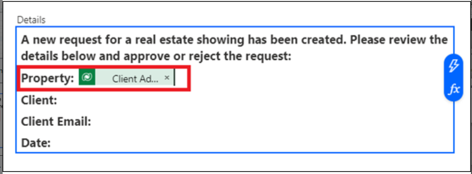

# **Lab 2: Automazione del processo di approvazione di una presentazione immobiliare utilizzando Copilot**

In questo lab creerai un'automazione usando Copilot in Power Automate
per automatizzare il processo di approvazione per una presentazione
immobiliare. Utilizzerai Copilot per creare un flusso che invia
un'e-mail all'agente immobiliare quando viene richiesta una nuova
proiezione. Quindi, l'agente può approvare o rifiutare la richiesta di
visualizzazione dall'interno dell'e-mail.

Segui questi passaggi per creare un flusso utilizzando Copilot.

1.  Accedi a Power Automate utilizzando
    **https://make.powerautomate.com/** con le credenziali del tenant di
    Office 365.

2.  Seleziona **United States** come paese/regione e quindi fai clic su
    **Get started**.

3.  Fare clic sul **environment selector** e selezionare l 'ambiente
    **Dev One**.

4.  Al centro della **Home** page all'interno di Power Automate, nel
    campo di testo su **Lets automate something. What should it do?**
    Immettere il seguente messaggio di richiesta:

[**Start an approval process for a new microsoft dataverse record and
update the record based on the outcome**](urn:gd:lg:a:send-vm-keys)

Seleziona il pulsante **Generate.**

5.  Se il flusso suggerito contiene solo due passaggi, ad esempio quando
    una riga viene aggiunta, modificata o eliminata e inizia e attendi
    l'approvazione, fai clic su **Show a different suggestion.**

6.  Dal prompt,Copilot fornisce lo schema per un flusso suggerito che è
    possibile esaminare. Per accettare il flusso, selezionare **Next**.

7.  Esamina le app e i servizi connessi. Se non è stata stabilita una
    connessione, modificarla o correggerla e quindi selezionare **Create
    flow**.

Si apre il designer Modifica con Copilot con il flusso insieme a una
finestra di chat di Copilot sulla destra.

8.  Imposta alcuni parametri selezionando il trigger **When a row is
    added,modified or** **deleted**.

Un pannello sul lato sinistro dello schermo mostra i dettagli del
trigger, incluso un parametro **Table Name** vuoto obbligatorio.

9.  . Dal menu a discesa \*\***Table Name\*\***, cerca e seleziona
    **\*\*Showings\*\***.

> \*\*Nota:\*\* Seleziona la tabella che è stata generata in lab1.

10. Comprimi il pannello Quando una riga viene aggiunta, modificata o
    eliminata utilizzando l'icona di compressione nell'angolo in alto a
    destra del pannello.

11. Seleziona l'opzione **Start and wait for an approval** dal flusso

Si noti che il parametro **Approval Type** non è presente.

12. Dal menu a discesa **Approval Type**, selezionare **Approve/Reject –
    First to respond**.

Dopo aver selezionato il **Approval Type**, sono ora disponibili altri
parametri.

13. Nella finestra di chat di Copilot, immettere il seguente prompt:

> Add "New Request for Showing" as the Title parameter for the Start and
> wait for an approval action.
>
> Nota: utilizzare il nome della tabella da cui vengono acquisiti i
> data. Se lab 1 ha generato un'altra tabella, utilizzare il nome di
> tale tabella.

Copilot impiega alcuni secondi per elaborare il prompt. Al termine
dell'elaborazione, il parametro **Title** viene popolato con il testo
del prompt.

14. Per il parametro **Assigned To** immettere le credenziali del tenant
    di Office 365 usate per questo lab. Questo indirizzo e-mail è quello
    che riceve la richiesta di approvazione.

15. Per il parametro **Details**, immettere il testo seguente:

> A new request for a real estate showing has been created. Please
> review the details below and approve or reject the request:
>
> \*\*Property:\*\* \*\*Client:\*\* \*\*Client
> Email:\*\* \*\*Date:\*\*    

16. Posiziona il cursore accanto a **Property:** nel parametro
    **Details,** quindi seleziona l'icona a forma di fulmine per aprire
    il riquadro **Dynamic content**.

17. Nel riquadro **Dynamic content,** seleziona **See More** del
    passaggio "Quando una riga viene aggiunta, modificata o eliminata"
    per espandere l'elenco dei contenuti dinamici disponibili.

18. Scorri verso il basso fino a trovare il campo **Client Address**,
    quindi seleziona **Add**.

Il campo Contenuto dinamico **Address** è stato aggiunto al parametro
**Details**.

19. Completa gli stessi passaggi per i campi **Client**, **Client
    Email** e **Date**.

Al termine degli altri campi, i valori dovrebbero essere simili
all'immagine seguente.

20. Una volta completato il parametro **Details**, è possibile
    comprimere l' azione **Start and wait for an approval** selezionando
    l'icona a forma di doppia freccia.

21. Selezionare l' azione **Condition**.

22. Selezionare la casella **Choose a value** , quindi selezionare
    **Outcome** dal riquadro **Dynamic content**.

23. Selezionare **is equal to** per la condizione, quindi immettere
    **Approve** per **Value**.

24. Comprimere l'azione **Condition**.

25. Selezionare l'azione **Update a row** nel ramo **True** della
    condizione.

26. Dal menu a discesa **Table Name**, cerca e seleziona **Showings**.

27. Seleziona il campo **Row ID**, seleziona **Dynamic content** e
    quindi seleziona **see more** davanti a Quando una riga viene
    aggiunta, modificata o eliminata.

28. Ora, seleziona il campo Identificatore univoco **Showings** dal
    riquadro **Dynamic content** e fai clic su **Add**.

Ogni volta che crei una tabella in Common Data Service, viene creata
automaticamente una colonna con lo stesso nome della tabella. Questa
colonna funge da ID di ricerca univoco per il record (o la riga) che è
stato creato.

29. Selezionare **Show all** in **Advanced parameters**.

30. Seleziona **Confirmed** dal menu a discesa **Status**.

Quando una presentazione viene approvata, il campo **Status** nella
tabella **Real Estate Showings** viene aggiornato a **Confirmed**.

31. Comprimere l'azione **Update a row**.

32. Selezionare l'azione **Update a row** nel ramo **False** della
    condizione.

33. Dal menu a discesa **Table Name**, cerca e seleziona **Showings**.

34. Selezionare il campo **Row ID**, quindi selezionare il campo
    Identificatore univoco **Showings** dal riquadro **Dynamic
    content**.

35. Selezionare **Show all** in **Advanced parameters**.

36. Seleziona **Cancelled** dal menu a discesa **Status**.

Quando una presentazione viene rifiutata, il campo **Status** della
tabella **Real Estate Showings** viene aggiornato in **Canceled**.

37. Comprimere l'azione **Update a row**.

38. Nella finestra di chat di Copilot, immettere il seguente prompt e
    quindi inviare:

[**Under the "Update a row" action for both branches in the condition,
add a new "Send an email (V2)"
action**](https://urn:gd:lg:a:send-vm-keys/)

Dopo alcuni secondi, Copilot dovrebbe spiegare cosa ha fatto, come
mostrato nell'immagine seguente.

39. Selezionare l'azione **Send an email** di posta elettronica nel ramo
    **True** della condizione.

40. Seleziona \*\*Switch to advanced mode\*\*nella riga del campo
    \*\*To\*\*, **Enter custom value** e quindi seleziona il campo
    **Client Email** dal riquadro **Dynamic content**. (Seleziona **See
    more** davanti alla sezione Quando una riga viene aggiunta,
    modificata o eliminata)

41. Per il campo **Subject**, immettere il seguente testo nella finestra
    di chat di Copilot, quindi premere il tasto **Enter** sulla
    tastiera:

**Add "Your request for a real estate showing has been approved" as the
Subject parameter for the Send an email action** 

Il campo **Subject** deve essere compilato con il testo del prompt.

42. Per il campo **Body**, inserisci il seguente testo nella finestra di
    chat di Copilot, quindi premi il tasto **Enter** sulla tastiera:

**Add "Good day - Your request for a real estate showing has been
approved. Please see below for details." as the Body parameter for the
Send an email action** 

Il campo **Body** dovrebbe essere popolato con il testo del prompt.

43. Inserisci il seguente contenuto dopo il **Body** del testo:

**Property:**

**Agent Name:**

**Showing Date:**

Aggiungere i campi **Client Address**, **Agent Name** e **Showing Date**
dal riquadro **Dynamic** **content** alle righe appropriate nel **Body**
del testo.

44. Aggiungere il campo **Response summary** dal riquadro **Dynamic
    content** alla fine del **Body** del testo.

45. Comprimere l'azione **Send an e-mail**.

46. Selezionare l'azione **Send an email** nel ramo **False** della
    condizione. Selezionare il campo **To**, rimuovere l'indirizzo
    e-mail example@example.com e quindi selezionare il campo **Client
    Email** dal riquadro **Dynamic content**.

47. Per il campo **Subject**, immettere il seguente contenuto nella
    finestra di chat di Copilot, quindi premere il tasto **Enter** sulla
    tastiera:

[**Add "Your request for a real estate showing has been rejected" as the
Subject parameter for the Send an email
action**](https://urn:gd:lg:a:send-vm-keys/) 

48. Per il campo **Body**, inserisci il seguente testo nella finestra di
    chat di Copilot, quindi premi il tasto **Enter** sulla tastiera:

[**Add "Good day - Your request for a real estate showing has been
rejected. Please see below for details." as the Body parameter for the
Send an email action**](https://urn:gd:lg:a:send-vm-keys/) 

49. Inserisci il seguente contenuto dopo il **Body** del testo:

**Property:**

**Agent Name:**

**Showing Date:**

Aggiungere i campi **Address**, **Agent Name** e **Showing Date** dal
riquadro **Dynamic content** alle righe appropriate nel **Body** del
testo.

50. Aggiungere il campo **Response summary** dal riquadro **Dynamic
    content** alla fine del **Body** del testo.

51. Comprimere l' azione **Send an e-mail**.

52. Rinomina il flusso in **Request Approval for Real Estate
    Showing** selezionando il testo di **request approval when a
    Dataverse record is created** nell'angolo in alto a sinistra dello
    schermo.

53. Salva il flusso selezionando il pulsante **Save** nell'angolo in
    alto a destra dello schermo.

54. Selezionare la **back arrow** prima del nome del flusso.

55. Selezionare **OK.**

56. Per inviare una richiesta di presentazione immobiliare, vai all'app
    Presentazioni immobiliari in Power Apps utilizzando
    **https://make.powerapps.com/** .

57. Seleziona **Apps** nel riquadro di spostamento a sinistra, seleziona
    **l**'app **Showings** e quindi seleziona **Play**.

58. Seleziona **+New** per creare una nuova richiesta di
    visualizzazione.

59. Compila i campi con le seguenti informazioni:

    - **Agent Name-** \< random name \>

    - **Client Full Name** - \< Your name \>

    - **Client Email**: \< Your email\> (l'e-mail che stai utilizzando
      per questo lab)

    - **Date** - \< Any future date\>

    - **Time** - \< Any future time \>

    - **Status**- Pending

    - **Address**- 210 Pine Road, Portland, OR 97204

**Nota** Questo indirizzo è uno degli indirizzi del file Microsoft Excel
nel Modulo 1; è lo stesso file che hai caricato e trasformato nella
tabella **Real Estate Properties**.

Di solito, si dispone di un campo di ricerca per la tabella **Real
Estate Properties** , ma non per questo lab per mantenerlo semplice.

60. Seleziona il segno di spunta nell'angolo in alto a destra dello
    schermo.

Il flusso viene eseguito e invia un'e-mail di approvazione all'indirizzo
e-mail fornito nel flusso creato.

61. Accedere all'account di posta elettronica usato per il lab e
    attendere l'arrivo del messaggio di posta elettronica.

**Nota:** se il flusso non viene eseguito immediatamente, assicurati di
attenderlo. L'attivazione del flusso potrebbe richiedere fino a 10
minuti, soprattutto al primo tentativo.

L'approvazione dovrebbe essere simile all'immagine seguente.

62. Seleziona **Approve**.

63. Aggiungi un commento e quindi seleziona **Submit**.

Il flusso continua a scorrere; Aggiorna la riga e invia un'e-mail al
richiedente. L'e-mail inviata al richiedente è simile all'immagine
seguente.

64. Controllare il flusso e notare che il flusso è ora contrassegnato
    come **Succeeded** nella cronologia di esecuzione.

