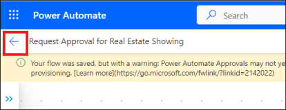
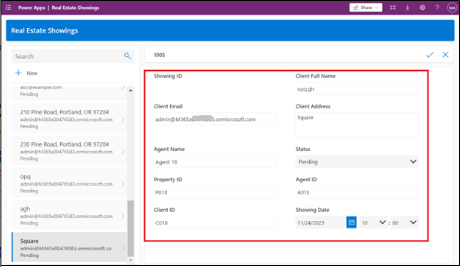

# **Laboratorio 2: Automatización del proceso de aprobación para la visita de inmobiliaria con Copilot**

En este laboratorio, creará una automatización mediante Copilot in Power
Automate para automatizar approval process para una visita de
inmobiliaria. Usará Copilot para crear un flow que manda un email al
agente de inmobiliaria cuando se solicita una visita.

Siga estos pasos para crear un flow con Copilot.

1.  Inicie sesión en Power Automate
    en [**https://make.powerautomate.com/**](urn:gd:lg:a:send-vm-keys) con
    sus Office 365 tenant credentials.

2.  Seleccione **United States** como country/region y haga clic
    en **Get started**.

3.  Haga clic en **environment selector** y seleccione **Dev
    One** environment.

4.  En el centro de la página **Home** cdentro de Power Automate, en el
    campo de texto en **Lets automate something. What should it
    do?** Introduzca el siguiente prompt:

[**Start an approval process for a new microsoft dataverse record and
update the record based on the outcome**](urn:gd:lg:a:send-vm-keys)

Seleccione el botón **Generate**.

5.  Si su flow sugerido contiene solo dos pasos i.e. Cuando se agrega
    una fila, modificado o eliminado y Start y espere para la aprobación
    y luego haga clic en **Show a different suggestion.**

6.  Desde el prompt, Copilot proporciona un el outline para un flow
    sugerido que puede revisar. Para aceptar el flow,
    seleccione **Next**.

7.  Revise las aplicaciones y servicios conectadas. Si no se ha hecho
    una conexión, edítelo o arréglelo y luego seleccione **Create
    flow**.

Se abre Edit with Copilot designer con su flow junto con su ventana
Copilot chat en la parte derecha.

8.  Establezca unos parámetros al seleccionar el trigger **When a row is
    added, modified or deleted**.

Un panel en la parte izquierda de la pantalla muestra detalles del
trigger, incluido el nuevo parámetro vacío **Table Name** que se
requiere.

9.  Desde el menú dropdown \*\***Table Name\*\***, busque y seleccione
    **\*\*Showings\*\***. 

> \*\*Note:\*\* Seleccione la tabla que se generó en laboratorio1. 

10. Minimice el ícono When a row is added, modified or deleted panel
    using collapse en la esquina superior derecha del panel.

11. Seleccione la acción **Start and wait for an approval** desde el
    flow

Note que falta el parámetro **Approval Type**.

12. Desde el menú despegable **Approval Type**,
    seleccione **Approve/Reject - First to respond**.

Después de seleccionar **Approval Type**, están disponible más
parámetros.

13. En la ventana Copilot chat, introduzca el siguiente prompt:

> Agregue "New Request for Showing" como el Title parameter para el
> Start y espere la acción aprobada
>
> \*\*Ojo:\*\* Use el nombre de la tabla cuyos datos estamos agregando.
> Si el laboratorio 1 ha generado otra tabla, use el nombre de aquella
> tabla. 

Lleva unos segundos para que el Copilot procese el prompt. Cuando se
completa el proceso, se pobla el **Title** con el prompt text.

14. Para el parámetro **Assigned To**, introduzca los Office 365 tenant
    credentials que usa para este laboratorio. Este email es el que
    recibe la solicitud de aprobación.

15. Para el parámetro **Details**, introduzca el siguiente texto:

> A new request for a real estate showing has been created. Please
> review the details below and approve or reject the request:
>
> \*\*Property:\*\* \*\*Client:\*\* \*\*Client Email:\*\* \*\*Date:\*\* 

16. Coloque su cursor junto a **Property:** en el
    parámetro **Details** y luego seleccione el ícono lightning para
    abrir el panel **Dynamic content**.

17. En el panel **Dynamic content**, seleccione **See More** del paso
    'When a row is added, modified or deleted' para expandir la lista
    del contenido dinámico disponible.

18. Baje hasta que encuentre el campo **Client** **Address** y
    seleccione **Add**.

El campo **Address** dynamic content está agregado en el
parámetro **Details**.

19. Complete os mismos pasos para los campos **Client**, **Client
    Email** y **Date**.

Cuando termina los restos de los campos, los valores se deben parecer a
la siguiente imagen.

20. Con el parámetro **Details** completado, puede minimizar la acción
    **Start and wait for an approval** al seleccionar el ícono double
    arrow.

21. Seleccione la acción **Condition**.

22. Seleccione la casilla **Choose a value** y
    seleccione **Outcome** desde el panel **Dynamic content**.

23. Seleccione **is equal to** para la condición y luego
    introduzca **Approve** para **Value**.

24. Minimice la acción **Condition**.

25. Seleccione la acción **Update a row** en el **True** branch de la
    condición.

26. Desde el menú despegable **Table Name**, busque y
    seleccione **Showings**.

27. Seleccione el campo **Row ID**, seleccione **Dynamic content** y
    luego seleccione **see more** junto a When a row is added, modified
    or deleted.

28. Ahora, seleccione el **Showings** unique identifier field desde el
    panel **Dynamic content** y haga clic en **Add**.

Cuando crea una tabla en Microsoft Dataverse, una columna se crea
automáticamente con el mismo nombre de la tabla. Esta columna sirve como
el unique lookup ID o el record (o row) que se creó.

29. Seleccione **Show all** en **Advanced parameters**.

30. Seleccione **Confirmed** desde el menú despegable de **Status**.

Cuando se aprueba un showing, el campo **Status** en la tabla **Real
Estate Showings** se actualiza a **Confirmed**.

31. Minimice la acción **Update a row**.

32. Seleccione la acción **Update a row** en el **False** branch de la
    condición.

33. Desde el menú despegable **Table Name**, busque y
    seleccione **Showings**.

34. Seleccione el campo **Row ID** y luego seleccione
    el **Showings** unique identifier field desde el panel **Dynamic
    content**.

35. Seleccione **Show all** en **Advanced parameters**.

36. Seleccione **Canceled** desde el menú despegable **Status**.

Cuando se rechaza un showing, el campo **Status** en la table **Real
Estate Showings** se actualiza a **Canceled**.

37. Minimice la acción **Update a row**.

38. En la ventana Copilot chat, introduzca el siguiente prompt y
    entregue:

[**Under the "Update a row" action for both branches in the condition,
add a new "Send an email (V2)" action**](urn:gd:lg:a:send-vm-keys)

Después de unos segundos, Copilot debe explicar lo que hizo, como se ve
en la imagen.

39. Seleccione la acción **Send an email** en el **True** branch de la
    condición.

40. Seleccione \*\*Switch to advanced mode\*\* en la línea del campo
    \*\*To\*\*, seleccione **Enter custom value** y luego seleccione el
    campo **Client Email** del panel **Dynamic content**.
    (Seleccione **see more** junto a When a row is added, modified or
    deleted)

41. Para el campo **Subject**, introduzca el siguiente texto en la
    ventana Copilot chat y presione **Enter** en su teclado:

**Add "Your request for a real estate showing has been approved" as the
Subject parameter for the Send an email action**

El campo **Subject** debe poblar con el texto de prompt.

42. Para el campo **Body**, introduzca el siguiente texto en la ventana
    Copilot chat y presione **Enter** en su teclado:

**Add "Good day - Your request for a real estate showing has been
approved. Please see below for details." as the Body parameter for the
Send an email action**

El campo **Body** debe poblar con el texto de prompt.

43. Introduzca el siguiente contenido después de **Body** text:

**Property:**

**Agent Name:**

**Showing Date:**

Agregue los campos **Client** **Address**, **Agent
Name** and **Showing** **Date** desde el panel **Dynamic content** a las
líneas apropriadas en el **Body** text.

44. Agregue el campo **Response summary** desde el panel **Dynamic
    content** para el final del texto de **Body**.

45. Minimize la acción **Send an email**.

46. Seleccione la acción **Send an email** en el **False** branch de la
    condición. Seleccione el campo **To**, quite el
    email example@example.com, y luego seleccione el campo **Client
    Email** desde el panel **Dynamic content**.

47. Para el campo **Subject**, introduzca el siguiente contenido en la
    ventana Copilot chat y presione **Enter** en su teclado:

[**Add "Your request for a real estate showing has been rejected" as the
Subject parameter for the Send an email
action**](urn:gd:lg:a:send-vm-keys)

48. Para el campo **Body**, introduzca el siguiente texto en la ventana
    Copilot chat y presione el **Enter** en su teclado:

[**Add "Good day - Your request for a real estate showing has been
rejected. Please see below for details." as the Body parameter for the
Send an email action**](urn:gd:lg:a:send-vm-keys)

49. Introduzca el siguiente contenido después del **Body** text:

**Property:**

**Agent Name:**

**Showing Date:**

Agregue los campos **Address**, **Agent
Name** y **Showing** **Date** desde el panel **Dynamic content** a
líneas apropriadas en el texto **Body**.

50. Agregue el campo **Response summary** desde el panel **Dynamic
    content** al final del **Body** text.

51. Minimice la acción **Send an email**.

52. Renombre el flow a **Request Approval for Real Estate Showing** al
    seleccionar el texto **request approval when a Dataverse record is
    created** en la esquina superior izquierda de la pantalla.

53. Guarde el flow al seleccionar el botón **Save** en la esquina
    superior derecha de la pantalla.

54. Seleccione **back arrow** antes del nombre del flow.

55. Seleccione **OK**.

56. Para entregar una solicitud un real estate showing, vaya a la
    aplicación Real Estate Showings en Power Apps
    mediante [**https://make.powerapps.com/**](urn:gd:lg:a:send-vm-keys) .

57. Seleccione **Apps** de la navegación izquierda, seleccione la
    aplicación **Showings** y luego seleccione **Play**.

58. Seleccione **+New** para crear una nueva solicitud de showing.

59. Llene los siguientes campos con la siguiente información:

    - **Agent Name** - \< random name \>

    - **Client Full Name** - \< Your name \>

    - **Client Email** - \< Your email \> (the email that you're using
      for this lab)

    - **Date** - \< Any future date \>

    - **Time** - \< Any future time \>

    - **Status** - Pending

    - **Address** - 210 Pine Road, Portland, OR 97204

**Ojo:** Esta dirección es una de las direcciones del archivo Microsoft
Excel en Módulos 1; es el mismo archivo que subó y reflejó en la
tabla **Real Estate Properties**.

Normalmente, debería tener un lookup field a la tabla **Real Estate
Properties**, pero no para este laboratorio para mantenerlo sencillo.

60. Seleccione la verificación en la esquina superior derecha de la
    pantalla.

Este flow se ejecuta y manda un approval email al email que proporcionó
en el flow que construyó.

61. Inicie sesión en la cuenta del email que usa para este laboratorio y
    espere a que llegue el correo.

**Ojo:** Si el flow no se ejecuta inmediatamente, espérelo. Puede tardar
unos 10 minutos para que se activa el flow, especialmente por la primera
vez.

El approval se ve algo así.

62. Seleccione **Approve**.

63. Agregue un comentario y seleccione **Submit**.

El flow sigue ejecutando; actualiza la fila y manda un email al
solicitante. El email que se manda un solicitante se parece a la
siguiente imagen.

64. Averigüe el flow y note que el flujo ahora se marca
    como **Succeeded** en el run history.

