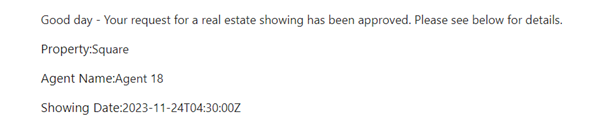

# **Lab 2: Automatisieren des Genehmigungsprozesses für eine Immobilienbesichtigung mit Copilot**

In diesem Lab erstellen Sie eine Automatisierung, indem Sie Copilot in
Power Automate verwenden, um den Genehmigungsprozess für eine
Immobilienbesichtigung zu automatisieren. Sie verwenden Copilot, um
einen Ablauf zu erstellen, der eine E-Mail an den Immobilienmakler
sendet, wenn eine neue Besichtigung angefordert wird. Anschließend kann
der Agent die Anzeigeanfrage aus der E-Mail heraus genehmigen oder
ablehnen.

Führen Sie die folgenden Schritte aus, um einen Flow mit Copilot zu
erstellen.

1.  Melden Sie sich bei Power Automate mit
    [**https://make.powerautomate.com/**](urn:gd:lg:a:send-vm-keys) mit
    Ihren Office 365-Mandantenanmeldeinformationen an.

2.  Wählen Sie **United States** als Land/Region aus und klicken Sie
    dann auf **Get started**.

3.  Klicken Sie auf die **environment selector** und wählen Sie **Dev**
    **One**-Environment aus.

4.  In der Mitte der Startseite in Power Automate, im Textfeld auf
    **Lets automate something. What should it do?** Geben Sie die
    folgende Eingabeaufforderung ein:

[**Start an approval process for a new microsoft dataverse record and
update the record based on the outcome**](urn:gd:lg:a:send-vm-keys)

Wählen Sie die Schaltfläche **Generate** aus.

5.  Wenn Ihr vorgeschlagener Ablauf nur zwei Schritte enthält, d. h.
    Wenn eine Zeile hinzugefügt, geändert oder gelöscht wird und Sie auf
    Starten und auf Genehmigung warten, klicken Sie auf **Show a
    different suggestion.**

6.  In der Eingabeaufforderung stellt Copilot die Gliederung für einen
    vorgeschlagenen Ablauf bereit, den Sie überprüfen können. Um den
    Flow zu akzeptieren, wählen Sie **Next**.

7.  Überprüfen Sie die verbundenen Apps und Dienste. Wenn keine
    Verbindung hergestellt wurde, bearbeiten oder reparieren Sie sie,
    und wählen Sie dann **Create flow**.

Der Designer Edit with Copilot wird mit Ihrem Flow geöffnet, zusammen
mit einem Copilot-Chat-Fenster auf der rechten Seite.

8.  Richten Sie einige Parameter ein, indem Sie den Trigger **When a row
    is added, modified or deleted** auswählen.

In einem Bereich auf der linken Seite des Bildschirms werden die
Triggerdetails angezeigt, einschließlich eines leeren **Parameters** für
den **Table name**, der erforderlich ist.

9.  . Suchen Sie im Dropdown-Menü nach \*\***Table Name\*\*** und wählen
    Sie **\*\*Showings\*\*** aus.

> \*\*Hinweis: \*\* Wählen Sie die Tabelle aus, die in lab1 generiert
> wurde.

10. Reduzieren Sie das Fenster, Wenn eine Zeile hinzugefügt, geändert
    oder gelöscht wird, indem Sie das Symbol zum Ausblenden in der
    oberen rechten Ecke des Fensters verwenden.

11. Wählen Sie die Aktion **Start and wait for an approval** aus dem
    Flow aus.

Beachten Sie, dass der Parameter **Approval Type** fehlt.

12. Wählen Sie im Dropdown-Menü **Approval Type** die Option
    **Approve/Reject - First to respond**.

Nachdem Sie die Option **Approval Type** auswählen, sind nun weitere
Parameter verfügbar.

13. Geben Sie im Copilot-Chat-Fenster die folgende Eingabeaufforderung
    ein:

> Fügen Sie " New Request for Showing " als Title-Parameter für die
> Aktion Start und Warten auf eine Genehmigungsaktion hinzu.
>
> \*\*Hinweis:\*\* Verwenden Sie den Namen der Tabelle, aus der Daten
> erfasst werden. Wenn Übung 1 eine andere Tabelle generiert hat,
> verwenden Sie den Namen dieser Tabelle. 

Es dauert einige Sekunden, bis Copilot die Eingabeaufforderung
verarbeitet hat. Wenn die Verarbeitung abgeschlossen ist, wird der
Parameter **Titel** mit dem Eingabeaufforderungstext gefüllt.

14. Geben Sie für den Parameter **Assigned To,** die Office
    365-Mandantenanmeldeinformationen ein, die Sie für dieses Lab
    verwenden. Diese E-Mail-Adresse ist diejenige, die die
    Genehmigungsanfrage erhält.

15. Geben Sie für den Parameter **Details** den folgenden Text ein:

> A new request for a real estate showing has been created. Please
> review the details below and approve or reject the request:
>
> \*\*Property:\*\* \*\*Client:\*\* \*\*Client Email:\*\* \*\*Date:\*\* 

16. Platziere deinen Cursor neben **Property:** im Parameter **Details**
    und wählen Sie dann das Blitzsymbol aus, um den Bereich **Dynamic
    content** zu öffnen.

17. Wählen Sie im Bereich **Dynamic content** die Option **See More**
    des Schritts "'When a row is added, modified or deleted', um die
    Liste der verfügbaren dynamischen Inhalte zu erweitern.

18. Scrollen Sie nach unten, bis Sie das Feld
    **Client** **Address** finden, und wählen Sie dann **Add**.

Das Feld **Address** dynamic content wird jetzt dem Parameter
**Details** hinzugefügt.

19. Führen Sie die gleichen Schritte für die Felder **Client**, **Client
    Email** und **Date** aus.

Wenn Sie mit den restlichen Feldern fertig sind, sollten die Werte in
der folgenden Abbildung aussehen.

20. Wenn der Parameter **Details** abgeschlossen ist, können Sie die
    Option **Start and wait for an approval** auswählen, indem Sie das
    Doppelpfeilsymbol wählen.

21. Wählen Sie die **Condition** action aus.

22. Wählen Sie das Feld **Choose a value** aus, und wählen Sie dann im
    Bereich **Dynamic Content** die Option **Outcome** aus.

23. Wählen Sie für die Bedingung die Option **is equal to**, und geben
    Sie dann den **Value** für **Approval** ein.

24. Aktion **Condition** reduzieren.

25. Wählen Sie die Aktion **Update a row** unter dem Zweig **True** der
    Bedingung aus.

26. Suchen Sie im Dropdown-Menü **Table Name** nach und wählen Sie
    **Showings** aus.

27. Wählen Sie das Feld **Row ID** aus, wählen Sie **Dynamic
    content** aus, und wählen Sie dann **see more** vor When a row is
    added, modified or deleted.

28. Wählen Sie nun das Feld **Showing unique identifier** aus dem
    Bereich **"Dynamic Content** aus und klicken Sie auf **Add.**

Jedes Mal, wenn Sie eine Tabelle in Microsoft Dataverse erstellen, wird
automatisch eine Spalte mit dem gleichen Namen wie die Tabelle erstellt.
Diese Spalte dient als eindeutige Nachschlage-ID für den Datensatz (oder
die Zeile), der erstellt wurde.

29. Wählen Sie **Show all** unter **Advanced parameters** aus.

30. Wählen Sie **Confirmed** aus dem Dropdown-Menü **Status** aus.

Wenn eine Besichtigung genehmigt wird, wird das Feld **Status** in der
Tabelle **Real Estate Showings** auf **Confirmed** aktualisiert.

31. Reduzieren Sie die Aktion **Update a row**.

32. Wählen Sie die Aktion **Update a row** unter dem Zweig **False** der
    Bedingung aus.

33. Suchen Sie im Dropdown-Menü **Table name** und wählen Sie
    **Showings** aus.

34. Wählen Sie das Feld **Row ID** und dann das Feld **Showing unique
    identifier** für Anzeigen aus dem Bereich **Dynamic Content** aus.

35. Wählen Sie **Show All** unter **Advanced parameters**.

36. Wählen Sie **Cancelled** aus dem Dropdown-Menü **Status** aus.

Wenn eine Besichtigung abgelehnt wird, wird das Feld **Status** in der
Tabelle **Real Estate Showings** auf **Cancelled** aktualisiert.

37. Reduzieren Sie die Aktion **Update a row**.

38. Geben Sie im Copilot-Chatfenster die folgende Eingabeaufforderung
    ein und senden Sie sie dann:

[**Under the "Update a row" action for both branches in the condition,
add a new "Send an email (V2)" action**](urn:gd:lg:a:send-vm-keys)

Nach einigen Sekunden sollte Copilot erklären, was es getan hat, wie in
der folgenden Abbildung gezeigt.

39. Wählen Sie die Aktion **Send an email** unter dem Zweig **True** der
    Bedingung aus.

40. Wählen Sie in der Zeile des Felds \*\*To\*\* die Option \*\* Switch
    to advanced mode \*\* aus, wählen Sie **Enter custom value** aus,
    und wählen Sie dann im Bereich **Dynamic Content** das Feld
    **Client-E-Mail** aus**.** (Wählen Sie **see more** Informationen
    finden Sie vor When a row is added, modified or deleted)

41. Geben Sie für das Feld **Subject** den folgenden Text in das
    Copilot-Chat-Fenster ein und drücken Sie dann **Enter** auf Ihrer
    Tastatur:

**Add "Your request for a real estate showing has been approved" as the
Subject parameter for the Send an email action**

Das Feld **Subject** sollte mit dem Eingabeaufforderungstext ausgefüllt
werden.

42. Geben Sie für das Feld **Body** den folgenden Text in das
    Copilot-Chatfenster ein und drücken Sie dann **Enter** auf Ihrer
    Tastatur:

**Add "Good day - Your request for a real estate showing has been
approved. Please see below for details.“ as the Body parameter for the
Send an email action below.“ as the Body parameter for the Send an email
action**

Das Feld **Body** sollte mit dem Eingabeaufforderungstext ausgefüllt
werden.

43. Geben Sie nach dem Textkörper den folgenden **Body Text** ein:

**Property:**

**Agent Name:**

**Showing Date:**

Fügen Sie die Felder **Client** **Address**, **Agent Name** und
**Showing Date** aus dem Bereich **Dynamic Content** zu den
entsprechenden Zeilen im **Body** hinzu.

44. Fügen Sie das Feld **Response summary** aus dem Bereich **Dynamic
    Content** am Ende des **Bodys** hinzu.

45. Reduzieren Sie die Aktion **Send an email**.

46. Wählen Sie die Aktion **Send an email** unter dem Zweig **False**
    der Bedingung aus. Wählen Sie das Feld **To** aus, entfernen Sie die
    example@example.com-E-Mail-Adresse, und wählen Sie dann im Bereich
    **Dynamic Content** das Feld **Client-E-Mail** aus.

47. Geben Sie für das Feld **Subject** den folgenden Inhalt in das
    Copilot-Chat-Fenster ein und drücken Sie dann **Enter** auf Ihrer
    Tastatur:

[**Add "Your request for a real estate showing has been rejected" as the
Subject parameter for the Send an email
action**](urn:gd:lg:a:send-vm-keys)

48. Geben Sie für das Feld **Body** den folgenden Text in das
    Copilot-Chatfenster ein und drücken Sie dann **Enter** auf Ihrer
    Tastatur:

[**Add "Good day - Your request for a real estate showing has been
rejected. Please see below for details." as the Body parameter for the
Send an email action**](urn:gd:lg:a:send-vm-keys)

49. Geben Sie nach dem **Body** den folgenden Inhalt ein:

**Property:**

**Agent Name:**

**Showing Date:**

Fügen Sie die **Address**, **Agent Name** und **Showing** **Date** aus
dem Bereich **Dynamic Content** zu den entsprechenden Zeilen im **Body
Text** hinzu.

50. Fügen Sie das Feld **Response Summary** aus dem Bereich **Dynamic
    Content** am Ende des **Body Text** hinzu.

51. Reduzieren Sie die Aktion **Send an email.** 

52. Benennen Sie den Ablauf in **Request Approval for Real Estate
    Showing,** indem Sie in der oberen linken Ecke des Bildschirms den
    Text **request approval when a Dataverse record is created**
    auswählen.

53. Speichern Sie den Flow, indem Sie auf die Schaltfläche **Save** in
    der oberen rechten Ecke des Bildschirms klicken.

54. Select **back arrow** before the name of the flow.

55. Wählen Sie **OK** aus.

56. Um eine Anfrage für eine Immobilienbesichtigung zu übermitteln,
    wechseln Sie zur App für Immobilienbesichtigungen in Power Apps
    mit[**https://make.powerapps.com/**](urn:gd:lg:a:send-vm-keys) .

57. Wählen Sie im linken Navigationsbereich **Apps** aus, wählen Sie
    **Showings-App** und dann **Play** aus.

58. Wählen Sie **+New** aus, um einen new showing request zu erstellen.

59. Füllen Sie die Felder mit den folgenden Informationen aus:

    - **Agent Name** - \< random name \>

    - **Client Full Name** - \< Your name \>

    - **Client Email** - \< Your email \> (the email that you're using
      for this lab)

    - **Date** - \< Any future date \>

    - **Time** - \< Any future time \>

    - **Status** - Pending

    - **Address** - 210 Pine Road, Portland, OR 97204

**Note** Diese Adresse ist eine der Adressen aus der Microsoft
Excel-Datei in Modul 1. Es handelt sich um dieselbe Datei, die Sie
hochgeladen und in die Tabelle **Real Estate Properties** umgewandelt
haben.

Normalerweise verfügen Sie über ein Nachschlagefeld für die Tabelle
**Real Estate Properties**, aber nicht für dieses Lab, um es einfach zu
halten.

60. Aktivieren Sie das Häkchen in der oberen rechten Ecke des
    Bildschirms.

Der Flow wird ausgeführt und sendet eine Genehmigungs-E-Mail an die
E-Mail-Adresse, die Sie in dem von Ihnen erstellten Flow angegeben
haben.

61. Melden Sie sich bei dem E-Mail-Konto an, das Sie für dieses Lab
    verwenden, und warten Sie dann, bis die E-Mail eintrifft.

**Hinweis:** Wenn der Flow nicht sofort ausgeführt wird, warten Sie
darauf. Es kann bis zu 10 Minuten dauern, bis der Flow ausgelöst wird,
insbesondere beim ersten Versuch.

Die Genehmigung sollte der folgenden Abbildung ähneln.

62. Wählen Sie **Approve** aus.

63. Fügen Sie einen Kommentar hinzu und wählen Sie dann **Submit** aus.

Der Flow läuft weiter. Die Zeile wird aktualisiert und eine E-Mail an
den Anforderer gesendet. Die E-Mail, die an den Anforderer gesendet
wird, ähnelt der folgenden Abbildung.

64. Überprüfen Sie den Flow, und beachten Sie, dass der Flow jetzt im
    Ausführungsverlauf als **Succeeded** markiert ist.

