# **Lab 2: Automating the approval process for a real estate showing using Copilot**

In this lab, you'll create an automation by using Copilot in Power
Automate to automate the approval process for a real estate showing.
You'll use Copilot to create a flow that sends an email to the real
estate agent when a new showing is requested. Then, the agent can
approve or reject the showing request from within the email.

Follow these steps to create a flow by using Copilot.

1.  Sign into Power Automate
    using [**https://make.powerautomate.com/**](urn:gd:lg:a:send-vm-keys) with
    your Office 365 tenant credentials.

2.  Select **United States** as country/region and then click on **Get
    started**.

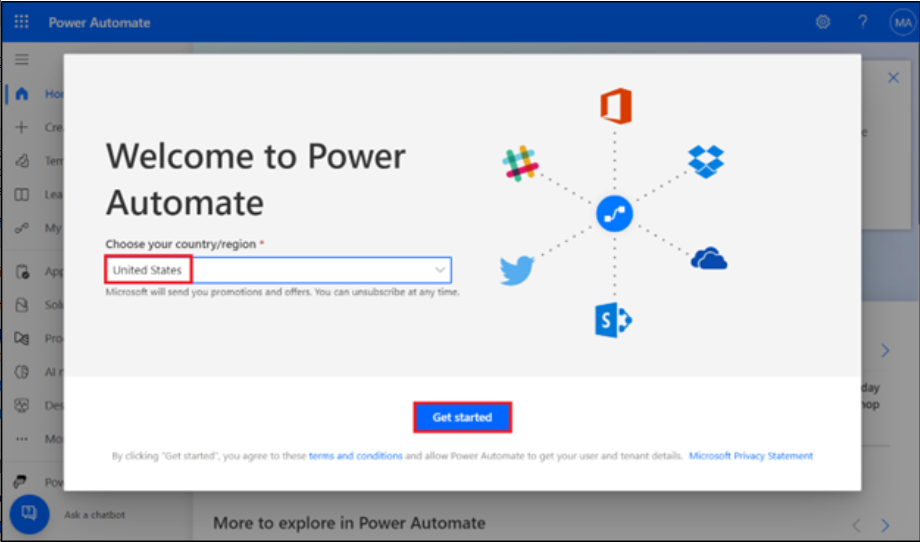

3.  Click on **environment selector** and select **Dev
    One** environment.

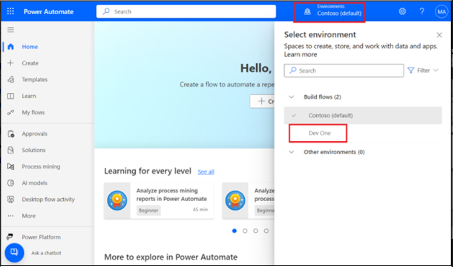

4.  In the center of the **Home** page within Power Automate, in the
    text field on **Lets automate something. What should it do?** enter
    the following prompt:

[**Start an approval process for a new microsoft dataverse record and
update the record based on the outcome**](urn:gd:lg:a:send-vm-keys)

Select the **Generate** button.

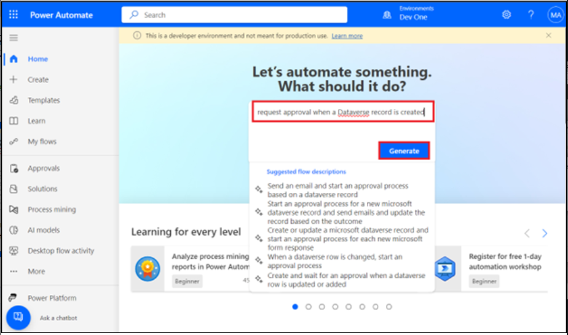

5.  If your suggested flow contains only two steps i.e. When a row is
    added, modified or deleted and Start and wait for approval then
    click on **Show a different suggestion.**

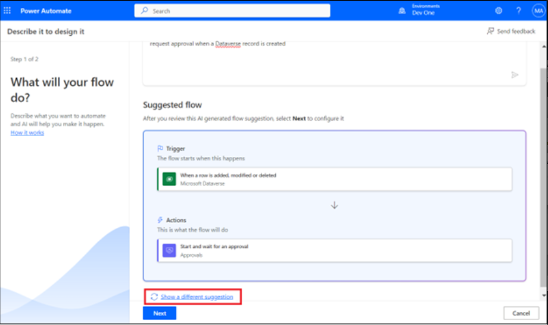

6.  From the prompt, Copilot provides the outline for a suggested flow
    that you can review. To accept the flow, select **Next**.

7.  Review the connected apps and services. If a connection hasn't been
    made, edit or fix it and then select **Create flow**.

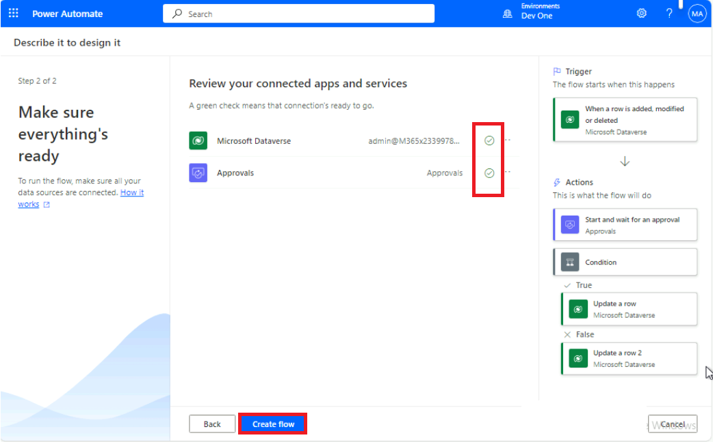

The Edit with Copilot designer opens with your flow along with a Copilot
chat window on the right.

8.  Set up some parameters by selecting the **When a row is added,
    modified or deleted** trigger.

A panel on the left side of the screen shows the trigger details,
including an empty **Table Name** parameter that's required.

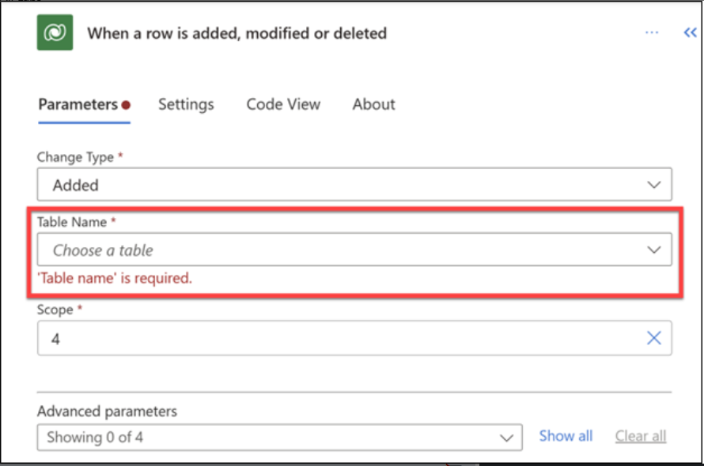

9.  . From the \*\***Table Name\*\*** dropdown menu, search for and
    select  **\*\*Showings\*\***. 

> \*\*Note:\*\* Select the table that got generated in lab1. 

10. Collapse the When a row is added, modified or deleted panel using
    collapse icon on top right corner of the panel.

11. Select the **Start and wait for an approval** action from the flow

Notice that the **Approval Type** parameter is missing.

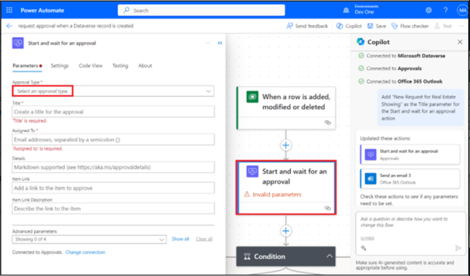

12. From the **Approval Type** dropdown menu, select **Approve/Reject -
    First to respond**.

After you select the **Approval Type**, more parameters are now
available.

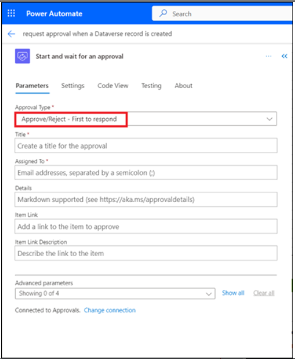

13. In the Copilot chat window, enter the following prompt:

> Add "New Request for Showing" as the Title parameter for the Start and
> wait for an approval action
>
> \*\*Note:\*\* Use the name of the table that we are ingesting data
> from. If lab 1 has generated some other table use the name of that
> table. 

It takes a few seconds for Copilot to process the prompt. When
processing is complete, the **Title** parameter is populated with the
prompt text.

14. For the **Assigned To** parameter, enter the Office 365 tenant
    credentials that you're using for this lab. This email address is
    the one that receives the approval request.

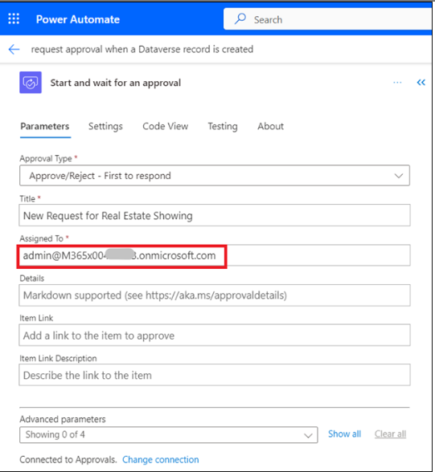

15. For the **Details** parameter, enter the following text:

> A new request for a real estate showing has been created. Please
> review the details below and approve or reject the request:
>
> \*\*Property:\*\* \*\*Client:\*\* \*\*Client Email:\*\* \*\*Date:\*\* 

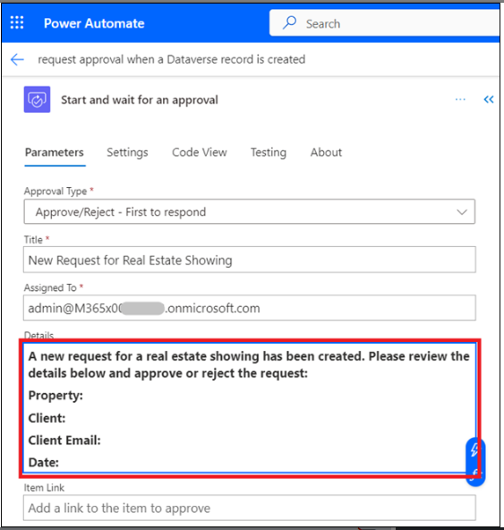

16. Place your curser next to **Property:** in the **Details** parameter
    and then select the lightning icon to open the **Dynamic
    content** pane.

17. In the **Dynamic content** pane, select **See More** of the step
    'When a row is added, modified or deleted' to expand the list of
    available dynamic content.

18. Scroll down until you find the **Client** **Address** field and then
    select **Add**.

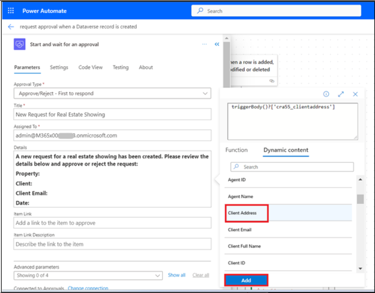

The **Address** dynamic content field is now added to
the **Details** parameter.

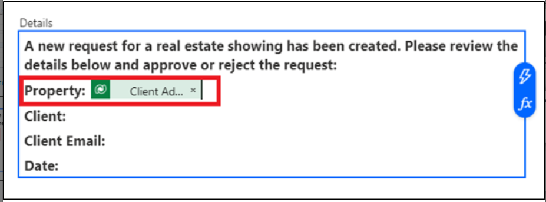

19. Complete the same steps for the **Client**, **Client
    Email** and **Date** fields.

When you're done with the rest of the fields, the values should resemble
the following image.

20. With the **Details** parameter completed, you can collapse
    the **Start and wait for an approval** action by selecting the
    double arrow icon.

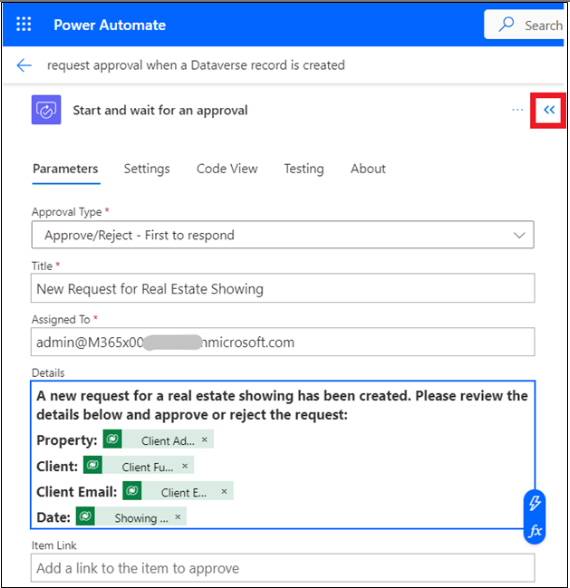

21. Select the **Condition** action.

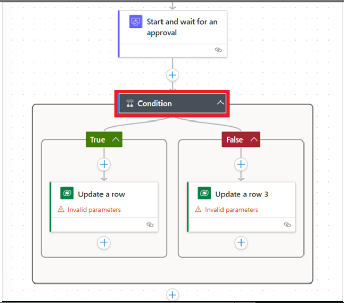

22. Select the **Choose a value** box and then select **Outcome** from
    the **Dynamic content** pane.

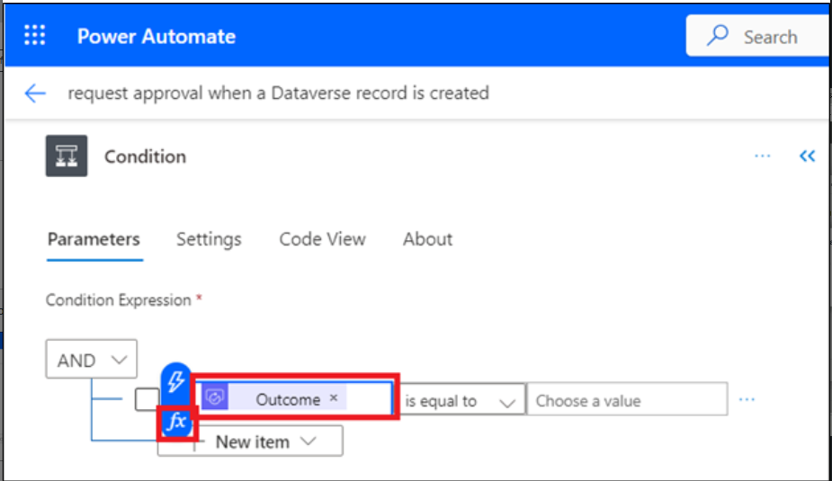

23. Select **is equal to** for the condition and then
    enter **Approve** for **Value**.

24. Collapse the **Condition** action.

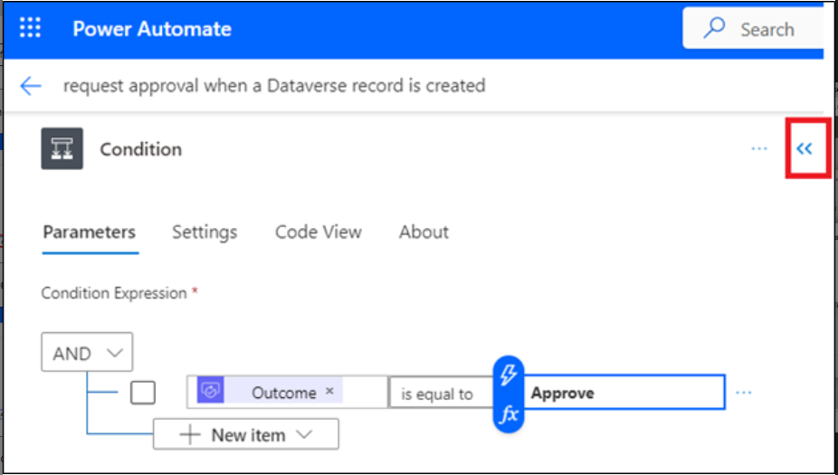

25. Select the **Update a row** action under the **True** branch of the
    condition.

26. From the **Table Name** dropdown menu, search for and
    select **Showings**.

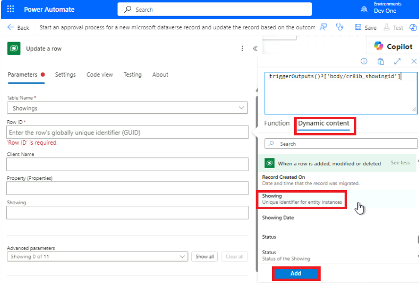

27. Select the **Row ID** field, select **Dynamic content** and then
    select **see more** infront of the When a row is added, modified or
    deleted.

28. Now, select the **Showings** unique identifier field from
    the **Dynamic content** pane and click on **Add**.

Whenever you create a table in Microsoft Dataverse, a column is
automatically created with the same name of the table. This column
serves as the unique lookup ID for the record (or row) that was created.

29. Select **Show all** under **Advanced parameters**.

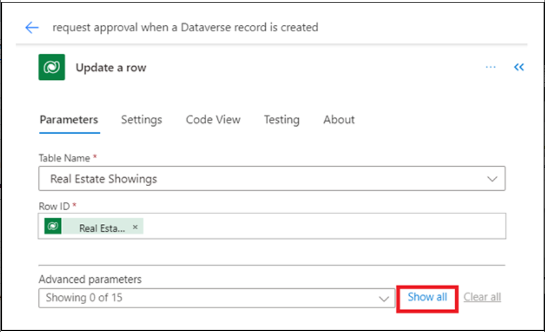

30. Select **Confirmed** from the **Status** dropdown menu.

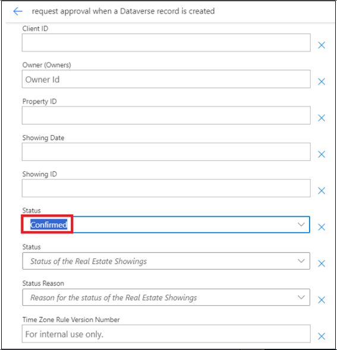

When a showing is approved, the **Status** field in the **Real Estate
Showings** table is updated to **Confirmed**.

31. Collapse the **Update a row** action.

32. Select the **Update a row** action under the **False** branch of the
    condition.

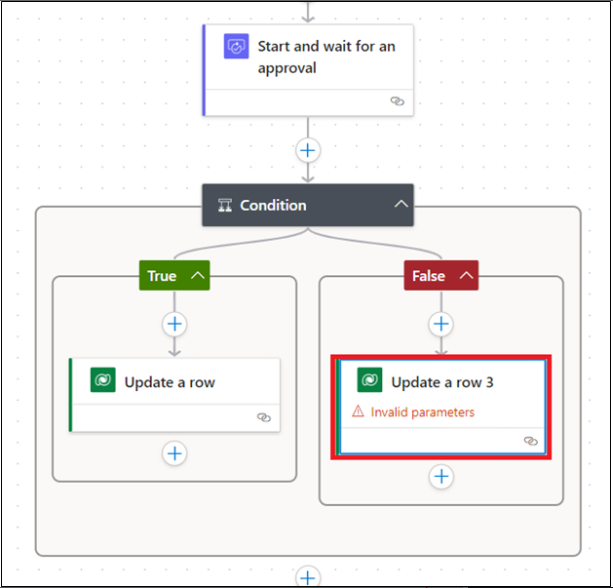

33. From the **Table Name** dropdown menu, search for and
    select **Showings**.

34. Select the **Row ID** field and then select the **Showings** unique
    identifier field from the **Dynamic content** pane.

35. Select **Show all** under **Advanced parameters**.

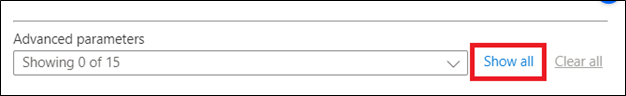

36. Select **Canceled** from the **Status** dropdown menu.

When a showing is rejected, the **Status** field in the **Real Estate
Showings** table is updated to **Canceled**.

37. Collapse the **Update a row** action.

38. In the Copilot chat window, enter the following prompt and then
    submit:

[**Under the "Update a row" action for both branches in the condition,
add a new "Send an email (V2)" action**](urn:gd:lg:a:send-vm-keys)

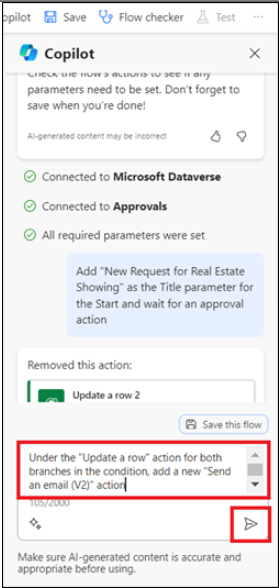

After a few seconds, Copilot should explain what it did, as shown in the
following image.

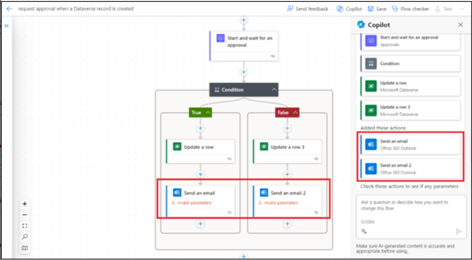

39. Select the **Send an email** action under the **True** branch of the
    condition.

40. Select \*\*Switch to advanced mode\*\* in the line of
    \*\*To\*\*field, select **Enter custom value** and then select
    the **Client Email** field from the **Dynamic content** pane.
    (Select **see more** infront of the When a row is added, modified or
    deleted)

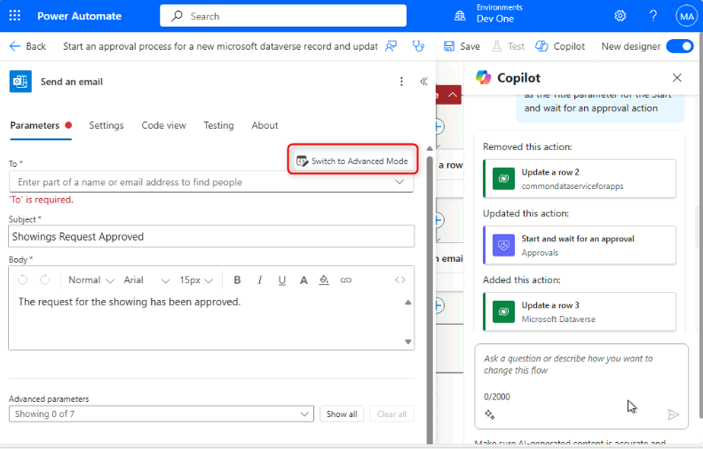

41. For the **Subject** field, enter the following text into the Copilot
    chat window and then press the **Enter** key on your keyboard:

**Add "Your request for a real estate showing has been approved" as the
Subject parameter for the Send an email action**

The **Subject** field should populate with the prompt text.

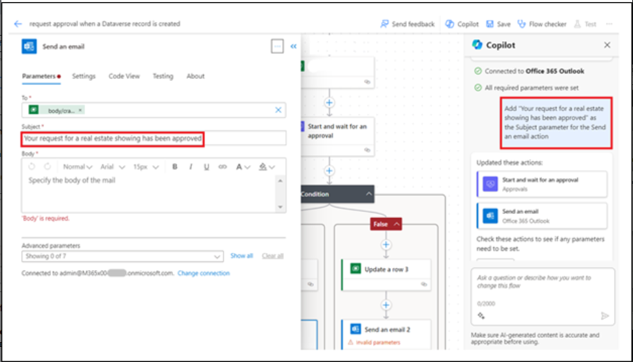

42. For the **Body** field, enter the following text into the Copilot
    chat window and then press the **Enter** key on your keyboard:

**Add "Good day - Your request for a real estate showing has been
approved. Please see below for details." as the Body parameter for the
Send an email action**

The **Body** field should populate with the prompt text.

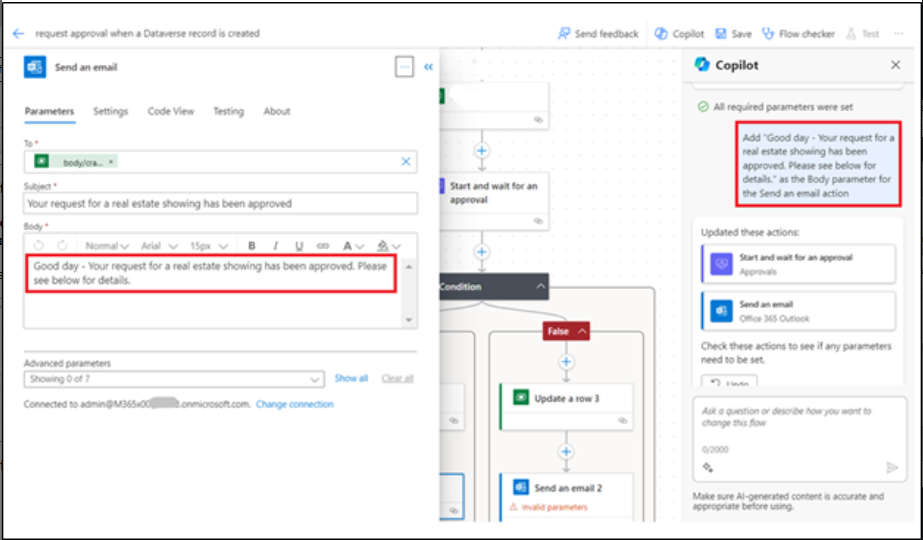

43. Enter the following content after the **Body** text:

**Property:**

**Agent Name:**

**Showing Date:**

Add the **Client** **Address**, **Agent
Name** and **Showing** **Date** fields from the **Dynamic content** pane
to the appropriate lines in the **Body** text.

44. Add the **Response summary** field from the **Dynamic content** pane
    to the end of the **Body** text.

45. Collapse the **Send an email** action.

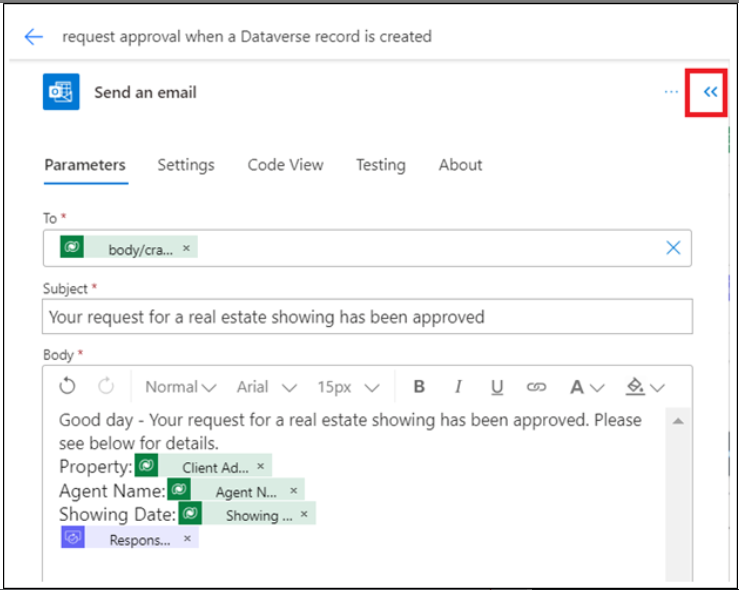

46. Select the **Send an email** action under the **False** branch of
    the condition. Select the **To** field, remove
    the example@example.com email address, and then select the **Client
    Email** field from the **Dynamic content** pane.

47. For the **Subject** field, enter the following content into the
    Copilot chat window and then press the **Enter** key on your
    keyboard:

[**Add "Your request for a real estate showing has been rejected" as the
Subject parameter for the Send an email
action**](urn:gd:lg:a:send-vm-keys)

48. For the **Body** field, enter the following text into the Copilot
    chat window and then press the **Enter** key on your keyboard:

[**Add "Good day - Your request for a real estate showing has been
rejected. Please see below for details." as the Body parameter for the
Send an email action**](urn:gd:lg:a:send-vm-keys)

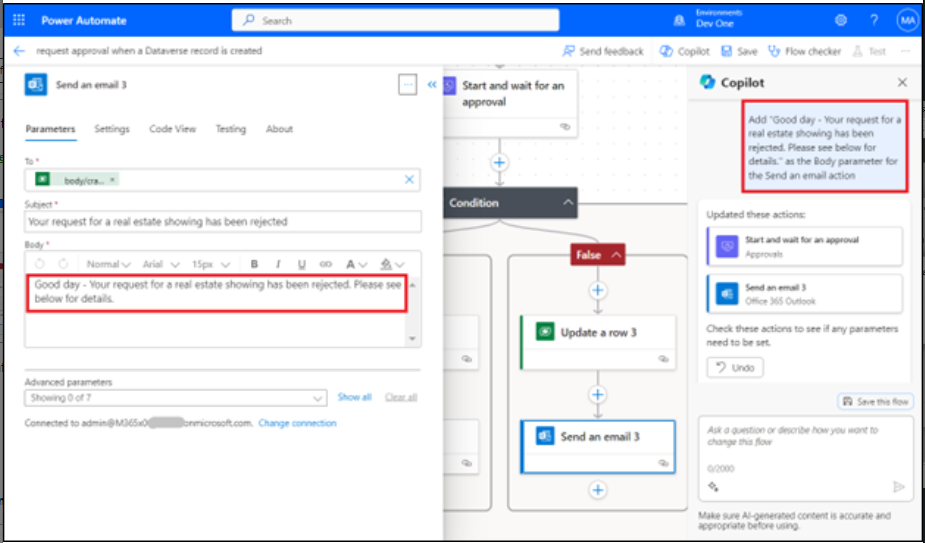

49. Enter the following content after the **Body** text:

**Property:**

**Agent Name:**

**Showing Date:**

Add the **Address**, **Agent Name** and **Showing** **Date** fields from
the **Dynamic content** pane to the appropriate lines in
the **Body** text.

50. Add the **Response summary** field from the **Dynamic content** pane
    to the end of the **Body** text.

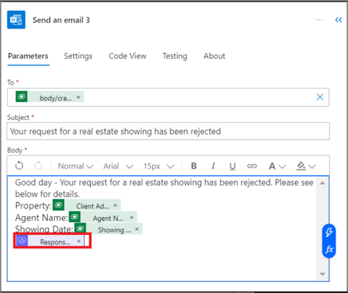

51. Collapse the **Send an email** action.

52. Rename the flow to **Request Approval for Real Estate Showing** by
    selecting the **request approval when a Dataverse record is
    created** text in the upper-left corner of the screen.

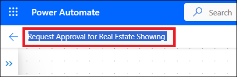

53. Save the flow by selecting the **Save** button in the upper-right
    corner of the screen.

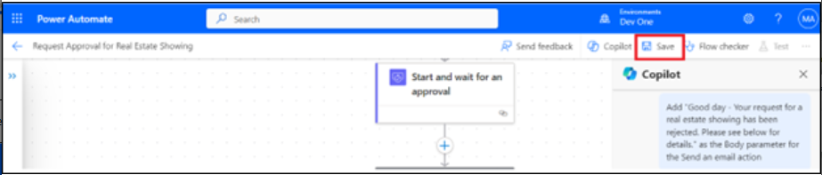

54. Select **back arrow** before the name of the flow.

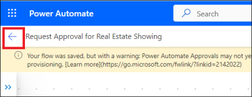

55. Select **OK**.

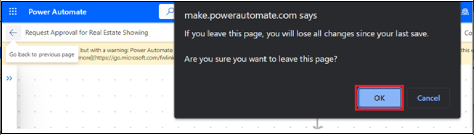

56. To submit a real estate showing request, go to the Real Estate
    Showings app in Power Apps
    using [**https://make.powerapps.com/**](urn:gd:lg:a:send-vm-keys) .

57. Select **Apps** from left navigation, select **Showings** app and
    then select **Play**.

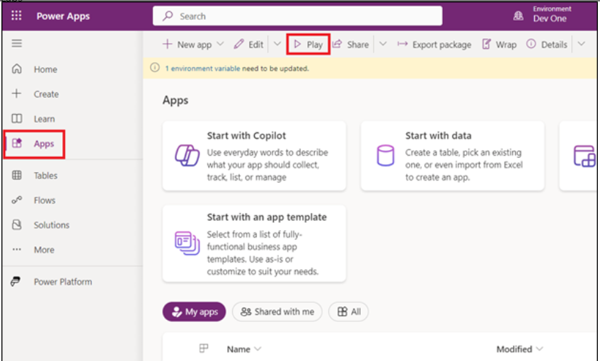

58. Select **+New** to create a new showing request.

59. Fill in the fields with the following information:

    - **Agent Name** - \< random name \>

    - **Client Full Name** - \< Your name \>

    - **Client Email** - \< Your email \> (the email that you're using
      for this lab)

    - **Date** - \< Any future date \>

    - **Time** - \< Any future time \>

    - **Status** - Pending

    - **Address** - 210 Pine Road, Portland, OR 97204

**Note** This address is one of the addresses from the Microsoft Excel
file in Module 1; it's the same file that you uploaded and turned into
the **Real Estate Properties** table.

Usually, you would have a lookup field to the **Real Estate
Properties** table, but not for this lab to keep it simple.

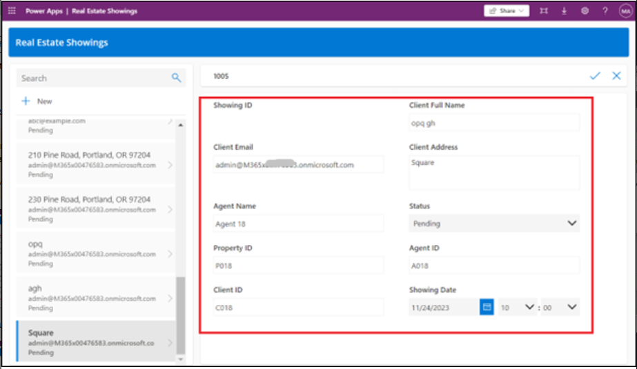

60. Select the check mark in the upper-right corner of the screen.

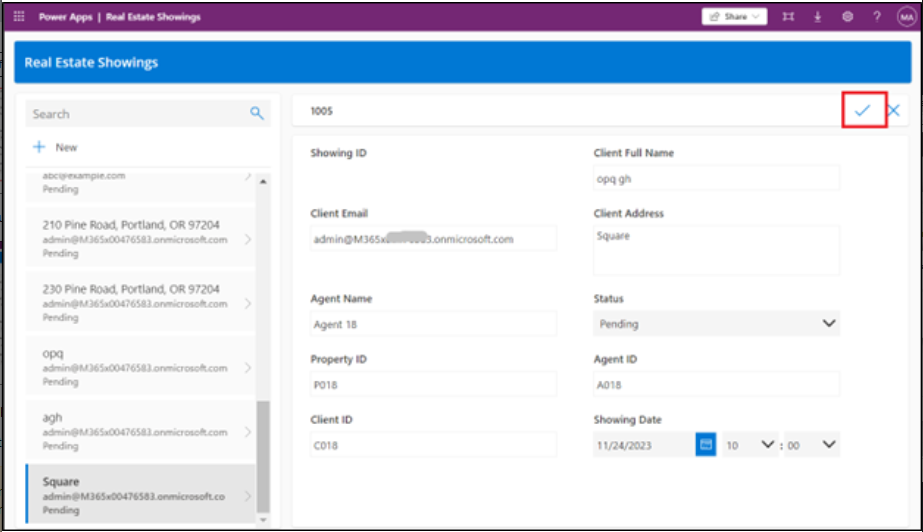

The flow runs and sends an approval email to the email address that you
provided in the flow that you built.

61. Sign in to the email account that you're using for this lab and then
    wait for the email to arrive.

**Note:** If the flow doesn't run immediately, make sure that you wait
for it. It might take up to 10 minutes for the flow to be triggered,
especially on the first try.

The approval should resemble the following image.

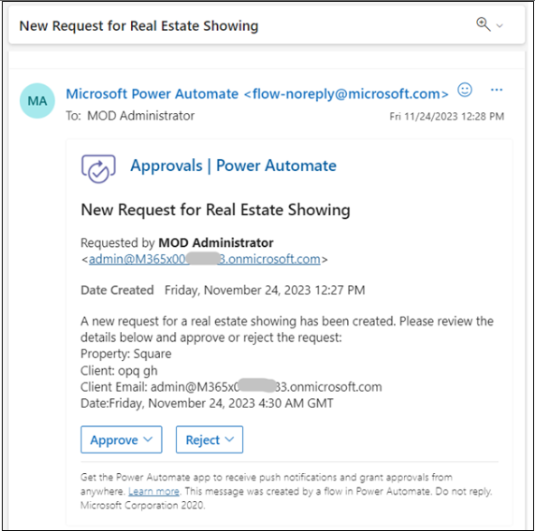

62. Select **Approve**.

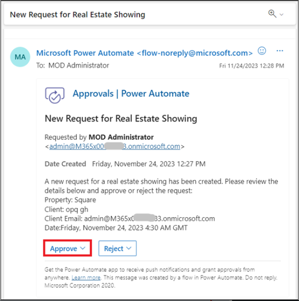

63. Add a comment and then select **Submit**.

The flow continues to run; it updates the row and sends an email to the
requestor. The email that's sent to the requester resembles the
following image.

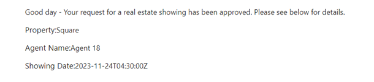

64. Check the flow and notice that the flow is now marked
    as **Succeeded** in the run history.

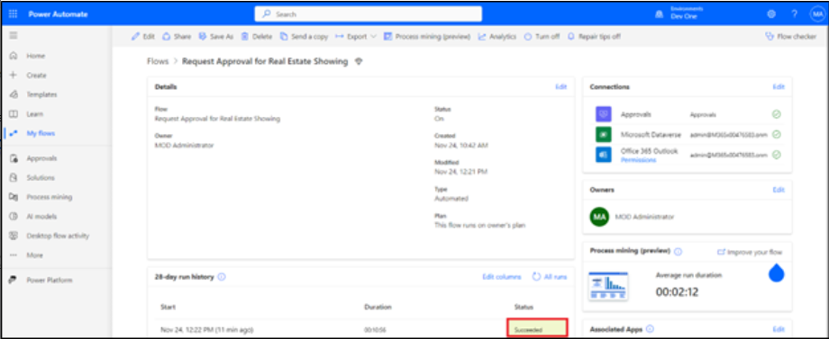

