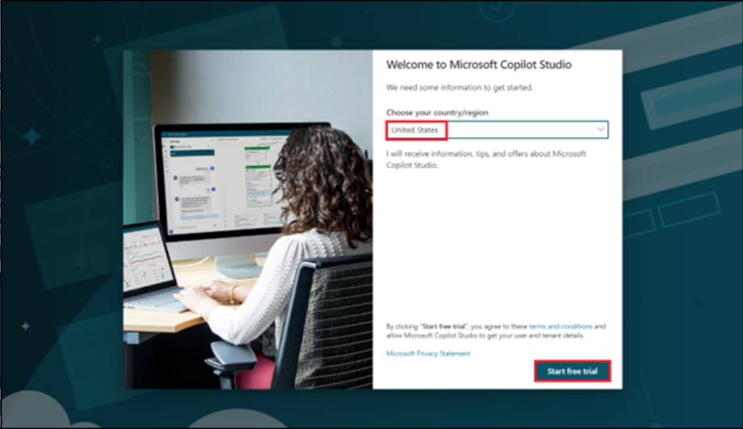
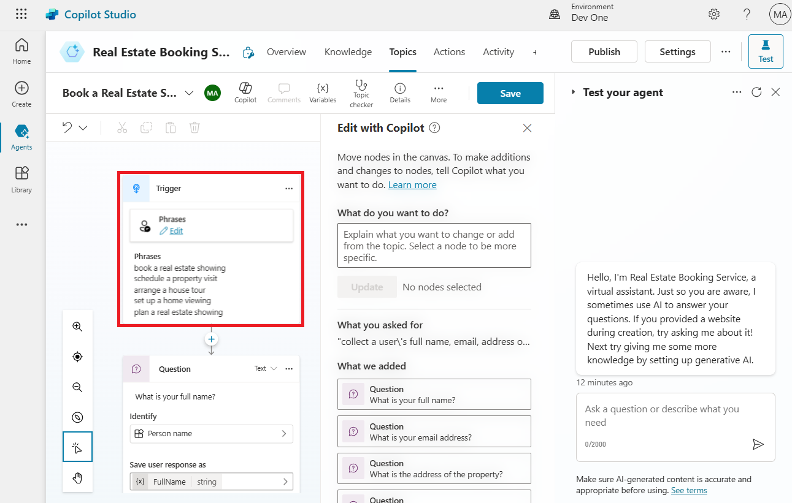
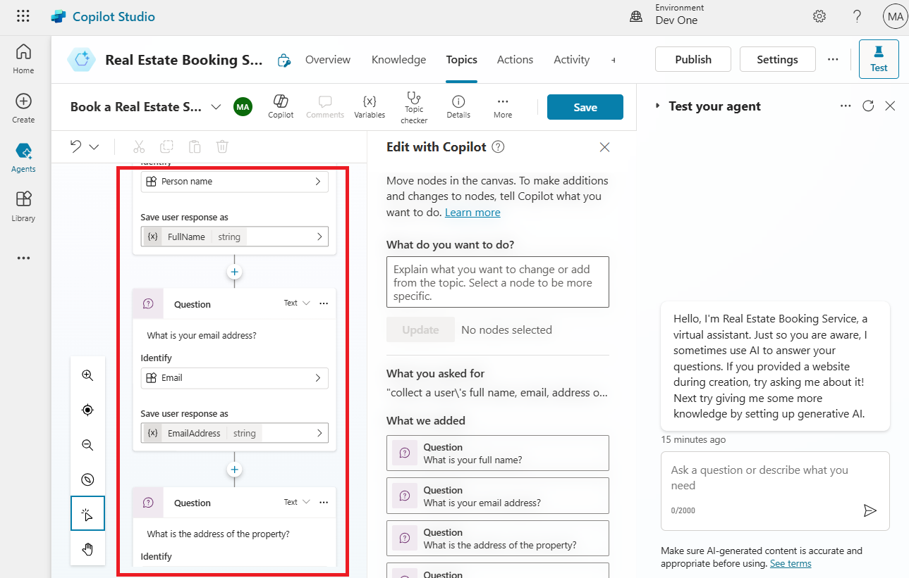
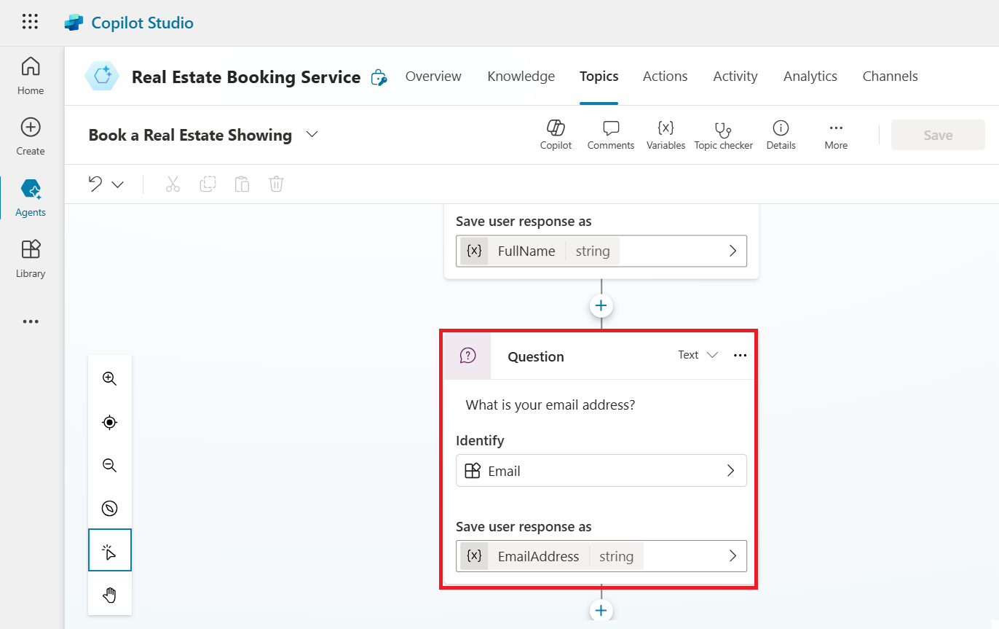

# 实验 3：使用新的 AI 功能在 Microsoft Copilot Studio 中构建机器人

在本实验中，您将使用 Microsoft Copilot Studio 中的 Copilot
创建机器人。此外，您还将学习如何使用 Conversation Booster
功能来改进机器人的响应。

1.  使用 [**https://copilotstudio.microsoft.com/**](urn:gd:lg:a:send-vm-keys)
    使用您的 **Office 365 管理员租户**凭据登录 **Microsoft Copilot
    Studio**

[**admin@M365x15683240.onmicrosoft.com**](urn:gd:lg:a:send-vm-keys)

[**Cn~R2y15%7Pju3lrGdR;(HO9Y+%^70p~**](urn:gd:lg:a:send-vm-keys)

2.  如果询问，请选择 **United States**
    作为您的国家/地区，然后选择**Start free trial/Get started。**

3.  从环境选择器中选择 **Dev One** 环境。

4.  在 “**Welcome to Copilot Studio**” 弹出窗口中，选择 “**Skip**” 

5.  从左侧导航菜单中选择 **+Create**，然后选择 **New agent**。

> 

此时将打开 Create a bot
向导。此向导通过命名、选择语言以及选择是否要使用生成式答案来促进对话，从而帮助您设置机器人。

6.  选择 **Skip to configure**。

> 

7.  将您的机器人命名为 **Real Estate Booking Service**，然后单击 **+Add
    knowledge**。

8.  选择 **Public website** （公共网站）。

> 

**注意：**选择 **Create** （创建） 后，在新环境中创建第一个 bot
的过程最多可能需要 15 分钟。后续机器人的创建速度要快得多。

9.  在网页链接下，输入 [**https://powerplatform.microsoft.com/**](urn:gd:lg:a:send-vm-keys) 然后选择
    “**Add**” 。

> 

10. 您可以在 Webpage link 字段下看到添加的链接，现在再次选择 **Add**。

> 

11. 选择 **Create**。

12. 创建代理后，从上面的水平模块中选择 **Topics** ，然后选择 **+ Add a
    topic** 下拉菜单。选择 **Create from description with Copilot**。

> 

**注意：**如果未显示**Create with
Copilot**选项，则可能需要启用智能创作支持：

a\. 选择上方菜单中的 **Settings** 图标，然后选择 **General settings**。

b\. 将 **Intelligent authoring support with Copilot** 开关设置为
**On**。

13. 此时将出现一个新窗口，要求您为 **Name your topic** ，并在 **Create a
    topic to ...**空间。

14. 在 **Name your topic** （命名您的主题） 字段中，输入以下文本：

[**Book a Real Estate Showing**](urn:gd:lg:a:send-vm-keys)

15. 在 **Create a topic to...**字段中，输入以下文本：

collect a user's full name, email, address of the property, and date and
time of the showing

选择 **Create**。

此时将显示一个新主题，其中包含生成的触发短语。

**注意：**请记住，您生成的内容可能与本实验中显示的内容不同。

还应显示多个问题节点、实体选择和变量命名。

16. 查找并选择 **What is your email address？**question 节点。

> 

17. 选择创作画布上部的 **Edit with Copilot** 图标。

18. 选择 “**What is your email address**（您的电子邮件地址是什么）”
    问题节点，选择 **+Add**（+添加），然后选择 **Message
    variation**（消息变体）。

在消息框中输入 **Thank you**，然后选择 {X} 图标以插入变量。选择 **Name**
variable（名称变量）。

19. 在最后一个节点后选择 **+ sign** 以再添加一个问题节点。

输入 **Do you want to visit again？**，选择 **Identity** 下的 **Multiple
choice option** ，单击 **+New option**，然后选择 **+New option**
两次，分别输入 **Yes** 和 **No**。

20. 选择 **Save** （保存） 以保存更改。

21. 在屏幕右侧，您可以看到 “测试您的 Copilot” 窗格已打开。

22. 当 **Conversation Start** （对话开始）
    消息出现时，您的机器人将开始对话。作为响应，输入您创建的主题的触发短语：

[**I want to book a real estate showing**](urn:gd:lg:a:send-vm-keys)

[**The bot responds with the "What is your full name?" question, as
shown in the following image.**](urn:gd:lg:a:send-vm-keys)

23. 输入其余信息：

> 复制
>
> 全名：\<您的姓名\>
>
> 电子邮件地址：\<您的电子邮件地址\>
>
> 联系地址： 555 Oak Lane, Denver, CO 80203
>
> 日期和时间： 10/10/2023 10:00 AM

24. 选择 Yes （是） 或 No （否）。

25. 要测试增强的机器人，请输入 What is Microsoft Power
    Platform？机器人从我们在创建机器人时提供的网站中检索信息并返回响应。

