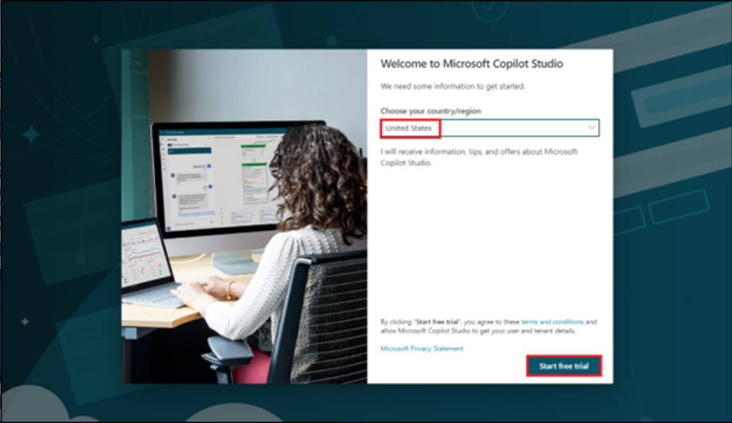
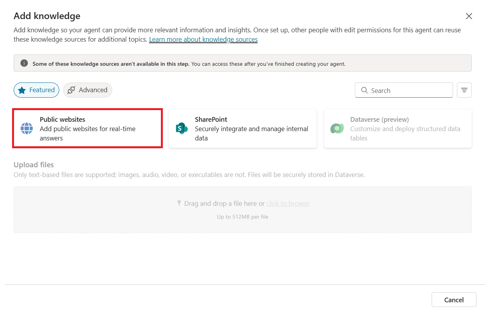
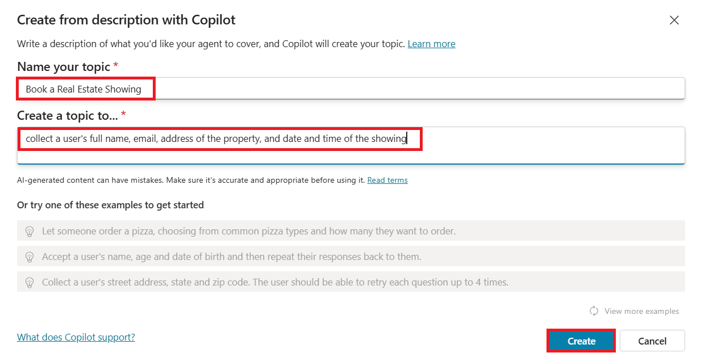
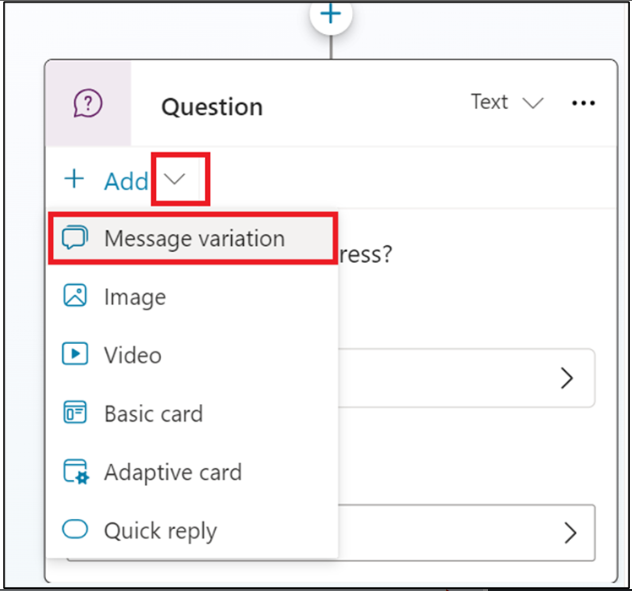
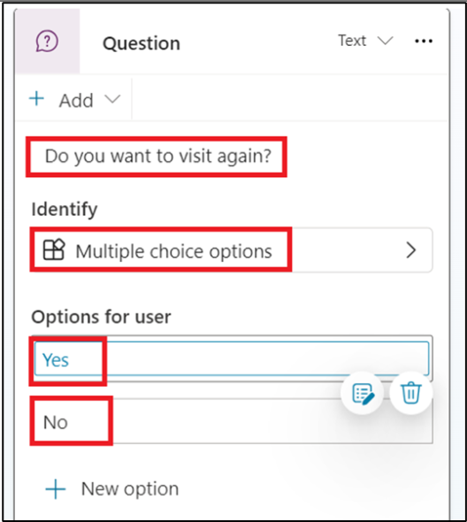
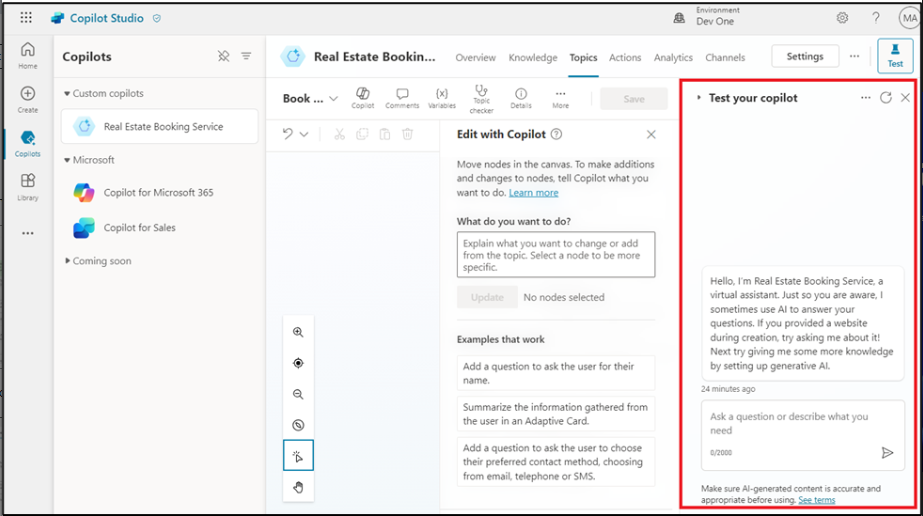

# Atelier 3 : Création d'un bot dans Microsoft Copilot Studio avec les nouvelles fonctionnalités d'IA 

Dans cet atelier, vous allez créer un bot à l'aide de Copilot in
Microsoft Copilot Studio ,De plus, vous apprendrez à utiliser la
fonctionnalité Conversation Booster pour améliorer les réponses de votre
bot.

1.  Connectez-vous à **Microsoft Copilot Studio** avec vos informations
    d'identification de **Office 365 admin tenant**  à l'aide
    [**https://copilotstudio.microsoft.com/**](https://copilotstudio.microsoft.com/)

[**admin@M365x15683240.onmicrosoft.com**](urn:gd:lg:a:send-vm-keys)

[**Cn~R2y15%7Pju3lrGdR ; (HO9Y+ %^70p~**](urn:gd:lg:a:send-vm-keys)

2.  Si vous y êtes invité, sélectionnez **Unites states** comme
    pays/région, puis sélectionnez **Start free trial/Get started.**

3.  Sélectionnez Environnement **Dev One** dans le sélecteur
    d'environnement.

4.  Dans la fenêtre surgit **Welcome to Copilot Studio**, sélectionnez
    **Skip**

5.  Sélectionnez **+Create** dans le menu de navigation de gauche, puis
    sélectionnez **New agent.**

> 

L'assistant de création d'un bot s'ouvre. Cet assistant vous aide à
configurer votre bot en le nommant, en sélectionnant la langue et en
choisissant éventuellement si vous souhaitez booster vos conversations
avec des réponses génératives.

6.  Sélectionnez **Skip configure**.

> 

7.  Nommez votre bot en tant que **Real Estate Booking Service**  puis
    cliquez sur **++Add knowledge.**

8.  Sélectionnez **Public** **SiteWeb**

> 

**Remarque :** Une fois que vous avez sélectionné **Create**, le
processus de création du premier bot dans un nouvel environnement peut
prendre jusqu'à 15 minutes. Les bots suivants sont créés beaucoup plus
rapidement.

9.  Sous le lien de la page Web, entrez le
    [**https://powerplatform.microsoft.com/,**](urn:gd:lg:a:send-vm-keys)
    puis sélectionnez **Add**.

> 

10. Vous pouvez voir le lien ajouté sous le champ Lien de la page Web,
    maintenant sélectionnez à nouveau **Add**.

> 

11. Sélectionnez **Create**

12. Une fois votre agent créé, sélectionnez **Topics** dans la palette
    horizontale ci-dessus, puis sélectionnez le menu déroulant **+ Add a
    topic** . Sélectionnez **Create from description with Copilot.**

> 

**Remarque :** Si l' option **Create with Copilot**  ne s'affiche pas,
vous devrez peut-être activer la prise en charge de la création
intelligente :

a\. Sélectionnez l' icône **settings**.dans le menu supérieur, puis
Sélectionnez **General settings**.

b\. Réglez l' option **Prise en charge de la création intelligente avec
Copilot** sur **On**.

13. Une nouvelle fenêtre s'affiche vous demandant de **Name your topic**
    et d'en fournir une description dans la section **Create a topic
    to...** espace.

14. Dans le champ **Name your topic**, entrez le texte suivant :

[**Book a Real Estate Showing**](urn:gd:lg:a:send-vm-keys)

15. Dans la section **Create a topic to...** , entrez le texte suivant :

Collecter le nom complet de l'utilisateur, son adresse e-mail, l'adresse
de la propriété, ainsi que la date et l'heure de la visite

Sélectionnez **Create**.

Une nouvelle rubrique s'affiche avec les phrases de déclenchement
générées.

**Remarque :** N'oubliez pas que le contenu généré peut s'afficher
différemment de ce qui est affiché dans cet atelier.

Les nœuds de question multiples, la sélection d'entités et le nommage
des variables doivent également être affichés.

16. Recherchez et sélectionnez l'option **What is your email
    address?** nœud de question.

> 

17. Sélectionnez l' icône **Edit with Copilot**  dans la partie
    supérieure du canevas de création.

18. Sélectionnez le nœud de **question ’What is your email address'** 
    sélectionnez **+Add**, puis sélectionnez **Message variation**.

Entrez **Thank you**  dans la zone de message, puis sélectionnez l'icône
{X} pour insérer la variable. Sélectionnez le **Name** de variable

19. Sélectionnez le **+ sign**  après le dernier nœud pour ajouter un
    nœud de question supplémentaire.

Entrez **Do you want to visit again?**,**?**, sélectionnez **Multiple
choice option**  sous **Identity**, cliquez sur **+Newoption** et entrez
**Yesi** et **No** séparément en sélectionnant deux fois **+New
option**.

20. Sélectionnez **Save** pour enregistrer vos modifications.

21. Sur le côté droit de l'écran, vous pouvez voir que le volet Tester
    votre copilote est déjà ouvert.

22. Lorsque le message Démarrer la **conversation** s'affiche, votre bot
    démarre une conversation. En réponse, entrez une phrase de
    déclenchement pour le sujet que vous avez créé :

[**I want to book a real estate showing**](urn:gd:lg:a:send-vm-keys)

[**The bot responds with the "What is your full name?" question, as
shown in the following image.**](urn:gd:lg:a:send-vm-keys)

23. Entrez le reste des informations :

> Copier
>
> Nom complet : \<Votre nom\>
>
> Adresse e-mail : \<Votre adresse e-mail\>
>
> Adresse : 555 Oak Lane, Denver, CO 80203
>
> Date et heure : 10/10/2023 10:00

24. Sélectionnez Oui ou Non.

25. Pour tester le bot boosté, entrez Qu'est-ce que Microsoft Power
    Platform ? Le bot récupère des informations sur le site Web que nous
    avons fournies lors de la création d'un bot et renvoie une réponse.

