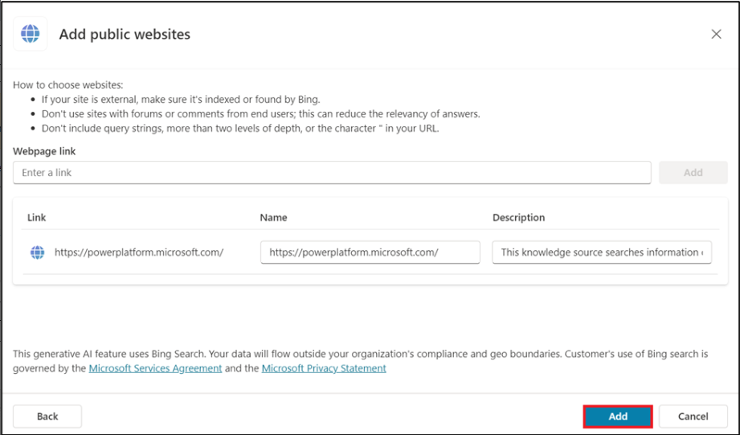
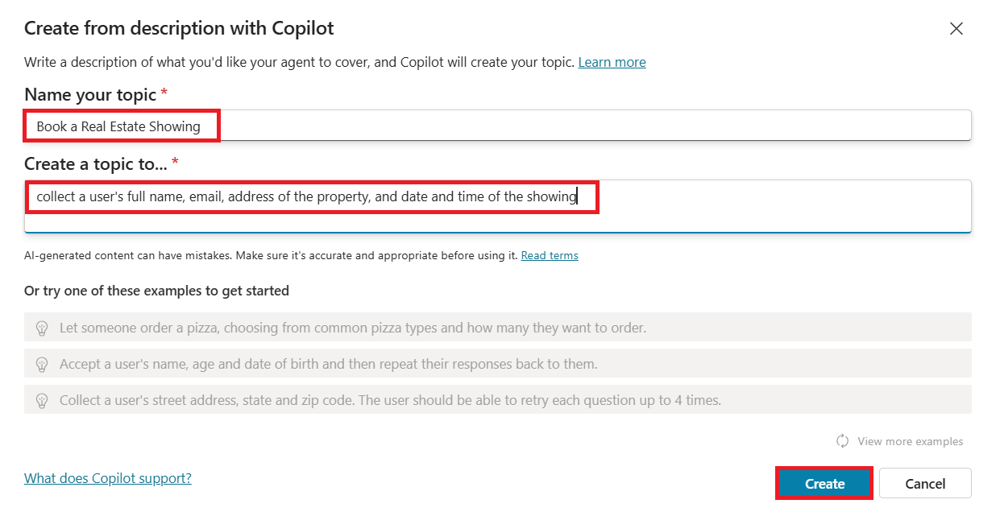
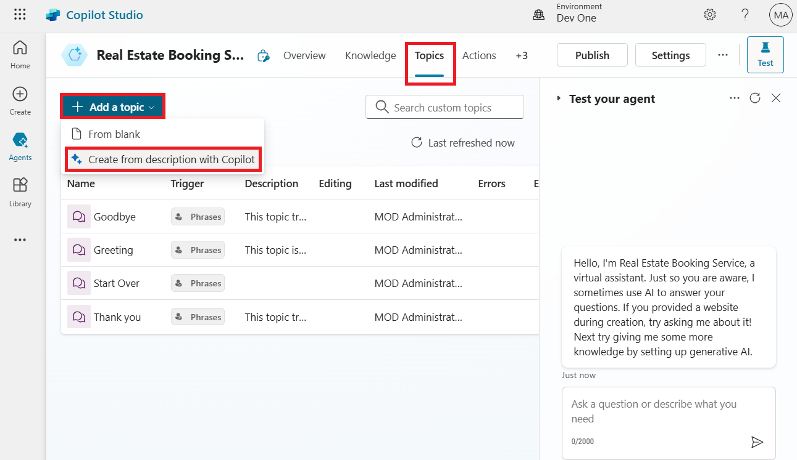
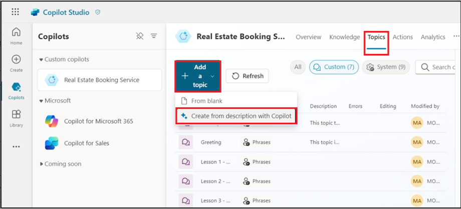

# Lab 3: Erstellen eines Bots in Microsoft Copilot Studio mit den neuen KI-Funktionen

In dieser Übung erstellen Sie einen Bot mithilfe von Copilot in
Microsoft Copilot Studio. Darüber hinaus erfahren Sie, wie Sie die
Conversation Booster-Funktion verwenden, um die Antworten Ihres Bots zu
verbessern.

1.  Melden Sie sich bei **Microsoft Copilot Studio** mit Ihren **Office
    365-Administrator-Mandantenanmeldeinformationen** an, indem Sie
    [**https://copilotstudio.microsoft.com/**](urn:gd:lg:a:send-vm-keys)

2.  Wenn Sie dazu aufgefordert werden, wählen Sie **United Stated** als
    Land/Region aus und wählen Sie dann **Start free trial/Get
    started.**

3.  Wählen Sie die Umgebung **Dev One** aus dem environment selector
    aus.

4.  Wählen Sie im Pop-up-Fenster Welcome to Copilot Studio die Option
    **Skip.**

5.  Wählen Sie im linken Navigationsmenü **+Create** aus, und wählen Sie
    dann **New agent.**

> 

Der Assistent zum Erstellen eines Bots wird geöffnet. Dieser Assistent
hilft Ihnen bei der Einrichtung Ihres Bots, indem er ihm einen Namen
gibt, die Sprache auswählt und optional auch auswählt, ob Sie Ihre
Unterhaltungen mit generativen Antworten verbessern möchten.

6.  Wählen Sie **Skip to configure** aus.

> 

7.  Benennen Sie Ihren Bot als **Real Estate Booking Service** und
    klicken Sie dann auf **+Add knowledge.**

8.  Wählen Sie **Public website** aus.

> 

**Hinweis:** Nachdem Sie **Create** ausgewählt haben, kann das Erstellen
des ersten Bots in einer neuen Umgebung bis zu 15 Minuten dauern.
Nachfolgende Bots werden viel schneller erstellt.

9.  Geben Sie unter dem Webseiten-Link das Symbol
    [**https://powerplatform.microsoft.com/**](https://powerplatform.microsoft.com/) und
    wählen Sie dann **Add**.

> 

10. Sie können den hinzugefügten Link unter dem Feld Webseiten-Link
    sehen, wählen Sie nun erneut **Add**.

> 

11. Wählen Sie **Create** aus.

12. Wenn Sie Ihren Agenten erstellt haben, wählen Sie **Topics** aus der
    obigen horizontalen Palette aus und wählen Sie dann das
    Dropdown-Menü + **Add a topics** aus. Wählen Sie **Create from
    description with Copilot** aus.

> 

**Hinweis:** Wenn die Option **Create with Copilot** nicht angezeigt
wird, müssen Sie möglicherweise die Unterstützung für intelligentes
Authoring aktivieren:

a\. Wählen Sie im oberen Menü das Symbol **Settings** und wählen Sie
dann **General settings**.

b\. Legen Sie den Schalter **Intelligent authoring support with
Copilot** auf **On** fest.

13. Es wird ein neues Fenster angezeigt, in dem Sie aufgefordert werden,
    **Name your topic** und eine Beschreibung im Feld **Create a topic
    to...** Raum.

14. Geben Sie im Feld **Name your topic** den folgenden Text ein:

[**Book a Real Estate Showing**](urn:gd:lg:a:send-vm-keys)

15. Klicken Sie im Feld **Create a topic to...** den folgenden Text ein:

collect a user's full name, email address of the property, and date and
time of the showing.

Wählen Sie **Create** aus.

Ein neues Thema mit den generierten Triggerphrasen wird angezeigt.

**Hinweis:** Denken Sie daran, dass Ihre generierten Inhalte
möglicherweise anders aussehen als in diesem Lab.

Mehrere Frageknoten, Entitätsauswahl und Variablenbenennung sollten
ebenfalls angezeigt werden.

16. Suchen Sie nach der Option **What is your email address?** und
    wählen Sie sie aus**.**

> 

17. Wählen Sie das Symbol **Edit with Copilot** im oberen Teil des
    Authoring-Canvas aus.

18. Wählen Sie die Frage **’What is your email address'** aus, wählen
    Sie **+Add**, und wählen Sie dann **Message variation** aus.

Geben Sie **Thank you** in das Nachrichtenfeld ein und wählen Sie dann
das Symbol {X} aus, um die Variable einzufügen.

Variable **Name** auswählen.

19. Wählen Sie **+ sign** nach dem letzten Knoten aus, um einen weiteren
    Fragenknoten hinzuzufügen.

Geben Sie **Do you want to visit again?** ein, wählen Sie **Multiple
choice option** unter **Identity**, klicken Sie auf **+New option** und
geben Sie **Yes** und **No** separat durch Auswahl von **+New
option** zweimal ein.

20. Wählen Sie **Save** aus, um Ihre Änderungen zu speichern.

21. Auf der rechten Seite des Bildschirms sehen Sie, dass der Bereich
    Test your copilot bereits geöffnet ist.

22. Wenn die Meldung **Conversation Start** angezeigt wird, beginnt Ihr
    Bot eine Unterhaltung. Geben Sie als Antwort eine Auslöserphrase für
    das Thema ein, das Sie erstellt haben:

[**I want to book a real estate showing**](urn:gd:lg:a:send-vm-keys)

[**The bot responds with the "What is your full name?" question, as
shown in the following image.**](urn:gd:lg:a:send-vm-keys)

23. Geben Sie die restlichen Informationen ein:

> Copy
>
> Full name: \<Your name\>
>
> Email address: \<Your email address\>
>
> Address: 555 Oak Lane, Denver, CO 80203
>
> Date and Time: 10/10/2023 10:00 AM

24. Wählen Sie Yes oder No aus.

25. Um den verstärkten Bot zu testen, geben Sie What is Microsoft Power
    Platform? Der Bot ruft Informationen von der Website ab, die wir bei
    der Erstellung eines Bots angegeben haben, und gibt eine Antwort
    zurück.

