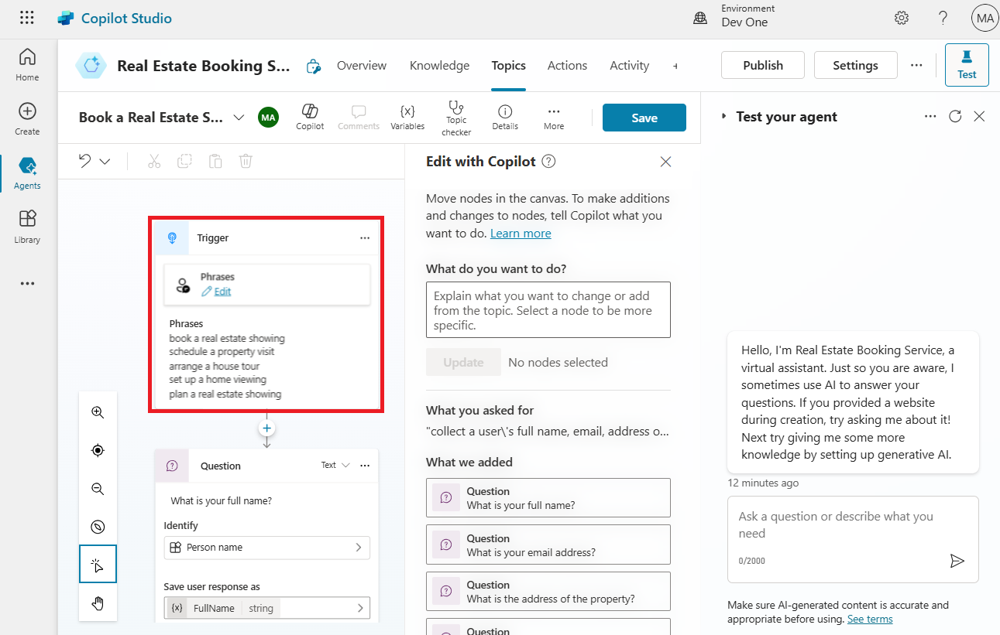
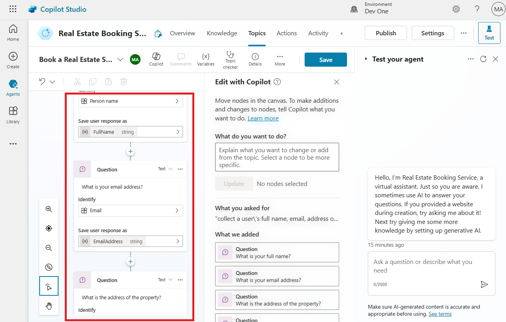

# Laboratorio 3: Construcción de un bot en Microsoft Copilot Studio con las nuevas capacidades IA

En este laboratorio, creará un bot mediante Copilot en Microsoft Copilot
Studio. Además, aprenderá cómo usar la característica Conversation
Booster para mejorar las respuestas de su bot.

1.  Inicie sesión en **Microsoft Copilot Studio** con sus **Office 365
    admin tenant** credentials
    mediante [**https://copilotstudio.microsoft.com/**](urn:gd:lg:a:send-vm-keys)

[**admin@M365x15683240.onmicrosoft.com**](urn:gd:lg:a:send-vm-keys)

[**Cn~R2y15%7Pju3lrGdR;(HO9Y+%^70p~**](urn:gd:lg:a:send-vm-keys)

2.  Si le pide, seleccione **United States** como country/region y luego
    seleccione **Start free trial/Get started.**

3.  Seleccione el entorno **Dev One** desde el environment selector.

4.  En el **Welcome to Copilot Studio** pop-up, seleccione **Skip**

5.  Seleccione **+Create** desde el menú de navegación izquierdo y
    seleccione **New** **agent.**

> 

Se abre Create a bot wizard. Este wizard le ayuda establecer su bot para
nombrarlo, seleccionar el idioma, y también elegir opcionalmente si
quiere impulsar sus conversaciones con respuestas generativas.

6.  Seleccione **Skip to** **configure**.

> 

7.  Nombre su bot como **Real Estate Booking Service** y haga clic
    en **+Add knowledge.**

8.  Seleccione **Public website**.

> 

**Ojo:** Después de seleccionar **Create**, el proceso de crear el
primer bot dentro de un nuevo entorno puede llevar unos 15 minutos. Se
crean los siguientes bots de forma más rápida.

9.  En el enlace webpage, introduzca
    [**https://powerplatform.microsoft.com/**](urn:gd:lg:a:send-vm-keys) y
    seleccione **Add**.

> 

10. Puede ver el enlace agregado en el campo Webpage link, ahora de
    nuevo seleccione **Add**.

> 

11. Seleccione **Create**.

12. Cuando se crea un agente, seleccione **Topics** desde el pallet
    horizontal en la parte superior y seleccione el menú despegable **+
    Add a topic**. Seleccione **Create from description with Copilot**.

> 

**Ojo:** Si no se ve la opción **Create with Copilot**, puede que
necesite habilitar Intelligent authoring support:

a\. Seleccione el ícono **Settings** en el menú de la parte superior y
seleccione **General settings**.

b\. Establezca el **Intelligent authoring support with
Copilot** a **On**.

13. Una nueva ventana aparece pidiéndole **Name your topic** y
    proporcionar una descripción en el espacio **Create a topic to...**.

14. En el campo **Name your topic**, introduzca el siguiente texto:

[**Book a Real Estate Showing**](urn:gd:lg:a:send-vm-keys)

15. En el campo **Create a topic to...**, introduzca el siguiente texto:

collect a user's full name, email, address of the property, and date and
time of the showing

Seleccione **Create**.

Se ve un nuevo topic con los trigger phrases generados.

**Ojo:** Recuerde, su contenido generado puede parecer un poco diferente
a lo que se muestra en este laboratorio.

También se debe mostrar múltiples nodos de preguntas, selcción de
entidades y el nombramiento de la variable.

16. Busque y seleccione el question mode **What is your email address?**

> 

17. Seleccione el ícono **Edit with Copilot** en la parte superior del
    authoring canvas.

18. Seleccione el question node **’What is your email address'**,
    seleccione **+Add**, y luego seleccione **Message variation**.

Introduzca **Thank you** en la casilla de mensaje y seleccione el ícono
{X} para insertar variables. Seleccione la variable **Name**.

19. Seleccione **+ sign** después del nodo último para agregar otro
    question node.

Introduzca **Do you want to visit again?**, seleccione **Multiple choice
option** en **Identity**, haga clic en **+New option** e
introduzca **Yes** y **No** separadamente al seleccione **+New
option** dos veces.

20. Seleccione **Save** para guardar sus cambios.

21. En la parte derecha de la pantalla, puede ver el panel Test your
    copilot ya está abierta.

22. Cuando aparece el mensaje **Conversation Start**, su bot empezará
    una conversación. Como respuesta, introduzca un trigger phrase para
    el topic que creó:

[**I want to book a real estate showing**](urn:gd:lg:a:send-vm-keys)

[**The bot responds with the "What is your full name?" question, as
shown in the following image.**](urn:gd:lg:a:send-vm-keys)

23. Introduzca el resto de la información:

> Copy
>
> Full name: \<Your name\>
>
> Email address: \<Your email address\>
>
> Address: 555 Oak Lane, Denver, CO 80203
>
> Date and Time: 10/10/2023 10:00 AM

24. Seleccione Yes o No.

25. Para probar el boosted bot, introduzca **What is Microsoft Power
    Platform?** El bot recupera la información del sitio web que hemos
    proporcionado a la hora de crear un bot y devuelve una respuesta.

