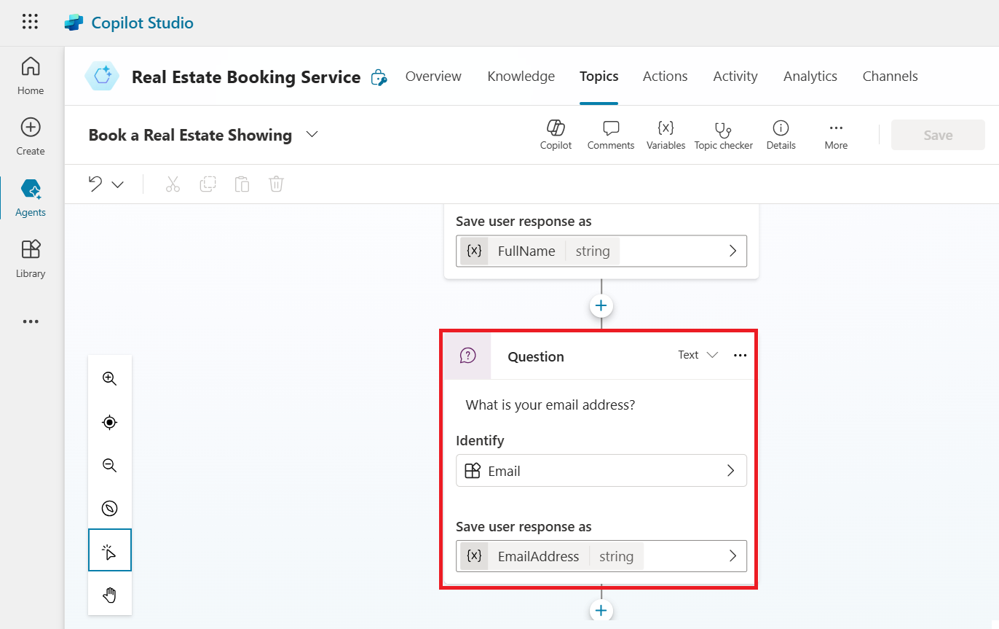

# Laboratório 3: Criando um bot no Microsoft Copilot Studio com os novos recursos de AI

Neste laboratório, você criará um bot usando o Copilot no Microsoft
Copilot Studio. Além disso, aprenderá a usar o recurso Conversation
Booster para melhorar as respostas do seu bot.

1.  Faça login no **Microsoft Copilot Studio** com suas credenciais do
    **Office 365 admin tenant** usando
    [**https://copilotstudio.microsoft.com/**](https://copilotstudio.microsoft.com/)

[**admin@M365x15683240.onmicrosoft.com**](urn:gd:lg:a:send-vm-keys)

[**Cn~R2y15%7Pju3lrGdR;(HO9Y+%^70p~**](urn:gd:lg:a:send-vm-keys)

2.  Se solicitado, selecione **United States** como seu country/region
    e, em seguida, selecione **Start free trial/Get started.**

3.  Selecione o ambiente **Dev One** no seletor de ambientes.

4.  Na janela pop-up **Welcome to Copilot Studio**, selecione **Skip**.

5.  Selecione **+Create** no menu de navegação à esquerda e, em seguida,
    selecione **New agent.**

> 

O assistente Create a bot será aberto. Esse assistente ajuda você a
configurar seu bot definindo um nome, selecionando o idioma e,
opcionalmente, escolhendo se deseja potencializar suas conversas com
respostas geradas por AI.

6.  Selecione **Skip to** **configure**.

> 

7.  Dê ao seu bot o nome **Real Estate Booking Service**  e clique em
    **+Add knowledge**.

8.  Selecione **Public website**.

> 

**Observação:** Após selecionar
**Create**, o processo de criação do primeiro bot em um novo ambiente
pode levar até 15 minutos. Bots subsequentes são criados muito mais
rapidamente.

9.  No link da página da web, insira    e, em seguida, selecione
    **Add**.

> 

10. Você verá o link adicionado no campo Webpage link. Agora, selecione
    **Add** novamente.

> 

11. Selecione **Create**.

12. Com o seu agente criado, selecione **Topics** na paleta horizontal
    superior e, em seguida, selecione o menu suspenso **+ Add a topic**.
    Escolha a opção **Create from description with Copilot**.

> 

**Observação:** Se a opção **Create with Copilot** não for exibida,
talvez seja necessário habilitar o suporte à criação inteligente:

a\. Selecione o ícone de **Settings** no menu superior e, em seguida,
selecione **General settings**.

b\. Defina a opção **Intelligent authoring support with Copilot** como
**On**.

13. Uma nova janela aparecerá solicitando que você **Name your topic** e
    forneça uma descrição em **Create a topic to...**

14. No campo **Name your topic**, insira o seguinte texto:

[**Book a Real Estate Showing**](urn:gd:lg:a:send-vm-keys)

15. No campo **Create a topic to...**, insira o seguinte texto:

collect a user's full name, email, address of the property, and date and
time of the showing

Selecione **Create**.

Um novo tópico é exibido com as frases de acionamento geradas.

**Observação:** Lembre-se de que o conteúdo gerado pode aparecer
diferente do que é mostrado neste laboratório.

Vários nós de perguntas, seleção de entidades e nomenclatura de
variáveis também devem ser exibidos.

16. Procure e selecione o nó da pergunta **What is your email address?**

> 

17. Selecione o ícone **Edit with Copilot** na parte superior da tela de
    criação.

18. Selecione o nó de pergunta **‘What is your email address?’**, clique
    em **+Add** e, em seguida, selecione **Message variation**.

Digite **Thank you** na caixa de mensagem e, em seguida, selecione o
ícone {X} para inserir a variável. Selecione a variável **Name**.

19. Selecione o **sinal +** após o último nó para adicionar mais um nó
    de pergunta.

Digite **Do you want to visit again?** selecione a opção **Multiple
choice** sob **Identity**, clique em **+New option** e insira **Yes** e
**No** separadamente, selecionando **+New option** duas vezes.

20. Selecione **Save** para salvar suas alterações.

21. No lado direito da tela, você verá que o painel Test your Copilot já
    está aberto.

22. Quando a mensagem **Conversation Start** aparecer, seu bot iniciará
    uma conversa. Em resposta, insira uma frase de acionamento para o
    tópico que você criou:

[**I want to book a real estate showing**](urn:gd:lg:a:send-vm-keys)

[**The bot responds with the "What is your full name?" question, as
shown in the following image.**](urn:gd:lg:a:send-vm-keys)

23. Insira as demais informações:

> Copy
>
> Full name: \<Your name\>
>
> Email address: \<Your email address\>
>
> Address: 555 Oak Lane, Denver, CO 80203
>
> Date and Time: 10/10/2023 10:00 AM

24. Selecione Yes ou No.

25. Para testar o bot otimizado, digite What is Microsoft Power
    Platform? O bot recupera as informações do site que fornecemos ao
    criar um bot e retorna uma resposta.

