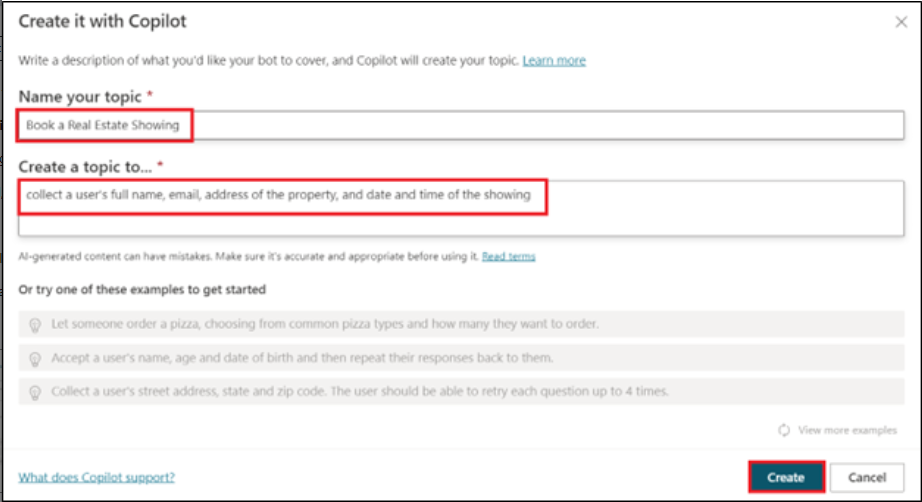

# Lab 3: Creazione di un bot in Microsoft Copilot Studio con le nuove funzionalità di intelligenza artificiale

In questo lab si creerà un bot usando Copilot in Microsoft Copilot
Studio. Inoltre, imparerai come utilizzare la funzione Conversation
Booster per migliorare le risposte del suoi bot.

1.  Accedere a **Microsoft Copilot Studio** con le credenziali del
    **Office 365** **admin** **tenant** utilizzando
    [**https://copilotstudio.microsoft.com/**](urn:gd:lg:a:send-vm-keys)

2.  Se richiesto, seleziona **United States** come paese/area
    geografica, quindi seleziona **Start free trial/Get started.**

3.  Seleziona l'ambiente **Dev One** dal selettore dell'ambiente.

4.  Nella finestra popup **Welcome to Copilot Studio,** selezionare
    **Skip**

5.  Seleziona **+Create** dal menu di navigazione a sinistra, quindi
    seleziona **New agent.**

> 

Viene visualizzata la procedura guidata Crea un bot. Questa procedura
guidata consente di configurare il bot assegnandogli un nome,
selezionando la lingua e, facoltativamente, scegliendo se si desidera
migliorare le conversazioni con risposte generative.

6.  Selezionare **Skip to configure.**

> 

7.  Assegna al suoi bot il nome **Real Estate Booking Service** se
    quindi fai clic su **+Add Knowledge.**

> 

8.  Seleziona **Public website**.

> 

**Nota:** dopo aver selezionato **Create**, il processo di creazione del
primo bot all'interno di un nuovo ambiente può richiedere fino a 15
minuti. I bot successivi vengono creati molto più velocemente.

9.  Sotto il collegamento alla pagina Web, inserisci il
    [**https://powerplatform.microsoft.com/**](urn:gd:lg:a:send-vm-keys)
    e quindi seleziona **Add**.

> 

10. Puoi vedere il link aggiunto nel campo Collegamento pagina web, ora
    seleziona di nuovo **Add**.

> 

11. Seleziona **Create**.

12. Dopo aver creato l'agente, seleziona **Topics** dal pallet
    orizzontale sopra e quindi seleziona il menu a discesa **+ Add a
    topic**. Seleziona **Create from description with Copilot.**

> 

**Nota:** se l' opzione **Create with Copilot** non viene visualizzata,
potrebbe essere necessario abilitare il supporto per l'authoring
intelligente:

a\. Selezionare l' icona **Settings** nel menu superiore, quindi
selezionare **General settings**.

b\. Impostare l' interruttore **Intelligent authoring support with**
**Copilot** su **On**.

13. Viene visualizzata una nuova finestra che ti chiede di assegnare un
    **Name your topic** e di fornire una descrizione nella sezione
    **Create a topic to...**spazio.

14. Nel campo **Name your topic**, inserisci il seguente testo:

[**Book a Real Estate Showing**](urn:gd:lg:a:send-vm-keys)

15. Nella casella **Create a topic to...** , inserisci il seguente
    testo:

Raccogli il nome completo di un utente, l'e-mail, l'indirizzo della
proprietà e la data e l'ora della presentazione

Seleziona **Create**.

Viene visualizzato un nuovo argomento con le frasi trigger generate.

**Nota:** ricorda che i contenuti generati potrebbero apparire in modo
diverso da quelli mostrati in questo laboratorio.

Dovrebbero essere visualizzati anche più nodi di domande, la selezione
di entità e la denominazione delle variabili.

16. Cerca e quindi seleziona **What is your email address?** nodo della
    domanda.

> 

17. Selezionare l' icona **Edit with Copilot** nella parte superiore
    dell'area di disegno.

18. Seleziona il nodo della domanda **"What is your email address?**",
    seleziona **+Add**, quindi seleziona **Message variation**.

Inserisci **Thank you** nella casella del messaggio, quindi seleziona
l'icona {X} per inserire la variabile. Selezionare Variabile **Name**.

19. Selezionare **+sign** dopo l'ultimo nodo per aggiungere un altro
    nodo della domanda.

Entra **Do you want to visit again?**, selezionare **Multiple choice
option** in **Identity**, fare clic su **+New option** e immettere
**Yes** e **No** separatamente selezionando due volte +**New option.**

20. Seleziona **Save** per salvare le modifiche.

21. Sul lato destro dello schermo, puoi vedere che il riquadro Verifica
    il suoi copilota è già aperto.

22. Quando viene visualizzato il messaggio **Conversation Start**, il
    bot avvierà una conversazione. In risposta, inserisci una frase
    trigger per l'argomento che hai creato:

[**I want to book a real estate
showing**](https://urn:gd:lg:a:send-vm-keys/)

[**The bot responds with the "What is your full name?" question, as
shown in the following image.**](https://urn:gd:lg:a:send-vm-keys/)* *

23. Inserisci il resto delle informazioni:

> Copy
>
> Full name: \<Your name\>
>
> E-mail address: \<Your email address\>
>
> Address: 555 Oak Lane, Denver, CO 80203
>
> Date and Time: 10/10/2023 10:00 AM

24. Selezionare **Yes** o **No**.

25. Per testare il bot potenziato, inserisci **What is Microsoft Power
    Platform**? Il bot recupera dal sito Web le informazioni che abbiamo
    fornito durante la creazione di un bot e restituisce una risposta.

