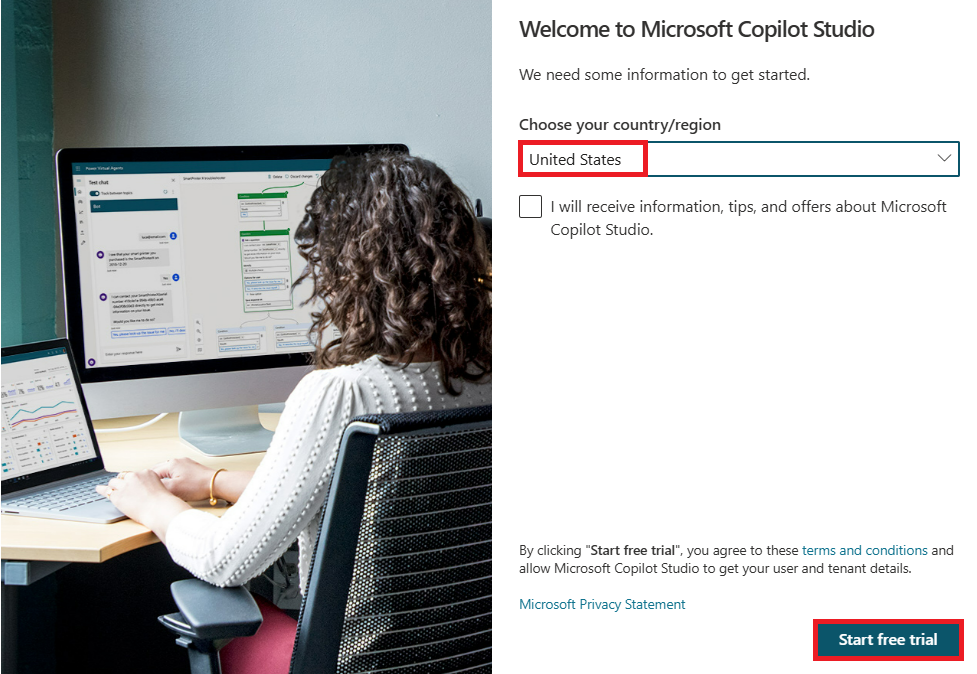
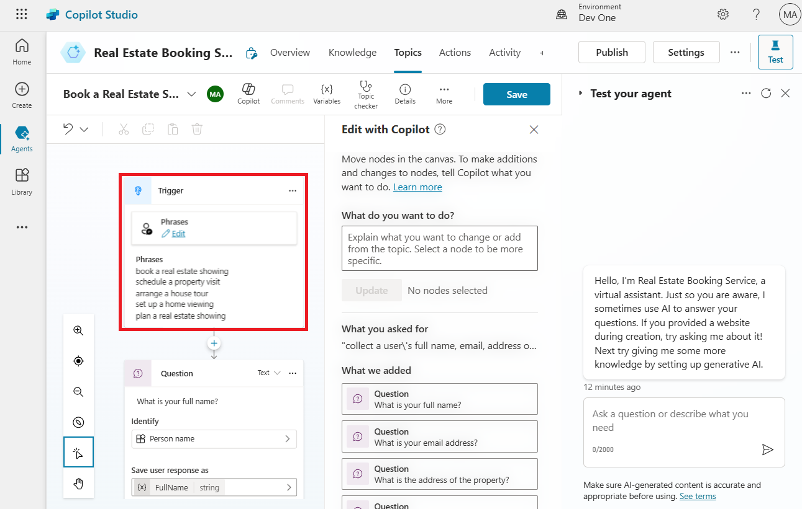
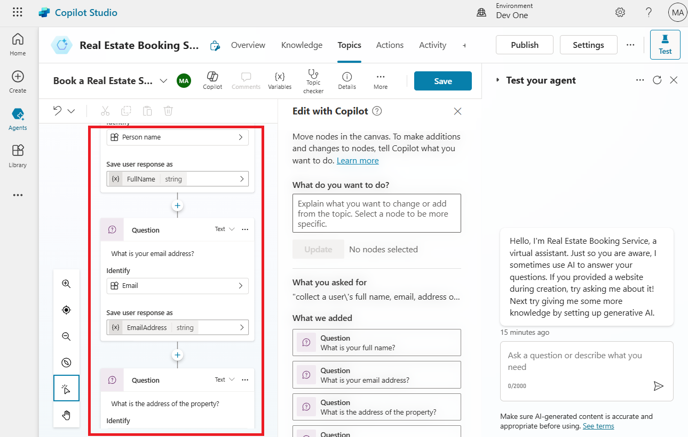
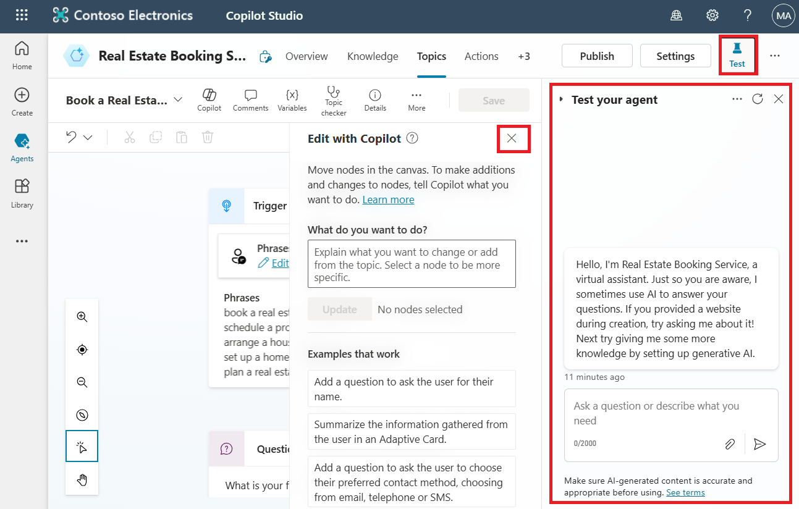
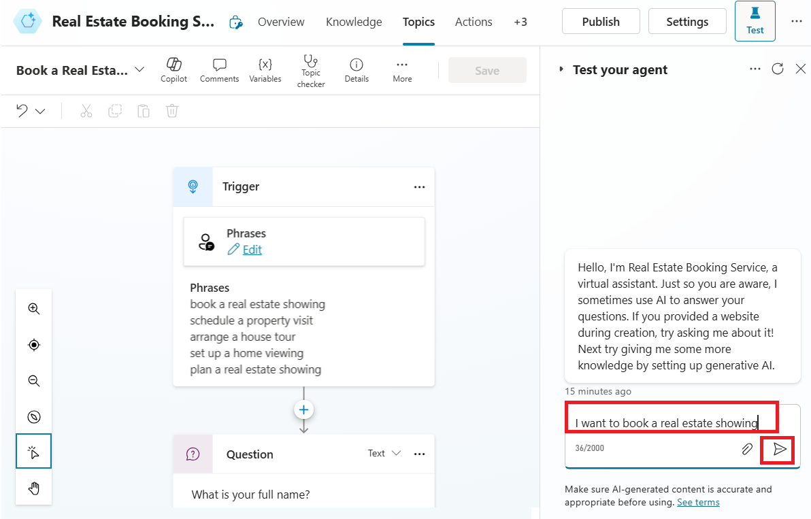
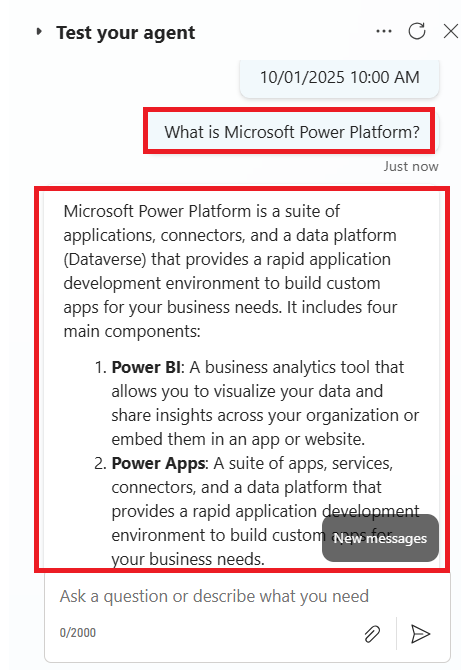

# Lab 3: Building an agent Microsoft Copilot Studio with the new AI capabilities

In this lab, you'll create a bot by using Copilot in Microsoft Copilot
Studio. Additionally, you'll learn how to use the Conversation Booster
feature to improve your bot's responses.

1.  Sign into **Microsoft Copilot Studio** with your **Office 365 admin
    tenant** credentials
    using [**https://copilotstudio.microsoft.com/**](urn:gd:lg:a:send-vm-keys)

[**admin@M365x15683240.onmicrosoft.com**](urn:gd:lg:a:send-vm-keys)

[**Cn~R2y15%7Pju3lrGdR;(HO9Y+%^70p~**](urn:gd:lg:a:send-vm-keys)

2.  If asked, select **United States** as your country/region and then
    select **Start free trial/Get started.**

> 

3.  Select **Dev One** environment from environment selector.

> 

4.  On the **Welcome to Copilot Studio** pop-up, select **Skip**

> 

5.  Select **+Create** from the left navigation menu and then
    select **New agent.**

> 

6.  Select **Skip to configure**.

> 

7.  Name your agent as **Real Estate Booking Service** and then click
    on **+Add knowledge.**

> 

8.  Select **Public website**.

> 

9.  Under the webpage link, enter
    the [**https://powerplatform.microsoft.com/**](urn:gd:lg:a:send-vm-keys) and
    then select **Add**.

> 

10. You can see the link added under Webpage link field, now again
    select **Add**.

> 

11. Select **Create**.

> 

12. With your agent created, select **Topics** from the above horizontal
    pallet and then select the **+ Add a topic** dropdown menu.
    Select **Create from description with Copilot**.

> 
>
> **Note:** If the **Create with Copilot** option doesn't display, you
> might need to enable Intelligent authoring support:
>
> a\. Select the **Settings** icon in the upper menu and then
> select **General settings**.
>
> b\. Set the **Intelligent authoring support with Copilot** toggle
> to **On**.

13. A new window appears asking you to **Name your topic** and provide a
    description in the **Create a topic to...** space.

14. In the **Name your topic** field, enter the following text:

> [**Book a Real Estate Showing**](urn:gd:lg:a:send-vm-keys)

15. In the **Create a topic to...** field, enter the following text:

> collect a user's full name, email, address of the property, and date
> and time of the showing
>
> Select **Create**.
>
> 

A new topic displays with the generated trigger phrases.

> 

**Note:** Remember, your generated content might appear differently than
what's shown in this lab.

Multiple question nodes, entity selection, and variable naming should
also be displayed.

16. Look for and then select the **What is your email
    address?** question node.

> 

17. Select the **’What is your email address'** question node,
    select **+Add**, and then select **Message variation**.

> 
>
> Enter **Thank you** in the message box and then select {X} icon to
> insert variable. Select **Name** variable.
>
> 

19. Select **+ sign** after the last node and select **Ask a question**
    to add one more question node.

Enter **Do you want to visit again?**, select **Multiple choice
option** under **Identity**, click on **+New option** and
enter **Yes** and **No** separately by selecting **+New option** twice.

20. Select **Save** to save your changes.

> 

21. On right side of the screen, you can see the Test your copilot pane
    is already opened. If not, click on **Test** to test the agent.

> 

22. When the **Conversation Start** message appears, your bot will start
    a conversation. In response, enter a trigger phrase for the topic
    that you've created:

[**I want to book a real estate showing**](urn:gd:lg:a:send-vm-keys)

[**The bot responds with the "What is your full name?" question, as
shown in the following image.**](urn:gd:lg:a:send-vm-keys)

> 

23. Enter the rest of the information:

> Copy
>
> Full name: \<Your name\>
>
> Email address: \<Your email address\>
>
> Address: 555 Oak Lane, Denver, CO 80203
>
> Date and Time: 10/1/2025 10:00 AM
>
> 

24. Select Yes or No.

> 

25. To test the ‘add knowledge’ property, enter What is Microsoft Power
    Platform? The bot retrieves information from the website which we
    have provided while creating an agent and returns a response.

> 
