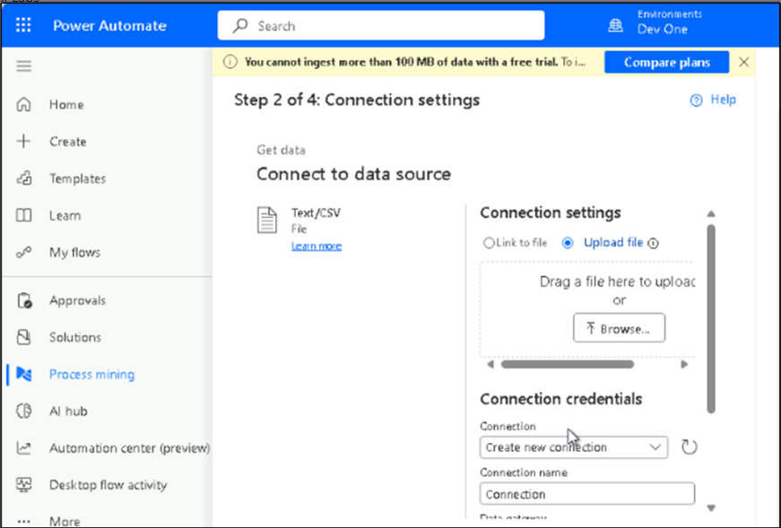

# Lab 4: Process ingestion and process analytics with Copilot in Process Mining (preview)

## Exercise 1 - Process ingestion with Copilot in Process Mining

1.  Navigate to the **Power Automate** portal
    using [**https://make.powerautomate.com/**](urn:gd:lg:a:send-vm-keys).
    Click on environment selector and select **Dev One** environment.

2.  From the left navigation, select **Process mining** and then
    select **Start here** under **Create new process**.

3.  In the **Process name** field, enter a name [**Process
    contacts**](urn:gd:lg:a:send-vm-keys) for your process.

4.  Select **Import Data** under **Data source**.

5.  Select **Dataflow**.

6.  Select **Continue**.

7.  Under **Connect to your data**, choose **Text/CSV** and
    select **Next**.

8.  Under **Connection settings** area, select **Upload file** and then
    click **Browse.**

9.  Open the **Grocery_Contacts.csv** file from **C:\LabFiles** in your
    lab **VM**. After uploading file, scroll down and select **Sign
    in** and sign in with your admin tenant credentials.

10. Once the file is uploaded, select **Next**.

11. Select **Next** on the **Preview file data** page.

12. Select **Next** on the **Transform your data** page.

13. On the **Map your data** page, for each of your attributes, map the
    column of attribute type correctly to set up your process map. Then,
    select **Save and analyze**.

**Note**: Case ID, Activity, and Event start are required.

14. Wait for the report to be prepared.

15. Once the report is prepared, you will be able to explore the report.
    Navigate through the **Summary**, **Map** and **Variant DNA** tabs.

## Exercise 2 - Process analytics with Copilot in Process Mining

1.  In process map view, select **Copilot** on the command bar to the
    right. The Copilot pane opens.

2.  Copilot offers several prepared suggestions to easily get you
    started on engaging with your data.

3.  From the provided suggestions, select **Summarize my process**.

4.  Copilot provides the response to your query.

5.  If available, it also provides subsequent prepared suggestions.

6.  (Optional) You can continue in conversation with Copilot by
    selecting subsequent suggestions. Alternatively, you can ask your
    own questions at any time using the text field in bottom part of the
    Copilot pane.
