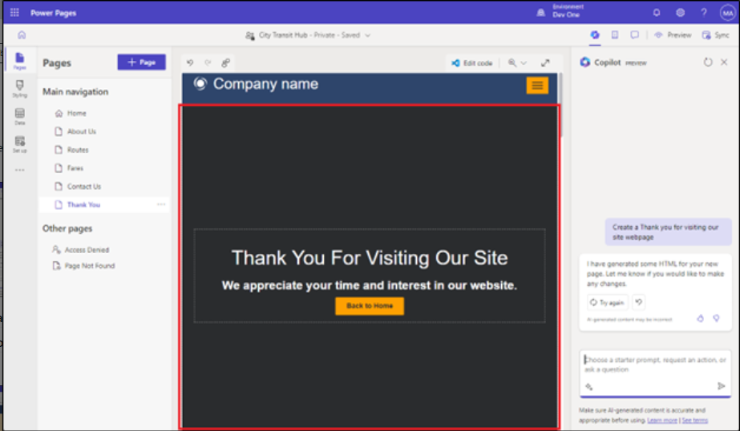
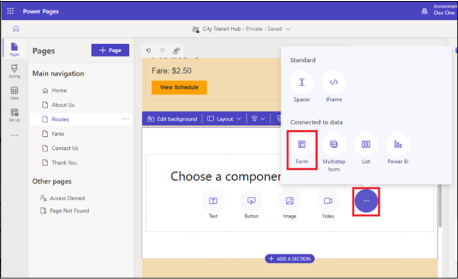

# 实验 5：使用 Copilot（预览版）创建 AI 生成的网站、网页并将其他组件添加到页面

**注意：**使用 Copilot 创建 Power Pages
网站时，请务必注意，每次创建网站时，Copilot
可能会生成不同的模板或布局。结果：

\- 生成的网站的确切布局和设计可能因实例而异。

\-
在按照指南或教程中的创建步骤进行作时，请将它们用作参考，而不是期望获得相同的结果。

\- 由于 Copilot
的动态生成功能，提供的屏幕截图可能与您在实例中看到的屏幕截图不同。

**提示：**
专注于理解整个流程和概念，而不是复制确切的设计，因为核心功能和步骤将保持一致。

## 练习 1：在 AI 的帮助下创建站点

要使用 Copilot 创建站点：

1.  使用 [**https://make.powerpages.microsoft.com/**](urn:gd:lg:a:send-vm-keys)
    转到 Power Pages

2.  确保您位于 Developer environment - **Dev One** 中，然后单击 **Get
    started**。

3.  选择 **Skip** on **Tell us about yourself** **窗口**。

4.  现在，您将导航到 Power Pages
    门户的主页。输入要构建的站点的描述，或选择该站点的建议描述。然后，按
    输入 键或选择文本框右下角的纸飞机图标。

示例描述：

- [**Build a website for public transportation for residents of city, to
  view routes and fares.**](urn:gd:lg:a:send-vm-keys)

5.  Copilot 会根据您的描述生成站点名称和 Web 地址。保持建议的名称和 Web
    地址不变，然后选择 **Next**。

> 

6.  在 “Choose a layout page’” 中，选择**Next**。然后，在 “添加常用页面”
    页面上，选择所有网页，然后单击 “完成” 。在 Introducing Copilot in
    power 页面上，单击 **Next**，最后选择 **Done**。

7.  单击“启用副驾驶”，然后在“将副驾驶添加到站点”页面的下一页上，打开“在坐下时启用副驾驶”

### 练习 2：使用 Copilot 创建 AI 生成的网页（**预览版**）

### 任务 1：生成网页

要使用 Copilot 生成网页：

1.  从左侧导航窗格中，选择 **Pages**
    工作区，然后您将进入新创建的网站的主页

2.  最初，您将位于 **Pages** 工作区。

3.  如果 Copilot 面板尚未打开，请选择命令栏中的 Copilot 按钮。

• 在 Choose a starter prompt， request an action， or ask a question
文本字段中键入网页的描述。

示例描述：

- [**Create a Thank you for visiting our site
webpage**](urn:gd:lg:a:send-vm-keys)

要完成页面审核，请选择 **Keep it** （保留）。

生成页面后，它会添加到主导航中，您可以查看页面和内容。页面中的部分、文本和图像可使用
WYSIWYG 编辑器进行低代码编辑。

## 练习 3：使用 Copilot 添加 AI 生成的表单（预览）

### 任务 1：使用 Copilot 创建表单

1.  转到 **Pages 工作区**，然后选择表单的 **Routes** 页面。

2.  将鼠标悬停在 Routes 网页的第一个部分上，然后单击 **+ Add a section
    \> 1Column**。

3.  选择 **More** ，然后选择 **Form** 组件。

4.  在 Describe a form to create it （描述用于创建表单）
    下的文本框中，描述您的表单。您可以在描述中使用最多 250
    个字符。要将描述发送给 Copilot，请按 Enter
    键或选择文本框右下角的纸质飞机图标。

**例：** [**Create a form for collecting suggestions and
addition/deletion of the routes**](urn:gd:lg:a:send-vm-keys)

**注：** 您可以检查描述右侧的预览，并根据需要优化表单。

- 要更改表单，请选择快速作或优化描述。

- 历史记录显示您到目前为止输入的描述。

- 选择 “**Start over**” 以擦除所有内容并从新描述开始。

5.  要将表单添加到页面，请选择 **OK**。

### 任务 2：使用 Copilot 添加 AI 生成的多步骤表单（预览版）

要使用 Copilot 生成多步表单，请执行以下作：

1.  转到 **Pages** （页面） **工作区**，然后为您的表单选择 **Thank you**
    （感谢） 页面。

2.  转到 Thank you 页面的底部，然后单击 Add 部分并选择 1 列。

> 

3.  在 choose component 部分。单击 （...），然后选择 表单。

> 
>
> 生成表单后，表单的预览将显示在画布上，并且 **审阅此表单**
> 工具栏显示在画布底部。
>
> 查看每个步骤。然后决定是要保留表单还是丢弃它。如果您选择将表单添加到页面，则可以使用
> Design Studio 的现有功能对其进行编辑，就像对其他组件所做的那样。

4.  查看每个步骤。然后决定是要保留表单还是丢弃它。如果您选择将表单添加到页面，则可以使用
    Design Studio 的现有功能对其进行编辑，就像对其他组件所做的那样。

> [**create a multistep form for getting information of a specific route
> and the fare.**](urn:gd:lg:a:send-vm-keys)
>
> 

5.  单击确定按钮在页面中添加表单。

> 

### 任务 3：使用 Copilot 生成文本

1.  转到 **Pages 工作区**，然后选择表单的 **About Us** page
    （关于我们页面）。

2.  将鼠标悬停在页面上，然后在我们的服务部分下选择 **+Add a section \>
    1Column** 。

3.  选择 **Text** 组件。

4.  在文本组件工具栏中，选择 **Copilot** 图标。

5.  描述您要让 Copilot 生成的文本; 例如， " [**I want to describe
    importance of local transport**](urn:gd:lg:a:send-vm-keys)".
    您可以在描述中使用最多 1500 个字符。要将描述发送给 Copilot，请按
    Enter 键或选择文本框右下角的纸质飞机图标。

6.  检查描述下方的 **preview** 并根据需要优化文本。

    - 要优化描述并生成新文本，请选择 **Rewrite** （重写）。

    - 要保留生成的文本，但使其听起来更友好、更随意、更有教育意义、更专业或更兴奋，请选择
      **Change the tone**（更改语气）。

    - 要保留生成的文本，但使其更简洁或对其进行扩展，请选择 **Adjust the
      length**（调整长度）。

    - 要向 Copilot 提供更多信息，请选择 Add more details for Copilot to
      work with。

    - 要向 Microsoft 提供有关 Copilot
      如何解释您的描述或优化的反馈，请选择竖起大拇指或竖起大拇指图标。

7.  要将文本添加到页面，请选择 **Add to page**。

### 任务 4：测试您的网站

1.  选择 **Preview**，然后选择
    **Desktop**。如果系统提示，请使用管理员凭据登录，然后选中 **checkbox
    of the consent**，然后选择 **Accept** （接受）。

2.  您可以查看主页和其他网页的列表。

3.  选择 Router page。您可以观察 AI 生成的表单。

4.  填写表单的几个字段，然后选择表单末尾的 **Submit** 按钮。

5.  选中 **checkbox of the consent** ，然后选择 **Accept**。

6.  成功提交表单后，请返回设计工作室。

**注意：**如果您没有收到提交成功的消息，请再试一次。

7.  选择 **Data**，然后选择 **Copilot Suggestion Routes**
    表（表名称可能不同），并确认您可以看到记录是使用多步骤表单流程创建的。

