# 실습 5: Copilot(미리 보기)을 사용하여 AI 생성 사이트 및 웹페이지 만들기 및 페이지에 다른 구성 요소 추가

**참고**: Copilot을 사용하여 Power Pages 웹사이트를 만들 때, Copilot은
웹사이트를 생성할 때마다 다른 템플릿이나 레이아웃을 생성할 수 있다는
점에 유의해야 합니다. 따라서 다음과 같은 문제가 발생할 수 있습니다.

\- 생성된 웹사이트의 정확한 레이아웃과 디자인은 인스턴스마다 다를 수
있습니다.

\- 가이드 또는 튜토리얼의 생성 단계를 따라 할 때는 동일한 결과를
기대하기보다는 참고용으로만 사용하십시오.

\- 제공된 스크린샷은 Copilot의 동적 생성 기능으로 인해 인스턴스에서
보이는 것과 다를 수 있습니다.

**팁**: 핵심 기능과 단계는 일관되게 유지되므로 정확한 디자인을 그대로
따라 하기보다는 전반적인 프로세스와 개념을 이해하는 데 집중하세요.

## 연습 1: AI를 활용한 사이트 만들기

사이트 생성에 Copilot을 사용하려면:

1.  [**https://make.powerpages.microsoft.com/**](urn:gd:lg:a:send-vm-keys)을
    사용하여 Power Pages로 이동합니다.

2.  현재 개발자 환경- **Dev One**에 있는지 확인한 다음 **Get started**를
    클릭합니다.

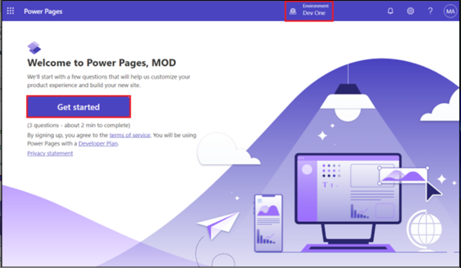

3.  **Tell us about yourself window** 창에서 **Skip**를 선택합니다.

4.  Now, you will be navigated to home page of the Power Pages portal.
    Enter a description of the site you want to build or select a
    suggested description of the site. And then, press the Enter key or
    select the paper airplane icon in the lower-right corner of the text
    box. 이제 Power Pages 포털 홈페이지로 이동합니다. 구축하려는
    사이트에 대한 설명을 입력하거나 제안된 설명을 선택하세요. 그런 다음
    Enter 키를 누르거나 텍스트 상자 오른쪽 하단에 있는 paper
    airplane아이콘을 선택합니다.

설명 예시:

- [**Build a website for public transportation for residents of city, to
  view routes and fares.**](urn:gd:lg:a:send-vm-keys)

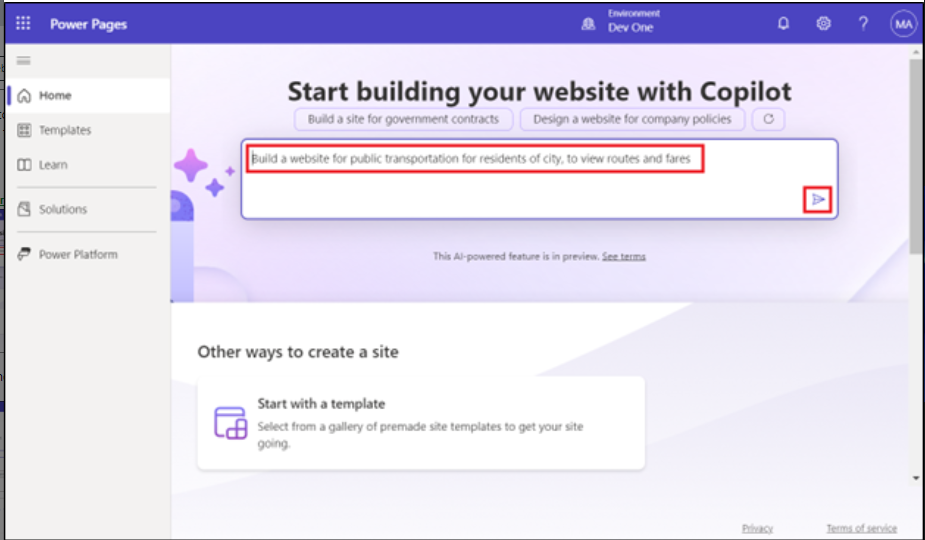

5.  Copilot은 입력한 설명을 기반으로 사이트 이름과 웹 주소를 생성합니다.
    제안된 이름과 웹 주소를 그대로 두고 **Next**를 선택합니다.

> 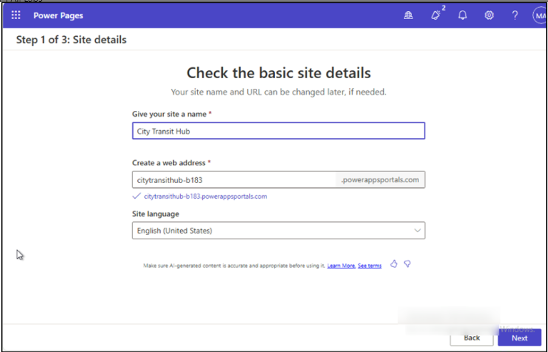

6.  Choose a layout page에서 **Next**를 선택합니다. add common pages
    페이지에서 모든 웹 페이지를 선택한 후 **Done**를 클릭합니다.
    Introducing Copilot in power pages에서 **Next**를 클릭하고
    마지막으로 **Done**를 선택합니다.

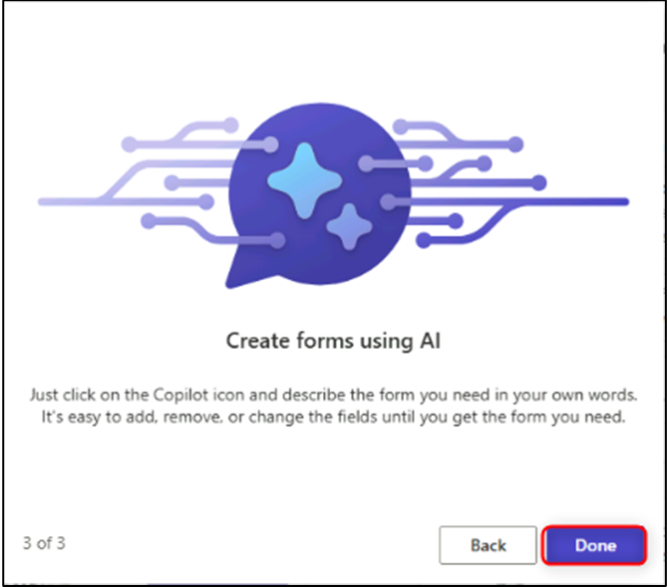

7.  Click on Enable copilot and on the next page of Add copilot to site
    page toggle on the Enable copilot on site Enable copilot를 클릭하고
    사이트에 copilot 추가 페이지의 다음 페이지에서 사이트에서 copilot
    활성화를 토글합니다. 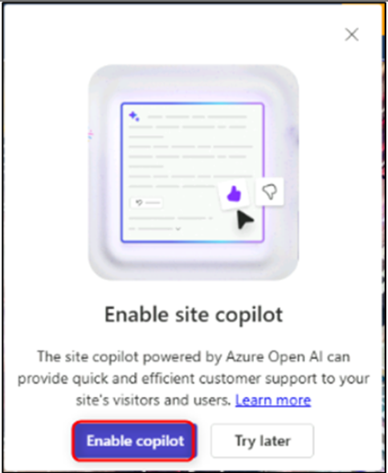

### 연습 2: Copilot을 사용하여 AI 생성 웹페이지 만들기(미리 보기)

### 작업 1: 웹페이지 생성

Copilot을 사용하여 웹페이지를 생성하려면:

1.  왼쪽 탐색 창에서 **Pages** 작업 영역을 선택하면 새로 만든 웹사이트의
    홈페이지가 표시됩니다.

2.  처음에는 **Pages**  작업 영역이 표시됩니다.

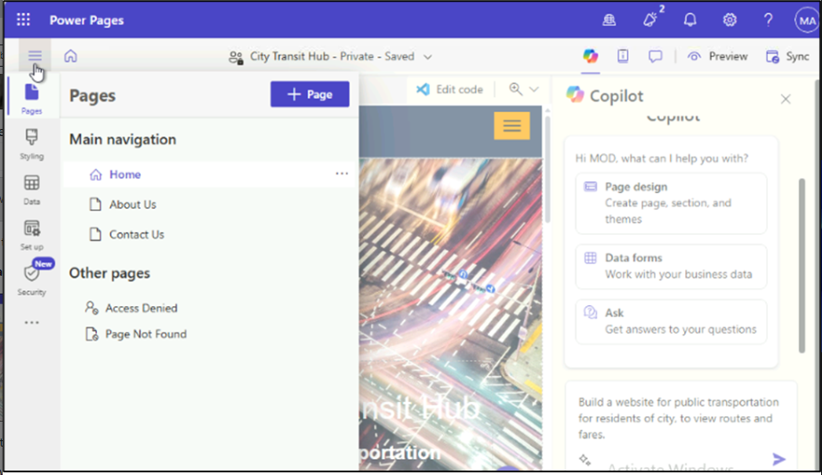

3.  Copilot 패널이 열려 있지 않으면 명령 모음에서 Copilot 버튼을
    선택합니다.

•시작 프롬프트 선택하고 작업 요청 또는 질문 텍스트 필드에 웹페이지에
대한 설명을 입력합니다.

예시 설명:

- [**Create a Thank you for visiting our site
webpage**](urn:gd:lg:a:send-vm-keys)

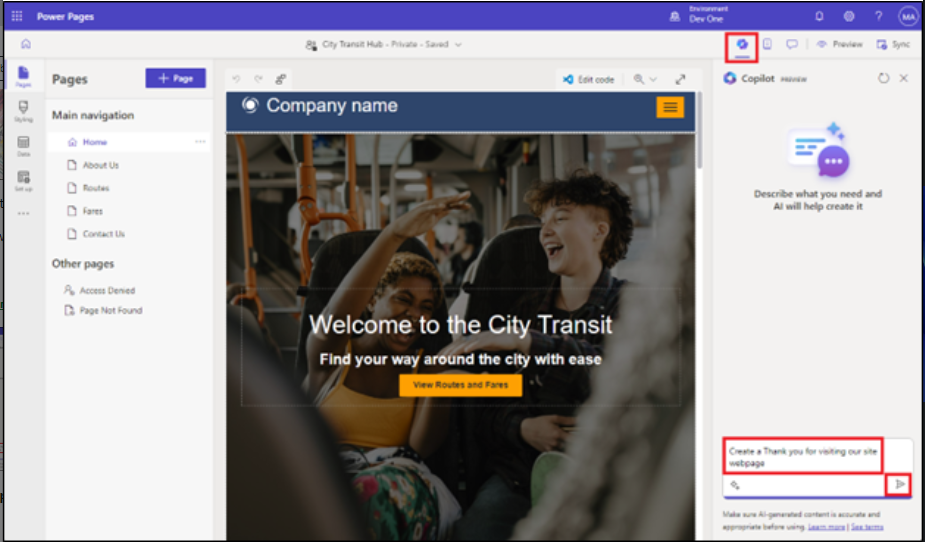

페이지 검토를 완료하려면 **Keep it**를 선택합니다.

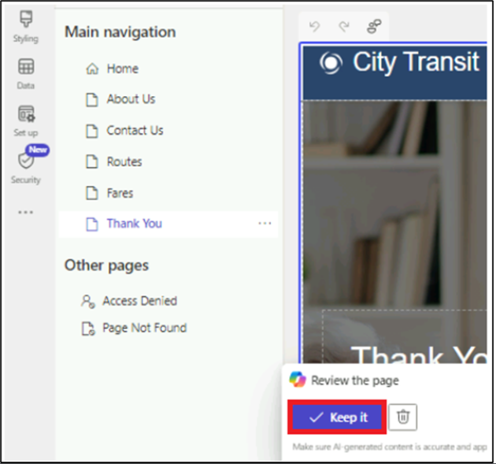

페이지가 생성되면 메인 내비게이션에 추가되어 페이지와 콘텐츠를 검토할 수
있습니다. 페이지의 섹션, 텍스트, 이미지는 WYSIWYG 편집기를 사용하여
로우코드로 편집할 수 있습니다.

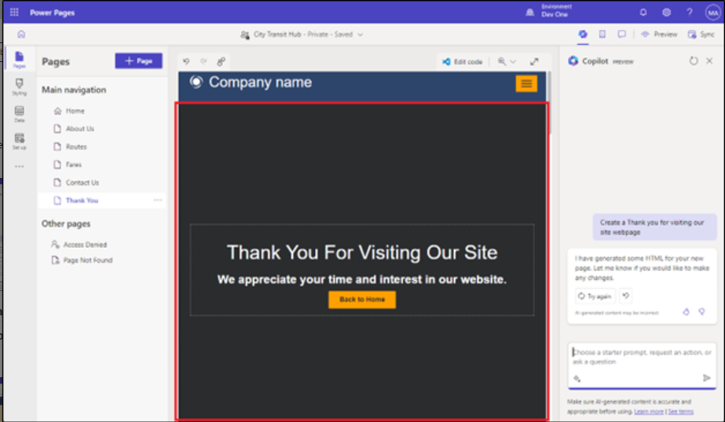

## 연습 3: Copilot을 사용하여 AI 생성 양식 추가(미리 보기)

### 작업 1: Copilot을 사용하여 양식 만들기

1.  **Pages workspace** 로 이동하여 양식의 **Routes** 페이지를
    선택합니다.

2.  Routes 웹 페이지의 첫 번째 섹션 위에 마우스를 올려놓고 **+ Add a
    section** \> **1Column**을 클릭합니다.

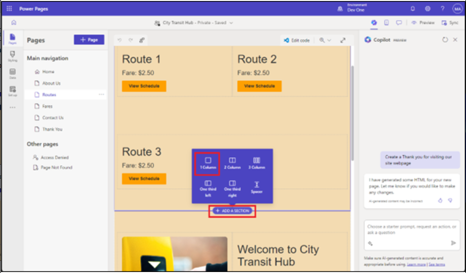

3.  **More**를 선택한 다음 **Form** 구성 요소를 선택합니다.

4.  In the text box under Describe a form to create it, describe your
    form. You can use up to 250 characters in your description. To send
    your description to Copilot, press the Enter key or select the paper
    airplane icon in the lower-right corner of the text box. 4. Describe
    a form to create it 아래의 텍스트 상자에 양식을 설명하세요. 설명에는
    최대 250자까지 입력할 수 있습니다. Copilot에 설명을 보내려면 Enter
    키를 누르거나 텍스트 상자 오른쪽 하단에 있는 종이 비행기 아이콘을
    선택합니다.

**예**: [**Create a form for collecting suggestions and
addition/deletion of the routes**](urn:gd:lg:a:send-vm-keys)

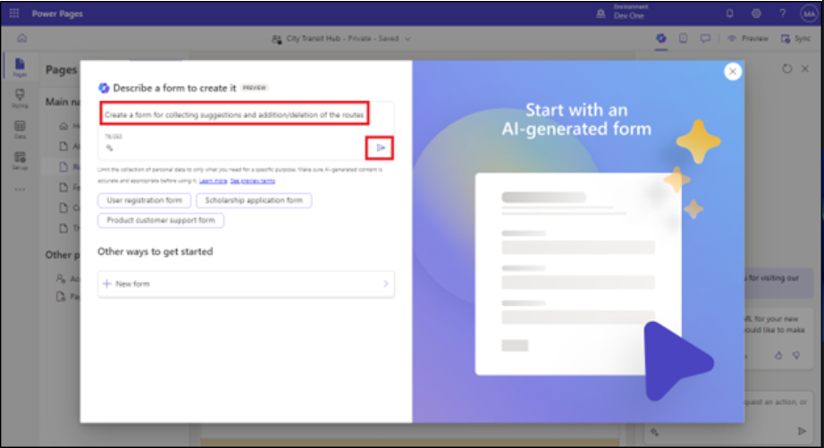

**참고**: 설명 오른쪽의 미리보기를 확인하고 필요에 따라 양식을 수정할 수
있습니다.

- To change the form, select a quick action or refine your description.
  양식을 변경하려면 quick action 또는 refine your description
  선택합니다.

- 기록에는 지금까지 입력한 설명이 표시됩니다.

- **Start over** 을 선택하면 모든 내용을 지우고 새 설명으로 시작할 수
  있습니다.

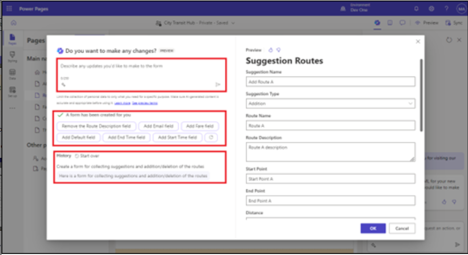

5.  페이지에 양식을 추가하려면 **Ok**를 선택합니다.

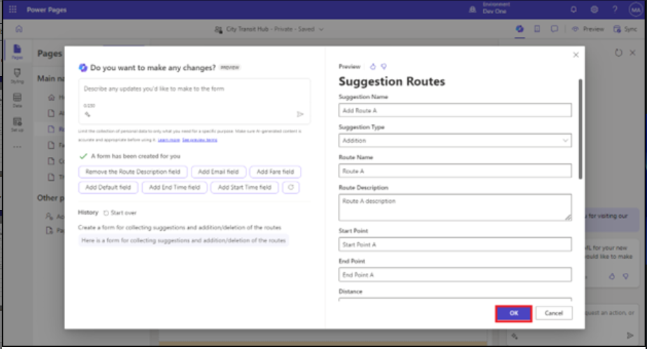

### 작업 2: Copilot을 사용하여 AI 생성 다단계 양식 추가(미리 보기)

Copilot을 사용하여 다단계 양식을 생성하려면:

1.  **Pages workspace** 로 이동하여 양식에 대한 **Thank you** 페이지를
    선택합니다.

2.  Thank you 페이지 하단으로 이동하여 Add 섹션을 클릭하고 1개의 열을
    선택합니다.

> 

3.  Component섹션에서 (…)를 클릭한 다음 Form를 선택합니다.

> 
>
> 양식이 생성되면 캔버스에 양식 미리보기가 표시되고, 캔버스 하단에
> **Review this form** 도구 모음이 표시됩니다.
>
> 각 단계를 검토한 후 양식을 유지할지 또는 삭제할지 결정합니다. 페이지에
> 양식을 추가하기로 선택한 경우, 다른 구성 요소와 마찬가지로 Design
> Studio의 기존 기능을 사용하여 양식을 편집할 수 있습니다.

4.  양식을 선택한 후, Describe 섹션에 아래 프롬프트를 입력하고 send를
    클릭합니다.

> [**create a multistep form for getting information of a specific route
> and the fare.**](urn:gd:lg:a:send-vm-keys)
>
> 

5.  OK 버튼을 클릭하여 페이지에 양식을 추가합니다.

> 

### 작업 3: Copilot으로 텍스트 생성하기

1.  **Pages workspace** 로 이동하여 양식의 **About Us**페이지를
    선택합니다.

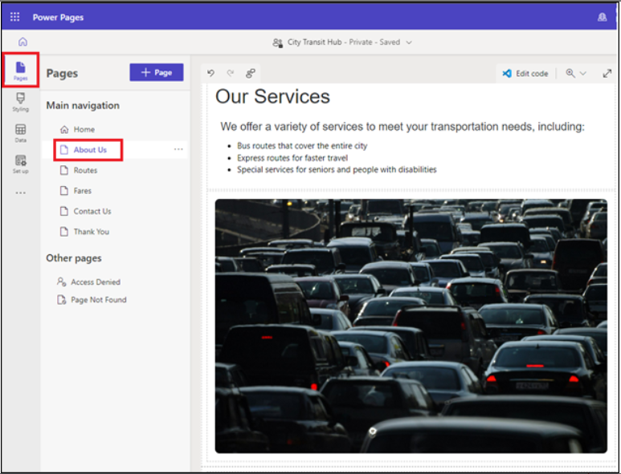

2.  페이지 위에 마우스를 올려놓고 **+Add a
    section** \> **1Column** 서비스 섹션 선택합니다.

3.  **Text** 구성 요소를 선택합니다.

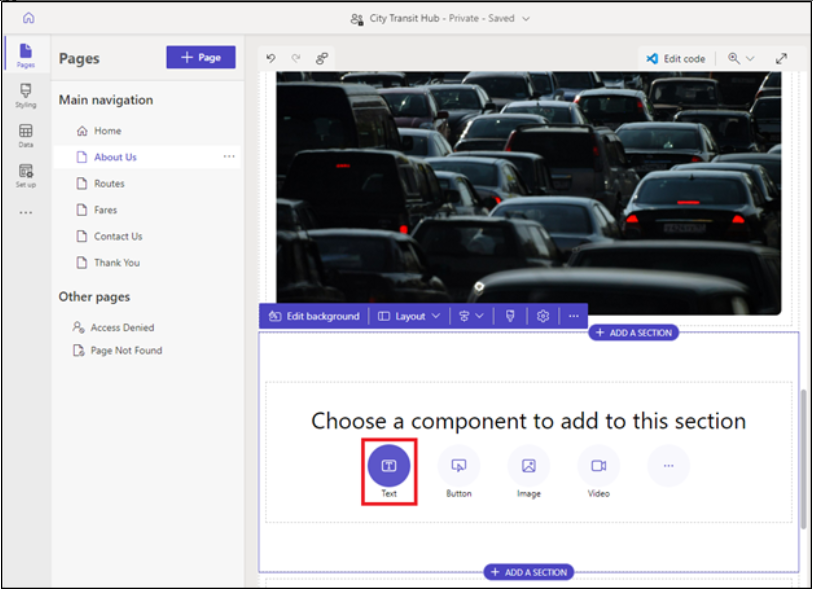

4.  텍스트 구성 요소 도구 모음에서 **Copilot** 아이콘을 선택합니다.

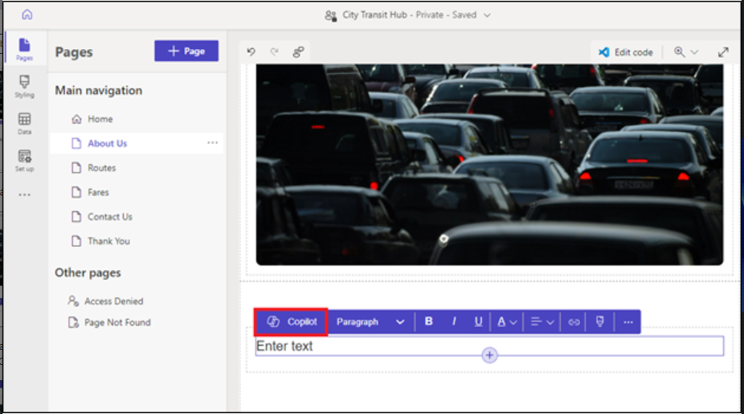

5.  Copilot에서 생성할 텍스트를 설명합니다. 예: " [**I want to describe
    importance of local transport**](urn:gd:lg:a:send-vm-keys)" 설명에는
    최대 1,500자까지 사용할 수 있습니다. Copilot에 설명을 보내려면
    **Enter** 키를 누르거나 텍스트 상자 오른쪽 하단에 있는 paper
    airplane 아이콘을 선택합니다.

6.  설명 아래의 **preview**를 확인하고 필요에 따라 텍스트를 수정합니다.

    - 설명을 다듬고 새 텍스트를 생성하려면 **Rewrite**를 선택합니다.

    - 생성된 텍스트를 유지하되 더 친근하고, 캐주얼하고, 교육적이고,
      전문적이고, 흥미진진하게 들리도록 하려면 **Change the tone**을
      선택합니다.

    - 생성된 텍스트를 유지하되 더 간결하게 만들거나 더 자세히 쓰려면
      **Adjust the length**를 선택합니다.

    - Copilot에 더 많은 정보를 제공하려면 Copilot에서 사용할 수 있도록
      **Add more details for Copilot to work with**를 선택합니다.

    - Copilot이 설명이나 개선 사항을 얼마나 잘 해석했는지에 대한
      피드백을 Microsoft에 제공하려면 thumbs-up 또는 thumbs-down아이콘을
      선택합니다.

7.  페이지에 텍스트를 추가하려면 **Add to page** 를 선택합니다.

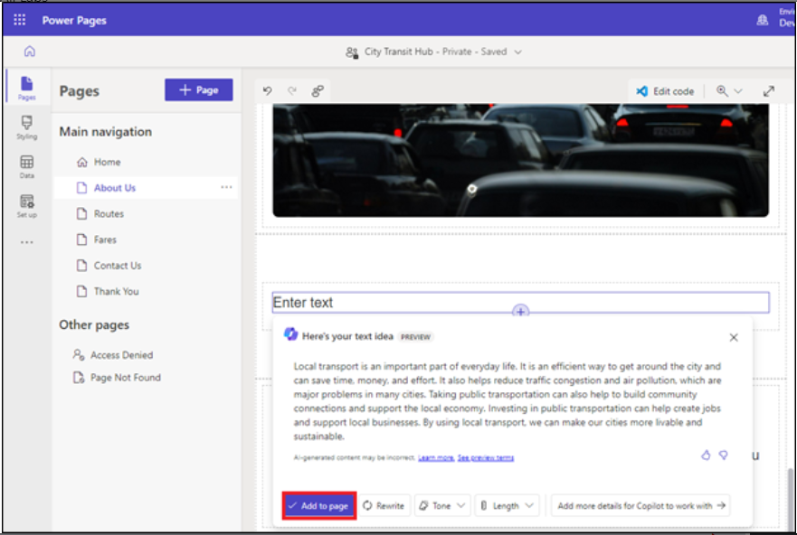

### 작업 4: 사이트 테스트

1.  **Preview**를 선택한 후 **Desktop**을 선택합니다. 요청이 있으면
    관리자 계정으로 로그인하고 **checkbox of the consent** 을 선택한 후
    **Accept**을 선택합니다.

2.  홈페이지와 다른 웹페이지 목록을 볼 수 있습니다.

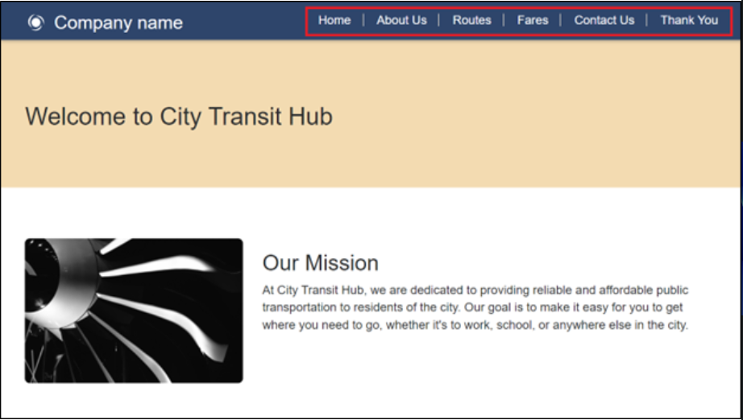

3.  Router페이지를 선택하세요. AI가 생성한 양식을 확인할 수 있습니다.

4.  양식의 몇 가지 필드를 작성한 후 양식 끝에 있는 **Submit** 버튼을
    선택합니다.

5.  **checkbox of the consent** 에 체크하고 **Accept**를 선택합니다.

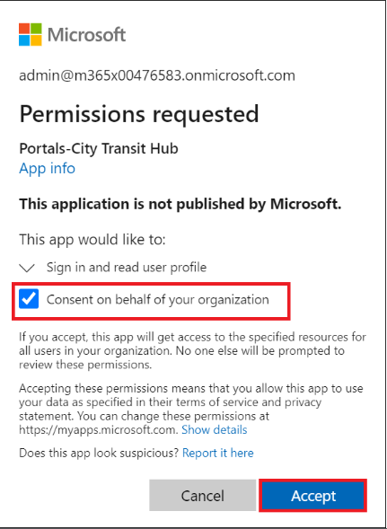

6.  양식을 성공적으로 제출한 후 디자인 스튜디오로 돌아가세요.

**참고**: 제출 완료 메시지가 나타나지 않으면 한 번 더 시도해 보세요.

7.  **Data**를 선택한 다음 **Copilot Suggestion Routes** 테이블을
    선택합니다(테이블 이름은 다를 수 있음). 그리고 다단계 양식
    프로세스를 사용하여 레코드가 생성되었는지 확인합니다.

