# Lab 5: Erstellen einer AI-generierten Website oder Webseite mit Copilot (Vorschau) und Hinzufügen anderer Komponenten zu Seiten

**Hinweis:** Wenn Sie eine Power Pages-Website mit Copilot erstellen,
ist es wichtig zu beachten, dass Copilot bei jeder Erstellung der
Website eine andere Vorlage oder ein anderes Layout generieren kann. Das
Ergebnis:

\- Das genaue Layout und Design der generierten Website kann von Fall zu
Fall variieren.

\- Wenn Sie die Erstellungsschritte in Leitfäden oder Tutorials
befolgen, sollten Sie diese als Referenz verwenden, anstatt identische
Ergebnisse zu erwarten.

\- Die bereitgestellten Screenshots können aufgrund der dynamischen
Generierungsfunktionen von Copilot von denen abweichen, die Sie in Ihrer
Instanz sehen.

**Tipp**: Konzentrieren Sie sich darauf, den Gesamtprozess und die
Konzepte zu verstehen, anstatt das genaue Design zu replizieren, da die
Kernfunktionen und -schritte konsistent bleiben.

## Übung 1: Erstellen einer Website mit Hilfe von AI

So verwenden Sie Copilot für die Websiteerstellung:

1.  Wechseln Sie zu Power Pages mit
    [**https://make.powerpages.microsoft.com/**](https://make.powerpages.microsoft.com/)

2.  Stellen Sie sicher, dass Sie sich in der Entwicklerumgebung - **Dev
    One** befinden, und klicken Sie dann auf **Get started**.

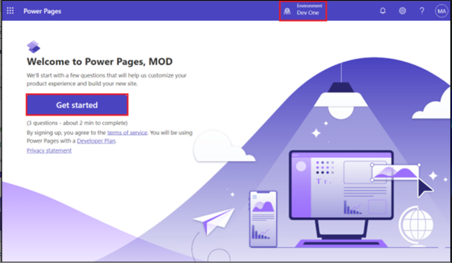

3.  Wählen Sie **Skip** unter **Tell us about yourself window** aus.

4.  Nun werden Sie zur Startseite des Power Pages-Portals navigiert.
    Geben Sie eine Beschreibung der Website ein, die Sie erstellen
    möchten, oder wählen Sie eine vorgeschlagene Beschreibung der
    Website aus. Drücken Sie dann die Eingabetaste, oder wählen Sie das
    Papierflugzeugsymbol in der unteren rechten Ecke des Textfelds aus.

Beispiel für eine Beschreibung:

- [**Build a website for public transportation for residents of city, to
  view routes and fares.**](urn:gd:lg:a:send-vm-keys)

5.  Copilot generiert einen Site-Namen und eine Webadresse basierend auf
    Ihrer Beschreibung. Behalten Sie den vorgeschlagenen Namen und die
    Webadresse bei und wählen Sie **Next**.

> 

6.  Auf ‘Choose a layout page’, wählen Sie **Next** aus. Dann, ‘add
    common pages’, wählen Sie All Webpages aus und klicken Sie dann auf
    Done. Klicken Sie auf den Seiten Einführung von Copilot in der
    Stromversorgung auf **Next** und wählen Sie schließlich **Done**.

7.  Klicken Sie auf Enable Copilot und schalten Sie auf der nächsten
    Seite der Seite Add Copilot to site auf die Option Enable Copilot on
    Site um.

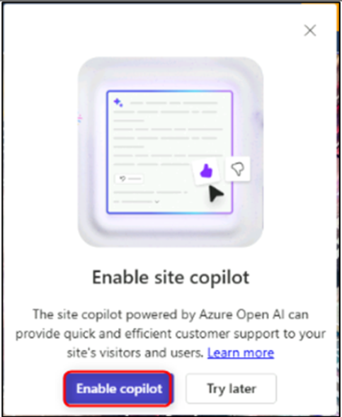

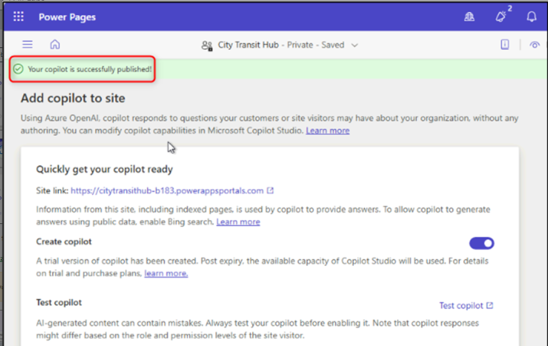

### Übung 2: Erstellen einer AI-generierten Webseite mit Copilot (**Vorschau**)

### Aufgabe 1: Generieren einer Webseite

So verwenden Sie Copilot zum Generieren einer Webseite:

1.  Wählen Sie im linken Navigationsbereich Workspaces **Pages** aus,
    und Sie befinden sich auf der Startseite Ihrer neu erstellten
    Website.

2.  Zunächst befinden Sie sich im Workspace **Pages**.

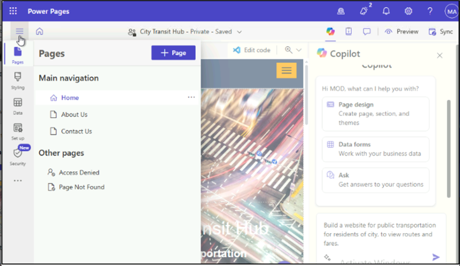

3.  Wählen Sie die Schaltfläche Copilot in der Befehlsleiste aus, wenn
    die Copilot-Gruppe noch nicht geöffnet ist.

• Geben Sie eine Beschreibung Ihrer Webseite in das Textfeld
"Startaufforderung auswählen", "Aktion anfordern" oder "Frage stellen"
ein.

Sample descriptions:

- [**Create a Thank you for visiting our site
webpage**](urn:gd:lg:a:send-vm-keys)

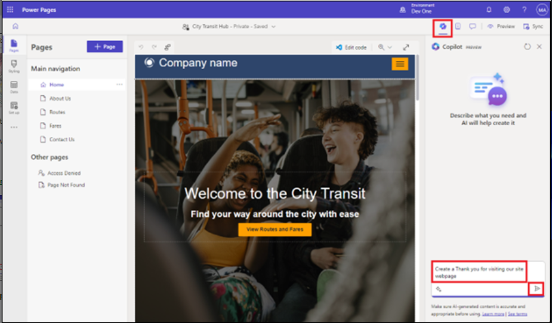

Um die Seitenüberprüfung abzuschließen, wählen Sie **Keep it**.

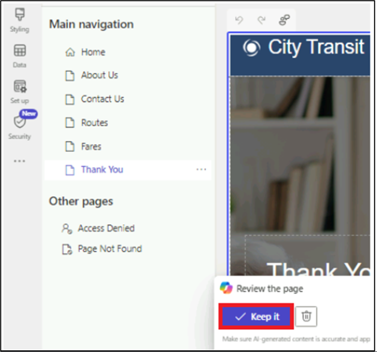

Nachdem die Seite generiert wurde, wird sie der Hauptnavigation
hinzugefügt, und Sie können die Seite und den Inhalt überprüfen.
Abschnitte, Text und Bilder auf der Seite können mit dem WYSIWYG-Editor
mit Low-Code bearbeitet werden.

## Übung 3: Hinzufügen eines AI-generierten Formulars mit Copilot (Vorschau)

### Aufgabe 1: Erstellen eines Formulars mit Copilot

1.  Gehen Sie zu **Pages workspace** und wählen Sie die Seite **Routes**
    für Ihr Formular.

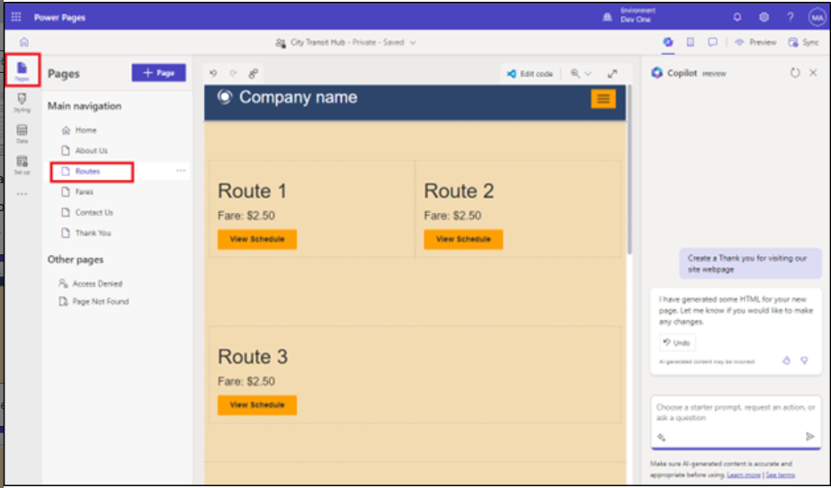

2.  Bewegen Sie den Mauszeiger über den ersten Abschnitt der
    Routen-Webseite und klicken Sie dann auf**+ Add a
    section** \> **1Column**.

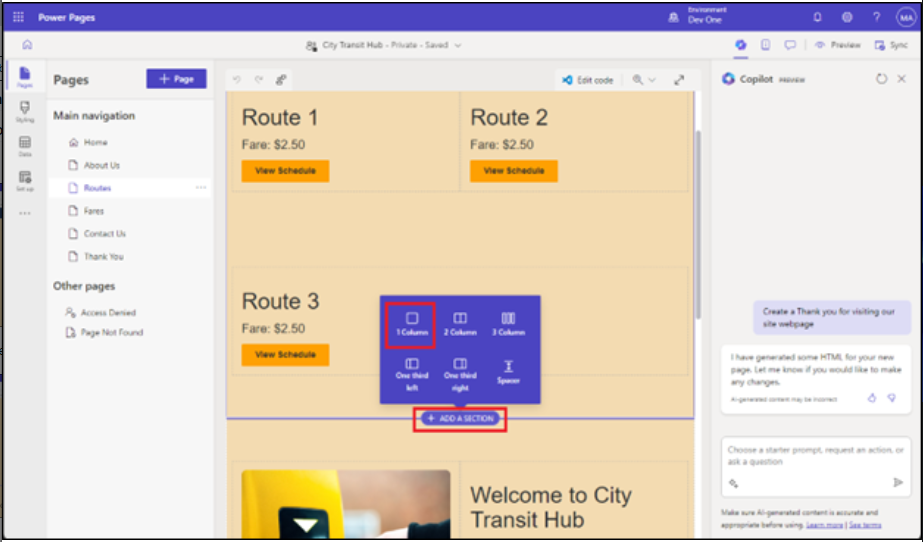

3.  Wählen Sie **More** und dann **Form** aus.

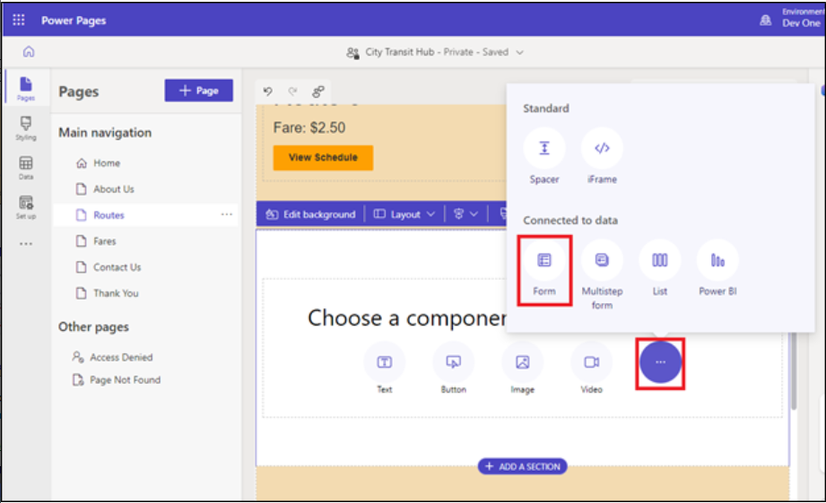

4.  Beschreiben Sie im Textfeld unter Beschreiben eines Formulars, um es
    zu erstellen das Formular. Sie können bis zu 250 Zeichen in Ihrer
    Beschreibung verwenden. Um Ihre Beschreibung an Copilot zu senden,
    drücken Sie die Eingabetaste oder wählen Sie das
    Papierflugzeugsymbol in der unteren rechten Ecke des Textfelds aus.

**Beispiel**: [**Create a form for collecting suggestions and
addition/deletion of the routes**](urn:gd:lg:a:send-vm-keys)

**Hinweis:** Sie können die Vorschau rechts neben Ihrer Beschreibung
überprüfen und das Formular nach Bedarf verfeinern.

- Ändern Sie das Formular, wählen Sie eine Schnellaktion aus oder
  verfeinern Sie Ihre Beschreibung.

- In der Historie siehst du die Beschreibungen, die du bisher eingegeben
  hast.

- Wählen Sie **Start over** aus, um alles zu löschen und mit einer neuen
  Beschreibung zu beginnen.

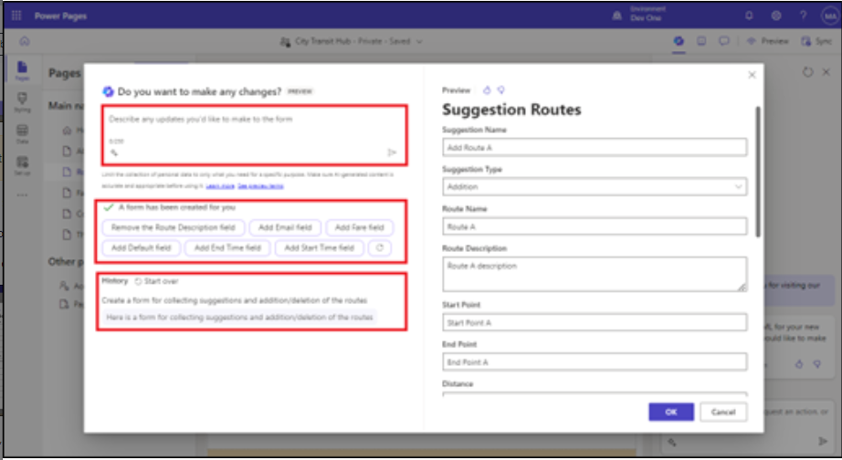

5.  Um das Formular zur Seite hinzuzufügen, wählen Sie **OK**.

### TFrage 2: Hinzufügen eines AI-generierten mehrstufigen Formulars mit Copilot (Vorschau)

So verwenden Sie Copilot zum Generieren eines mehrstufigen Formulars:

1.  Gehen Sie zum **Pages workspace** und wählen Sie eine Thank you
    Seite für Ihr Formular aus.

2.  Gehen Sie zum Ende der Thank you Seite, klicken Sie auf den
    Abschnitt Hinzufügen und wählen Sie 1 Spalte aus.

> 

3.  Wählen Sie den Abschnitt Komponente aus. Klicken Sie auf das (...)
    und wählen Sie dann Form aus.

> 
>
> Nachdem das Formular generiert wurde, wird eine Vorschau des Formulars
> auf der Arbeitsfläche angezeigt, und die Symbolleiste **Review this
> form** wird am unteren Rand der Arbeitsfläche angezeigt.
>
> Überprüfen Sie jeden Schritt. Entscheiden Sie dann, ob Sie das
> Formular behalten oder verwerfen möchten. Wenn Sie sich dafür
> entscheiden, das Formular zur Seite hinzuzufügen, können Sie es mit
> den vorhandenen Funktionen von Design Studio bearbeiten, genau wie bei
> anderen Komponenten.

4.  Nachdem Sie das Formular ausgewählt haben, geben Sie die unten
    angegebene Eingabeaufforderung im Abschnitt Beschreiben ein und
    klicken Sie dann auf Send.

> [**create a multistep form for getting information of a specific route
> and the fare.**](urn:gd:lg:a:send-vm-keys)
>
> 

5.  Klicken Sie auf die Schaltfläche OK, um das Formular auf der Seite
    hinzuzufügen.

> 

### Aufgabe 3: Generieren von Text mit Copilot

1.  Gehen Sie zum **Pages workspace** und wählen Sie die Seite **About
    us** für Ihr Formular aus.

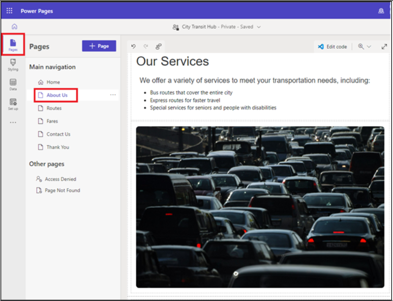

2.  Bewegen Sie den Mauszeiger über die Seite und wählen Sie +**Add a
    section** \> **1Column** unter Our Services section.

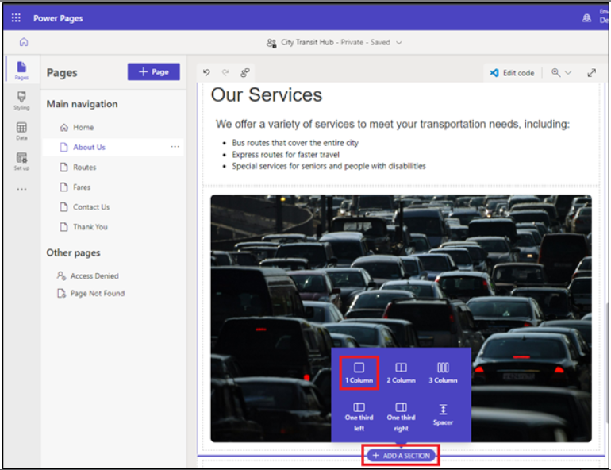

3.  Wählen Sie die Textkomponente aus.

4.  Wählen Sie in der Symbolleiste der Textkomponente das
    **Copilot-Symbol** aus.

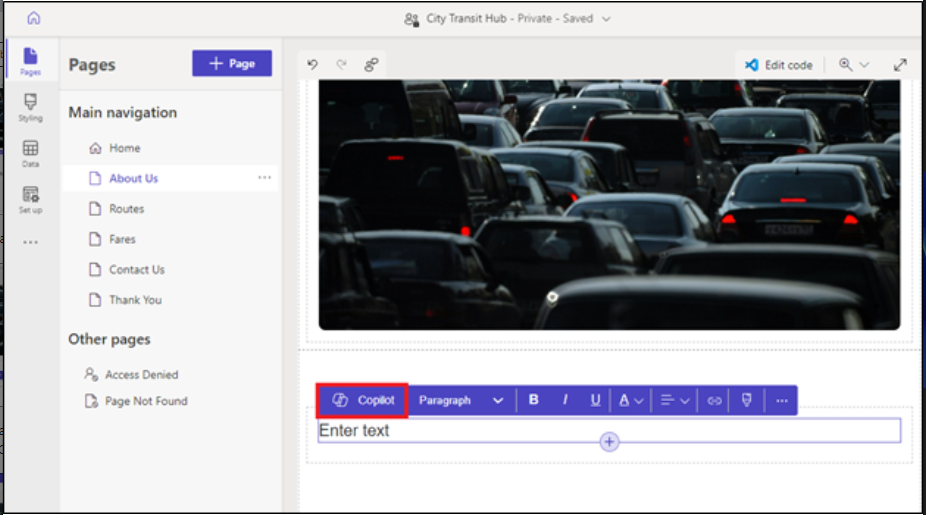

5.  Beschreiben Sie den Text, den Copilot generieren soll. Zum Beispiel,
    " [**I want to describe importance of local
    transport**](urn:gd:lg:a:send-vm-keys)". Sie können bis zu 1.500
    Zeichen in Ihrer Beschreibung verwenden. Um Ihre Beschreibung an
    Copilot zu senden, drücken Sie die Eingabetaste oder wählen Sie das
    Papierflugzeugsymbol in der unteren rechten Ecke des Textfelds aus.

6.  Überprüfen Sie die **Preview** unter Ihrer Beschreibung und
    verfeinern Sie den Text nach Bedarf.

    - Um Ihre Beschreibung zu verfeinern und neuen Text zu generieren,
      wählen Sie **Rewrite**.

    - Um den generierten Text beizubehalten, ihn aber freundlicher,
      lockerer, lehrreicher, professioneller oder aufgeregter klingen zu
      lassen, wählen Sie **Change the tone**.

    - Um den generierten Text beizubehalten, ihn aber prägnanter zu
      gestalten oder zu erweitern, wählen Sie **Adjust the length**.

    - Um Copilot weitere Informationen zu geben, wählen Sie **Add more
      details for Copilot to work with**.

    - Wenn Sie Microsoft Feedback dazu geben möchten, wie gut Copilot
      Ihre Beschreibung oder Verfeinerung interpretiert hat, wählen Sie
      das Symbol "Daumen hoch" oder "Daumen runter" aus.

7.  Um den Text zur Seite hinzuzufügen, wählen Sie **Add to page**.

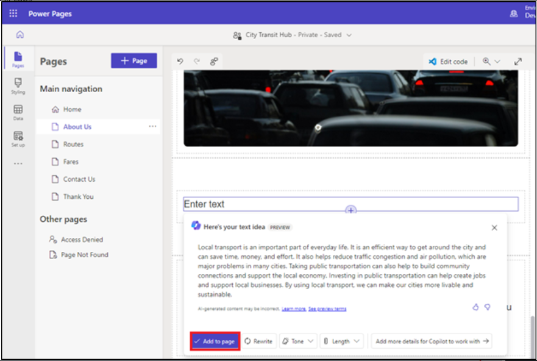

### Aufgabe 4: Testen der Website

1.  Wählen Sie **Preview**, gefolgt bei **Desktop**. Wenn Sie dazu
    aufgefordert werden, melden Sie sich mit den
    Administratoranmeldeinformationen an, aktivieren Sie das
    **Kontrollkästchen der Einwilligung** und wählen Sie **Accept** aus.

2.  Sie können die Startseite und die Liste der anderen Webseiten sehen.

3.  Wählen Sie die Seite Router aus. Sie können das von der AI
    generierte Formular.

4.  Füllen Sie die wenigen Felder des Formulars aus und wählen Sie dann
    am Ende des Formulars die Schaltfläche **Submit** aus.

5.  Aktivieren Sie das **Kontrollkästchen der Einwilligung** und wählen
    Sie **Accept**.

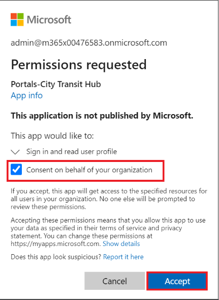

6.  Nachdem Sie das Formular erfolgreich abgeschickt haben, kehren Sie
    zum Designstudio zurück.

**Hinweis**: Versuchen Sie es noch einmal, wenn Sie keine Nachricht über
die erfolgreiche Übermittlung erhalten.

7.  Wählen Sie **Data** aus, wählen Sie dann die Tabelle **Copilot
    Suggestion Routes** aus (der Tabellenname kann abweichen) und
    vergewissern Sie sich, dass Sie sehen können, dass die Datensätze
    mit dem mehrstufigen Formularprozess erstellt wurden.

