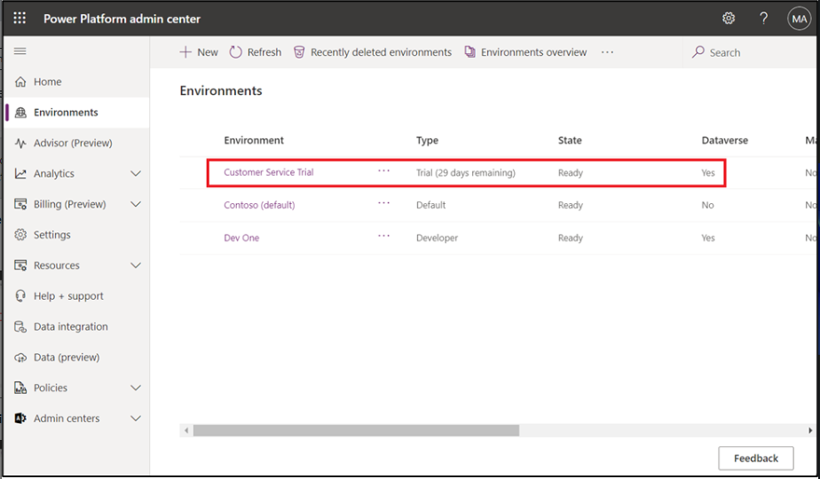
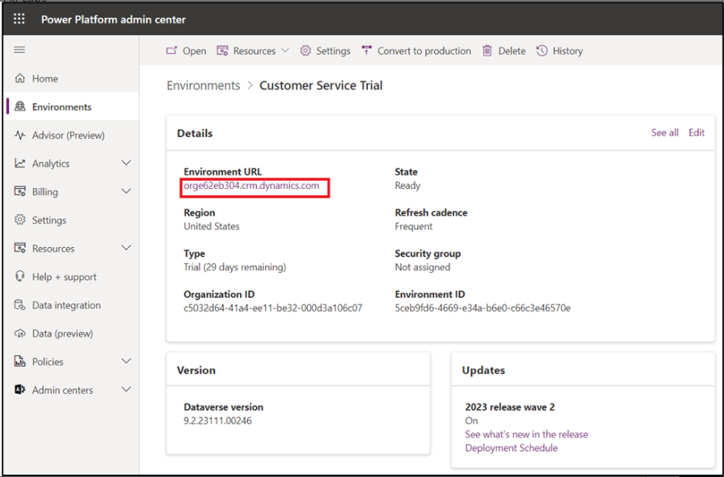

# 實驗 6：使用 Dynamics 365 Customer Service 中的 Copilot 更快地解決客戶問題

## 練習 1：匯總個案

Copilot
案例摘要可幫助您快速瞭解案例的上下文並更有效地解決客戶問題。案例摘要包括關鍵信息，例如案例標題、客戶、主題、產品、優先級、案例類型和描述。

1.  要導航到您的 **Customer Service 工作區**，請使用給定的鏈接
    [**https://admin.powerplatform.microsoft.com**](https://admin.powerplatform.microsoft.com)
    轉到 **Power Platform 管理中心**。

2.  選擇 **Environments** 選項卡，然後選擇 **Customer Service Trial**
    環境。

3.  在 **Customer Service Trial environment** 頁面上，單擊 **Environment
    URL**。

4.  您將導航到 **Customer Service workspace**。如果您導航到
    已發佈的應用頁面，請選擇 **Customer Service workspace**。

注意：如果 URL 未將您帶到 Customer Service 工作區，請單擊 Dynamics 365
旁邊的選項卡來切換頁面。注意：如果 URL 未將您帶到 Customer Service
工作區，請單擊 Dynamics 365 旁邊的選項卡來切換頁面。

5.  選擇 **Customer Service Agent Dashboard** （客戶服務代理控制面板）。

6.  選擇 **Customer Service Agent Dashboard** 上列出的案例之一。

7.  **Case summary**
    要在案例表單上顯示為卡片。當您打開案例時，**Summary** （摘要）
    卡默認處於折疊狀態。

8.  展開 **Summary** （摘要） 選項卡。

9.  您可以查看生成的案例摘要。

## 練習 2：草稿題

1.  從 **Customer Service Agent Dashboard**
    中，選擇其中一個示例案例，例如 **A Mineral Building Up in Water
    Supply**。

您可以提出自由格式的問題，就像您詢問可能知道答案的同事或主管一樣。

2.  在屏幕右側打開的 **Copilot** 窗格中，鍵入 [**What is mineral built
    up in water supply?**](urn:gd:lg:a:send-vm-keys) 並選擇 **Send**
    圖標。

> **注意：**Copilot
> 設置過程可能需要一些時間才能完成。要優化您的實驗會話，請保存您的進度並繼續進行下一個實驗活動。Copilot
> 設置完成後，您可以返回此實驗室，從上次中斷的地方繼續。

3.  您現在可以看到 **Copilot** 已回答您的問題。

4.  您可以提出更多問題，例如，該怎麼做........或者如何解決 Smart Brew
    System 中的堵塞問題或 [**What to do if water doesn't come
    consistently in smart brew
    system?**](urn:gd:lg:a:send-vm-keys)，然後單擊 **Send**
    圖標。**Copilot** 將回答您的問題。

5.  使用 **Copilot**，您可以執行以下作：

    - **直接提問：** Copilot 顯示您的組織提供的知識源中最相關的答案。

    - **逐次提問後續問題：** 如果 Copilot
      的回答沒有立即有用，您可以提出後續問題，並以自然的對話方式指導
      Copilot。

    - **要求 Copilot 嘗試更好的響應：** Copilot
      還可以根據更多指導重新表述響應。

例如，**鍵入**， [**Can you summarize your
response?**](urn:gd:lg:a:send-vm-keys) 或 [**Can you attempt a response
providing details for each of the steps you
mentioned?**](urn:gd:lg:a:send-vm-keys)

6.  如果您對 Copilot
    提供的響應感到滿意，您可以使用整個響應或部分響應來回答客戶的問題：

    - 將 Copilot
      的部分回復複製到您的聊天中，或在語音對話期間從中閱讀。選擇
      **Copy** 圖標，將整個響應複製到剪貼板。

**注意：** 當您在活動的數字消息傳遞對話中時，選擇 **Send to customer**
（發送給客戶）
以打開一個編輯窗口，您可以在其中修改響應並將其發送給客戶。您還可以更改客戶關鍵字，以提示
Copilot 生成更準確的響應。

7.  選擇 “**Check sources**” 以查看 Copilot
    從中提取響應的知識庫或網站鏈接。您可以將此補充信息用作資源或與客戶共享。

8.  單擊鏈接，然後您可以在左側看到內容。

9.  關閉新打開的選項卡。在本例中為 “Troubleshooting Brewing Issues” 。

10. 要對 Copilot
    回答的有用性進行評級，請選擇豎起大拇指或豎起大拇指圖標。

11. 客戶對話結束後，或者如果您希望 Copilot 忽略到目前為止的對話，請選擇
    **Copilot** 窗格頂部的 **Clear chat**。

## 練習 3：草稿電子郵件

1.  在 **Copilot** 窗格中選擇 **Write an email** （編寫電子郵件）
    選項卡。

2.  在案例概述頁面上，選擇 **Related** 選項卡，然後選擇 **Activities**。

3.  選擇 **+New Activity \> Email**。

4.  當您開始起草電子郵件時，Copilot
    將在右側面板中打開，並顯示五個預定義提示和一個自定義提示：

    - **建議通話：**起草建議今天或明天與客戶通話的回復。

    - **Request more
      information（請求更多信息）：**起草回復，請求客戶提供更多詳細信息以幫助解決問題。

    - **同理心反饋：** 起草回復，對提出投訴的客戶提供同理心回應。

    - **提供產品/服務詳細信息：**
      起草回復，提供詳細信息或回答客戶有關特定產品或服務的問題。

    - **解決客戶的問題：**
      起草回復，提供客戶問題的解決方案---和解決步驟---如果適用。

    - **自定義：**允許您提供自己的回復提示。

5.  從預定義的提示列表中選擇 **Resolve the customer's problem**。

6.  您可以看到，Copilot 已生成建議。

7.  您現在可以查看響應。進行任何必要的更改，然後選擇 **Copy to email**
    （複製到電子郵件）
    以將整個響應複製到草稿中。或者選擇響應的一部分，然後使用右鍵單擊菜單複製並粘貼所選內容。

8.  響應現在位於左側的正文部分。

9.  現在，您可以發送電子郵件或保存它。

