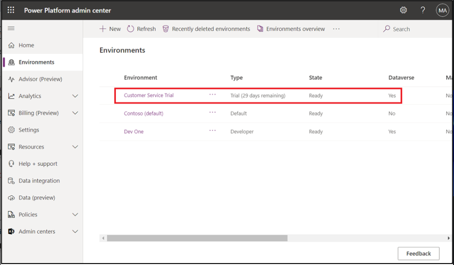
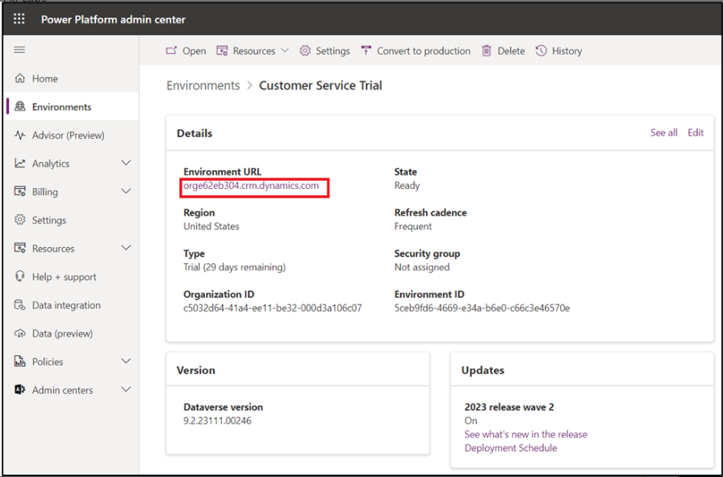

# Lab 6: Solving customer issues faster with Copilot in Dynamics 365 Customer Service

## Exercise 1: Summarize cases

Copilot case summaries help you to quickly understand the context of a
case and resolve customer issues more efficiently. The case summary
includes key information such as the case title, customer, subject,
product, priority, case type, and description.

1.  To navigate to your **Customer Service workspace**, go to
    the **Power Platform admin center** using the given
    link [**https://admin.powerplatform.microsoft.com**](urn:gd:lg:a:send-vm-keys).

2.  Select the **Environments** tab and then select **Customer Service
    Trial** environment.

3.  On the **Customer Service Trial environment** page, click on
    the **Environment URL**.

4.  You will be navigated to your **Customer Service workspace**. If you
    are navigated to Published app page, select **Customer Service
    workspace**.

Note: if the URL does not take you to the Customer Service workspace,
switch the page by clicking on the tab beside Dynamics 365.Note: if the
URL does not take you to the Customer Service workspace, switch the page
by clicking on the tab beside Dynamics 365.

5.  Select the **Customer Service Agent Dashboard**.

6.  Select one of the cases listed on the **Customer Service Agent
    Dashboard**.

7.  The **Case summary** appears as a card on the case form. When you
    open a case, the **Summary** card is collapsed by default.

8.  Expand the **Summary** tab.

9.  You can see the generated case summary.

## Exercise 2: Draft questions

1.  From the **Customer Service Agent Dashboard** select one of the
    sample cases, for example, **A Mineral Build Up in Water Supply**.

You can ask free-form questions just as you'd ask your colleague or
supervisor who might know the answers.

2.  In the **Copilot** pane, which is opened on right side of the
    screen, type [**What is mineral built up in water
    supply?**](urn:gd:lg:a:send-vm-keys) and select **Send** icon.

> **Note**: The Copilot setup process may take some time to complete. To
> optimize your lab session, save your progress and proceed to the next
> lab activity. You can return to this lab once the Copilot setup is
> complete to continue from where you left off.

3.  You can now see that **Copilot** has answered your question.

4.  You can ask more questions like, what to do........ or how to fix
    issue of clogging in smart brew system or [**What to do if water
    doesn't come consistently in smart brew
    system?**](urn:gd:lg:a:send-vm-keys) and click
    on **Send** icon. **Copilot** will give response to your question.

5.  With **Copilot**, you can take the following actions:

    - **Ask a direct question**: Copilot shows the most relevant answer
      from the knowledge sources your organization has made available.

    - **Ask follow-up turn by turn questions**: If Copilot's response
      isn't immediately useful, you can ask follow-up questions and
      guide Copilot in a natural, conversational way.

    - **Ask Copilot to attempt a better response**: Copilot can also
      rephrase responses based on more guidance.

For example **type**, [**Can you summarize your
response?**](urn:gd:lg:a:send-vm-keys) or [**Can you attempt a response
providing details for each of the steps you
mentioned?**](urn:gd:lg:a:send-vm-keys)

6.  If you're satisfied with the response Copilot provides, you can use
    the whole response or a part of it to answer the customer's
    question:

    - Copy part of Copilot's reply into your chat or read from it during
      a voice conversation. Select the **Copy** icon to copy the entire
      response to the clipboard.

**Note**: When you're in an active digital messaging conversation,
select **Send to customer** to open an editing window where you can
revise the response and send it to the customer. You can also change
customer keywords to prompt Copilot to generate a more accurate
response.

7.  Select **Check sources** to see the knowledge base or website links
    from which Copilot drew the response. You can use this supplemental
    information as a resource or share it with the customer.

8.  Click on the link and then you can see content on left side.

9.  Close the newly opened tab. Here in this case 'Troubleshooting
    Brewing Issues'.

10. To rate the usefulness of Copilot's responses, select the thumbs-up
    or thumbs-down icon.

11. After a customer conversation has ended, or if you want Copilot to
    disregard the conversation so far, select **Clear chat** at the top
    of the **Copilot** pane.

## Exercise 3: Draft emails

1.  Select **Write an email** tab on the **Copilot** pane.

2.  On the case overview page, select **Related** tab and then
    select **Activities.**

3.  Select **+New Activity \> Email**.

4.  When you start to draft an email, Copilot opens in the right side
    panel and presents five predefined prompts and one custom prompt:

    - **Suggest a call**: Drafts a reply that suggests a call with the
      customer today or tomorrow.

    - **Request more information**: Drafts a reply that requests more
      details from the customer to help resolve the problem.

    - **Empathize with feedback**: Drafts a reply that provides an
      empathetic response to a customer who expresses a complaint.

    - **Provide product/service details**: Drafts a reply that offers
      details or answers customer questions about a particular product
      or service.

    - **Resolve the customer's problem**: Drafts a reply that provides a
      resolution---and resolution steps, if applicable---to the
      customer's problem.

    - **Custom**: Allows you to provide your own prompt for the reply.

5.  Select **Resolve the customer's problem** from the predefined
    prompts list.

6.  You can see, Copilot has generated suggestion.

7.  You can now review the response. Make any necessary changes, and
    then select **Copy to email** to copy the entire response to your
    draft. Or select part of the response and use the right-click menu
    to copy and paste the selection.

8.  Response is now available in body part on left side.

9.  Now you can send the email or save it.

