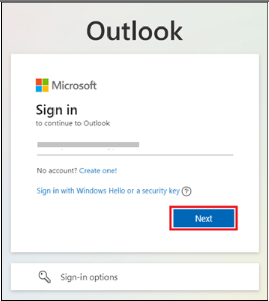
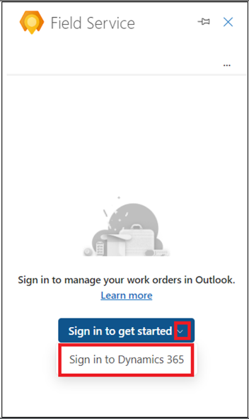
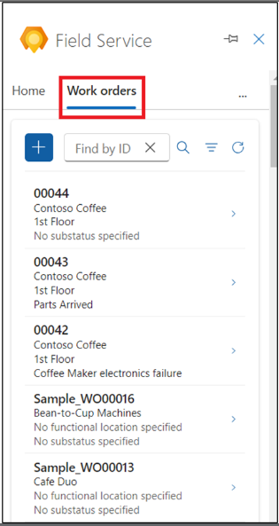

# 实验 7：在 Field Service 中使用 Copilot 在 Outlook 中创建、安排和查看工作订单

**注：** Outlook 加载项不支持在 Outlook Web 中切换到其他主题。

## 练习 1：打开 Field Service Outlook 加载项

1.  在新选项卡中，使用链接打开
    **Outlook** [**http://www.outlook.com/**](urn:gd:lg:a:send-vm-keys)。

2.  使用 **Office 365 管理员租户**凭据登录。

3.  打开任何电子邮件。在电子邮件中，选择 **Apps** 图标。如果您没有看到
    Apps 图标，请选择更多选项 （...），然后选择 Apps。

4.  选择 **Dynamics 365 Field Service for Outlook** 应用程序。

5.  选择 **Sign in to get started**。

6.  选择 **Sign-in to Dynamics 365**。

7.  选择您的 **Dynamics 365 environment**。对于此实验室，请选择 **Field
    Service Trial** 环境。

**注意：**如果您看到“此环境对 Field Service
无效”的警告，请暂时跳过此实验室，并在该功能可用于此试用环境后稍后尝试。

8.  选择 **Get started**（开始）。

## 练习 2：在 Field Service 中使用 Copilot 在 Outlook 中创建工作订单

1.  在电子邮件中，打开 **Field Service add-in**。

2.  在 **Home** 选项卡上，选择 **Create a work order from email**。

3.  在 **Create work order** 页面上，使用下表输入要求的信息，然后选择
    **Create**。

[TABLE]

> **注：** 对于工作订单上的任何字段，如果下拉列表中没有值，请选择
> **+**。Field Service
> 应用将打开，以便您可以输入新值及其详细信息。保存并关闭 Field Service
> 应用。键入新值或选择 **Refresh** 将新值添加到下拉列表中。
>
> 

4.  创建工作订单后，工作订单编号将显示在 **Field Service**
    窗格的顶部。**System Status** （系统状态） 默认为 **Unscheduled**
    （未计划）。

**提示：**如果要在 Dynamics 365 Field Service
应用中打开工作订单，请选择弹出图标。

## 练习 3：获取日程帮助

在 Outlook 中，计划辅助功能可帮助您计划、重新计划或移动工作订单的预订。

### 任务 1：在 Outlook 中安排工作订单

计划基于资源可用性、技能、客户承诺的时间窗口、客户位置接近度和业务部门。

1.  在 **Field Service Add-in** 页面上，导航到 **Work orders**
    选项卡，然后打开一个未计划的工作订单。

2.  在 **Work order** 页面上，选择 **Suggested actions** 下的
    **Schedule**。系统根据工作订单要求搜索可用的技术人员，然后显示建议。

3.  如果系统找不到建议，或者您没有找到合适的技术人员，请改用 **Go to
    schedule board**。

4.  您将导航到 **Dynamics 365 Field Service Schedule Board**。

5.  确保您处于 **Initial public view** （初始公共视图） 模式。选择 Book
    预订工作订单。

6.  为 **Requirement** 字段选择您的工作订单，然后选择 **Resource**。

7.  选择 **Start date** （开始日期）、**Start time** （开始时间） 和
    **End date** （结束日期） 和 **End time** （结束时间）。

8.  选择 **Book**（预订）。工作订单现已预订。

9.  导航到 **Outlook** 选项卡。技术人员已预订，工作订单的状态将更改为
    **Scheduled**。0

10. 选择 **View schedule** 了解工作订单计划的更多详细信息。

### 任务 2：在 Outlook 中重新安排工作订单

将计划的工作订单重新安排到其他资源、日期或时间。使用计划辅助根据资源可用性、技能、客户承诺的时间窗口、客户位置接近度和业务部门提供计划。

1.  在 **Work orders** 页面中，打开一个计划的工作订单。

2.  在 **Suggested actions** （建议的作） 下选择 **View schedule**
    （查看计划）。

3.  在计划详细信息页面上，选择 **Reschedule**（重新计划）。

4.  选择 **Go to schedule board** 重新安排工作订单。

5.  查看技术人员及其可用性。您可以按姓名搜索技术员，按日期筛选，或者按开始时间或行程时间对技术员进行排序。如果尚未在资源要求中设置
    **Estimated Duration** （估计持续时间），则默认使用 30 分钟。

6.  重新计划工作订单后，**Field Service** 窗格顶部将显示确认。

### 任务 3：在 Outlook 中移动预订

1.  在 **Field Service Add-in** 页面上，导航到 **Work orders**
    选项卡，然后打开计划的工作订单。

2.  在 **Suggested actions** （建议的作） 下选择 **View schedule**
    （查看计划）。

3.  在计划详细信息页面上，选择 **Move booking**。

4.  您可以更改当前资源。

5.  选择日期和时间，然后选择 **Update** （更新）。

6.  技术人员已预订。确认将显示在 **Field Service** 窗格的顶部。

## 练习 4：在 Outlook 中查看工作订单

1.  在电子邮件中，打开 **Field Service add-in**。

2.  在 **Work orders** 选项卡上，将显示最多 50
    个工作订单的列表。首先显示最近的工作订单。

**提示：**要在 Field Service 应用中查看更多工作订单，请选择列表底部的
**See more**。

3.  要查找特定工作订单，请在 **Find by ID** 框中输入工作订单
    ID，然后选择 Search。

4.  To filter the work orders by status or priority, select **Filter**

5.  进行选择，例如，选择状态为 **Scheduled** 的工作订单，然后选择
    **Apply**。

6.  要删除筛选条件，请选择 **Filter**（筛选），清除每个选择，然后选择
    **Apply**（应用）。

## 练习 5：在 Outlook 中编辑工作订单

1.  在电子邮件中，在 **Field Service Add-in** 页面上，导航到 **Work
    orders** 选项卡，然后打开任何工作订单。

**提示：** 如有必要，请使用 **Find by ID** 或 **Filter** 来查找工单。

2.  进行必要的更改，例如，更改工作订单的 **Substatus** 并选择 **Save**
    。

3.  工作订单已更新。确认将显示在 **Field Service** 窗格的顶部。

