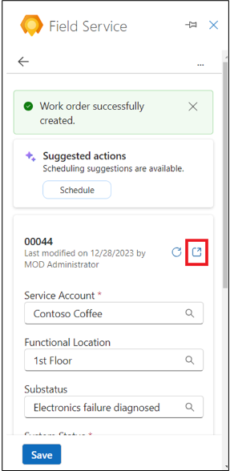

# 실습 7: Field Service의 Copilot을 사용하여 Outlook에서 work order 생성, 예약 및 보기

**참고**: Outlook 웹에서 다른 테마로 전환하는 기능은 Outlook 추가
기능에서 지원되지 않습니다.

## 연습 1: Field Service Outlook 추가 기능 열기

1.  새 탭에서 [**http://www.outlook.com/**](urn:gd:lg:a:send-vm-keys)
    링크를 사용하여 **Outlook** 을 엽니다.

2.  **Office 365 admin tenant**  자격 증명으로 로그인합니다.

3.  원하는 이메일을 엽니다. 이메일에서 **Apps** 아이콘을 선택합니다. 앱
    아이콘이 보이지 않으면 추가 옵션(…)을 선택한 다음 Apps를 선택합니다.

4.  **Dynamics 365 Field Service for Outlook** 앱을 선택합니다.

5.  **Sign in to get started**을 선택합니다.

6.  **Sign-in to Dynamics 365**을 선택합니다.

7.  **Dynamics 365 environment**를 선택합니다. 이 **Field Service
    Trial**환경을 선택합니다.

**참고**: This environment is not valid for Field service’ 라는 경고가
나타나면 지금은 이 실습을 skip 하고 나중에 이 평가판 환경에서 해당
기능이 사용 가능해지면 시도해 보세요.

8.  **Get started**를 선택합니다.

## 연습 2: Field Service의 Copilot을 사용하여 Outlook에서 work order 만들기

1.  이메일을 확인하는 동안 **Field Service add-in**을 엽니다.

2.  **Home**탭에서 **Create a work order from email**를 선택합니다.

3.  **Create work order**  페이지에서 다음 표를 사용하여 요청된 정보를
    입력한 다음 **Create**를 선택합니다.

[TABLE]

> **참고**: work order의 필드 중 드롭다운 목록에 값이 없는 경우 **+**를
> 선택하세요. Field Service 앱이 열리면 새 값과 세부 정보를 입력할 수
> 있습니다. Field Service 앱을 저장하고 닫으세요. 새 값을 입력하거나
> **Refresh**를 선택하여 드롭다운 목록에 새 값을 추가하세요.
>
> 

4.  Work order가 생성되면 work order 번호가 **Field Service**창 상단에
    표시됩니다. **System Status** 기본값은 **Unscheduled**입니다.

**팁**: Dynamics 365 Field Service 앱에서 work order을 열려면 팝업
아이콘을 선택합니다.

## 연습 3: 일정 지원 받기

Outlook에서 일정 지원 기능을 사용하면 work order의 예약을 예약, 변경
또는 이동할 수 있습니다.

### 작업 1: Outlook에서 work order 예약하기

일정은 리소스 가용성, 기술, 고객 약속 시간 창, 고객 위치 근접성 및
사업부를 기반으로 합니다.

1.  **Field Service Add-in**  페이지에서 **Work orders** 탭으로 이동한
    다음 예약되지 않은 work order를 엽니다.

2.  **Work order** 페이지에서 **Suggested actions**아래의 **Schedule를**
    선택합니다. 시스템은 작업 지시 요구 사항을 기반으로 사용 가능한
    기술자를 검색한 후 제안 사항을 표시합니다.

3.  시스템에서 제안을 찾지 못하거나 적합한 기술자를 찾지 못할 경우 대신
    **Go to schedule board**를 사용하세요.

4.  **Dynamics 365 Field Service Schedule Board**으로 이동합니다.

5.  **Initial public view**  모드에 있는지 확인하세요. **Book** 를
    선택하여 work order를 예약합니다.

6.  **Requirement** 필드에서 work order를 선택하고 **Resource**를
    선택합니다.

7.  **Start date**, **Start time**, **End date**, **End time**을
    선택합니다.

8.  **Book**을 선택합니다. 이제 work order가 예약됩니다.

9.  **Outlook** 탭으로 이동합니다. 기술자가 예약되었고 작업 지시 상태가
    **Scheduled**으로 변경되었습니다.

10. work order 일정에 대한 자세한 내용을 보려면 **View schedule** 를
    선택합니다.

### 작업 2: Outlook에서 work order 일정 변경

예약된 work order를 다른 리소스, 날짜 또는 시간으로 일정을 변경합니다.
일정 지원을 사용하여 리소스 가용성, 기술, 고객 약속 시간 창, 고객 위치
근접성 및 사업부를 기반으로 일정을 제공합니다.

1.  **Work orders** 페이지에서 예약된 work order를 엽니다.

2.  **Suggested actions**에서 **View schedule** 를 선택합니다.

3.  schedule details 페이지에서 **Reschedule**을 선택합니다.

4.  Work order을 다시 예약하려면 **Go to schedule board** 를 선택하세요.

5.  기술자와 그들의 근무 가능 시간을 검토하세요. 이름으로 기술자를
    검색하거나, 날짜별로 필터링하거나, 시작 시간 또는 이동 시간별로
    정렬할 수 있습니다. 리소스 요구 사항에 **Estimated Duration**이
    설정되어 있지 않으면 기본적으로 30분이 사용됩니다.

6.  Work order 일정이 조정되면 **Field Service** 창 상단에 확인 메시지가
    표시됩니다.

### 작업 3: Outlook에서 예약 이동

1.  **Field Service Add-in** 페이지에서 **Work orders** 탭으로 이동한
    다음 예약된 work order를 엽니다.

2.  **Suggested actions**에서 **View schedule**를 선택합니다.

3.  Schedule details 페이지에서 **Move booking**를 선택합니다.

4.  현재 리소스를 변경할 수 있습니다.

5.  날짜와 시간을 선택하고 **Update**를 선택합니다.

6.  기술자 예약이 완료되었습니다. **Field Service**  창 상단에 확인
    메시지가 표시됩니다.

## 연습 4: Outlook에서 work order 보기

1.  이메일을 확인하는 동안 **Field Service add-in**을 엽니다.

2.  **Work orders** 탭에 최대 50개의 work order 목록이 표시됩니다. 가장
    최근 work order가 먼저 표시됩니다.

**팁**: Field Service 앱에서 더 많은 work order를 보려면 목록 하단의
**See more** 를 선택합니다.

3.  특정 work order을 찾으려면 **Find by ID** 상자에 work order ID를
    입력하고 **Search**를 선택합니다.

4.  work order을 상태 또는 우선 순위별로 필터링하려면 **Filter**를
    선택합니다.

5.  예를 들어, 상태가 **Scheduled** 인 작업 주문을 선택한 다음
    **Apply**를 선택합니다.

6.  필터를 제거하려면 **Filter**를 선택하고 각 선택 항목을 지운 다음
    **Apply**를 선택합니다.

## 연습 5: Outlook에서 work order 편집

1.  이메일을 확인하는 동안 **Field Service Add-in**  페이지에서 work
    order 탭으로 이동한 다음 원하는 **Work orders** 를 엽니다.

**팁**: 필요한 경우 **Find by ID** 또는 **Filter**를 사용하여 work
order를 찾으세요.

2.  필요한 변경 작업을 수행합니다. 예를 들어 work order의
    **Substatus**를 변경하고 **Save**를 선택합니다.

3.  work order가 업데이트되었습니다. **Field Service** 창 상단에 확인
    메시지가 표시됩니다.

