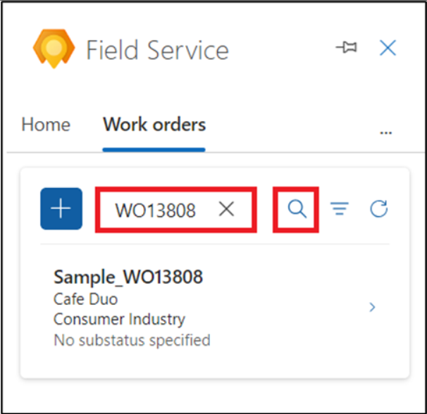

# Laboratorio 7: Crear, programar y visualizar los work orders en Outlook con Copilot in Field Service

**Ojo**: Cambiar del tema en Outlook Web no se admite en Outlook
add-ins.

## Ejercicio 1: Abra el Field Service Outlook Add-in

1.  En una nueva pestaña abra **Outlook** con el
    enlace [**http://www.outlook.com/**](urn:gd:lg:a:send-vm-keys).

2.  Inicie sesión con sus **Office 365 admin tenant** credentials.

3.  Abra cualquiera de los emails. Cuando está en un email, seleccione
    el ícono **Apps**. Si no ve el ícono de Apps, seleccione more
    options (…) y seleccione Apps.

4.  Seleccione el **Dynamics 365 Field Service for Outlook** app.

5.  Seleccione **Sign in to get started**.

6.  Seleccione **Sign-in to Dynamics 365**.

7.  Seleccione su **Dynamics 365 environment**. Para este laboratorio,
    seleccione el **Field Service Trial** environment.

**Ojo:** Si aparece una alerta diciendo ‘This environment is not valid
for Field service’, entonces salte este laboratorio por ahora y pruebe
más tarde cuando esté disponible el feature en este entorno de prueba.

8.  Seleccione **Get started**.

## Ejercicio 2: Cree un work order en Outlook con Copilot in Field Service

1.  Cuando está en un email, abra el **Field Service add-in**.

2.  En la pestaña **Home**, seleccione **Create a work order from
    email**.

3.  En la página **Create work order**, use la siguiente table para
    introducir la información y seleccione **Create**.

[TABLE]

> **Ojo**: Para cualquier campo en el work order, si el valor no está
> disponible en la lista despegable, seleccione **+**. Se abre el Field
> Service app para que pueda introducir un nuevo valor y sus detalles.
> Guarde y cierre el Field Service app. Tecle el nuevo valor o
> seleccione **Refresh** para agregar un nuevo valor a la lista
> despegable.
>
> 

4.  Después de que se cree el work order, se ve el número de work order
    en la parte superior del panel **Field Service**. El **System
    Status** predeterminado es **Unscheduled**.

**Consejo**: Si quiere abrir el work order en Dynamics 365 Field Service
app, seleccione el ícono de maximizar.

## Ejercicio 3: Obtenga schedule assistance

En Outlook, schedule assist functionality le ayuda a programar,
reprogramar o mover una reserva de work order.

### Tarea 1: Programe un work order en Outlook

La programación se basa en resource availability, skills, customer
promised time windows, customer location proximity, y business unit.

1.  En la página **Field Service Add-in**, navegue a la pestaña **Work
    orders** y luego abra un work order no programado.

2.  En la página **Work order**, seleccione **Schedule** en **Suggested
    actions**. El sistema busca técnicos disponibles en función de los
    requisitos de work order y luego mustra sugerencias.

3.  Si el sistema do encuentra sugerencias o si no encuentra el técnico
    justo, en su vez use el **Go to schedule board**.

4.  Se le navegará a **Dynamics 365 Field Service Schedule Board**.

5.  Asegure que está en el **Initial public view** mode.
    Seleccione **Book** para reservar el work order.

6.  Seleccione su work order para el campo **Requirement** y seleccione
    el **Resource**.

7.  Seleccione el **Start date**, **Start time** y **End date**, **End
    time**.

8.  Seleccione **Book**. Se reserva el work order ahora.

9.  Navegue a la pestaña **Outlook**. Está reservado el técnico, y el
    estado del work order se cambia a **Scheduled**.0

10. Seleccione **View schedule** para saber más detalles del work order
    schedule.

### Tarea 2: Reprograme un work order en Outlook

Reprograme un work order programado a un recurso, fecha o tiempo
diferente. Use el schedule assist para proporcionar los programas en
función de la disponibilidad de recursos, habilidades, ventanas del
tiempo prometidos al cliente, la ubicación del cliente y la unidad de
empresas.

1.  Desde la página **Work orders**, abra un work order programado.

2.  Seleccione **View schedule** en **Suggested actions**.

3.  En la página schedule details, seleccione **Reschedule**.

4.  Seleccione **Go to schedule board** para reprogramar el work order.

5.  Revise los técnicos y su disponibilidad. Puede buscar al técnico por
    nombre, filtrar por fechas o reordenar los técnicos por la fecha de
    inicio o el tiempo de viaje. Si no se ha establecido
    el **Estimated** en el resource requirements, se usa 30 minutes como
    predeterminado.

6.  Una vez que se reprograme el work order, se ve una confirmación en
    la parte superior del panel **Field Service**.

### Tarea 3: Mueva una reserva en Outlook

1.  En la página **Field Service Add-in**, navegue a la pestaña **Work
    orders** y luego abra un scheduled work order.

2.  Seleccione **View schedule** en **Suggested actions**.

3.  En la página schedule details, seleccione **Move booking**.

4.  Puede cambiar el recurso actual.

5.  Seleccione la fecha y hora y seleccione **Update**.

6.  Se ha reservado al técnico. Se ve una confirmación en la parte
    superior del panel **Field Service**.

## Ejercicio 4: Visualice los work orders en Outlook

1.  Cuando está en un email, abra el **Field Service add-in**.

2.  En la pestaña **Work orders**, aparece una lista de hasta 50 work
    orders. se ve el work order más reciente primero.

**Consejo**: Para visualizar más work orders en el Field Service app,
seleccione **See more** at the bottom of the list.

3.  Para buscar un work order específico, introduzca el work order ID en
    el cuadro **Find by ID** y seleccione **Search**.

4.  Para filtrar los work orders por status o priority,
    seleccione **Filter**

5.  Haga su elección, por ejemplo, seleccione los work orders con el
    status **Scheduled** y seleccione **Apply**.

6.  Para quitar un filtro, seleccione **Filter**, borre cada selección,
    y seleccione **Apply**.

## Ejercicio 5: Edite un work order en Outlook

1.  Cuando está en un email, en la página **Field Service Add-in**,
    navegue a la pestaña **Work orders** y abra cualquira de los work
    orders.

**Consejo**: Use **Find by ID** o **Filter** para encontrar el work
order si es necesario.

2.  Haga los cambios necesarios, por ejemplo, cambie
    el **Substatus** del work order y seleccione **Save**.

3.  Se actualiza el work order. Se ve una confirmación en la parte
    encima del panel **Field Service**.

