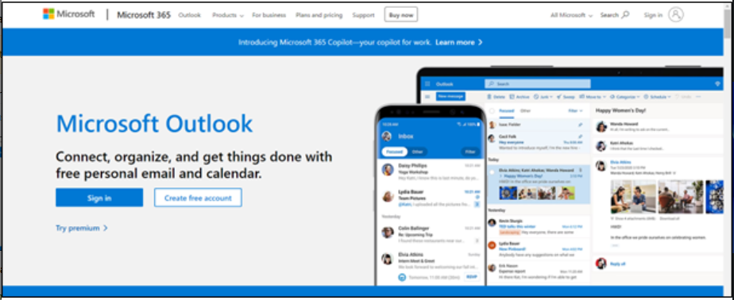

# Lab 7: Erstellen, Planen und Anzeigen von Arbeitsaufträgen in Outlook mit Copilot in Field Service

**Hinweis**: Das Wechseln zu einem anderen Design in Outlook Web wird in
Outlook-Add-Ins nicht unterstützt.

## Übung 1: Öffnen des Field Service Outlook-Add-Ins

1.  Öffnen Sie Outlook in einem neuen Tab über den Link
    [**http://www.outlook.com/**](urn:gd:lg:a:send-vm-keys).

2.  Melden Sie sich mit den Anmeldeinformationen Ihres **Office
    365-Administratormandanten** an.

3.  Öffnen Sie eine der E-Mails. Wählen Sie in einer E-Mail das Symbol
    **Apps** aus. Wenn das Symbol "Apps" nicht angezeigt wird, wählen
    Sie "More Options" (...) und dann "Apps" aus.

4.  Wählen Sie die **Dynamics 365 Field Service for Outlook** App aus.

5.  Wählen Sie **Sign in to get started** aus.

6.  Wählen Sie **Sign-in to Dynamics 365** aus.

7.  Wählen Sie Ihre **Dynamics 365 environment**. Wählen Sie für dieses
    Lab **Field Service Trial** environment aus.

**Hinweis:** Wenn Sie auf die Warnung " This environment is not valid
for Field service" stoßen, überspringen Sie dieses Lab vorerst und
probieren Sie es später aus, sobald die Funktion für diese Testumgebung
verfügbar gemacht wird.

8.  Wählen Sie **Get started** aus.

## Übung 2: Erstellen eines Arbeitsauftrags in Outlook mit Copilot in Field Service

1.  Öffnen Sie in einer E-Mail das Symbol **Field Service add-in**.

2.  Wählen Sie auf der Registerkarte **Home** die Option **Create a work
    order from email** aus.

3.  Geben Sie auf der Seite **Create work order** in der folgenden
    Tabelle die angeforderten Informationen ein, und wählen Sie dann
    **Create**.

[TABLE]

> **Hinweis**: Wenn für jedes Feld im Arbeitsauftrag ein Wert nicht in
> der Dropdown-Liste verfügbar ist, wählen Sie **+** aus. Die Field
> Service-App wird geöffnet, damit Sie einen neuen Wert und dessen
> Details eingeben können. Speichern und schließen Sie die Field
> Service-App. Geben Sie den neuen Wert ein, oder wählen Sie **Refresh**
> aus, um den neuen Wert der Dropdownliste hinzuzufügen.
>
> 

4.  Nachdem der Arbeitsauftrag erstellt wurde, wird die
    Arbeitsauftragsnummer oben im **Field Service** angezeigt. Die
    Standardeinstellung für den **System status** ist **Unscheduled.**

**Tipp**: Wenn Sie den Arbeitsauftrag in der Dynamics 365 Field
Service-App öffnen möchten, wählen Sie das Popup-Symbol aus.

## Übung 3: Unterstützung bei der Terminplanung

In Outlook hilft Ihnen die Terminplanungshilfe, eine Buchung für einen
Arbeitsauftrag zu planen, neu zu planen oder zu verschieben.

### Aufgabe 1: Planen eines Arbeitsauftrags in Outlook

Die Planung basiert auf der Ressourcenverfügbarkeit, den Fähigkeiten,
den vom Kunden zugesagten Zeitfenstern, der Nähe des Kundenstandorts und
der Geschäftseinheit.

1.  Navigieren Sie auf der Seite Field Service Add-In zur Registerkarte
    **Work orders** und öffnen Sie dann einen ungeplanten
    Arbeitsauftrag.

2.  Wählen Sie auf der Seite **Work order** die Option **Scheduled**
    unter **Suggested actions** aus. Das System sucht auf der Grundlage
    der Anforderungen des Arbeitsauftrags nach verfügbaren Technikern
    und zeigt dann Vorschläge an.

3.  Wenn das System keine Vorschläge findet oder Sie nicht den richtigen
    Techniker finden, verwenden Sie stattdessen die **Go to schedule
    board**.

4.  Sie werden zu **Dynamics 365 Field Service Schedule Board**
    navigiert.

5.  Stellen Sie sicher, dass Sie sich im Modus **Initial public
    view** befinden. Wählen Sie **Book** aus, um den Arbeitsauftrag zu
    buchen.

6.  Wählen Sie Ihren Arbeitsauftrag für das Feld **Requirement** aus,
    und wählen Sie das Symbol **Resource**.

7.  Wählen Sie die Schaltfläche **Start date**, **Start time** und **End
    date**, **End time** aus.

8.  Wählen Sie **Book** aus. Der Arbeitsauftrag ist jetzt gebucht.

9.  Navigieren Sie zur Registerkarte **Outlook**. Der Techniker wird
    gebucht und der Status des Arbeitsauftrags wird geändert in
    **Scheduled**.0

10. Wählen Sie **View schedule**  aus, um weitere Details zum
    Arbeitsauftragsplan zu erfahren.

### Aufgabe 2: Einen Arbeitsauftrag in Outlook neu planen

Planen Sie einen geplanten Arbeitsauftrag auf eine andere Ressource, ein
anderes Datum oder eine andere Uhrzeit um. Verwenden Sie die
Zeitplanunterstützung, um Zeitpläne basierend auf
Ressourcenverfügbarkeit, Fähigkeiten, vom Kunden zugesagten
Zeitfenstern, der Nähe des Kundenstandorts und der Geschäftseinheit
bereitzustellen.

1.  Öffnen Sie auf der Seite **Work orders** einen geplanten
    Arbeitsauftrag.

2.  Wählen Sie **View schedule** unter **Suggested actions** aus.

3.  Wählen Sie auf der Seite mit den Zeitplandetails die Option
    **Reschedule**.

4.  Wählen Sie **Go to schedule board** aus, um den Arbeitsauftrag neu
    zu planen.

5.  Überprüfen Sie die Techniker und ihre Verfügbarkeit. Sie können nach
    Namen nach einem Techniker suchen, nach Datum filtern oder die
    Techniker nach Startzeit oder Reisezeit sortieren. Wenn die
    **geschätzte Dauer** nicht in den Ressourcenanforderungen
    eingerichtet wurde, wird standardmäßig 30 Minuten verwendet.

6.  Sobald der Arbeitsauftrag neu geplant wurde, wird oben im **Field
    Service-Bereich** eine Bestätigung angezeigt.

### Aufgabe 3: Verschieben einer Buchung in Outlook

1.  Navigieren Sie auf der Seite Field Service Add-In zur Registerkarte
    **Work orders** und öffnen Sie dann einen geplanten Arbeitsauftrag.

2.  Wählen Sie **View schedule** unter **Suggested actions** aus.

3.  Wählen Sie auf der Seite mit den Zeitplandetails die Option **Move
    booking**.

4.  Sie können die aktuelle Ressource ändern.

5.  Wählen Sie das Datum und die Uhrzeit aus und wählen Sie **Update**.

1.  Der Techniker ist gebucht. Eine Bestätigung wird oben im Bereich
    **Field Service** angezeigt.

## Übung 4: Anzeigen von Arbeitsaufträgen in Outlook

1.  Öffnen Sie in einer E-Mail das Symbol **Field Service add-in**.

2.  Auf der Registerkarte **Work orders** wird eine Liste mit bis zu 50
    Arbeitsaufträgen angezeigt. Der letzte Arbeitsauftrag wird zuerst
    angezeigt.

**Tipp**: Um weitere Arbeitsaufträge in der Field Service-App
anzuzeigen, wählen Sie unten in der Liste **See More** aus.

3.  Um einen bestimmten Arbeitsauftrag zu finden, geben Sie die
    Arbeitsauftrags-ID in das **Find by ID** suchen ein und wählen Sie
    **Search** aus.

4.  Um die Arbeitsaufträge nach Status oder Priorität zu filtern, wählen
    Sie **Filter** aus**.**

5.  Treffen Sie Ihre Auswahl, z.B. markieren Sie die Arbeitsaufträge mit
    dem Status **Scheduled** und wählen Sie dann **Apply**.

6.  Um einen Filter zu entfernen, wählen Sie **Filter** aus, löschen Sie
    jede Auswahl, und wählen Sie dann **Apply**.

## Übung 5: Bearbeiten eines Arbeitsauftrags in Outlook

1.  Navigieren Sie in einer E-Mail auf der Seite **Field Service
    Add-In** zur Registerkarte **Work orders** und öffnen Sie dann einen
    der Arbeitsaufträge.

**Tipp**: Verwenden Sie bei Bedarf **Find by ID** oder **Filter**, um
den Arbeitsauftrag zu finden.

2.  Nehmen Sie die erforderlichen Änderungen vor, z.B. ändern Sie den
    **Substatus** des Arbeitsauftrags und wählen Sie **Save**.

3.  Der Arbeitsauftrag wird aktualisiert. Eine Bestätigung wird oben im
    Bereich **Field Service** angezeigt.

