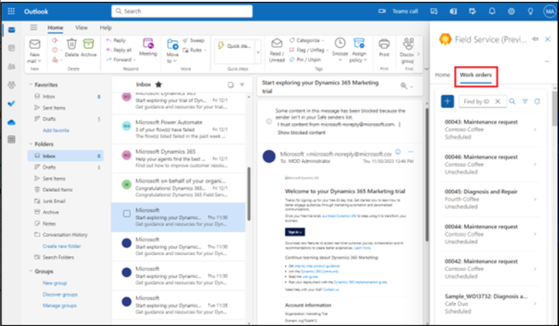

# Lab 7 : Création, planification et affichage d'ordres de travail dans Outlook à l'aide de Copilot dans Field Service

**Remarque** : Le passage à un autre thème dans Outlook Web n'est pas
pris en charge dans les compléments Outlook.

## Exercice 1 : Ouvrir le complément Outlook de Field Service

1.  Dans un nouvel onglet, ouvrez **Outlook** à l'aide du lien
    [**http://www.outlook.com/**](urn:gd:lg:a:send-vm-keys).

2.  Connectez-vous à l'aide de vos informations d'identification de
    **Office 365 admin tenant** 

3.  Ouvrez l'un des e-mails. Dans un e-mail, sélectionnez l' icône
    **Apps**. Si vous ne voyez pas l'icône Applications, sélectionnez
    Plus d'options (...), puis sélectionnez les Applications.

4.  Sélectionnez l **'**application **Dynamics 365 Field Service Pour
    Outlook** .

5.  Sélectionnez **Sign in to get started**.

6.  Sélectionnez **Sign-in to Dynamics 365**.

7.  Sélectionnez votre **Dynamics 365 environment**. Pour cet atelier,
    sélectionnez **Field Service Trial**  Environnement.

**Remarque :** Si vous rencontrez l'avertissement indiquant « Cet
environnement n'est pas valide pour Field Service », ignorez cet atelier
pour l'instant et essayez-le plus tard une fois que la fonctionnalité
sera mise à la disposition de cet environnement d'essai.

8.  Sélectionnez **Get started** .

## Exercice 2 : Création d'un ordre de travail dans Outlook à l'aide de Copilot dans Field Service

1.  Dans un e-mail, ouvrez le **Field Service add-in**.

2.  Sous l' onglet **Home**, sélectionnez **Create a work order from
    email**.

3.  Sur la page **Create work order** , utilisez le tableau suivant pour
    entrer les informations demandées, puis sélectionnez **Create**.

[TABLE]

> **Remarque** : Pour n'importe quel champ de l'ordre de travail, si une
> valeur n'est pas disponible dans la liste déroulante, sélectionnez
> **+**. L'application Field Service s'ouvre pour vous permettre de
> saisir une nouvelle valeur et ses détails. Enregistrez et fermez
> l'application Field Service. Tapez la nouvelle valeur ou sélectionnez
> **Refresh** pour ajouter la nouvelle valeur à la liste déroulante.
>
> 

4.  Une fois l'ordre de travail créé, le numéro de l'ordre de travail
    s'affiche en haut du volet **Field Service**  La valeur par défaut
    de **System Status**  est **Unscheduled**.

**Conseil** : Si vous souhaitez ouvrir l'ordre de travail dans Dynamics
365 Field Service app ,sélectionnez l'icône qui surgit .

## Exercice 3 : Obtenir de l'aide pour planifier

Dans Outlook, la fonctionnalité d'assistance à la planification vous
permet de planifier, de reprogrammer ou de déplacer une réservation pour
un ordre de travail.

### Tâche 1 : Planifier un ordre de travail dans Outlook

La planification est basée sur la disponibilité des ressources, les
compétences, les créneaux horaires promis par le client, la proximité de
l'emplacement du client et l'unité commerciale.

1.  Sur la page **Field Service Add-in**, accédez à l' onglet **Work
    orders** , puis ouvrez un ordre de travail non planifié.

2.  Sur la page **Work order**  sélectionnez **Schedule** sous
    **Suggested actions**. Le système recherche les techniciens
    disponibles en fonction des exigences de l'ordre de travail, puis
    affiche des suggestions.

3.  Si le système ne trouve pas de suggestions ou si vous ne trouvez pas
    le bon technicien, utilisez plutôt le **Go to schedule board**.

4.  Vous serez redirigé vers le **Dynamics 365 Field Service Schedule
    Board**.

5.  Assurez-vous que vous êtes en mode **Initial public view** .
    Sélectionnez **Book**  pour enregistrer l'ordre de travail.

6.  Sélectionnez votre ordre de travail pour le champ **Requirement** et
    sélectionnez la **ressource**.

7.  Sélectionnez la date de  **Start date**, **Start time** et **End
    date**, **End time**

8.  Sélectionnez **Book**. L'ordre de travail est maintenant réservé.

9.  Accédez à l' onglet **Outlook**. Le technicien est réservé et le
    statut de l'ordre de travail passe à **Scheduled**.0

10. Sélectionnez **View schedule**  pour connaître plus de détails sur
    le calendrier de l'ordre de travail.

### Tâche 2 : Replanifier un ordre de travail dans Outlook

Replanifier un ordre de travail planifié à une ressource, une date ou
une heure différente. Utilisez l'assistant de planification pour fournir
des calendriers en fonction de la disponibilité des ressources, des
compétences, des créneaux horaires promis par le client, de la proximité
de l'emplacement du client et de l'unité commerciale.

1.  À partir de la page **Work orders**, ouvrez un ordre de travail
    planifié.

2.  Sélectionnez **View schedule**  sous **Suggested actions**.

3.  Sur la page des détails de la planification, sélectionnez
    **Reschedule**.

4.  Sélectionnez **Go to schedule board**  pour replanifier l'ordre de
    travail.

5.  Passez en revue les techniciens et leur disponibilité. Vous pouvez
    rechercher un technicien par son nom, filtrer par dates ou trier les
    techniciens par heure de début ou temps de trajet. Si la **Estimated
    duration** n'a pas été configurée dans les besoins en ressources, 30
    minutes sont utilisées par défaut.

6.  Une fois l'ordre de travail reprogrammé, une confirmation s'affiche
    en haut du volet **Field Service**.

### Tâche 3 : Déplacer une réservation dans Outlook

1.  Sur la page **Field Service Add-in**  accédez à l' onglet **Work
    orders**  puis ouvrez un ordre de travail planifié.

2.  Sélectionnez **View schedule**  sous **Suggested actions**.

3.  Sur la page des détails de l'horaire, sélectionnez **Move booking**

4.  Vous pouvez modifier la ressource actuelle.

5.  Sélectionnez la date et l'heure, puis sélectionnez **Update**.

6.  Le technicien est réservé. Une confirmation s'affiche en haut du
    volet **Field Service**.

## Exercice 4 : Afficher les ordres de travail dans Outlook

1.  Dans un e-mail, ouvrez le **Field Service add-in**.

2.  Dans l' onglet **Work orders** , une liste de 50 ordres de travail
    s'affiche. L'ordre de travail le plus récent s'affiche en premier.

**Conseil** : Pour afficher plus d'ordres de travail dans l'application
Field Service, sélectionnez **See more** en bas de la liste.

3.  Pour trouver un ordre de travail particulier, entrez l'ID de l'ordre
    de travail dans la zone **Find by ID**  et sélectionnez **Search**..

4.  Pour filtrer les ordres de travail par statut ou par priorité,
    sélectionnez **Filter**

5.  Faites votre choix, par exemple, sélectionnez les ordres de travail
    avec le statut **Scheduled**,puis sélectionnez **Apply**.

6.  Pour supprimer un filtre, sélectionnez **Filter**, effacez chaque
    sélection, puis sélectionnez **Apply**.

## Exercice 5 : Modifier un ordre de travail dans Outlook

1.  Dans un e-mail, sur la page **Field Service Add-in** , accédez à l'
    onglet **Work orders**  puis ouvrez l'un des ordres de travail.

**Conseil** : Utilisez **Find by ID**  ou **Filter** pour trouver
l'ordre de travail si nécessaire.

2.  Apportez les modifications nécessaires, par exemple, modifiez le
    **Substatus**  de l'ordre de travail et sélectionnez **Save**.

3.  L'ordre de travail est mis à jour. Une confirmation s'affiche en
    haut du volet **Field Service**.

