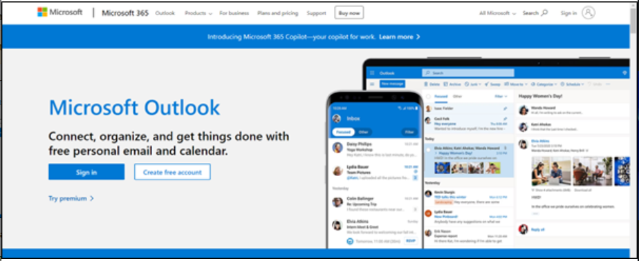
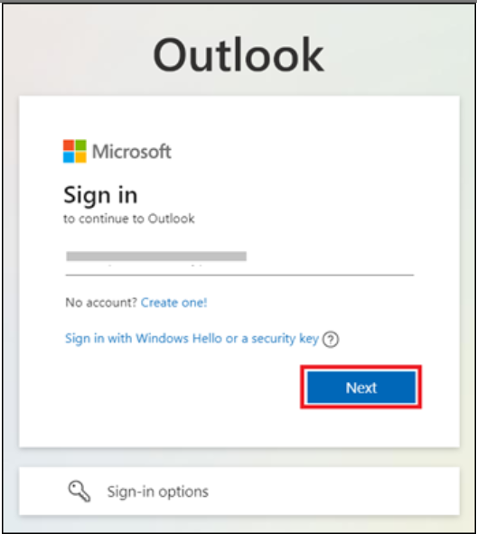
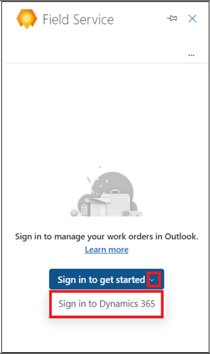
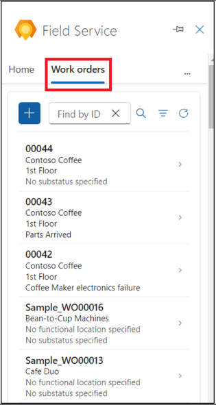

# Lab 7: Creating, scheduling, and viewing work orders in Outlook using Copilot in Field Service

**Note**: Switching to a different theme in Outlook Web is not supported
in Outlook add-ins.

## Exercise 1: Open the Field Service Outlook Add-in

1.  In a new tab open **Outlook** using the
    link [**http://www.outlook.com/**](urn:gd:lg:a:send-vm-keys).

2.  Sign in with your **Office 365 admin tenant** credentials.

3.  Open any of the emails. While in an email, select the **Apps** icon.
    If you don’t see Apps icon, select more options (…) and then select
    Apps.

4.  Select **Dynamics 365 Field Service for Outlook** app.

5.  Select **Sign in to get started**.

6.  Select **Sign-in to Dynamics 365**.

7.  Select your **Dynamics 365 environment**. For this lab,
    select **Field Service Trial** environment.

**Note:** If you come across the warning saying ‘This environment is not
valid for Field service’ then skip this lab for now and try it later
once the feature is made available to this trial environment.

8.  Select **Get started**.

## Exercise 2: Create a work order in Outlook using Copilot in Field Service

1.  While in an email, open the **Field Service add-in**.

2.  On the **Home** tab, select **Create a work order from email**.

3.  On the **Create work order** page, use following table to enter the
    asked information and then select **Create**.

[TABLE]

> **Note**: For any field on the work order, if a value is not available
> in the drop-down list, select **+**. The Field Service app opens so
> you can enter a new value and its details. Save and close the Field
> Service app. Type the new value or select **Refresh** to add the new
> value to the drop-down list.
>
> 

4.  After the work order is created, the work order number displays at
    the top of the **Field Service** pane. The **System Status** default
    is **Unscheduled**.

**Tip**: If you want to open the work order in the Dynamics 365 Field
Service app, select the pop-out icon.

## Exercise 3: Get schedule assistance

In Outlook, schedule assist functionality helps you schedule,
reschedule, or move a booking for a work order.

### Task 1: Schedule a work order in Outlook

Scheduling is based on resource availability, skills, customer promised
time windows, customer location proximity, and business unit.

1.  On the **Field Service Add-in** page, navigate to the **Work
    orders** tab and then open an unscheduled work order.

2.  On the **Work order** page, select **Schedule** under **Suggested
    actions**. The system searches for available technicians based on
    the work order requirements and then displays suggestions.

3.  If the system doesn't find suggestions or you don't find the right
    technician, use the **Go to schedule board** instead.

4.  You will be navigated to **Dynamics 365 Field Service Schedule
    Board**.

5.  Make sure that you are on the **Initial public view** mode.
    Select **Book** to book the work order.

6.  Select your work order for **Requirement** field and select
    the **Resource**.

7.  Select the **Start date**, **Start time** and **End date**, **End
    time**.

8.  Select **Book**. The work order is booked now.

9.  Navigate to the **Outlook** tab. The technician is booked, and the
    status of work order is changed to **Scheduled**.0

10. Select **View schedule** to know more details of the work order
    schedule.

### Task 2: Reschedule a work order in Outlook

Reschedule a scheduled work order to a different resource, date, or
time. Use schedule assist to provide schedules based on resource
availability, skills, customer promised time windows, customer location
proximity, and business unit.

1.  From the **Work orders** page, open a scheduled work order.

2.  Select **View schedule** under **Suggested actions**.

3.  On the schedule details page, select **Reschedule**.

4.  Select **Go to schedule board** to reschedule the work order.

5.  Review the technicians and their availability. You can search for a
    technician by name, filter by dates, or sort the technicians by
    start time or travel time. If the **Estimated Duration** hasn't been
    set up in the resource requirements, 30 minutes is used as a
    default.

6.  Once the work order is rescheduled, a confirmation displays at the
    top of the **Field Service** pane.

### Task 3: Move a booking in Outlook

1.  On the **Field Service Add-in** page, navigate to the **Work
    orders** tab and then open a scheduled work order.

2.  Select **View schedule** under **Suggested actions**.

3.  On the schedule details page, select **Move booking**.

4.  You can change the current resource.

5.  Select the date and time and select **Update**.

6.  The technician is booked. A confirmation displays at the top of
    the **Field Service** pane.

## Exercise 4: View work orders in Outlook

1.  While in an email, open the **Field Service add-in**.

2.  On the **Work orders** tab, a list of up to 50 work orders display.
    The most recent work order displays first.

**Tip**: To view more work orders in the Field Service app, select **See
more** at the bottom of the list.

3.  To find a particular work order, enter the work order ID in
    the **Find by ID** box and select **Search**.

4.  To filter the work orders by status or priority, select **Filter**

5.  Make your choice, for example, select the work orders with
    status **Scheduled** and then select **Apply**.

6.  To remove a filter, select **Filter**, clear each selection, and
    then select **Apply**.

## Exercise 5: Edit a work order in Outlook

1.  While in an email, on the **Field Service Add-in** page, navigate to
    the **Work orders** tab and then open any of the work orders.

**Tip**: Use **Find by ID** or **Filter** to find the work order if
necessary.

2.  Make the necessary changes, for example, change the **Substatus** of
    the work order and select **Save**.

3.  The work order is updated. A confirmation displays at the top of
    the **Field Service** pane.

