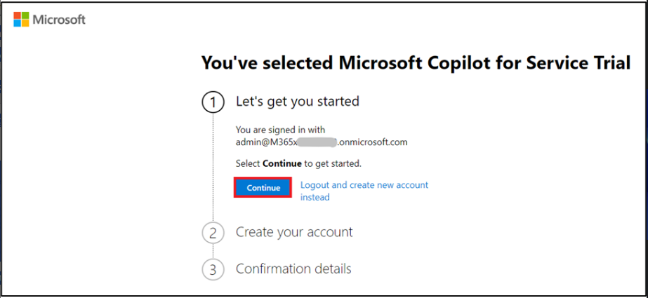
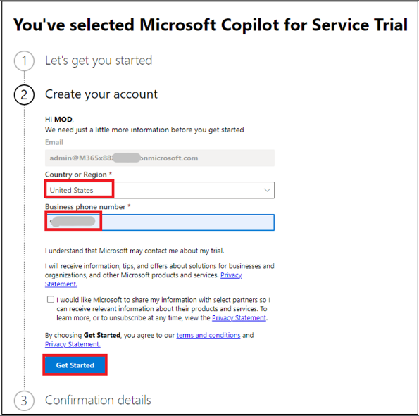
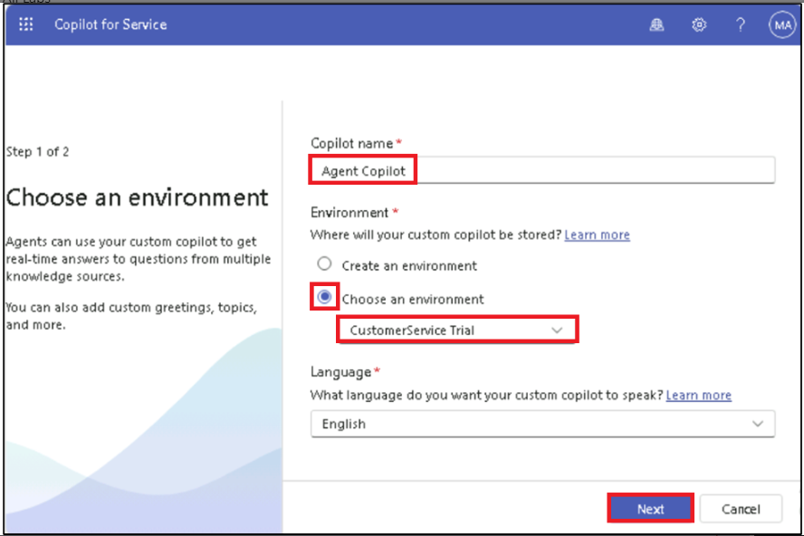
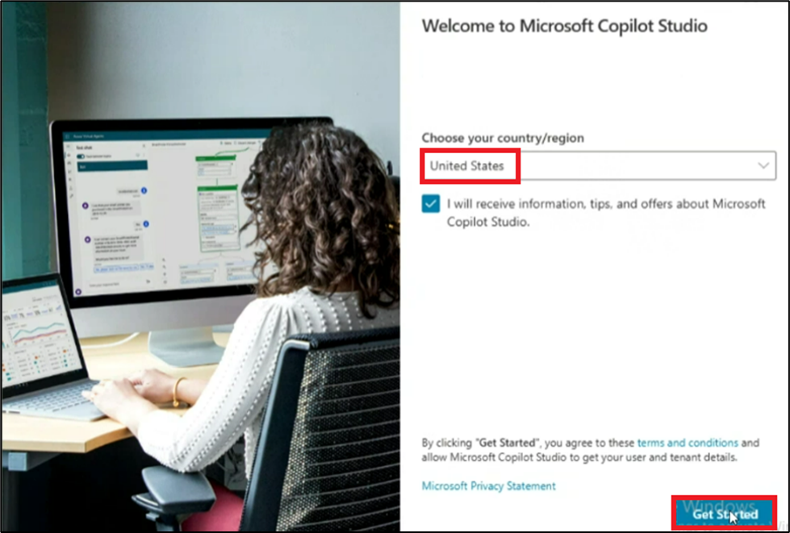
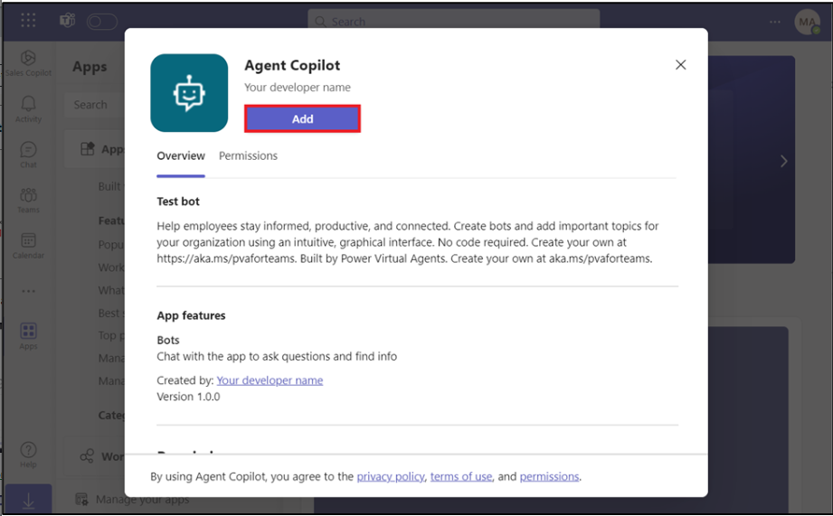

Lab 8: Creazione e distribuzione di un copilota per agenti con Microsoft
Copilot for Service

Esercizio 1: Creare un copilota agente

Puoi creare un copilota agente in pochi semplici passaggi.

1.  Vai alla pagina di registrazione utilizzando
    [**https://go.microsoft.com/fwlink/?linkid=2252259**](https://go.microsoft.com/fwlink/?linkid=2252259).

2.  Seleziona **Continue**.

3.  Seleziona **United States** come Paese/area geografica, inserisci il
    suoi numero di telefono e seleziona **Get started**.

**Nota**: se hai selezionato NON UTILIZZARE Microsoft Copilot per
l'anteprima del servizio, continua e fai clic su Inizia.

4.  Seleziona **Get Started**.

5.  Dal selettore di ambiente selezionare ambiente **Contoso
    (default),** quindi fare clic su **Create a custom copilot** e
    quindi selezionare **Get Started**.

6.  Assegna il nome come **Agent Copilot**, seleziona **Choose an
    environment** , seleziona **Customer Service trial** e quindi
    seleziona **Next**.

7.  In **Choose a customer engagement service**, seleziona **I don’t
    want to set this up right now,** quindi seleziona **Create**.

8.  Passa alla pagina **Content sources**.

9.  In **Websites** incollare il sito Web specificato -
    [**https://www.microsoft.com/en-in/power-platform**](urn:gd:lg:a:send-vm-keys)
    e quindi selezionare **Add**.

10. Seleziona **Save** in alto.

11. Nella sezione **Test Copilot**, digita [**What is Power
    Platform**](urn:gd:lg:a:send-vm-keys). Quindi, seleziona l 'icona
    **Send**.

12. Puoi vedere la risposta data da **Copilot**.

# Esercizio 2: Pubblicazione in Copilot per il servizio

1.  Passare alla pagina principale **Overview** di **Copilot for
    Service**.

2.  Nella pagina **Publish your copilot** nella pagina **Overview**
    selezionare **Publish**.

La pubblicazione del copilota potrebbe richiedere alcuni minuti. Una
volta pubblicato correttamente, l'indicatore di stato mostra l'ultimo
timestamp pubblicato.

# Esercizio 3: Connettere il bot al canale Microsoft Teams

1.  Nella scheda **Give agents access** selezionare **Connect to
    Teams**.

2.  Verrà visualizzato **Microsoft Copilot Studio**. Se richiesto,
    accedere con le credenziali **Office 365 Admin Tenant**. Seleziona
    **United States** come **country/region** e quindi seleziona **Get
    Started**. Se si passa alla pagina dell'agente, come mostrato nella
    seconda immagine, selezionare **Create**.

> 
>
> 

3.  Nel portale di Microsoft Copilot Studio, nella pagina Agente,
    selezionare **Publish**. Ora seleziona la scheda **Channels**,
    seleziona **Microsoft Teams** e quindi seleziona **Turn on Teams.**

> 

**Nota:** se non vedi questa opzione, il canale Microsoft Teams potrebbe
essere già abilitato.

4.  Seleziona **Edit details** per modificare l'icona, il colore e le
    descrizioni del bot.

Questi verranno visualizzati nella **Microsoft Teams app store** nella
scheda **About** dell'app dopo che l'utente ha installato il bot.

5.  Modifica la breve descrizione in **Test bot,** quindi seleziona
    **Save**.

6.  Seleziona **Open copilot** per avviare la richiesta di installazione
    in Microsoft Teams.

7.  Seleziona **Cancel on Open Microsoft Teams (work or school)?**
    Finestra pop-up.

8.  Seleziona **Use the Web app instead**.

9.  Seleziona **Add** per aggiungerlo come app in Teams. Questo installa
    solo il bot per te.

10. Inserisci [**What is Power Platform**](urn:gd:lg:a:send-vm-keys)
    nella casella Digita un messaggio e fai clic sull' icona **Send**.

11. Puoi vedere la risposta data dalla **Agent copilot**.

