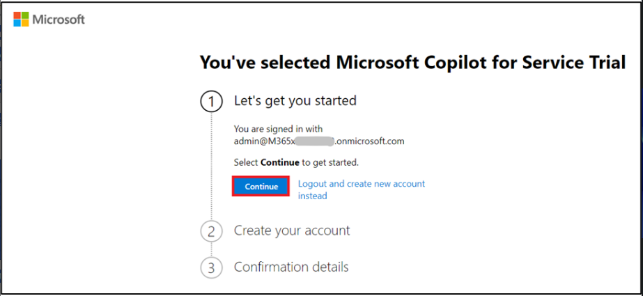
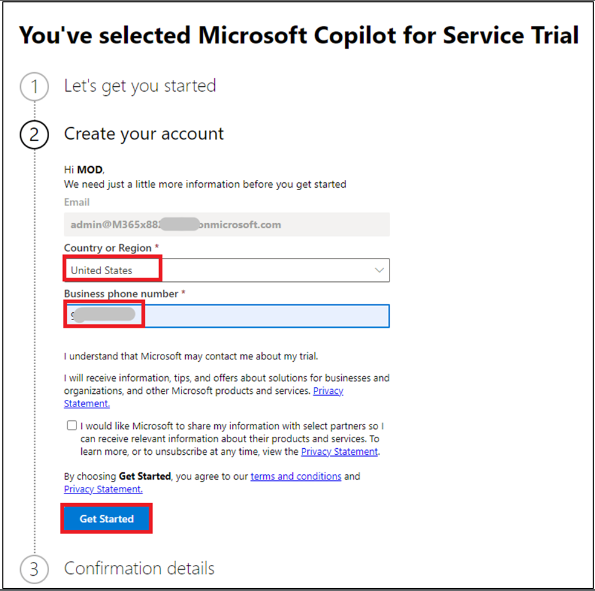
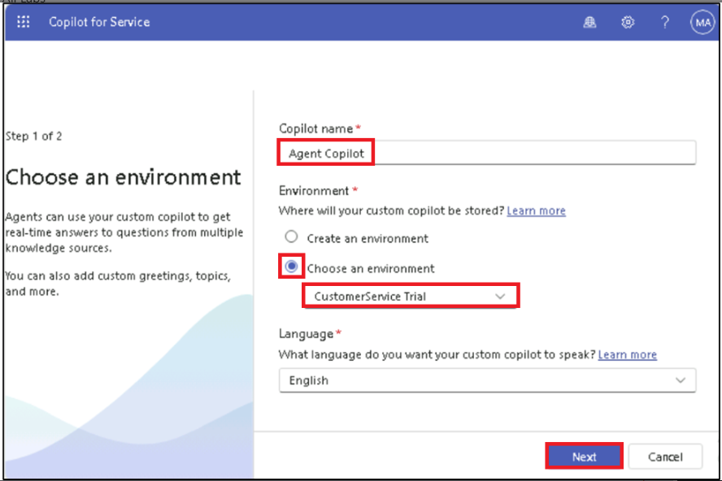
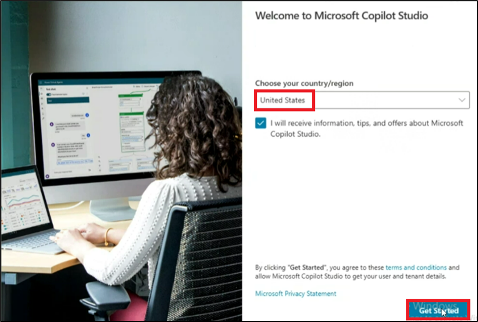
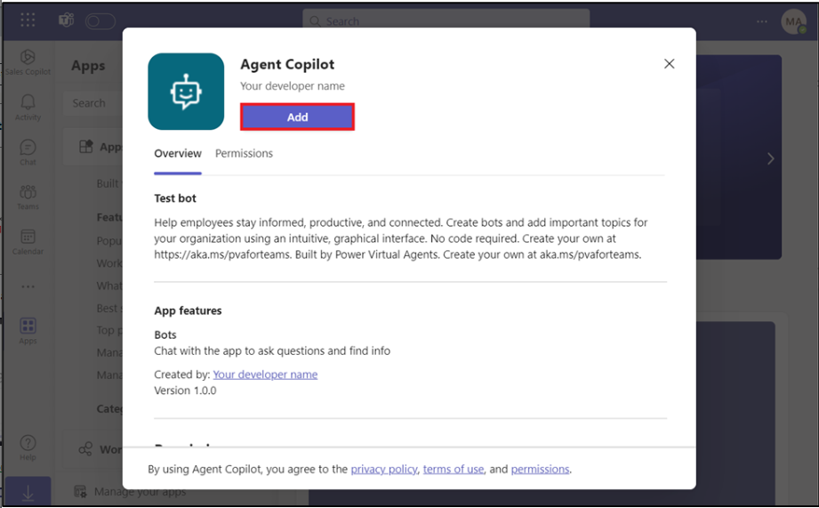

Lab 8: Creating and deploying an agent-facing copilot with Microsoft
Copilot for Service

## Exercise 1: Create an Agent copilot

You can create an Agent copilot in a few easy steps.

1.  Go to the sign-up page
    using [**https://go.microsoft.com/fwlink/?linkid=2252259**](urn:gd:lg:a:send-vm-keys).

2.  Select **Continue**.

3.  Select **United States** as Country/region, enter your phone number
    and select **Get started**.

**Note**: If the get you’ve selected DO NOT USE Microsoft Copilot for
Service Preview, continue and click on Get started.

4.  Select **Get started**.

5.  From the environment selector, select **Contoso
    (default)** environment and then click on **Create a custom
    copilot** and then select **Get started**.

6.  Give the name as **Agent Copilot**, select **Choose an
    environment**, select **Customer Service trial** and then select
    **Next**.

7.  Under **Choose a customer engagement service**, select **I don’t
    want to set this up right now** and then select **Create**.

8.  Navigate to the **Content sources** page.

9.  Under **Websites**, paste the given website
    - [**https://www.microsoft.com/en-in/power-platform**](urn:gd:lg:a:send-vm-keys) and
    then select **Add**.

10. Select **Save** at the top.

11. In the **Test Copilot** section, type [**What is Power
    Platform**](urn:gd:lg:a:send-vm-keys). Then, select **Send** icon.

12. You can see the response given by **Copilot**.

## Exercise 2: Publish in Copilot for Service

1.  Navigate to the main **Overview** page of **Copilot for Service**.

2.  In the **Publish your copilot** card on the **Overview** page,
    select **Publish**.

It may take a few minutes for the copilot to publish. Once published
successfully, the status indicator shows the last published timestamp.

## Exercise 3: Connect your agent to the Microsoft Teams channel

1.  In the **Give agents access** card, select **Connect to Teams**.

2.  You will be navigated to **Microsoft Copilot Studio**. If asked,
    sign in with your **Office 365 Admin Tenant** credentials.
    Select **United States** as **country/region** and then select **Get
    Started**. If you are navigated to Agent page as shown in the second
    image then select **Create**.

> 
>
> 

3.  On Microsoft Copilot Studio portal, on Agent page,
    select **Publish**. Now, select **Channels** tab, select **Microsoft
    Teams** and then select **Turn on Teams.**

> 

**Note:** If you do not see this option, then the Microsoft Teams
channel may already be enabled.

4.  Select **Edit details** to change the bot's icon, color, and
    descriptions.

These will be shown in the **Microsoft Teams app store** and the
app's **About** tab after the user installs the bot.

5.  Change the short description to **Test bot** then select **Save**.

6.  Select **Open copilot** to have the installation prompt launch in
    Microsoft Teams.

7.  Select **Cancel on Open Microsoft Teams (work or school)?** Pop-up
    window.

8.  Select **Use the web app instead**.

9.  Select **Add** to have it added as an app in Teams. This only
    installs the agent for you.

10. Enter [**What is Power Platform**](urn:gd:lg:a:send-vm-keys) in the
    Type a message box and click on **Send** icon.

11. You can see the given response from **Agent copilot**.

