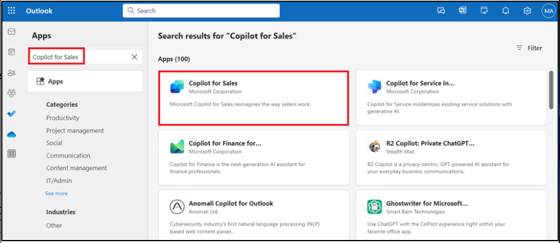

# 實驗 9：使用 Copilot for Sales 撰寫電子郵件、在 Outlook 中查看電子郵件摘要和業務機會摘要

**注意：**如果該產品不可用，您可以切換到 11
號實驗室。您可以根據可用性稍後執行此實驗。

## 練習 1：打開 Copilot for Sales 

1.  在新選項卡中，使用鏈接 [**www.outlook.com**](urn:gd:lg:a:send-vm-keys)
    打開 **Outlook**。

2.  使用 **Office 365 管理員租戶**憑據登錄。

3.  打開任何電子郵件。在電子郵件中，選擇 **Apps** 圖標。

4.  如果您可以在 **Apps** （應用程序） 下看到 **Copilot for
    Sales**，則可以直接執行步驟 11。

5.  如果您在 **Apps**下沒有看到 **Copilot for Sales**，請選擇 **More
    apps**，然後單擊 **Add apps**。

6.  在 **Apps** 頁面上，搜索 [**Copilot for
    Sales**](urn:gd:lg:a:send-vm-keys)，然後選擇 **Copilot for Sales**
    應用程序。

7.  選擇 **Add** on Copilot for Sales 卡。

8.  再次選擇 **Copilot for Sales** 應用程序，然後單擊**Open**。

9.  選擇 **Got it** （知道了）。

10. 導航到 **Mails**。

11. 打開任何電子郵件。在電子郵件中，選擇 **Apps** 圖標。

12. 現在，您將能夠看到 **Copilot for Sales** 應用程序。選擇 **Copilot
    for Sales** 應用程序。

13. 如果系統提示，請在彈出窗口中使用您的 **Office 365
    管理員租戶**憑據登錄。如果出現彈出窗口，指出使用 Copilot
    快速趕上並起草，請選擇 **Got it**。

14. **Copilot for Sales**
    窗格顯示在右側。選擇您的環境。對於此實驗室，請選擇 **Sales Tria**l
    environment（Sales 試用環境）。

15. 選擇 **Get started**。

16. 您現在可以使用 **Copilot for Sales** 窗格。

# 練習 2：查看和保存電子郵件摘要

## 任務 1：查看電子郵件摘要

1.  在 **Outlook** 中，打開客戶電子郵件。

2.  打開 **Apps \> Copilot for Sales** 窗格。

3.  電子郵件摘要顯示在 **Key info** 卡中。

**注意**

如果電子郵件內容少於 1000
個字符，則不會生成電子郵件摘要，並且不會顯示此電子郵件卡的摘要。

### 任務 2：將電子郵件摘要保存到 CRM

1.  在 **Key info** 卡中，單擊省略號 （...），然後選擇 **Save summary to
    Dynamics 365**。

2.  在 **Select a record** （選擇記錄） 下，在搜索框中輸入 Coffee
    maker（咖啡機），選擇建議的記錄之一或使用搜索框查找其他記錄。

如果有多個與連絡人相關的商機，Sales Copilot 將顯示一個建議商機列表（按
AI 排名）以保存摘要。在這種情況下，默認情況下會選擇第一個商機。

**注意**

- 如果電子郵件已連接到業務機會，則默認選中該電子郵件。

- 如果未連接任何商機，則默認情況下將選擇排名靠前的商機，該商機由客戶或連絡人可用的打開商機以及電子郵件的內容決定。

- 當您搜索記錄時，搜索結果將顯示管理員選擇的記錄名稱和關鍵字段。

- 您的搜索結果將添加到建議的記錄列表中，因此您可以安全地搜索並重試。

- 目前，您可以使用 Sales Copilot 將摘要保存到一條記錄中。

- 您可以連接到為活動啟用並由管理員添加到 Sales Copilot 的所有記錄類型。

3.  選擇 **Save** （保存）。

電子郵件摘要將作為所選記錄的注釋保存到 CRM 中。所有 Microsoft Copilot
for Sales 注釋都共享相同的主題：“\[AI 生成的\] 來自 Sales Copilot
的電子郵件摘要”，並包括電子郵件本身的主題，以及保存注釋時的時間戳。

## 練習 3：使用 Sales Copilot for Microsoft Outlook 加載項創建電子郵件回復

### 任務 1：使用預定義類別創建電子郵件回復

1.  在 **Outlook** 中，打開客戶電子郵件，然後選擇 **Reply**。

2.  選擇 **Apps**，然後選擇 **Copilot for Sales**。

3.  選擇 **Copilot for Sales**。

4.  選擇 **Draft an email** （草稿電子郵件）。

5.  您可以起草具有預定義類別的電子郵件。關閉提示。

6.  **查看**建議的內容。選擇任何建議的內容。例如，選擇 **Address a
    concern**（解決問題）。

要生成其他建議，請選擇 **More options** （更多選項），然後選擇 **Try
again**
（重試）。如果需要，優化建議的內容。您還可以將建議的內容恢復到以前的版本。

7.  Copilot 收集所需信息並給出響應。

8.  選擇並複製 Email content 並將其粘貼到新的電子郵件正文中。

**注意：**電子郵件正文中的現有內容不會被替換。建議的內容將添加到電子郵件正文中的任何現有內容之前。

9.  根據需要**編輯**電子郵件內容，然後單擊 **Send it**。

### 任務 2：使用自定義提示創建電子郵件

如果預定義的響應類別不符合您的要求，您可以輸入自定義提示以生成建議的內容。您可以在回復客戶電子郵件、閱讀電子郵件或撰寫新電子郵件時獲取建議的電子郵件內容。

**注意**

- 使用自定義提示生成建議的電子郵件內容時，不會顯示來自 CRM 的信息。

- 您還可以為包含內部電子郵件地址的電子郵件生成建議內容。如果所有電子郵件地址都是內部地址，則您只會看到輸入自定義提示的選項。如果您添加外部電子郵件地址，則預定義的響應類別將可用。

1.  在 **Outlook** 中，打開客戶電子郵件，然後選擇 **Reply**。

2.  選擇 **Apps**，然後選擇 **Copilot for Sales**。

3.  選擇**Copilot for Sales**。

4.  選擇 **Draft an email** （草稿電子郵件）。

**注意**

撰寫新電子郵件時，預定義的響應類別不可用。您只能輸入自定義提示或創建電子郵件來總結您的銷售會議。

5.  在文本框中，輸入一個短語來描述您要發送的回復類型，例如， [**Send the
    acceptance**](urn:gd:lg:a:send-vm-keys)，然後選擇 **Create draft**。

6.  **查看**建議的內容。

要生成其他建議，請選擇 More options （更多選項），然後選擇 Try again
（重試）。如果需要，優化建議的內容。您還可以將建議的內容恢復到以前的版本。

7.  選擇 複製 並粘貼新電子郵件正文中的內容。

**注意：**電子郵件正文中的現有內容不會被替換。建議的內容將添加到電子郵件正文中的任何現有內容之前。

8.  根據需要**編輯**電子郵件內容，然後單擊 **Send it**。

### 任務 3：調整電子郵件草稿

1.  使用適當的響應類別生成建議的回復。

2.  選擇 **Adjust draft**。

3.  在 “**Draft with Copilot**” 頁面上，根據您的要求選擇 **Length**,
    **Adjust tone** 和 **Suggest a meeting time** 選項卡，然後選擇
    “**Update**” 。

4.  **查看**建議的內容。

要生成其他建議，請選擇 More options （更多選項），然後選擇 Try again
（重試）。如果需要，優化建議的內容。您還可以將建議的內容恢復到以前的版本。

5.  選擇 複製 並粘貼新電子郵件正文中的內容。

**注意：**電子郵件正文中的現有內容不會被替換。建議的內容將添加到電子郵件正文中的任何現有內容之前。

6.  根據需要**編輯**電子郵件內容，然後單擊 **Send it**。

## 練習 4：添加或刪除會議建議

默認情況下，建議的內容中不包含會議時間。如果客戶在特定時間請求了會議並在電子郵件中提到了相同的會議，則會議時間將包含在建議的內容中。建議內容中顯示的會議時間採用您的時區。

### 任務 1：添加會議時間建議

如果您想與客戶開會，您可以在建議的內容中包含會議時間。建議的會議時間是日曆中的第一個可用時段。

1.  在 **Outlook** 中，打開客戶電子郵件，然後選擇 **Reply**。

2.  選擇 **Apps**，然後選擇 **Copilot for Sales**。

3.  選擇 **Copilot for Sales**。

4.  選擇 **Draft an email** （草稿電子郵件）。

5.  選擇預定義的類別。

6.  **查看**建議的內容。選擇任何建議的內容。例如，選擇 **Address** **a
    concern**（解決問題）。

要生成其他建議，請選擇 More options （更多選項），然後選擇 Try again
（重試）。如果需要，優化建議的內容。您還可以將建議的內容恢復到以前的版本。

7.  Copilot 收集所需信息並給出響應。

8.  選擇 **Adjust draft**。

9.  在 **Suggest a meeting time** （建議會議時間）
    下，選擇顯示的會議時間。

10. 選擇 **Update** （更新）。

11. 選擇 複製 並粘貼新電子郵件正文中的內容。

> **注意：**電子郵件正文中的現有內容不會被替換。建議的內容將添加到電子郵件正文中的任何現有內容之前。

12. 根據需要**編輯**電子郵件內容，然後單擊 **Send it**。

### 任務 2：刪除會議時間建議

1.  使用適當的響應類別生成建議的內容。

2.  選擇 **Adjust draft**。

3.  在 **Suggest a meeting time** （建議會議時間）
    下，清除所選的會議時間。

4.  選擇 **Update** （更新）。

## 練習 5：查看業務機會摘要

1.  在 **Outlook** 中，打開電子郵件或已安排的會議。

2.  打開 **Copilot for Sales** 窗格。單擊**Save email to Dynamics
    365**。

3.  在 **First， turn on server-side sync** 對話框中，選擇 **Turn on**。

4.  在 **Connect to a record** （連接到記錄） 頁面上，搜索 alex
    並使用搜索框選擇連絡人。

5.  選擇連絡人，然後單擊 **Save** （保存）。

6.  將電子郵件保存到所選連絡人的記錄後，**Copilot for Sales**
    窗格上會顯示一條消息。

7.  選擇連絡人。您將導航到 **Contact details** （連絡人詳細信息） 頁面。

8.  在 **Contact details** （連絡人詳細信息） 頁面上，轉到
    **Opportunities** （機會） 區域，然後選擇其中一個機會。

9.  的 **Opportunity summary** 和 **Opportunity details** 顯示在
    **Opportunity summary card** 中。

