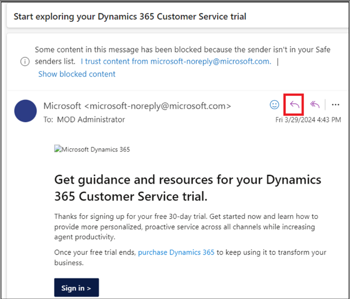
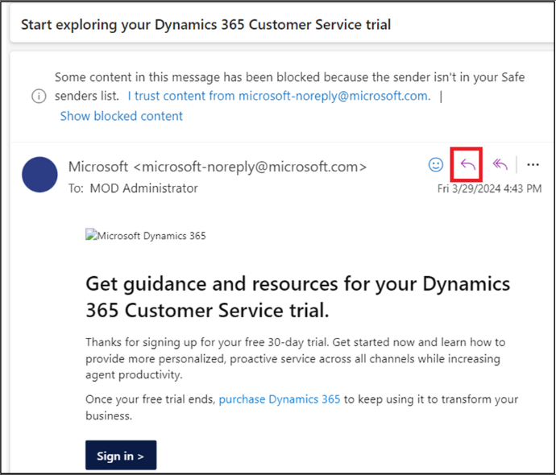

# 실습 9: Copilot for Sales를 사용하여 Outlook에서 이메일 작성, 이메일 요약 및 영업 기회 요약 보기

**참고**: 제품을 사용할 수 없는 경우 실습 11로 전환할 수 있습니다. 이
실습은 제품 가용성에 따라 나중에 수행할 수 있습니다.

## 연습 1: Copilot for sales 열기

1.  새 탭에서 [**www.outlook.com**](urn:gd:lg:a:send-vm-keys)링크를
    사용하여 **Outlook**을 엽니다.

2.  **Office 365 admin tenant**  자격 증명으로 로그인합니다.

3.  이메일을 엽니다. 이메일에서 **Apps**아이콘을 선택합니다.

4.  **Apps**아래에 **Copilot for Sales**가 표시되면 11단계를 바로 실행할
    수 있습니다.

5.  **Apps** 아래에 **Copilot for Sales**가 보이지 않으면 **More
    apps**을 선택한 다음 **Add apps**를 클릭합니다.

6.  **Apps** 페이지에서 [**Copilot for
    Sales**](urn:gd:lg:a:send-vm-keys) 를 검색한 다음 **Copilot for
    Sales** 앱을 선택합니다.

7.  Copilot for Sales 카드에**Add**를 선택합니다.

8.  다시 한번 **Copilot for Sales** 앱을 선택하고 **Open**를 클릭합니다.

9.  **Got it**를 선택합니다.

10. **Mails**으로 이동합니다.

11. 이메일을 엽니다. 이메일에서 **Apps**아이콘을 선택합니다.

12. 이제 **Copilot for Sales** 앱이 표시됩니다. **Copilot for
    Sales** 앱을 선택합니다.

13. 메시지가 표시되면 팝업 창에서 **Office 365 admin tenant** 자격
    증명으로 로그인합니다. Catch up and draft fast with Copilot이라는
    팝업이 나타나면 **Got it**를 선택합니다.

14. 오른쪽에 **Copilot for Sales** 창이 나타납니다. 환경을 선택합니다.
    이 실습에서는 **Sales Trial** 환경을 선택합니다.

15. **Get started**을 선택합니다.

16. 이제 **Copilot for Sales** 창을 사용할 수 있습니다.

# 연습 2: 이메일 요약 보기 및 저장

## 작업 1: 이메일 요약 보기

1.  **Outlook**에서 고객 이메일을 엽니다.

2.  **Apps \> Copilot for Sales** 창을 엽니다.

3.  이메일 요약은 **Key info** 카드에 표시됩니다.

**참고**

이메일 내용이 1000자 미만이면 이메일 요약이 생성되지 않으며, 이 이메일
요약 카드도 표시되지 않습니다.

### 작업 2: CRM에 이메일 요약 저장 

1.  **Key info** 카드에서 줄임표(…)를 클릭한 다음 **Save summary to
    Dynamics 365**을 선택합니다.

2.  **Select a record**에서 검색창에 "Coffee maker"를 입력하고, 추천
    레코드 중 하나를 선택하거나 검색창을 사용하여 다른 레코드를
    찾으세요.

연락처와 관련된 여러 기회가 있는 경우, Sales Copilot은 AI를 기준으로
순위가 매겨진 제안 기회 목록을 표시하여 요약을 저장합니다. 이 경우
기본적으로 첫 번째 기회가 선택됩니다.

**Note**

- 이메일이 이미 기회에 연결된 경우 기본적으로 선택됩니다..

- 연결 기회가 없는 경우, 계정 또는 연락처에 사용 가능한 진행 중인 기회와
  이메일 내용을 기준으로 순위가 가장 높은 기회가 기본적으로 선택됩니다.

- 레코드를 검색하면 검색 결과에 레코드 이름과 관리자가 선택한 주요
  필드가 표시됩니다.

- 검색 결과는 추천 레코드 목록에 추가되므로 안전하게 검색하고 다시
  시도할 수 있습니다.

- 현재 Sales Copilot을 사용하여 요약을 하나의 레코드에 저장할 수
  있습니다.

- 관리자가 Sales Copilot에 추가하고 활동에 활성화된 모든 레코드 유형에
  연결할 수 있습니다.

3.  **Save**를 선택합니다.

이메일 요약은 선택한 레코드에 대한 메모로 CRM에 저장됩니다. 모든
Microsoft Copilot for Sales 메모는 "\[AI generated\] Email summary from
Sales Copilot"이라는 동일한 제목을 공유하며, 이메일 제목과 메모가 저장된
타임스탬프를 포함합니다.

## 연습 3: Microsoft Outlook을 위한 Sales Copilot 추가 기능을 사용하여 이메일 회신 만들기

### 작업 1: 미리 정의된 범주를 사용하여 이메일 회신 만들기

1.  **Outlook**에서 고객 이메일을 열고 **Reply**를 선택합니다.

2.  **Apps**을 선택한 다음 **Copilot for Sales**를 선택합니다.

3.  Select **Copilot for Sales**.

4.  **Draft an email**을 선택합니다.

5.  미리 정의된 카테고리를 사용하여 이메일을 작성할 수 있습니다. 팁을
    닫습니다.

6.  제안된 콘텐츠를 **검토합니다**. 제안된 콘텐츠 중 하나를 선택합니다.
    예를 들어, **Address a concern**을 선택합니다.

7.  다른 제안을 생성하려면 '추가 옵션'을 선택한 다음 '다시 시도'를
    선택하세요. 필요한 경우 제안된 콘텐츠를 세부적으로 조정하세요.
    제안된 콘텐츠를 이전 버전으로 복원할 수도 있습니다.

다른 제안을 생성하려면 **More options**을 선택한 다음 **Try again**를
선택합니다. 필요한 경우 제안된 콘텐츠를 세부적으로 조정할 수 있습니다.
제안된 콘텐츠를 이전 버전으로 복원할 수도 있습니다.

8.  Copilot는 필요한 정보를 수집하고 응답합니다.

9.  이메일 내용을 선택하여 복사한 후 새 이메일 본문에 붙여넣습니다.

**참고:** 이메일 본문의 기존 내용은 대체되지 않습니다. 제안된 내용은
이메일 본문의 기존 내용 앞에 추가됩니다.

9.  필요에 따라 이메일 내용을 **수정한** 후 **Send** 를 클릭합니다.

### 작업 2: 사용자 지정 프롬프트를 사용하여 이메일 메시지 만들기

미리 정의된 응답 범주가 요구 사항에 맞지 않는 경우, 사용자 지정
프롬프트를 입력하여 제안된 콘텐츠를 생성할 수 있습니다. 고객 이메일에
답장하거나, 이메일을 읽거나, 새 이메일을 작성할 때 제안된 이메일
콘텐츠를 받을 수 있습니다.

**참고**

- 사용자 지정 프롬프트를 사용하여 제안된 이메일 콘텐츠를 생성할 경우 CRM
  정보가 표시되지 않습니다.

- 내부 이메일 주소가 포함된 이메일에 대해서도 추천 콘텐츠를 생성할 수
  있습니다. 모든 이메일 주소가 내부 이메일 주소인 경우, 사용자 지정
  프롬프트를 입력하는 옵션만 표시됩니다. 외부 이메일 주소를 추가하면
  미리 정의된 응답 범주가 제공됩니다.

1.  **Outlook**에서 고객 이메일을 열고 **Reply**를 선택합니다.

2.  **Apps**를 선택한 다음 **Copilot for Sales**를 선택합니다.

3.  **Copilot for Sales**를 선택합니다.

4.  **Draft an email**을 선택합니다.

**참고**

새 이메일을 작성하는 동안에는 미리 정의된 응답 범주를 사용할 수
없습니다. 사용자 지정 프롬프트를 입력하거나 영업 미팅을 요약하는
이메일만 만들 수 있습니다.

5.  텍스트박스에 보낼 답장 유형을 설명하는 문구(예: [**Send the
    acceptance**](urn:gd:lg:a:send-vm-keys))를 입력한 후 **Create
    draft**를 선택합니다.

6.  **Review** the suggested content. 제안된 내용을 **검토합니다**.

다른 제안을 생성하려면 More options을 선택한 다음Try again를 선택합니다.
필요한 경우 제안된 내용을 수정합니다. 제안된 내용을 이전 버전으로 복원할
수도 있습니다.

7.  copy를 선택하여 새 이메일 본문에 내용을 복사합니다.

**참고**: 이메일 본문의 기존 내용은 대체되지 않습니다. 제안된 내용은
이메일 본문의 기존 내용 앞에 추가됩니다.

8.  필요에 따라 이메일 내용을 편집한 후 **Send**합니다.

### 작업 3: 이메일 초안 수정

1.  적절한 응답 범주를 사용하여 제안된 답장을 생성합니다.

2.  **Adjust draft**를 선택합니다.

3.  **Draft with Copilot** 페이지에서 요구 사항에 따라
    **Length**, **Adjust tone** 및 **Suggest a meeting time** 탭을
    선택한 다음 **Update**를 선택합니다.

4.  추천 콘텐츠를 **검토합니다**.

다른 추천 콘텐츠를 생성하려면 More options을 선택한 다음 Try again를
선택하세요. 필요한 경우 추천 콘텐츠를 세부적으로 조정하세요. 추천
콘텐츠를 이전 버전으로 복원할 수도 있습니다.

5.  새 이메일 본문에 내용 copy 및 paste를 선택합니다.

**참고**: 이메일 본문의 기존 내용은 대체되지 않습니다. 제안된 내용은
이메일 본문의 기존 내용 앞에 추가됩니다.

6.  필요에 따라 이메일 내용을 편집한 후 **Send**합니다.

## 연습 4: 회의 제안 추가 또는 삭제

기본적으로 회의 시간은 제안된 콘텐츠에 포함되지 않습니다. 고객이 특정
시간에 회의를 요청하고 이메일에 해당 내용을 언급한 경우, 해당 회의
시간은 제안된 콘텐츠에 포함됩니다. 제안된 콘텐츠에 표시되는 회의 시간은
해당 지역의 시간대를 기준으로 합니다.

### 작업 1: 회의 시간 제안 추가

고객과 회의를 진행하려면 제안된 콘텐츠에 회의 시간을 포함할 수 있습니다.
제안된 회의 시간은 달력에서 가장 먼저 예약 가능한 시간입니다.

1.  **Outlook**에서 고객 이메일을 열고 **Reply**를 선택합니다.

2.  **Apps**를 선택한 다음 **Copilot for Sales**를 선택합니다.

3.  **Copilot for Sales**를 선택합니다.

4.  **Draft an email**를 선택합니다.

5.  미리 정의된 카테고리를 선택합니다.

6.  제안된 콘텐츠를 **검토합니다**. 제안된 콘텐츠 중 하나를 선택하세요.
    예를 들어, **Address a concern**을 선택합니다.

다른 제안을 생성하려면 More options를 선택한 다음 Try again를
선택합니다. 필요한 경우 제안된 콘텐츠를 세부적으로 조정합니다. 제안된
콘텐츠를 이전 버전으로 복원할 수도 있습니다.

7.  Copilot은 필요한 정보를 수집하고 응답합니다.

8.  **Adjust draft**을 선택합니다.

9.  **Suggest a meeting time**에서 표시된 회의 시간을 선택합니다.

10. **Update**를 선택합니다

11. 새 이메일 본문에 콘텐츠 copy 및 paste를 선택합니다.

> **참고**: 이메일 본문의 기존 내용은 바뀌지 않습니다. 제안된 내용은
> 이메일 본문의 기존 내용 앞에 추가됩니다.

12. 필요에 따라 이메일 내용을 편집한 후 전송합니다.

### 작업 2: 회의 시간 제안 삭제

1.  적절한 응답 범주를 사용하여 제안된 콘텐츠를 생성합니다.

2.  **Adjust draft**을 선택합니다.

3.  **Suggest a meeting time**에서 선택된 회의 시간을 선택 취소합니다.

4.  **Update**를 선택합니다.

## 연습 5: 영업 기회 요약 보기

1.  **Outlook**에서 이메일이나 예약된 회의를 엽니다.

2.  **Copilot for Sales** 창을 엽니다. **Save email to Dynamics**을
    클릭합니다.

3.  **First, turn on server-side sync**  대화 상자에서 **Turn on**를
    선택합니다.

4.  **Connect to a record**  페이지에서 Alex를 검색하고 검색 상자를
    사용하여 연락처를 선택합니다.

5.  연락처를 선택하고 **Save**를 클릭합니다.

6.  선택한 연락처의 기록에 이메일이 저장되면 **Copilot for Sales** 창에
    메시지가 표시됩니다.

7.  연락처를 선택하고 **Contact details** 페이지로 이동합니다.

8.  **Contact details** 페이지에서 **Opportunities** 영역으로 이동하여
    **Opportunities** 중 하나를 선택합니다.

9.  **Opportunity summary** 과 **Opportunity details** 는 **Opportunity
    summary card**에 표시됩니다.

