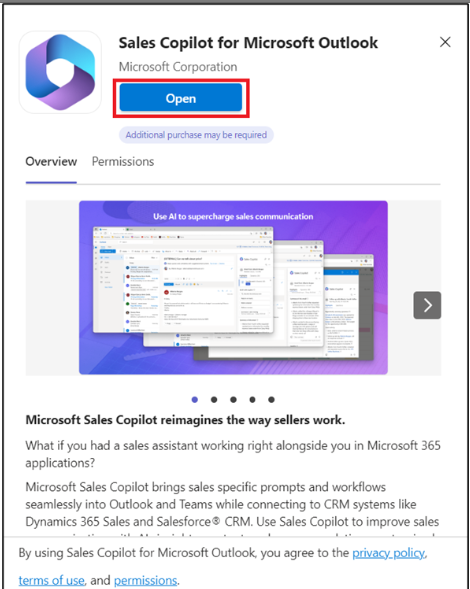

# Laboratorio 9: Redactar emails, visualizar email summary y opportunity summary en Outlook mediante Copilot for Sales

**Ojo:** Puede cambiar al laboratorio 11 si el producto no está
disponible. Puede realizar este laboratorio más tarde en función de la
disponibilidad.

## Ejercicio 1: Abra Copilot for Sales

1.  En una nueva pestaña, abra **Outlook** con el
    enlace [**www.outlook.com**](urn:gd:lg:a:send-vm-keys).

2.  Inicie sesión con sus **Office 365 admin tenant** credentials.

3.  Abra cualquiera de los emails. Cuando está en un email, seleccione
    el ícono **Apps**.

4.  Si puede ver **Copilot for Sales** en **Apps**, puede ejecutar
    directamente el paso 11.

5.  Si no ve **Copilot for Sales** en **Apps**, seleccione **More
    apps**, y haga clic en **Add apps**.

6.  En la página **Apps**, busque [**Copilot for
    Sales**](urn:gd:lg:a:send-vm-keys) y seleccione **Copilot for
    Sales** app.

7.  Seleccione **Add** en el Copilot for Sales card.

8.  Una vez más, seleccione **Copilot for Sales** app y haga clic
    en **Open**.

9.  Seleccione **Got it**.

10. Navegue a **Mails**.

11. Abra cualquiera de los emails. Cuando está en un email, seleccione
    el ícono **Apps**.

12. Ahora podrá ver el **Copilot for Sales** app. Seleccione **Copilot
    for Sales** app.

13. Si le pide, inicie sesión con sus **Office 365 admin
    tenant** credentials en el pop-up window. Si aparece el pop-up
    diciendo Catch up and draft fast with Copilot, seleccione **Got
    it**.

14. Aparece el panel **Copilot for Sales** en la parte derecha.
    Seleccione su environment. Para este laboratorio, seleccione **Sales
    Trial** environment.

15. Seleccione **Get started**.

16. Ahora puede usar el panel **Copilot for Sales**.

# Ejercicio 2: Visualice y guarde el email summary

## Tarea 1: Visualice el email summary

1.  En **Outlook**, abra un email del cliente.

2.  Abra el panel **Apps \> Copilot for Sales**.

3.  Se ve el email summary en el **Key info** card.

**Ojo**

Si el contenido del email es menos de 1000 letras, no se genera un email
summary, y no se muestra Summary de este email card.

### Tarea 2: Guarde el email summary a CRM

1.  En el **Key info** card, haga clic en los tres puntos (…) y
    seleccione **Save summary to Dynamics 365**.

2.  En **Select a record**, introduzca Coffee maker en el search box
    seleccione uno de los registros sugeridos o use el search box para
    buscar otro registro.

Si hay varias oportunidades relacionadas con el contacto, Sales Copilot
muestra una lista de suggested opportunities, clasificadas por AI, para
guardar el summary. En este caso, se selecciona la primera oportunidad
por defecto.

**Ojo**

- Si un email ya está conectado con un opportunity, se lo selecciona por
  defecto.

- Si no está conectado ningún opportunity, el opportunity mejor
  posicionado, lo cual se determina en función de los opportunities
  abiertas disponibles para la cuenta o el contacto, y el contenido del
  email, que se seleccionará por defecto.

- Cuando busca un record, los resultados muestran un record name y los
  key fields seleccionados por su admin.

- Se agregarán sus search results a la lista suggested records, entonces
  puede buscar de forma segura e intentar de nuevo.

- De momento, puede guardar el summary a un record con Sales Copilot.

- Puede conectarlo a todos record types que estén habilitados para
  actividades y agregados a Sales Copilot por su admin.

3.  Seleccione **Save**.

Se guarda el email summary a CRM como una nota al record seleccionado.
Todas las notas de Microsoft Copilot for Sales comparten el mismo
subject: "\[AI generated\] Email summary from Sales Copilot" e incluyen
tanto el subject del email como el timestamp cuando se guardó la nota.

## Ejercicio 3: Cree un email reply con Sales Copilot for Microsoft Outlook Add-in

### Tarea 1: Cree un email reply mediante categorías predefinidas

1.  En **Outlook**, abra un customer email y seleccione **Reply**.

2.  Seleccione **Apps** y luego seleccione **Copilot for Sales**.

3.  Seleccione **Copilot for Sales**.

4.  Seleccione **Draft an email**.

5.  Puede redactar un email con los pre-defined categories. Cierre el
    tip.

6.  **Revise** el contenido sugerido. Seleccione cualquiera del
    contenido sugerido. Por ejemplo, seleccione **Address a concern**.

Para generar una sugerencia diferente, seleccione **More options**, y
luego seleccione **Try again**. Refine el contenido sugerido, si se
requiere. También puede restaurar el contenido sugerido a la versión
anterior.

7.  Copilot recopila la información requerida y da una respuesta.

8.  Seleccione y copie el Email content y péguelo en el nuevo email.

**Ojo**: no se reemplaza el contenido existente del email. El contenido
sugerido será precedido por cualquier contenido existente del email
body.

9.  **Edite** el email content como sea necesario, y **Mándelo**.

### Tarea 2: Cree un mensaje de email con custom prompt

Si las categorías de respuestas predefinidas no cumplen sus requisitos,
puede introducir un prompt personalizado para generar el contenido
sugerido. Puede obtener contenido del email sugerido cuando responde a
un email del cliente, lee un email, o redacta un nuevo email.

**Ojo**

- No se ve la información de CRM al usar un prompt personalizado para
  generar el contenido del email sugerido.

- También puede generar contenido para los emails que contienen emails
  internos. Si todos los emails son internor, solo verá la opción de
  introducir un prompt personalizado. Si agrega un email externo, se
  hacen disponible las opciones de pre-defined response categories.

1.  En **Outlook**, abra un email del cliente y seleccione **Reply**.

2.  Seleccione **Apps** y luego seleccione **Copilot for Sales**.

3.  Seleccione **Copilot for Sales**.

4.  Seleccione **Draft an email**.

**Ojo**

Pre-defined response categories no están disponibles a la hora de
redactar un nuevo email. Solo puede introducir un custom prompt o crear
un email para resumir su sales meeting.

5.  En el textbox, introduzca una frase para describir el tipo de
    respuestas que quiere enviar, por ejemplo **Send the acceptance** y
    seleccione **Create draft**.

6.  **Revise** el contenido sugerido.

Para generar otra sugerencia, seleccione More options, y seleccione Try
again. Refine el suggested content, si es necesario. También puede
restaurarel contenido sugerido a la versión anterior.

7.  Seleccione copy and paste del content en el nuevo email body.

**Ojo**: No se reemplaza el contenido existente en el email body. El
suggested content está precedido por el contenido existente del email
body.

8.  **Edite** el contenido del email como sea necesario, y **Mándelo**.

### Tarea 3: Ajuste el email draft

1.  Genere el suggested reply con una response category adecuada.

2.  Seleccione **Adjust draft**.

3.  En la página **Draft with Copilot**, seleccione
    el **Length**, **Adjust tone** y **Suggest a meeting time** según
    sus necesidades y seleccione **Update**.

4.  **Revise** el suggested content.

Para generar una sugerencia diferente, seleccione More options, y
seleccione Try again. Refine el suggested content, si es necesario.
También puede restaurar el contenido sugerido a la versión anterior.

5.  Seleccione copy and paste del content en el new email body.

**Ojo**: No se reemplaza el contenido existente en el email body. El
suggested content está precedido por el contenido existente del email
body.

6.  **Edite** el email content como sea necesario, y **Mándelo**.

## Ejercicio 4: Agregue o quite meeting suggestion

Por defecto, no se incluye un meeting time en el contenido sugerido. Si
un cliente ha solicitado un meeting a cierta hora y lo ha mencionado en
el email, se incluye el meeting time en el suggested content. El meeting
time mostrado en el suggested content será en su zona horaria.

### Tarea 1: Agregue un meeting time suggestion

Su quiere tener una reunión con su cliente, puede incluir un meeting
time en el suggested content. El meeting time sugerido será el primer
hueco disponible de su calendario.

1.  En **Outlook**, abra un customer email y seleccione **Reply**.

2.  Seleccione **Apps** y seleccione **Copilot for Sales**.

3.  Seleccione **Copilot for Sales**.

4.  Seleccione **Draft an email**.

5.  Seleccione un pre-defined category.

6.  **Revise** el suggested content. Seleccione cualquiera del contenido
    sugerido. Por ejemplo, seleccione **Address a concern**.

Para generar una sugerencia diferente, seleccione More options, y luego
seleccione Try again. Refine el suggested content, si es necesario.
También puede restaurar el contenido sugerido a la versión anterior.

7.  Copilot recopila la información necesaria y da una respuesta.

8.  Seleccione **Adjust draft**.

9.  En **Suggest a meeting time**, seleccione el meeting time mostrado.

10. Seleccione **Update**.

11. Seleccione copy and paste del content en el new email body.

> **Ojo**: No se reemplaza el contenido existente en el email body. El
> suggested content está precedido por el contenido existente del email
> body.

12. **Edite** el email content como sea necesario, y **Mándelo**.

### Tarea 2: Quite el meeting time suggestion

1.  Genere el suggested content con una response category adecuada.

2.  Seleccione **Adjust draft**.

3.  En **Suggest a meeting time**, borre el meeting time seleccionado.

4.  Seleccione **Update**.

## Ejercicio 5: Visualice el opportunity summary

1.  En **Outlook**, abra un email o el scheduled meeting.

2.  Abra el panel **Copilot for Sales**. Haga clic en **Save email to
    Dynamics 365**.

3.  En el diálogo **First, turn on server-side sync**, seleccione **Turn
    on**.

4.  En la página **Connect to a record**, busque alex y seleccione el
    contacto con el search box.

5.  Seleccione el contacto y haga clic en **Save**.

6.  Una vez que se guarde el email al record del contacto seleccionado,
    se ve un mensaje en el panel **Copilot for Sales**.

7.  Seleccione el contact. Se le navegará a la página **Contact
    details**.

8.  En la página **Contact details**, vaya al área **Opportunities** y
    seleccione una de las oportunidades.

9.  Se ve **Opportunity summary** y **Opportunity details** en
    el **Opportunity summary card**.

