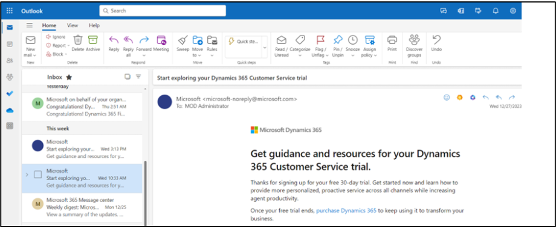
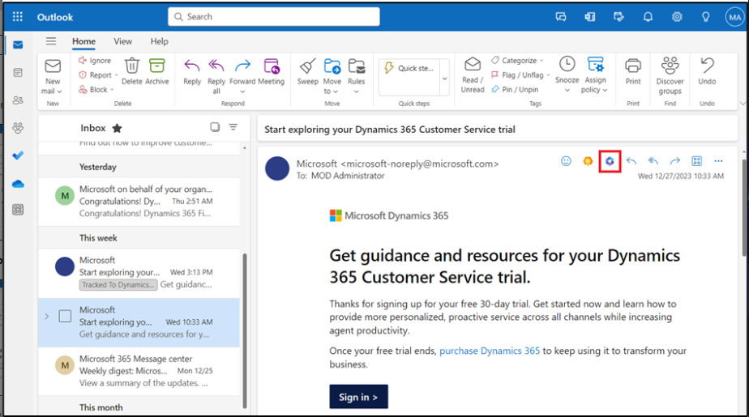

# 实验 9：使用 Copilot for Sales 撰写电子邮件、在 Outlook 中查看电子邮件摘要和业务机会摘要

**注意：**如果该产品不可用，您可以切换到 11
号实验室。您可以根据可用性稍后执行此实验。

## 练习 1：打开 Copilot for Sales 

1.  在新选项卡中，使用链接 [**www.outlook.com**](urn:gd:lg:a:send-vm-keys)
    打开 **Outlook**。

2.  使用 **Office 365 管理员租户**凭据登录。

3.  打开任何电子邮件。在电子邮件中，选择 **Apps** 图标。

4.  如果您可以在 **Apps** （应用程序） 下看到 **Copilot for
    Sales**，则可以直接执行步骤 11。

5.  如果您在 **Apps**下没有看到 **Copilot for Sales**，请选择 **More
    apps**，然后单击 **Add apps**。

6.  在 **Apps** 页面上，搜索 [**Copilot for
    Sales**](urn:gd:lg:a:send-vm-keys)，然后选择 **Copilot for Sales**
    应用程序。

7.  选择 **Add** on Copilot for Sales 卡。

8.  再次选择 **Copilot for Sales** 应用程序，然后单击**Open**。

9.  选择 **Got it** （知道了）。

10. 导航到 **Mails**。

11. 打开任何电子邮件。在电子邮件中，选择 **Apps** 图标。

12. 现在，您将能够看到 **Copilot for Sales** 应用程序。选择 **Copilot
    for Sales** 应用程序。

13. 如果系统提示，请在弹出窗口中使用您的 **Office 365
    管理员租户**凭据登录。如果出现弹出窗口，指出使用 Copilot
    快速赶上并起草，请选择 **Got it**。

14. **Copilot for Sales**
    窗格显示在右侧。选择您的环境。对于此实验室，请选择 **Sales Tria**l
    environment（Sales 试用环境）。

15. 选择 **Get started**。

16. 您现在可以使用 **Copilot for Sales** 窗格。

# 练习 2：查看和保存电子邮件摘要

## 任务 1：查看电子邮件摘要

1.  在 **Outlook** 中，打开客户电子邮件。

2.  打开 **Apps \> Copilot for Sales** 窗格。

3.  电子邮件摘要显示在 **Key info** 卡中。

**注意**

如果电子邮件内容少于 1000
个字符，则不会生成电子邮件摘要，并且不会显示此电子邮件卡的摘要。

### 任务 2：将电子邮件摘要保存到 CRM

1.  在 **Key info** 卡中，单击省略号 （...），然后选择 **Save summary to
    Dynamics 365**。

2.  在 **Select a record** （选择记录） 下，在搜索框中输入 Coffee
    maker（咖啡机），选择建议的记录之一或使用搜索框查找其他记录。

如果有多个与联系人相关的商机，Sales Copilot 将显示一个建议商机列表（按
AI 排名）以保存摘要。在这种情况下，默认情况下会选择第一个商机。

**注意**

- 如果电子邮件已连接到业务机会，则默认选中该电子邮件。

- 如果未连接任何商机，则默认情况下将选择排名靠前的商机，该商机由客户或联系人可用的打开商机以及电子邮件的内容决定。

- 当您搜索记录时，搜索结果将显示管理员选择的记录名称和关键字段。

- 您的搜索结果将添加到建议的记录列表中，因此您可以安全地搜索并重试。

- 目前，您可以使用 Sales Copilot 将摘要保存到一条记录中。

- 您可以连接到为活动启用并由管理员添加到 Sales Copilot 的所有记录类型。

3.  选择 **Save** （保存）。

电子邮件摘要将作为所选记录的注释保存到 CRM 中。所有 Microsoft Copilot
for Sales 注释都共享相同的主题：“\[AI 生成的\] 来自 Sales Copilot
的电子邮件摘要”，并包括电子邮件本身的主题，以及保存注释时的时间戳。

## 练习 3：使用 Sales Copilot for Microsoft Outlook 加载项创建电子邮件回复

### 任务 1：使用预定义类别创建电子邮件回复

1.  在 **Outlook** 中，打开客户电子邮件，然后选择 **Reply**。

2.  选择 **Apps**，然后选择 **Copilot for Sales**。

3.  选择 **Copilot for Sales**。

4.  选择 **Draft an email** （草稿电子邮件）。

5.  您可以起草具有预定义类别的电子邮件。关闭提示。

6.  **查看**建议的内容。选择任何建议的内容。例如，选择 **Address a
    concern**（解决问题）。

要生成其他建议，请选择 **More options** （更多选项），然后选择 **Try
again**
（重试）。如果需要，优化建议的内容。您还可以将建议的内容恢复到以前的版本。

7.  Copilot 收集所需信息并给出响应。

8.  选择并复制 Email content 并将其粘贴到新的电子邮件正文中。

**注意：**电子邮件正文中的现有内容不会被替换。建议的内容将添加到电子邮件正文中的任何现有内容之前。

9.  根据需要**编辑**电子邮件内容，然后单击 **Send it**。

### 任务 2：使用自定义提示创建电子邮件

如果预定义的响应类别不符合您的要求，您可以输入自定义提示以生成建议的内容。您可以在回复客户电子邮件、阅读电子邮件或撰写新电子邮件时获取建议的电子邮件内容。

**注意**

- 使用自定义提示生成建议的电子邮件内容时，不会显示来自 CRM 的信息。

- 您还可以为包含内部电子邮件地址的电子邮件生成建议内容。如果所有电子邮件地址都是内部地址，则您只会看到输入自定义提示的选项。如果您添加外部电子邮件地址，则预定义的响应类别将可用。

1.  在 **Outlook** 中，打开客户电子邮件，然后选择 **Reply**。

2.  选择 **Apps**，然后选择 **Copilot for Sales**。

3.  选择**Copilot for Sales**。

4.  选择 **Draft an email** （草稿电子邮件）。

**注意**

撰写新电子邮件时，预定义的响应类别不可用。您只能输入自定义提示或创建电子邮件来总结您的销售会议。

5.  在文本框中，输入一个短语来描述您要发送的回复类型，例如， [**Send the
    acceptance**](urn:gd:lg:a:send-vm-keys)，然后选择 **Create draft**。

6.  **查看**建议的内容。

要生成其他建议，请选择 More options （更多选项），然后选择 Try again
（重试）。如果需要，优化建议的内容。您还可以将建议的内容恢复到以前的版本。

7.  选择 复制 并粘贴新电子邮件正文中的内容。

**注意：**电子邮件正文中的现有内容不会被替换。建议的内容将添加到电子邮件正文中的任何现有内容之前。

8.  根据需要**编辑**电子邮件内容，然后单击 **Send it**。

### 任务 3：调整电子邮件草稿

1.  使用适当的响应类别生成建议的回复。

2.  选择 **Adjust draft**。

3.  在 “**Draft with Copilot**” 页面上，根据您的要求选择 **Length**,
    **Adjust tone** 和 **Suggest a meeting time** 选项卡，然后选择
    “**Update**” 。

4.  **查看**建议的内容。

要生成其他建议，请选择 More options （更多选项），然后选择 Try again
（重试）。如果需要，优化建议的内容。您还可以将建议的内容恢复到以前的版本。

5.  选择 复制 并粘贴新电子邮件正文中的内容。

**注意：**电子邮件正文中的现有内容不会被替换。建议的内容将添加到电子邮件正文中的任何现有内容之前。

6.  根据需要**编辑**电子邮件内容，然后单击 **Send it**。

## 练习 4：添加或删除会议建议

默认情况下，建议的内容中不包含会议时间。如果客户在特定时间请求了会议并在电子邮件中提到了相同的会议，则会议时间将包含在建议的内容中。建议内容中显示的会议时间采用您的时区。

### 任务 1：添加会议时间建议

如果您想与客户开会，您可以在建议的内容中包含会议时间。建议的会议时间是日历中的第一个可用时段。

1.  在 **Outlook** 中，打开客户电子邮件，然后选择 **Reply**。

2.  选择 **Apps**，然后选择 **Copilot for Sales**。

3.  选择 **Copilot for Sales**。

4.  选择 **Draft an email** （草稿电子邮件）。

5.  选择预定义的类别。

6.  **查看**建议的内容。选择任何建议的内容。例如，选择 **Address** **a
    concern**（解决问题）。

要生成其他建议，请选择 More options （更多选项），然后选择 Try again
（重试）。如果需要，优化建议的内容。您还可以将建议的内容恢复到以前的版本。

7.  Copilot 收集所需信息并给出响应。

8.  选择 **Adjust draft**。

9.  在 **Suggest a meeting time** （建议会议时间）
    下，选择显示的会议时间。

10. 选择 **Update** （更新）。

11. 选择 复制 并粘贴新电子邮件正文中的内容。

> **注意：**电子邮件正文中的现有内容不会被替换。建议的内容将添加到电子邮件正文中的任何现有内容之前。

12. 根据需要**编辑**电子邮件内容，然后单击 **Send it**。

### 任务 2：删除会议时间建议

1.  使用适当的响应类别生成建议的内容。

2.  选择 **Adjust draft**。

3.  在 **Suggest a meeting time** （建议会议时间）
    下，清除所选的会议时间。

4.  选择 **Update** （更新）。

## 练习 5：查看业务机会摘要

1.  在 **Outlook** 中，打开电子邮件或已安排的会议。

2.  打开 **Copilot for Sales** 窗格。单击**Save email to Dynamics
    365**。

3.  在 **First， turn on server-side sync** 对话框中，选择 **Turn on**。

4.  在 **Connect to a record** （连接到记录） 页面上，搜索 alex
    并使用搜索框选择联系人。

5.  选择联系人，然后单击 **Save** （保存）。

6.  将电子邮件保存到所选联系人的记录后，**Copilot for Sales**
    窗格上会显示一条消息。

7.  选择联系人。您将导航到 **Contact details** （联系人详细信息） 页面。

8.  在 **Contact details** （联系人详细信息） 页面上，转到
    **Opportunities** （机会） 区域，然后选择其中一个机会。

9.  的 **Opportunity summary** 和 **Opportunity details** 显示在
    **Opportunity summary card** 中。

