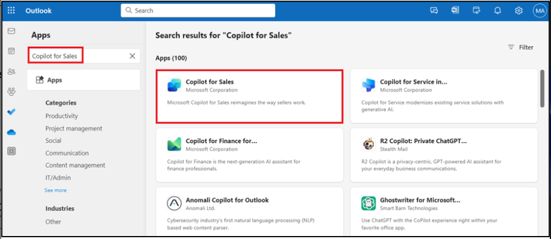
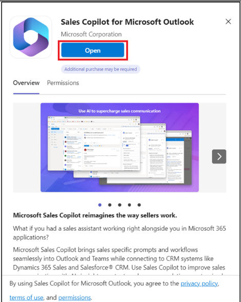
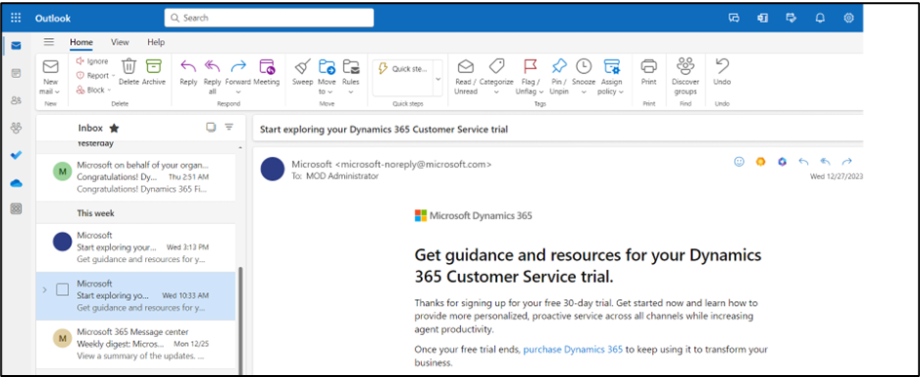
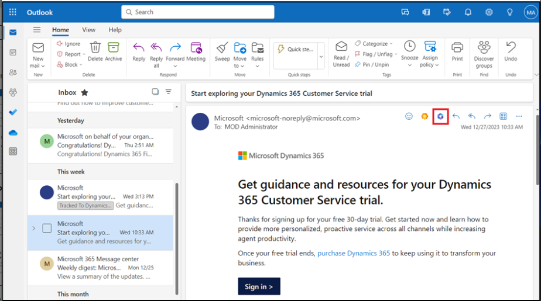
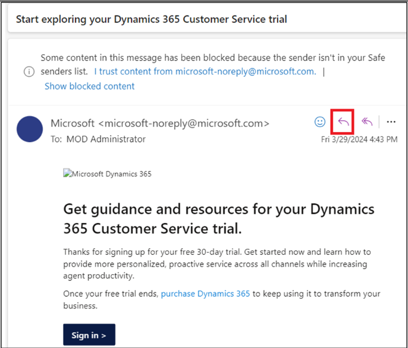
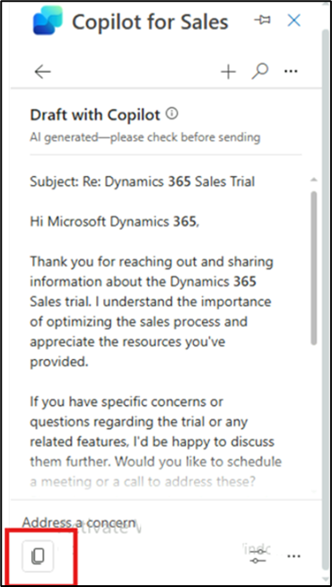
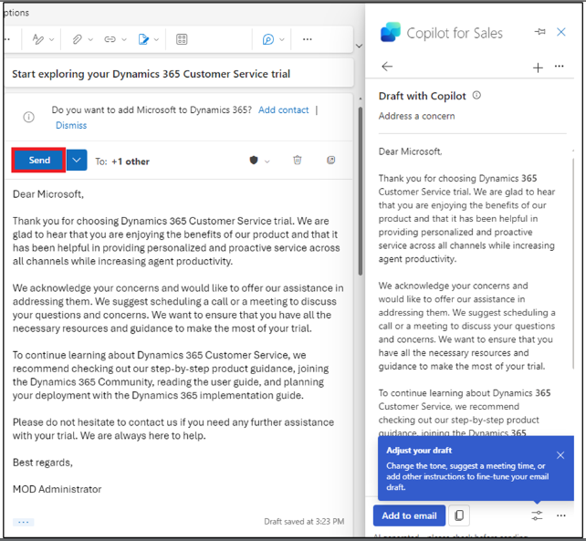
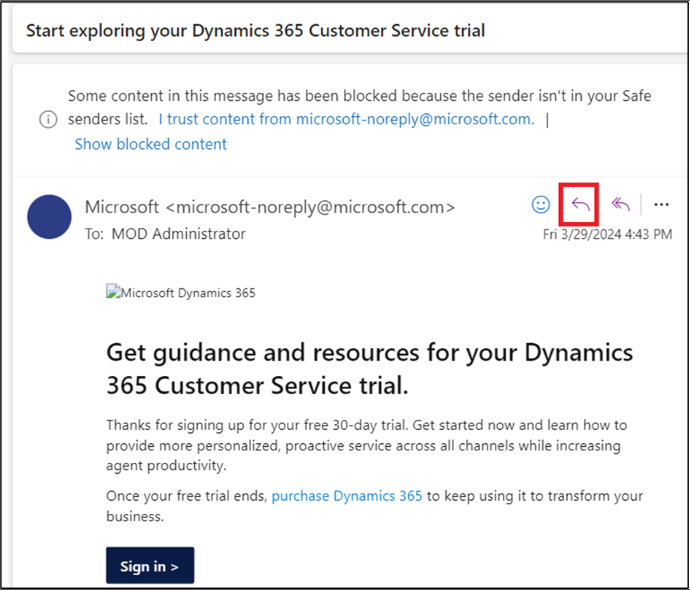
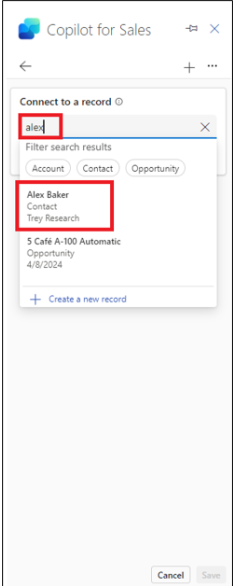

# Lab 9: Verfassen von E-Mails, Anzeigen von E-Mail-Zusammenfassungen und Opportunity-Zusammenfassungen in Outlook mit Copilot for Sales

**Hinweis:** Sie können zu Labornummer 11 wechseln, wenn das Produkt
nicht verfügbar ist. Sie können dieses Lab je nach Verfügbarkeit später
ausführen.

## Übung 1: Öffnen von Copilot für den Vertrieb

1.  Öffnen Sie **Outlook** in einem neuen Tab über den Link
    [**www.outlook.com**](urn:gd:lg:a:send-vm-keys).

2.  Melden Sie sich mit den Anmeldeinformationen Ihres **Office
    365-Administratormandanten** an.

3.  Öffnen Sie eine der E-Mails. Wählen Sie in einer E-Mail das Symbol
    **Apps** aus.

4.  Wenn **Copilot for Sales** unter **Apps** angezeigt wird, können Sie
    Schritt 11 direkt ausführen.

5.  Wenn **Copilot for Sales** unter **Apps** nicht angezeigt wird,
    wählen Sie **More Apps** aus und klicken Sie dann auf **Add**
    **Apps**.

6.  Suchen Sie auf der Seite **Apps** nach [**Copilot for
    Sales**](urn:gd:lg:a:send-vm-keys) und wählen Sie dann **Copilot for
    Sales** App aus.

7.  Wählen Sie **Add** Copilot for Sales card aus.

8.  Wählen Sie erneut die **Copilot for** **Sales-App** aus und klicken
    Sie auf **Open.**

9.  Wählen Sie **Got it** aus.

10. Navigieren Sie zu den **Mails**.

11. Öffnen Sie eine der E-Mails. Wählen Sie in einer E-Mail das Symbol
    **Apps** aus.

12. Jetzt können Sie die **Copilot for** **Sales-App** sehen. Wählen Sie
    die **Copilot for** **Sales**-App aus.

13. Melden Sie sich im Popupfenster mit den Anmeldeinformationen **Ihres
    Office 365-Administratormandanten** an. Wenn das Pop-up-Fenster "
    Catch up and draft fast with Copilot " angezeigt wird, wählen Sie
    **Got it** aus.

14. Der Bereich **Copilot for Sales** wird auf der rechten Seite
    angezeigt. Wählen Sie Ihre Umgebung aus. Wählen Sie für dieses Lab
    die Option **Sales Trial-Umgebung** aus.

15. Wählen Sie **Get started** aus.

16. Sie können jetzt den Bereich **Copilot for Sales** verwenden.

# Übung 2: Anzeigen und Speichern der E-Mail-Zusammenfassung

## Aufgabe 1: Anzeigen der E-Mail-Zusammenfassung

1.  Öffnen Sie in **Outlook** eine Kunden-E-Mail.

2.  Öffnen Sie den Bereich **"Apps" \> Copilot for Sales**.

3.  Die E-Mail-Zusammenfassung wird auf der **Key Indo Card** angezeigt.

**Anmerkung**

Wenn der E-Mail-Inhalt weniger als 1000 Zeichen umfasst, wird die
E-Mail-Zusammenfassung nicht generiert und die Zusammenfassung dieser
E-Mail-Karte wird nicht angezeigt.

### Aufgabe 2: Speichern der E-Mail-Zusammenfassung im CRM

1.  Klicken Sie auf der Kachel **Key Info Card** auf die
    Auslassungspunkte (...), und wählen Sie dann **Save summary to
    Dynamics 365** aus.

2.  Geben Sie unter **Select a record** den Namen Coffee maker in das
    Suchfeld ein, wählen Sie einen der vorgeschlagenen Datensätze aus,
    oder verwenden Sie das Suchfeld, um einen anderen Datensatz zu
    finden.

Wenn es mehrere Verkaufschancen im Zusammenhang mit dem Kontakt gibt,
zeigt Sales Copilot eine Liste der vorgeschlagenen Verkaufschancen an,
die nach AI geordnet sind, um die Zusammenfassung zu speichern. In
diesem Fall ist die erste Verkaufschance standardmäßig ausgewählt.

**Anmerkung**

- Wenn die E-Mail bereits mit einer Verkaufschance verknüpft ist, ist
  sie standardmäßig ausgewählt.

&nbsp;

- Wenn keine Verkaufschance verknüpft ist, wird standardmäßig die
  Verkaufschance mit dem höchsten Rang ausgewählt, die durch die für die
  Firma oder den Kontakt verfügbaren offenen Verkaufschancen und den
  Inhalt der E-Mail bestimmt wird.

1.  Wenn Sie nach einem Datensatz suchen, werden in den Suchergebnissen
    der Name des Datensatzes und die von Ihrem Administrator
    ausgewählten Schlüsselfelder angezeigt.

2.  Ihre Suchergebnisse werden der Liste der vorgeschlagenen Datensätze
    hinzugefügt, sodass Sie sicher suchen und es erneut versuchen
    können.

3.  Derzeit können Sie die Zusammenfassung mit Sales Copilot in einem
    Datensatz speichern.

4.  Sie können eine Verbindung zu allen Datensatztypen herstellen, die
    für Aktivitäten aktiviert und von Ihrem Administrator zu Sales
    Copilot hinzugefügt wurden.

&nbsp;

3.  Wählen Sie **Save** aus.

Die E-Mail-Zusammenfassung wird als Notiz zum ausgewählten Datensatz in
CRM gespeichert. Alle Microsoft Copilot for Sales-Notizen haben
denselben Betreff: "\[AI generated\] E-Mail-Zusammenfassung von Sales
Copilot" und enthalten den Betreff der E-Mail selbst sowie den
Zeitstempel, zu dem die Notiz gespeichert wurde.

## Übung 3: Erstellen einer E-Mail-Antwort mit dem Sales Copilot für Microsoft Outlook-Add-In

### Aufgabe 1: Erstellen einer E-Mail-Antwort mit vordefinierten Kategorien

1.  Öffnen Sie in **Outlook** eine Kunden-E-Mail, und wählen Sie
    **Reply** aus.

2.  Wählen Sie **Apps** und dann **Copilot for Sales** aus.

3.  Wählen Sie **Copilot for Sales** aus.

4.  Wählen Sie **Draft an email** aus.

5.  Sie können eine E-Mail mit den vordefinierten Kategorien verfassen.
    Schließen Sie es in der Ecke.

6.  **Überprüfen Sie** den vorgeschlagenen Inhalt. Wählen Sie einen der
    vorgeschlagenen Inhalte aus. Wählen Sie z. B. **Address a concern**
    aus.

Um einen anderen Vorschlag zu generieren, wählen Sie **More Options**
und dann **Try Again** aus. Verfeinern Sie bei Bedarf den
vorgeschlagenen Inhalt. Sie können den vorgeschlagenen Inhalt auch in
der vorherigen Version wiederherstellen.

7.  Copilot sammelt die erforderlichen Informationen und gibt eine
    Antwort.

8.  Wählen Sie den E-Mail-Inhalt aus, kopieren Sie ihn und fügen Sie ihn
    in die neue E-Mail-Datei ein.

**Hinweis**: Vorhandene Inhalte im E-Mail-Text werden nicht ersetzt. Der
vorgeschlagene Inhalt wird allen vorhandenen Inhalten im E-Mail-Text
vorangestellt.

9.  **Bearbeiten Sie** den E-Mail-Inhalt nach Bedarf, und **senden** Sie
    ihn dann.

### Aufgabe 2: Erstellen einer E-Mail-Nachricht mit einer benutzerdefinierten Eingabeaufforderung

Wenn die vordefinierten Antwortkategorien nicht Ihren Anforderungen
entsprechen, können Sie eine benutzerdefinierte Eingabeaufforderung
eingeben, um vorgeschlagene Inhalte zu generieren. Sie können
vorgeschlagene E-Mail-Inhalte erhalten, wenn Sie auf eine Kunden-E-Mail
antworten, eine E-Mail lesen oder eine neue E-Mail verfassen.

**Anmerkung**

- Informationen aus CRM werden nicht angezeigt, wenn eine
  benutzerdefinierte Eingabeaufforderung verwendet wird, um
  vorgeschlagene E-Mail-Inhalte zu generieren.

- Sie können auch vorgeschlagene Inhalte für E-Mails generieren, die
  interne E-Mail-Adressen enthalten. Wenn alle E-Mail-Adressen intern
  sind, wird nur die Option zum Eingeben einer benutzerdefinierten
  Eingabeaufforderung angezeigt. Wenn Sie eine externe E-Mail-Adresse
  hinzufügen, werden vordefinierte Antwortkategorien zur Verfügung
  gestellt.

1.  Öffnen Sie in **Outlook** eine Kunden-E-Mail, und wählen Sie
    **Reply** aus.

2.  Wählen Sie **Apps** und dann **Copilot for Sales** aus.

3.  Wählen Sie **Copilot for Sales** aus.

4.  Wählen Sie **Draft an email** aus.

**Anmerkung**

Vordefinierte Antwortkategorien sind beim Verfassen einer neuen E-Mail
nicht verfügbar. Sie können nur eine benutzerdefinierte
Eingabeaufforderung eingeben oder eine E-Mail erstellen, um Ihr
Verkaufsgespräch zusammenzufassen.

5.  Geben Sie im Textfeld einen Ausdruck ein, um die Art der Antwort zu
    beschreiben, die Sie senden möchten, z. B. [**[Send the
    acceptance](urn:gd:lg:a:send-vm-keys),**](urn:gd:lg:a:send-vm-keys)
    und wählen Sie dann **Create Draft** aus.

6.  **Überprüfen des** vorgeschlagenen Inhalts.

Um einen anderen Vorschlag zu generieren, wählen Sie Weitere Optionen
und dann erneut versuchen aus. Verfeinern Sie bei Bedarf den
vorgeschlagenen Inhalt. Sie können den vorgeschlagenen Inhalt auch in
der vorherigen Version wiederherstellen.

7.  Wählen Sie Kopieren und fügen Sie den Inhalt in den neuen
    E-Mail-Text ein.

**Hinweis**: Vorhandene Inhalte im E-Mail-Text werden nicht ersetzt. Der
vorgeschlagene Inhalt wird allen vorhandenen Inhalten im E-Mail-Text
vorangestellt.

8.  **Bearbeiten Sie** den E-Mail-Inhalt nach Bedarf, und **senden** Sie
    ihn dann.

### Aufgabe 3: Anpassen des E-Mail-Entwurfs

1.  Generieren Sie die vorgeschlagene Antwort mit einer geeigneten
    Antwortkategorie.

2.  Wählen Sie **Adjust draft** aus.

3.  Wählen Sie auf der Seite **Draft with Copilot** die Option
    **Length**, **Adjust tone** und **Suggest a meeting
    time** Registerkarten aus, gemäß Ihren Anforderungen und wählen Sie
    dann **Update**.

4.  **Überprüfen des** vorgeschlagenen Inhalts.

Um einen anderen Vorschlag zu generieren, wählen Sie More Options und
dann Try Again aus. Verfeinern Sie bei Bedarf den vorgeschlagenen
Inhalt. Sie können den vorgeschlagenen Inhalt auch in der vorherigen
Version wiederherstellen.

5.  Wählen Sie Kopieren und fügen Sie den Inhalt in den neuen
    E-Mail-Text ein.

**Hinweis**: Vorhandene Inhalte im E-Mail-Text werden nicht ersetzt. Der
vorgeschlagene Inhalt wird allen vorhandenen Inhalten im E-Mail-Text
vorangestellt.

6.  **Bearbeiten Sie** den E-Mail-Inhalt nach Bedarf, und **senden** Sie
    ihn dann.

## Übung 4: Hinzufügen oder Entfernen von Besprechungsvorschlägen

Standardmäßig ist eine Besprechungszeit nicht in den vorgeschlagenen
Inhalten enthalten. Wenn ein Kunde ein Meeting zu einem bestimmten
Zeitpunkt angefordert und dies in einer E-Mail erwähnt hat, wird die
Meeting-Zeit in den vorgeschlagenen Inhalt aufgenommen. Die im
vorgeschlagenen Inhalt angezeigte Besprechungszeit befindet sich in
Ihrer Zeitzone.

### Aufgabe 1: Hinzufügen eines Vorschlags für eine Besprechungszeit

Wenn Sie eine Besprechung mit einem Kunden abhalten möchten, können Sie
eine Besprechungszeit in den vorgeschlagenen Inhalt aufnehmen. Die
vorgeschlagene Besprechungszeit ist der erste verfügbare Zeitfenster in
Ihrem Kalender.

1.  Öffnen Sie in **Outlook** eine Kunden-E-Mail, und wählen Sie Reply
    aus.

2.  Wählen Sie **Apps** und dann **Copilot for Sales** aus.

3.  Wählen Sie **Copilot for Sales** aus.

4.  Wählen Sie **Draft an email** aus.

5.  Wählen Sie eine vordefinierte Kategorie aus.

6.  **Überprüfen Sie** den vorgeschlagenen Inhalt. Wählen Sie einen der
    vorgeschlagenen Inhalte aus. Wählen Sie z. B. **Address a concern**
    aus.

Um einen anderen Vorschlag zu generieren, wählen Sie Weitere Optionen
und dann erneut versuchen aus. Verfeinern Sie bei Bedarf den
vorgeschlagenen Inhalt. Sie können den vorgeschlagenen Inhalt auch in
der vorherigen Version wiederherstellen.

7.  Copilot sammelt die erforderlichen Informationen und gibt eine
    Antwort.

8.  Wählen Sie **Adjust draft** aus.

9.  Unter **Suggest a meeting time**, wählen Sie die angezeigte
    Besprechungszeit aus.

10. Wählen Sie **Update** aus.

11. Wählen Sie Kopieren und fügen Sie den Inhalt in den neuen
    E-Mail-Text ein.

> **Hinweis**: Vorhandene Inhalte im E-Mail-Text werden nicht ersetzt.
> Der vorgeschlagene Inhalt wird allen vorhandenen Inhalten im
> E-Mail-Text vorangestellt.

12. **Bearbeiten Sie** den E-Mail-Inhalt nach Bedarf, und **senden** Sie
    ihn dann.

### Aufgabe 2: Entfernen des Vorschlags für die Besprechungszeit

1.  Generieren Sie den vorgeschlagenen Inhalt mit einer geeigneten
    Antwortkategorie.

2.  Wählen Sie **Adjust draft** aus.

3.  Unter **Suggest a meeting time**, löschen Sie die ausgewählte
    Besprechungszeit.

4.  Wählen Sie **Update** aus.

## Übung 5: Anzeigen der Zusammenfassung der Verkaufschance

1.  Öffnen Sie in **Outlook** eine E-Mail oder die geplante Besprechung.

2.  Öffnen des Bereichs **Copilot for Sales**. Klicken Sie auf **Save
    E-Mail to Dynamics 365**.

3.  Auf der Dialog Box **First, turn on server-side sync**, wählen Sie
    **Turn on** aus.

4.  Suchen Sie auf der Seite **Connect to a record** nach Alex, und
    wählen Sie den Kontakt über das Suchfeld aus.

5.  Wählen Sie den Kontakt aus und klicken Sie auf **Save**.

6.  Nachdem die E-Mail im Datensatz des ausgewählten Kontakts
    gespeichert wurde, wird eine Nachricht im Bereich **Copilot for
    Sales** angezeigt.

7.  Wählen Sie den Kontakt aus. Sie werden zur Seite mit den **Contact
    Details** weitergeleitet.

8.  Wechseln Sie auf der Seite **Contact details** zum Bereich
    **Opportunities** und wählen Sie eine der Opportunities aus.

9.  Die **Opportunity summary** und **Opportunity details** werden in
    der **Opportunity summary card** angezeigt**.**

