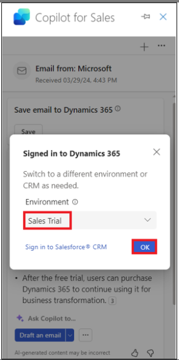

# Lab 9: Composizione di e-mail, visualizzazione del riepilogo delle e-mail e del riepilogo delle opportunità in Outlook utilizzando Copilot for Sales

**NOTA:** È possibile passare al laboratorio numero 11 se il prodotto
non è disponibile. È possibile eseguire questo lab in un secondo momento
in base alla disponibilità.

## Esercizio 1: Aprire il Copilot per le vendite

1.  In una nuova scheda, apri **Outlook** utilizzando il collegamento
    [**www.outlook.com**](urn:gd:lg:a:send-vm-keys).

2.  Accedere con le credenziali del **Office 365 admin tenant**.

3.  Apri una qualsiasi delle e-mail. Durante un'e-mail, seleziona
    l'icona **Apps**.

4.  Se è possibile visualizzare **Copilot for Sales** in **Apps**, è
    possibile eseguire direttamente il passaggio 11.

5.  Se **Copilot for Sales** non è visualizzato in **Apps**, selezionare
    **More apps** e quindi fare clic su **Add apps**.

6.  Nella pagina **Apps** cercare [**Copilot for
    Sales**](urn:gd:lg:a:send-vm-keys) e quindi selezionare l'app
    **Copilot for Sales.**

7.  Seleziona **Add** su Copilot per la scheda Vendite.

8.  Ancora una volta, seleziona l'app **Copilot for Sales** e fai clic
    su **Open**.

9.  Seleziona **Got it.**

10. Vai alla **Mails**.

11. Apri una qualsiasi delle e-mail. Durante un'e-mail, seleziona
    l'icona **Apps**.

12. Ora sarai in grado di vedere l' app **Copilot for Sales**. Seleziona
    l'app **Copilot for Sales.**

13. Se richiesto, accedere con le credenziali del **Office 365 admin
    tenant** nella finestra popup. Se viene visualizzato un popup che
    dice Recupera e disegna velocemente con Copilot,seleziona **Got
    it**.

14. Il riquadro **Copilot for Sales** viene visualizzato sul lato
    destro. Seleziona il suoi ambiente. Per questo lab, selezionare
    Ambiente **Sales Trial**.

15. Seleziona **Get Started**.

16. È ora possibile utilizzare il riquadro **Copilot for Sales**.

# Esercizio 2: Visualizzare e salvare il riepilogo tramite posta elettronica

## Attività 1: Visualizzare il riepilogo delle e-mail

1.  In **Outlook** aprire un messaggio di posta elettronica del cliente.

2.  Aprire il riquadro **Apps \> Copilot for Sales**.

3.  Il riepilogo dell'e-mail viene visualizzato nella scheda **Key
    info**.

**Nota**

Se il contenuto dell'e-mail è inferiore a 1000 caratteri, il riepilogo
dell'e-mail non verrà generato e il riepilogo di questa scheda e-mail
non verrà visualizzato.

### Attività 2: Salvare il riepilogo tramite posta elettronica in CRM

1.  Nella scheda **Key info**, fai clic sui puntini di sospensione (...)
    e quindi seleziona **Save summary to Dynamics 365**.

2.  In **Select a record** immettere **Coffee Maker** nella casella di
    ricerca, selezionare uno dei record suggeriti o utilizzare la
    casella di ricerca per trovare un altro record.

Se sono presenti più opportunità correlate al contatto, Sales Copilot
visualizza un elenco di opportunità suggerite, classificate
dall'intelligenza artificiale, per salvare il riepilogo. In questo caso,
per impostazione predefinita viene selezionata la prima opportunità.

**Nota**

- Se l'e-mail è già collegata a un'opportunità, è selezionata per
  impostazione predefinita.

- Se non è collegata alcuna opportunità, per impostazione predefinita
  verrà selezionata l'opportunità con il punteggio più alto, determinata
  dalle opportunità aperte disponibili per l'account o il contatto e dal
  contenuto dell'e-mail.

- Quando si cerca un record, nei risultati della ricerca vengono
  visualizzati il nome del record e i campi chiave selezionati
  dall'amministratore.

- I risultati della ricerca verranno aggiunti all'elenco dei record
  suggeriti, in modo da poter cercare e riprovare in sicurezza.

- Attualmente, è possibile salvare il riepilogo in un unico record
  utilizzando Sales Copilot.

- È possibile connettersi a tutti i tipi di record abilitati per gli
  impegni e aggiunti a Sales Copilot dall'amministratore.

3.  Seleziona **Save**.

Il riepilogo tramite posta elettronica viene salvato in CRM come nota
per il record selezionato. Tutte le note di Microsoft Copilot for Sales
condividono lo stesso oggetto: "\[AI generated\] Email summary from
Sales Copilot" e includono l'oggetto dell'email stessa, nonché il
timestamp in cui la nota è stata salvata.

## Esercizio 3: Creare una risposta e-mail utilizzando il componente aggiuntivo Sales Copilot per Microsoft Outlook

### Attività 1: Creare una risposta e-mail utilizzando categorie predefinite

1.  In **Outlook**, apri un messaggio di posta elettronica del cliente e
    seleziona **Reply**.

2.  Seleziona **Apps**, quindi seleziona **Copilot for Sales**.

3.  Seleziona **Copilot for Sales**.

4.  Seleziona **Draft an email**.

5.  Puoi redigere un'e-mail con le categorie predefinite. Chiudere la
    punta.

6.  **Review** i contenuti suggeriti. Seleziona uno dei contenuti
    suggeriti. Ad esempio, selezionare **Address a concern**.

Per generare un suggerimento diverso, selezionare **More options**,
quindi selezionare **Try again**. Perfeziona il contenuto suggerito, se
necessario. È inoltre possibile ripristinare il contenuto suggerito alla
versione precedente.

7.  Copilot raccoglie le informazioni richieste e fornisce una risposta.

8.  Seleziona e copia il contenuto dell'e-mail e incollalo nel nuovo
    corpo dell'e-mail.

**Nota**: il contenuto esistente nel corpo dell'email non viene
sostituito. Il contenuto suggerito viene anteposto a qualsiasi contenuto
esistente nel corpo del messaggio di posta elettronica.

9.  **Edit** il contenuto dell'email in base alle esigenze, quindi
    **Send it**.

### Attività 2: Creare un messaggio di posta elettronica utilizzando un prompt personalizzato

Se le categorie di risposta predefinite non soddisfano le tue esigenze,
puoi inserire un prompt personalizzato per generare il contenuto
suggerito. È possibile ottenere contenuti e-mail suggeriti quando si
risponde a un'e-mail di un cliente, si legge un'e-mail o si compone una
nuova e-mail.

**Nota**

- Le informazioni di CRM non vengono visualizzate quando si utilizza un
  prompt personalizzato per generare il contenuto dell'e-mail suggerito.

- Puoi generare contenuti suggeriti anche per le e-mail contenenti
  indirizzi e-mail interni. Se tutti gli indirizzi e-mail sono interni,
  vedrai solo l'opzione per inserire il prompt personalizzato. Se si
  aggiunge un indirizzo e-mail esterno, vengono rese disponibili
  categorie di risposta predefinite.

1.  In **Outlook**, apri un messaggio di posta elettronica del cliente e
    seleziona **Reply**.

2.  Seleziona **Apps**, quindi seleziona **Copilot for Sales**.

3.  Seleziona **Copilot fo Sales**.

4.  Seleziona **Draft an email**.

**Nota**

Le categorie di risposta predefinite non sono disponibili durante la
composizione di un nuovo messaggio di posta elettronica. È possibile
inserire solo un prompt personalizzato o creare un'e-mail per
riepilogare la riunione di vendita.

5.  Nella casella di testo, inserisci una frase per descrivere il tipo
    di risposta che desideri inviare, ad esempio [**Send the
    acceptance,**](urn:gd:lg:a:send-vm-keys) quindi seleziona **Create
    draft**.

6.  **Review** i contenuti suggeriti.

Per generare un suggerimento diverso, selezionare Altre opzioni, quindi
selezionare Riprova. Perfeziona il contenuto suggerito, se necessario. È
inoltre possibile ripristinare il contenuto suggerito alla versione
precedente.

7.  Seleziona copia e incolla il contenuto nel nuovo corpo dell'email.

**Nota**: il contenuto esistente nel corpo dell'email non viene
sostituito. Il contenuto suggerito viene anteposto a qualsiasi contenuto
esistente nel corpo del messaggio di posta elettronica.

8.  **Edit** il contenuto dell'email in base alle esigenze, quindi
    **Send it**.

### Attività 3: Modificare la bozza dell'e-mail

1.  Generare la risposta suggerita utilizzando una categoria di risposta
    appropriata.

2.  Seleziona **Adjust draft.**

3.  Nella pagina **Draft with Copilot**, seleziona le schede **Length**,
    **Adjust tone** e **Suggest a meeting time** in base alle tue
    esigenze, quindi seleziona **Update**.

4.  **Review** i contenuti suggeriti.

Per generare un suggerimento diverso, selezionare Altre opzioni, quindi
selezionare Riprova. Perfeziona il contenuto suggerito, se necessario. È
inoltre possibile ripristinare il contenuto suggerito alla versione
precedente.

5.  Seleziona copia e incolla il contenuto nel nuovo corpo dell'email.

**Nota**: il contenuto esistente nel corpo dell'email non viene
sostituito. Il contenuto suggerito viene anteposto a qualsiasi contenuto
esistente nel corpo del messaggio di posta elettronica.

6.  **Edit** il contenuto dell'email in base alle esigenze, quindi
    **Send it**.

## Esercizio 4: Aggiungere o rimuovere il suggerimento per la riunione

Per impostazione predefinita, l'orario della riunione non è incluso nel
contenuto suggerito. Se un cliente ha richiesto un incontro a una certa
ora e lo ha menzionato in un'e-mail, l'orario dell'incontro è incluso
nel contenuto suggerito. L'orario della riunione visualizzato nel
contenuto suggerito è nel suoi fuso orario.

### Attività 1: Aggiungere un suggerimento per l'orario della riunione

Se si desidera avere un incontro con un cliente, è possibile includere
un orario di riunione nel contenuto suggerito. L'orario della riunione
suggerito è il primo slot disponibile nel suoi calendario.

1.  In **Outlook**, apri un messaggio di posta elettronica del cliente e
    seleziona **Reply**.

2.  Seleziona **Apps**, quindi seleziona **Copilot for Sales**.

3.  Seleziona **Copilot for Sales**.

4.  Seleziona **Draft an email**.

5.  Selezionare una categoria predefinita.

6.  **Review** i contenuti suggeriti. Seleziona uno dei contenuti
    suggeriti. Ad esempio, selezionare **Address a concern**.

Per generare un suggerimento diverso, selezionare Altre opzioni, quindi
selezionare Riprova. Perfeziona il contenuto suggerito, se necessario. È
inoltre possibile ripristinare il contenuto suggerito alla versione
precedente.

7.  Copilot raccoglie le informazioni richieste e fornisce una risposta.

8.  Seleziona **Adjust draft**.

9.  In **Suggest a meeting time**, seleziona l'orario della riunione
    visualizzato.

10. Seleziona **Update**.

11. Seleziona copia e incolla il contenuto nel nuovo corpo dell'email.

> **Nota**: il contenuto esistente nel corpo dell'email non viene
> sostituito. Il contenuto suggerito viene anteposto a qualsiasi
> contenuto esistente nel corpo del messaggio di posta elettronica.

12. **Edit** il contenuto dell'email in base alle esigenze, quindi
    **Send it**.

### Attività 2: rimuovere il suggerimento sull'orario della riunione

1.  Genera il contenuto suggerito utilizzando una categoria di risposta
    appropriata.

2.  Seleziona **Adjust draft**.

3.  In **Suggest a meeting time**, deselezionare l'orario della riunione
    selezionato.

4.  Seleziona **Update**.

## Esercizio 5: Visualizzare il riepilogo delle opportunità

1.  In **Outlook**, apri un messaggio di posta elettronica o la riunione
    pianificata.

2.  Aprire il riquadro **Copilot for Sales**. Fai clic su **Save email
    to Dynamics 365**.

3.  Nella finestra di dialogo **First**, **turn on server-side sync**
    seleziona **Turn on**.

4.  Nella pagina **Connect to a record**, cerca l'alex e seleziona il
    contatto utilizzando la casella di ricerca.

5.  Seleziona il contatto e fai clic su **Save**.

6.  Una volta salvato l'e-mail nel record del contatto selezionato,
    viene visualizzato un messaggio nel riquadro **Copilot for Sales**.

7.  Seleziona il contatto. Verrai indirizzato alla pagina dei **Contact
    details**.

8.  Nella pagina **Contact details**, vai all' area **Opportunities** e
    seleziona una delle opportunità.

9.  I **Opportunity summary** e **Opportunity detssails** vengono
    visualizzati nella **Opportunity summary card**.

