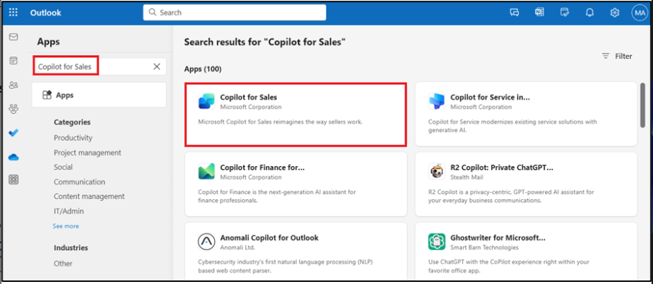
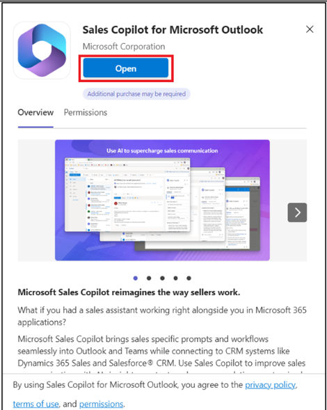
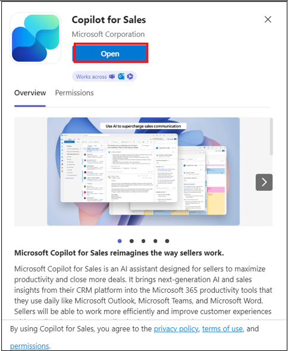
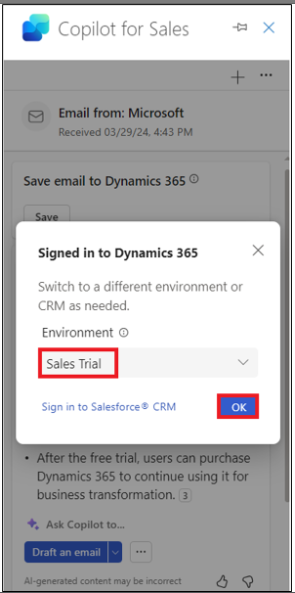
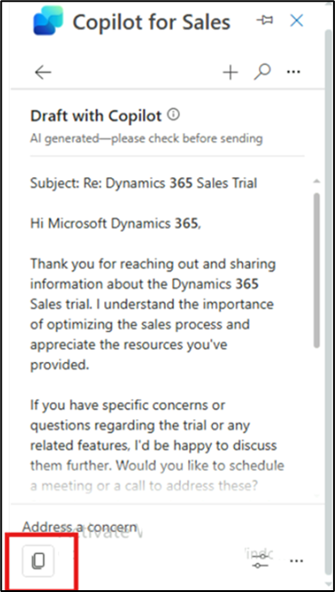
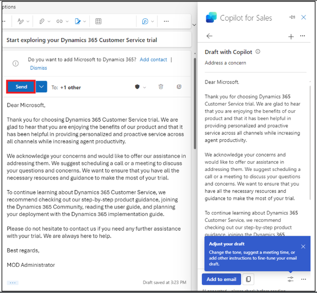

# Lab 9: Composing emails, viewing email summary and opportunity summary in Outlook using Copilot for Sales

**Note:** You may switch to lab number 11 if the product is not
available. You can perform this lab later based on availability.

## Exercise 1: Open the Copilot for Sales

1.  In a new tab open **Outlook** using the
    link [**www.outlook.com**](urn:gd:lg:a:send-vm-keys).

2.  Sign in with your **Office 365 admin tenant** credentials.

3.  Open any of the emails. While in an email, select the **Apps** icon.

4.  If you can see **Copilot for Sales** under **Apps**, you can
    directly execute step 11.

5.  If you don’t see **Copilot for Sales** under **Apps**, select **More
    apps**, and then click **Add apps**.

6.  On the **Apps** page, search for [**Copilot for
    Sales**](urn:gd:lg:a:send-vm-keys) and then select **Copilot for
    Sales** app.

7.  Select **Add** on Copilot for Sales card.

8.  Once again, select **Copilot for Sales** app and click **Open**.

9.  Select **Got it**.

10. Navigate to the **Mails**.

11. Open any of the emails. While in an email, select the **Apps** icon.

12. Now you will be able to see the **Copilot for Sales** app.
    Select **Copilot for Sales** app.

13. If asked, sign in with your **Office 365 admin tenant** credentials
    in the pop-up window. If pop-up appears saying Catch up and draft
    fast with Copilot, select **Got it**.

14. The **Copilot for Sales** pane appears on the right side. Select
    your environment. For this lab, select **Sales Trial** environment.

15. Select **Get started**.

16. You can now use the **Copilot for Sales** pane.

## Exercise 2: View and save email summary

### Task 1: View email summary

1.  In **Outlook**, open a customer email.

2.  Open the **Apps \> Copilot for Sales** pane.

3.  The email summary is displayed in the **Key info** card.

**Note**

If the email content is less than 1000 characters, the email summary
will not be generated, and the Summary of this email card is not
displayed.

### Task 2: Save email summary to CRM

1.  In the **Key info** card, click the ellipses (…) and then
    select **Save summary to Dynamics 365**.

2.  Under **Select a record**, enter Coffee maker in the search box
    select one of the suggested records or use the search box to find
    another record.

If there are multiple opportunities related to contact, Sales Copilot
displays a list of suggested opportunities, ranked by AI, to save the
summary. In this case, the first opportunity is selected by default.

**Note**

- If the email is already connected to an opportunity, it's selected by
  default.

- If no opportunity is connected, the top ranked opportunity, which is
  determined by the open opportunities available for the account or
  contact, and the content of the email, will be selected by default.

- When you search for a record, the search results display the record
  name and the key fields selected by your administrator.

- Your search results will be added to the suggested records list, so
  you can safely search and try again.

- Currently, you can save the summary to one record using Sales Copilot.

- You can connect to all record types that are enabled for activities
  and added to Sales Copilot by your administrator.

3.  Select **Save**.

The email summary is saved to CRM as a note to the selected record. All
Microsoft Copilot for Sales notes share the same subject: "\[AI
generated\] Email summary from Sales Copilot" and include the subject of
the email itself, as well as the timestamp when the note was saved.

## Exercise 3: Create an email reply using Sales Copilot for Microsoft Outlook Add-in

### Task 1: Create an email reply using pre-defined categories

1.  In **Outlook**, open a customer email and select **Reply**.

2.  Select **Apps** and then select **Copilot for Sales**.

3.  Select **Copilot for Sales**.

4.  Select **Draft an email**.

5.  You can draft an email with the pre-defined categories. Close the
    tip.

6.  **Review** the suggested content. Select any of the suggested
    content. For example, select **Address a concern**.

To generate a different suggestion, select **More options**, and then
select **Try again**. Refine the suggested content, if required. You can
also restore the suggested content to the previous version.

7.  Copilot gathers the required information and gives a response.

8.  Select and copy Email content and paste that in the new email body.

**Note**: Existing content in the email body is not replaced. The
suggested content is prepended to any existing content in the email
body.

9.  **Edit** the email content as required, and then **Send** it.

### Task 2: Create an email message using custom prompt

If the pre-defined response categories don't suit your requirements, you
can enter custom prompt to generate suggested content. You can get
suggested email content when you reply to a customer email, read an
email, or compose a new email.

**Note**

- Information from CRM is not displayed when using custom prompt to
  generated suggested email content.

- You can generate suggested content for emails containing internal
  email addresses also. If all email addresses are internal, you'll only
  see the option to enter custom prompt. If you add an external email
  address, pre-defined response categories are made available.

1.  In **Outlook**, open a customer email and select **Reply**.

2.  Select **Apps** and then select **Copilot for Sales**.

3.  Select **Copilot for Sales**.

4.  Select **Draft an email**.

**Note**

Pre-defined response categories are not available while composing a new
email. You can only enter custom prompt or create an email to summarize
your sales meeting.

5.  In the textbox, enter a phrase to describe the kind of reply you
    want to send, for example [**Send the
    acceptance**](urn:gd:lg:a:send-vm-keys) and then select **Create
    draft**.

6.  **Review** the suggested content.

To generate a different suggestion, select More options, and then select
Try again. Refine the suggested content, if required. You can also
restore the suggested content to the previous version.

7.  Select copy and paste the content in the new email body.

**Note**: Existing content in the email body is not replaced. The
suggested content is prepended to any existing content in the email
body.

8.  **Edit** the email content as required, and then **Send** it.

### Task 3: Adjust the email draft

1.  Generate the suggested reply using an appropriate response category.

2.  Select **Adjust draft**.

3.  On the **Draft with Copilot** page, select the **Length**, **Adjust
    tone** and **Suggest a meeting time** tabs as per your requirements
    and then select **Update**.

4.  **Review** the suggested content.

To generate a different suggestion, select More options, and then select
Try again. Refine the suggested content, if required. You can also
restore the suggested content to the previous version.

5.  Select copy and paste the content in the new email body.

**Note**: Existing content in the email body is not replaced. The
suggested content is prepended to any existing content in the email
body.

6.  **Edit** the email content as required, and then **Send** it.

## Exercise 4: Add or remove meeting suggestion

By default, a meeting time is not included in the suggested content. If
a customer has requested a meeting at a certain time and mentioned the
same in an email, the meeting time is included in the suggested content.
The meeting time displayed in the suggested content is in your time
zone.

### Task 1: Add a meeting time suggestion

If you want to have a meeting with a customer, you can include a meeting
time in the suggested content. The meeting time suggested is the first
available slot in your calendar.

1.  In **Outlook**, open a customer email and select **Reply**.

2.  Select **Apps** and then select **Copilot for Sales**.

3.  Select **Copilot for Sales**.

4.  Select **Draft an email**.

5.  Select a pre-defined category.

6.  **Review** the suggested content. Select any of the suggested
    content. For example, select **Address a concern**.

To generate a different suggestion, select More options, and then select
Try again. Refine the suggested content, if required. You can also
restore the suggested content to the previous version.

7.  Copilot gathers the required information and gives a response.

8.  Select **Adjust draft**.

9.  Under **Suggest a meeting time**, select the meeting time displayed.

10. Select **Update**.

11. Select copy and paste the content in the new email body.

> **Note**: Existing content in the email body is not replaced. The
> suggested content is prepended to any existing content in the email
> body.

12. **Edit** the email content as required, and then **Send** it.

### Task 2: Remove the meeting time suggestion

1.  Generate the suggested content using an appropriate response
    category.

2.  Select **Adjust draft**.

3.  Under **Suggest a meeting time**, clear the meeting time selected.

4.  Select **Update**.

## Exercise 5: View opportunity summary

1.  In **Outlook**, open an email or the scheduled meeting.

2.  Open the **Copilot for Sales** pane. Click **Save email to Dynamics
    365**.

3.  On the **First, turn on server-side sync** dialog, select **Turn
    on**.

4.  On **Connect to a record** page, search for the alex and select the
    contact using the search box.

5.  Select the contact and click **Save**.

6.  Once the email is saved to the record of the selected contact, a
    message is displayed on the **Copilot for Sales** pane.

7.  Select the contact. You will be navigated to the **Contact
    details** page.

8.  On the **Contact details** page, go to the **Opportunities** area
    and select one of the opportunities.

9.  The **Opportunity summary** and **Opportunity details** are
    displayed in the **Opportunity summary card**.

