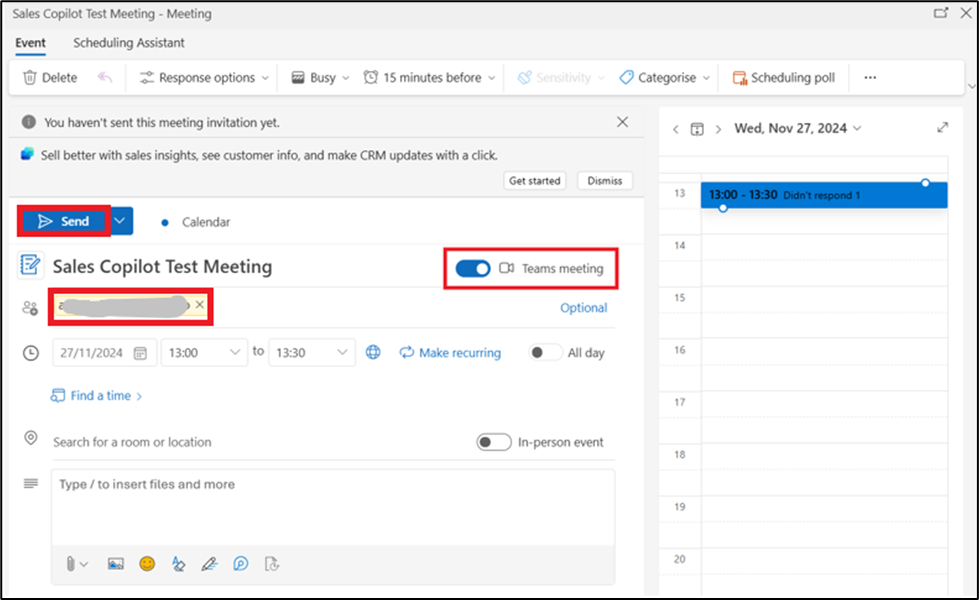

# Laboratório 10: Usando o aplicativo Microsoft Copilot for Sales no Microsoft Teams e utilizando o painel de inteligência de conversas (preview)

**Observação:** Você pode pular para o laboratório número 11 se o
produto não estiver disponível. Você pode realizar este laboratório
posteriormente, conforme a disponibilidade.

## Exercício 1: Instalar e fixar o Microsoft Copilot for Sales no Teams

#### Tarefa 1: Criar uma política de configuração personalizada para aplicativos do Teams

1.  Faça login no **Microsoft Teams admin
    center** - [**https://admin.teams.microsoft.com/dashboard**](urn:gd:lg:a:send-vm-keys)

2.  No painel esquerdo, selecione **Teams apps** \> **Setup policies**.

3.  Na guia **Manage policies**, selecione **Add**.

4.  Insira [**Assign Copilot permissions**](urn:gd:lg:a:send-vm-keys) no
    campo **Name**.

5.  Ative o botão **User pinning**.

6.  Em **Installed apps**, selecione **Add apps**.

7.  No painel **Add installed apps**, procure o aplicativo **Copilot for
    Sales** (você pode filtrar por política de permissões também).

8.  Passe o mouse sobre **Copilot for Sales** e clique em **Select**.

9.  Selecione **Add** novamente para instalar o aplicativo listado.

10. Em **Pinned apps**, selecione **Add apps**.

11. No painel **Add pinned** apps, procure novamente por **Copilot for
    Sales**. Você pode filtrar por política de permissões também.

12. Passe o mouse sobre **Copilot for Sales** e clique em **Select**.

13. Selecione **Add** novamente para fixar o aplicativo.

14. Em **App bar** ou **Messaging extensions**, organize os aplicativos
    na ordem em que você deseja que eles apareçam no Teams.

15. Selecione **Save**.

16. Open Abra uma nova guia no navegador e vá para o Microsoft Teams
    webapp usando o link fornecido
    - [**https://teams.microsoft.com/\_#/apps/c92c289e-ceb4-4755-819d-0d1dffdab6fa/sections/homeTab**](urn:gd:lg:a:send-vm-keys)

17. Faça login com suas credenciais do **Office 365 admin tenant**.

18. Você pode ver o aplicativo **Microsoft Copilot for Sales** fixado no
    **Teams**.

19. Se você não vir o aplicativo fixado, selecione Apps no painel
    esquerdo, procure Copilot for Sales e selecione Add.

20. Selecione **Add**.

## Tarefa 2: Agendar uma reunião do Microsoft Teams a partir do Outlook

1.  Vá para o **App launcher**.

2.  Selecione **Outlook**.

3.  Selecione **Calendar** no painel de navegação à esquerda. Selecione
    **New event \> Event**.

4.  Nomeie a reunião como – [**Sales Copilot Test
    Meeting**](urn:gd:lg:a:send-vm-keys), selecione a data atual e
    selecione a hora (defina para 10 minutos depois da hora atual).

5.  No campo **Invite attendees**, insira seu **email id**.
    Certifique-se de que no campo Search for a room or location, o botão
    de alternância **Teams meeting** esteja **ON**. Agora selecione
    **Send**.

6.  Vá para o aplicativo **Teams**, selecione **Calendar**. Você pode
    ver a reunião recém-agendada. Clique na reunião.

7.  Selecione **Edit**.

8.  Selecione o ícone **+** na barra de menu na parte superior.

9.  Selecione **Copilot for Sales**.

10. Selecione **Save**.

11. Selecione **Join** para entrar na reunião.

12. Selecione **Join** novamente.

13. Você receberá uma notificação do MOD Admin para participar da
    reunião no aplicativo Teams. Selecione **Join**.

14. Silencie o áudio e clique em **Join now**.

15. No aplicativo web Mod Admin's Team, você receberá uma notificação
    informando que está **Waiting in the lobby**. Selecione **Admit**.

16. Selecione **More \> Record** e **Transcribe \> Start recording**.

17. Você pode falar algo como MOD Admin para gerar uma transcrição.
    (Exemplo - Você pode explicar o que é o Sales Copilot).

18. Saia da reunião no Mod Admin’s Teams web app e no seu Teams app.

19. Selecione **Chat** no painel de navegação à esquerda e, em seguida,
    selecione **Copilot for Sales**.

20. Selecione **Open summary**.

21. Agora você pode ver o summary gerado pelo Copilot for Sales.

## Exercício 2: Compartilhar um registro do CRM no Teams

1.  Vá para a conta do **Outlook** do Mod Admin, abra um email ou a
    scheduled meeting.

2.  Abra o painel **Copilot for Sales**. Clique em **Save email to
    Dynamics 365**.

3.  Na caixa de diálogo **First, turn on server-side sync**, selecione
    **Turn on**.

4.  Na página **Connect to a record**, procure pelo contato alex usando
    a **search box**.

5.  Selecione o **contacto** e clique em **Save**.

6.  Depois que o e-mail é salvo no registro do contato selecionado, uma
    mensagem é exibida no painel **Copilot for Sales**.

7.  Selecione o **contato**. Você será direcionado para a página
    **Contact details**.

8.  Na página **Contact details**, vá até a área **Opportunities** e
    passe o mouse sobre uma das oportunidades, por exemplo -- 50 Café
    A-100 Automatic, clique em **more options** (... 3 pontos),
    selecione **Teams** e depois selecione **+ Set up deal room**.

9.  Seleione **Use an existing team**.

10. Selecione o **Test Team** e depois selecione **Next**.

11. Mantenha o **channel** como está, selecione a privacy como
    **Standard**, marque a **checkbox** de **Include shared channel** e
    depois selecione **Set up team**.

12. Vá para o Teams app. Selecione o **channel 50 Café A-100
    Automatic** dentro do **Test Team**. A captura de tela a seguir
    mostra um exemplo de um **deal room team** para o 50 Café A-100
    Automatic.

13. Clique em **Reply** abaixo da mensagem do Copilot for Sales e
    selecione o **+ ícon** para abrir ações e aplicativos.

14. Select **Copilot for Sales** app.

15. Digite alex na caixa de pesquisa e selecione o contato **Alex
    Baker**.

16. Agora, clique no **send icon** para enviar o registro.

17. Clique em Ver registro e você verá os detalhes de contato.

## Exercício 3: Analise os dados de conversas dos seus vendedores com o Power BI (versão prévia)

### Tarefa 1: Baixe o aplicativo do painel Copilot for Sales

1.  Para baixar o Copilot for Sales - Painel de inteligência de
    conversação,
    acesse [**https://go.microsoft.com/fwlink/p/?linkid=2259835**](https://go.microsoft.com/fwlink/p/?linkid=2259835) e
    Selecione **Get it now**.

2.  Você será direcionado para o Power BI Apps. Selecione **Instal** na
    janela “'Install this Power BI app”,

3.  Você pode ver o Copilot for Sales - Dashboard na lista de
    aplicativos. Clique no **Copilot for Sales - Dashboard** para
    abri-lo.

4.  As seguintes páginas estão disponíveis no seu relatório:

- Coaching opportunities

- Customer insights

- Call recordings

5.  Você pode usar o **Time period filter** e os **Data filters** no seu
    relatório.

6.  Selecione a **página Coaching opportunities** no painel de navegação
    à esquerda. São exibidos KPIs conversacionais e gráficos resumidos
    para o período selecionado.

7.  Selecione **Customer insights page** no painel de navegação à
    esquerda. Ela exibe a opinião dos clientes e as principais marcas
    sobre as quais eles estão falando.

8.  Selecione a página **Conversation recordings** no painel de
    navegação à esquerda. Esta página ajuda você a ouvir gravações de
    chamadas e entender o contexto da conversa.

### Tarefa 2: Conecte o painel aos dados da sua organização

Quando você baixa o Copilot for Sales - Dashboard de inteligência de
conversação do Microsoft AppSource, ele inclui dados de amostra. Para
conectar o dashboard aos seus próprios dados no Dataverse, siga estas
etapas:

1.  Considerando que o painel Copilot for Sales baixado já está aberto,
    selecione **Connect your data**.

2.  Insira as seguintes informações:

a. **EnvironmentPath**: URL do seu ambiente Dataverse de avaliação do
Sales. Você deve remover o prefixo https:// da URL do caminho do
ambiente que você inserir. (Para obter a URL, acesse o centro de
administração da Power Platform. Selecione Ambientes no painel de
navegação à esquerda, clique em Sales trial e copie a URL do ambiente)

b. **CRM type**: Tipo de CRM que você está usando -- **Dynamics**.

c\. Selecione **Next**.

3.  Selecione um método de autenticação - **OAuth2** e configurações de
    nível de privacidade - **None** para sua fonte de dados. Selecione
    **Sign in and connect**.

4.  Depois que o painel estiver conectado com sucesso aos dados da
    organização, você poderá editar o relatório e publicá-lo.

** **
