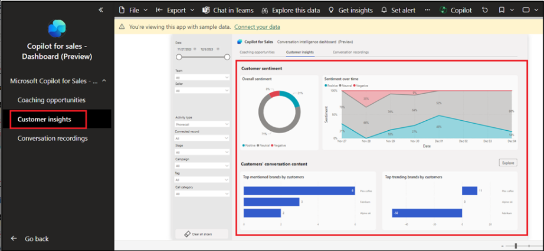

# 實驗 10：在 Microsoft Teams 中使用 Microsoft Copilot for Sales 應用和使用對話智能儀表板（預覽版）

**注意：**如果該產品不可用，您可以切換到 11
號實驗室。您可以根據可用性稍後執行此實驗。

## 練習 1：在 Teams 中安裝和固定 Microsoft Copilot for Sales 

### 任務 1：創建自定義 Teams 應用設置策略

1.  登錄到 **Microsoft Teams
    管理中心**- [**https://admin.teams.microsoft.com/dashboard**](urn:gd:lg:a:send-vm-keys)

2.  在左窗格中，選擇 **Teams apps \> Setup policies**。

3.  在 **Manage policies** （管理策略） 選項卡上，選擇 **Add**
    （添加）。

4.  在 **Name** 字段中輸入 [**Assign Copilot
    permissions**](urn:gd:lg:a:send-vm-keys) 。

5.  開啟 **User pinning**（用戶固定）。

6.  在 **Installed apps** （已安裝的應用程序） 下，選擇 **Add apps**
    （添加應用程序）。

7.  在 **Add installed apps** 面板中，搜索 **Copilot for Sales**
    應用程序。您還可以通過 App 權限策略篩選 App。

8.  將鼠標懸停在 **Copilot for Sales** 上，然後單擊選擇。

9.  再次選擇 **Add** （添加） 以安裝列出的應用程序。

10. 在 **Pinned apps** （固定的應用） 下，選擇 **Add apps**
    （添加應用）。

11. 在 **Add pinned** 的應用程序面板中，搜索 **Copilot for Sales**
    應用程序。您還可以通過 App 權限策略篩選 App。

12. 將鼠標懸停在 **Copilot for Sales** 上，然後單擊 **Select**。

13. 再次選擇 **Add** 以固定列出的應用程序。

14. 在 “**App bar**” 或 “**Messaging extensions**” 下，按照您希望它們在
    Teams 中的顯示順序排列應用。

15. 選擇 **Save** （保存）。

16. 在瀏覽中打開一個新選項卡，然後使用給定的鏈接瀏覽到 Microsoft Teams
    Web 應用程序 -
     [**https://teams.microsoft.com/\_#/apps/c92c289e-ceb4-4755-819d-0d1dffdab6fa/sections/homeTab**](urn:gd:lg:a:send-vm-keys)

17. 使用 **Office 365 管理員租戶**憑據登錄。

18. 您可以看到 **Microsoft Copilot for Sales** 應用程序固定在 **Teams**
    中。

19. 如果您沒有看到固定的應用程序，請從左側窗格中選擇應用程序，搜索
    Copilot for Sales，然後選擇添加。

20. 選擇 **Add**。

## 任務 2：從 Outlook 安排 Microsoft Teams 會議

1.  轉到 **App launcher**。

2.  選擇 **Outlook**。

3.  從左側導航窗格中選擇 **Calendar**。選擇 **New event \> Event**。

4.  為會議命名 – [**Sales Copilot Test
    Meeting**](urn:gd:lg:a:send-vm-keys)，選擇當前日期並選擇時間（將其設置為當前時間的
    10 分鐘後）。

5.  在 **Invite attendees** （邀請與會者） 字段中，輸入您的 **email
    id**。確保在 搜索會議室或位置 字段中，**Teams meeting** 切換按鈕為
    **On**。現在選擇 **Send**。

6.  現在轉到 **Teams** 應用程序，選擇
    **Calendar**。您可以看到新安排的會議。單擊會議。

7.  選擇 **Edit**（編輯）。

8.  從頂部的菜單欄中選擇 **+** 圖標。

9.  選擇 **Copilot for Sales**。

10. 選擇 **Save** （保存）。

11. 選擇 **Join** 以加入會議。

12. 再次選擇 **Join** （加入）。

13. 您將收到來自 MOD 管理員的通知，以從 Teams 應用程序加入會議。選擇
    **Join**。

14. 將音頻靜音，然後選擇 **Join now**。

15. 在 Mod 管理員的團隊 Web 應用程序上，您將收到 **Waiting in the
    lobby** 的通知。選擇 **Admit**。

16. 選擇 **More \> Record** 和**Transcribe \> Start recording**。

17. 您可以以 MOD 管理員的身份交談以生成成績單。（示例 - 您可以解釋什麼是
    Sales Copilot）。

18. 從 Mod Admin 的 Teams Web 應用程序和您的 Teams 應用程序離開會議。

19. 從左側導航窗格中選擇 **Chat** ，然後選擇 **Copilot for Sales**。

20. 選擇 **Open summary** （打開摘要）。

21. 您現在可以查看 Copilot for Sales 生成的摘要。

## 練習 2：在 Teams 中共享 CRM 記錄

1.  轉到 Mod 管理員的 **Outlook** 帳戶，打開電子郵件或預定的會議。

2.  打開 **Copilot for Sales** 窗格。單擊 **Save email to Dynamics
    365**。

3.  在 **First， turn on server-side sync** 對話框中，選擇 **Turn on**。

4.  在 **Connect to a record page** （連接到記錄頁面）
    上，使用搜索框搜索連絡人 alex。

5.  選擇連絡人，然後單擊 **Save** （保存）。

6.  將電子郵件保存到所選連絡人的記錄後，**Copilot for Sales**
    窗格上會顯示一條消息。

7.  選擇連絡人。您將導航到 **Contact details** （連絡人詳細信息） 頁面。

8.  在 **Contact details** 頁面上，轉到 **Opportunities**
    區域並將鼠標懸停在其中一個機會上，例如 -- 50 Café A-100
    Automatic，單擊更多選項 （...3 點），選擇
    **Teams**（團隊），然後選擇 **+ Set up deal room**（+ 設置交易室）。

9.  選擇 **Use an existing team**（使用現有團隊）。

10. 選擇 **Test Team**，然後選擇 **Next**。

11. 保持頻道原樣，選擇隱私作為 **Standard**，選中 **Include shared
    channel** 複選框，然後選擇 **Set up team**。

12. 轉到 Teams 應用程序。在 **Test Team** 團隊下選擇 **50 Café A-100
    Automatic** channel。以下屏幕截圖顯示了 50 Café A-100 Automatic
    的交易室團隊示例。

13. 單擊 Copilot for Sales 消息下的 **Reply** ，然後選擇 **+
    圖標**以打開作和應用程序。

14. 選擇 **Copilot for Sales** 應用程序。

15. 在搜索框中鍵入 alex，然後選擇 **Alex Baker** 連絡人。

16. 現在，單擊 **send 圖標**以發送記錄。

17. 單擊 View record（查看記錄），您將看到聯繫方式。

## 練習 3：使用 Power BI 分析銷售人員的對話數據（預覽）

### 任務 1：下載 Copilot for Sales 儀錶板應用

1.  要下載 Copilot for Sales -
    對話智能儀表板，請轉到 [**https://go.microsoft.com/fwlink/p/?linkid=2259835**](https://go.microsoft.com/fwlink/p/?linkid=2259835) 選擇
    **Get it now**.

2.  您將導航到 Power BI 應用程序。在 “安裝此 Power BI 應用程序”
    窗口中選擇**Install**。

3.  您可以在應用程序列表下看到 Copilot for Sales - 儀錶板。單擊
    **Copilot for Sales - Dashboard** 將其打開。

4.  您的報表中提供了以下頁面：

- 輔導機會

- 客戶洞察

- 通話錄音

5.  您可以在報表中使用 **Time period filter**（時間段篩選條件）和 **Data
    filters** （數據篩選條件）。

6.  從左側導航窗格中選擇 **Coaching
    opportunities**（教練機會）**頁面**。它顯示所選時間段的對話 KPI
    和摘要圖表。

7.  從左側導航窗格中選擇 **Customer Insights
    頁面**。它顯示客戶情緒和您的客戶正在談論的頂級品牌。

8.  從左側導航窗格中選擇 **Conversation recordings** （對話錄音）
    頁面。此頁面可幫助您收聽通話錄音並瞭解對話的上下文。

### 任務 2：將控制面板連接到組織的數據

當您從 Microsoft AppSource 下載 Copilot for Sales -
對話智能儀表板時，它包含示例數據。要將儀錶板連接到您在 Dataverse
中自己的數據，請執行以下步驟：

1.  考慮到下載的 Copilot for Sales 儀錶板已打開，請選擇 **Connect your
    data**。

2.  輸入以下信息：

a. **EnvironmentPath**: 指向 Sales 試用 Dataverse 環境的
URL。您必須從您輸入的環境路徑 URL 中刪除 https:// 前綴。（若要獲取
URL，請轉到 Power Platform 管理中心。從左側導航窗格中選擇 環境，單擊
Sales 試用版並複製 環境 URL）

b. **CRM 類型：**您正在使用的 CRM 類型 -- **Dynamics。**

c\. 選擇 **Next**（下一步）。

3.  為您的數據源選擇身份驗證方法 - **OAuth2** 和隱私級別設置 -
    **None**。選擇 **Sign in and connect** （登錄並連接）。

4.  在控制面板成功連接到組織的數據後，您可以編輯並發佈報告。

** **
