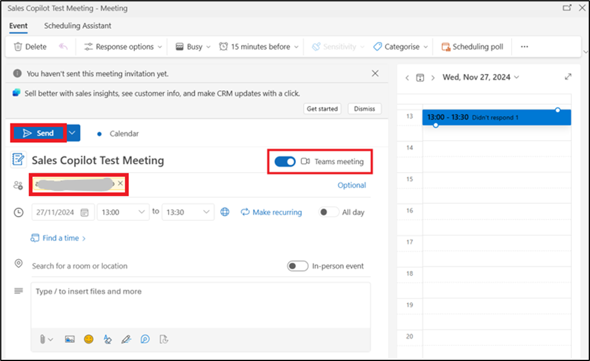
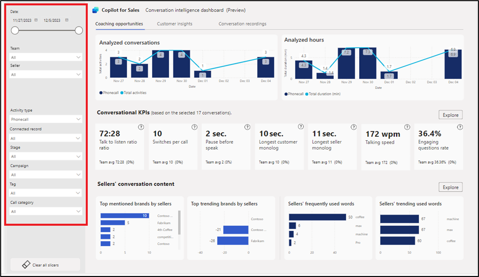
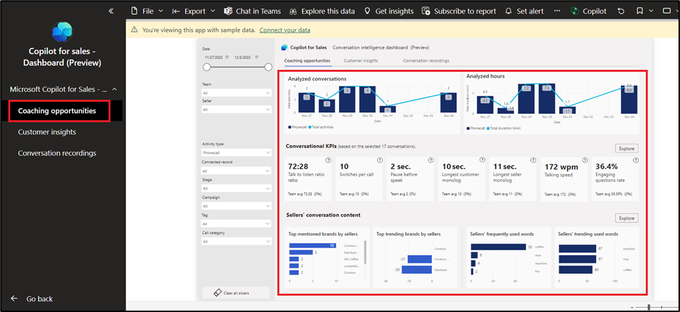
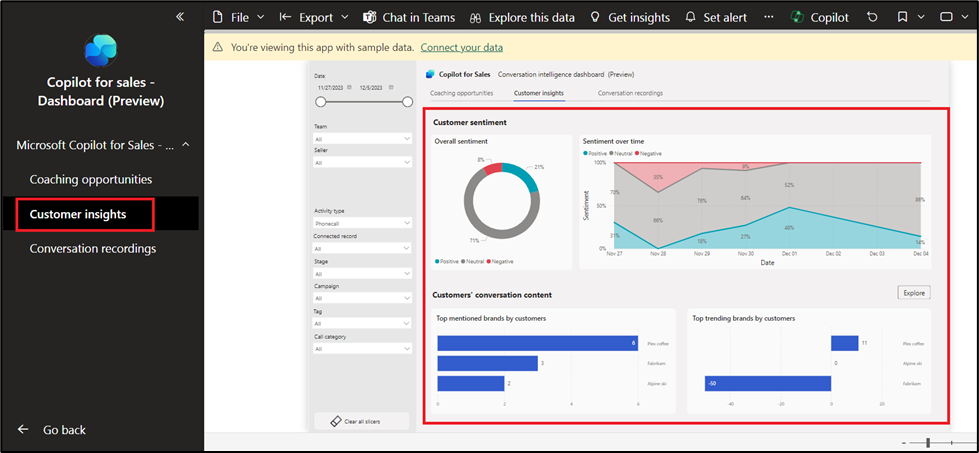

# Lab 10: Uso dell'app Microsoft Copilot for Sales in Microsoft Teams e uso del dashboard di Conversazione intelligente (anteprima)

**NOTA:** È possibile passare al laboratorio numero 11 se il prodotto
non è disponibile. È possibile eseguire questo lab in un secondo momento
in base alla disponibilità.

## Esercizio 1: Installare e aggiungere Microsoft Copilot for Sales in Teams

### Attività 1: Creare un criterio di configurazione dell'app Teams personalizzato

1.  Accedere all **Microsoft Teams admin center** -
    [**https://admin.teams.microsoft.com/dashboard**](urn:gd:lg:a:send-vm-keys)

2.  Nel riquadro sinistro selezionare **Teams apps \> Setup policies**.

3.  Nella scheda **Manage policies,** selezionare **Add**.

4.  Immettere [**Assign Copilot
    permissionst**](urn:gd:lg:a:send-vm-keys) nel campo **Name**.

5.  Attiva l'opzione **User pinning**.

6.  In **Installed apps**, seleziona **Add apps**.

7.  Nel pannello **Add installed apps**, cerca l' app **Copilot for
    Sales**. È anche possibile filtrare le app in base ai criteri di
    autorizzazione delle app.

8.  Passa il mouse su **Copilot for Sales** e fai clic su Seleziona.

9.  Seleziona di nuovo Add per installare le app elencate.

10. In **Pinned apps** selezionare **Add apps**.

11. Nel pannello **Add pinned** apps, cerca l' app **Copilot for
    Sales**. È anche possibile filtrare le app in base ai criteri di
    autorizzazione delle app.

12. Passa il mouse su **Copilot for Sales** e fai clic su **Select**.

13. Seleziona di nuovo **Add** per aggiungere le app elencate.

14. Nella **App bar** o nelle **Messaging extensions**, disporre le app
    nell'ordine in cui si desidera che vengano visualizzate in Teams.

15. Seleziona **Save**.

16. Apri una nuova scheda nella tua navigazione e passa all'app Web di
    Microsoft Teams utilizzando il collegamento fornito -
    **https://teams.microsoft.com/\_#/apps/c92c289e-ceb4-4755-819d-0d1dffdab6fa/sections/homeTab**

17. Accedere con le credenziali del **Office 365 admin tenant**.

18. È possibile visualizzare l'app **Microsoft Copilot for Sales**
    aggiunta in **Teams**.

19. Se l'app non è bloccata, selezionare **Apps** nel riquadro sinistro,
    cercare **Copilot for Sales** e selezionare **Add**.

20. Seleziona **Add**.

## Attività 2: Pianificare una riunione di Microsoft Teams da Outlook

1.  Vai su **App launcher**.

2.  Seleziona **Outlook**.

3.  Seleziona **Calendar** dal riquadro di spostamento a sinistra.
    Seleziona **New event \> Event**.

4.  Assegna il nome alla riunione - **Sales Copilot Test Meeting**,
    seleziona la data corrente e seleziona l'ora (impostala su 10 minuti
    dopo l'ora corrente).

5.  Nel campo **Invite attendees**, inserisci il suoi **e-mail id**.
    Assicurati che nel campo Cerca una sala o una posizione,
    l'interruttore **Teams meeting** sia **On**. Ora seleziona **Send**.

6.  Ora vai all'app **Teams**, seleziona **Calendar**. È possibile
    visualizzare la riunione appena pianificata. Fare clic sulla
    riunione.

7.  Seleziona **Edit**.

8.  Seleziona l'icona **+** dalla barra dei menu in alto.

9.  Seleziona **Copilot for Sales**.

10. Seleziona **Save**.

11. Seleziona **Join** per partecipare alla riunione.

12. Seleziona di nuovo **Join**.

13. Riceverai una notifica dall'amministratore MOD per aver partecipato
    alla riunione dalla tua app Teams. Seleziona **Join**.

14. Disattiva l'audio e seleziona **Join now**.

15. Sull'app web del team di Mod Admin, riceverai la notifica che
    **Waiting in the lobby**. Seleziona **Admit**.

16. Seleziona **More \> Record** e **Transcribe\> Start recording**.

17. Puoi parlare di qualcosa come amministratore MOD per generare la
    trascrizione. (Esempio: puoi spiegare cos'è Sales Copilot).

18. Esci dalla riunione dall'app Web Teams di Mod Admin e dall'app
    Teams.

19. Seleziona **Chat** dal riquadro di navigazione a sinistra, quindi
    seleziona **Copilot for Sales**.

20. Seleziona **Open summary**.

21. Ora è possibile visualizzare il riepilogo generato da Copilot for
    Sales.

## Esercizio 2: Condividere un record CRM in Teams

1.  Vai all' account **Outlook** del Mod Admin, apri un'e-mail o la
    riunione programmata.

2.  Aprire il riquadro **Copilot for Sales**. Fai clic su **Save e-mail
    to Dynamics 365**.

3.  Nella finestra di dialogo **First**, **turn on server-side sync**
    seleziona **Turn on**.

4.  Nella pagina **Connect to a record** cercare il contatto **alex**
    utilizzando la casella di ricerca.

5.  Seleziona il contatto e fai clic su **Save**.

6.  Una volta salvato l'e-mail nel record del contatto selezionato,
    viene visualizzato un messaggio nel riquadro **Copilot for Sales**.

7.  Seleziona il contatto. Verrai indirizzato alla pagina dei **Contact
    details**.

8.  Nella pagina dei **Contact details**, vai all' area
    **Opportunities** e passa il mouse su una delle opportunità, ad
    esempio - 50 Café A-100 Automatic, fai clic su altre opzioni (... 3
    punti), seleziona **Teams** e quindi seleziona **+Set up deal
    room**.

9.  Seleziona **Use an existing team**.

10. Selezionare **Test Team**, quindi selezionare **Next**.

11. Mantieni il canale così com'è, seleziona la privacy come
    **Standard**, seleziona la casella di controllo **Include shared
    channel** e quindi seleziona **Set up team**.

12. Vai all'app Teams. Seleziona il canale **50 Café A-100 Automatic**
    in **Test Team** team. Lo screenshot seguente mostra un esempio di
    un team di deal room per il 50 Café A-100 Automatic.

13. Fare clic su **Reply** in Copilot per il messaggio di vendita,
    quindi selezionare la **+icon** per aprire azioni e app.

14. Seleziona l 'app **Copilot for Sales.**

15. Digita alex nella casella di ricerca e quindi seleziona il contatto
    **Alex Baker**.

16. Ora, fai clic sulla **send icon** per inviare il record.

17. Fai clic su **View record** e vedrai i dettagli di contatto.

## Esercizio 3: Analizzare i data delle conversazioni dei venditori con Power BI (anteprima)

### Attività 1: Scaricare l'app dashboard Copilot for Sales

1.  Per scaricare il dashboard Copilot for Sales - Conversazione
    intelligente, vai a
    [**https://go.microsoft.com/fwlink/p/?linkid=2259835**](https://go.microsoft.com/fwlink/p/?linkid=2259835)
    seleziona **Get it now**.

2.  Verrà visualizzato il passaggio alle app Power BI. Selezionare
    **Install** nella finestra **"Install this Power BI app".**

3.  È possibile visualizzare Copilot for Sales - Dashboard nell'elenco
    App. Fare clic su **Copilot for Sales - Dashboard** per aprirlo.

4.  Nel report sono disponibili le seguenti pagine:

- Coaching opportunities

- Customer insights

- Call recordings

5.  È possibile utilizzare il **Time period filter** e i **Data
    filters** nel report.

6.  Seleziona la **Coaching opportunities page** nel riquadro di
    spostamento a sinistra. Visualizza KPI conversazionali e grafici di
    riepilogo per il periodo di tempo selezionato.

7.  Seleziona **Customer Insights page** dal riquadro di navigazione a
    sinistra. Mostra il sentiment dei clienti e i principali marchi di
    cui i suoii clienti parlano.

8.  Seleziona la pagina **Conversation recordings** nel riquadro di
    spostamento a sinistra. Questa pagina ti aiuta ad ascoltare le
    registrazioni delle chiamate e a comprendere il contesto della
    conversazione.

### Attività 2: Connetti il dashboard ai data della tua organizzazione

Quando si scarica Copilot for Sales - Dashboard di Conversazione
intelligente da Microsoft AppSource, sono inclusi data di esempio. Per
connettere la dashboard ai suoii data in Common Data Service, procedi
nel seguente modo:

1.  Considerando che il dashboard di Copilot for Sales scaricato è già
    aperto, seleziona **Connect your data**.

2.  Inserisci le seguenti informazioni:

un. **EnvironmentPath**: URL dell'ambiente Common Data Service di prova
di Sales. È necessario rimuovere il prefisso https:// dall'URL del
percorso dell'ambiente immesso. Per ottenere l'URL, vai all'interfaccia
di amministrazione di Power Platform. Seleziona Ambienti dal riquadro di
navigazione a sinistra, fai clic su Versione di prova delle vendite e
copia l'URL dell'ambiente)

b\. **CRM type**: Tipo di CRM che stai utilizzando: **Dynamics**.

c\. Selezionare **Next**.

3.  Selezionare un metodo di autenticazione (**OAuth2)** e le
    impostazioni del livello di privacy (**None**) per l'origine data.
    Seleziona **Sign in and connect**.

4.  Dopo che il dashboard è stato connesso correttamente ai data
    dell'organizzazione, è possibile modificare il report e pubblicarlo.

** **
