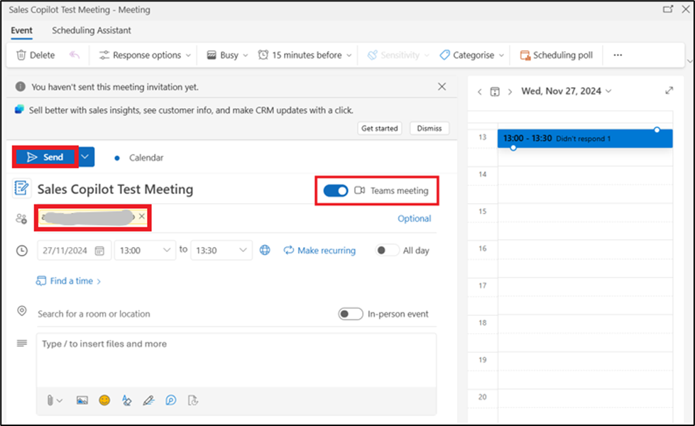
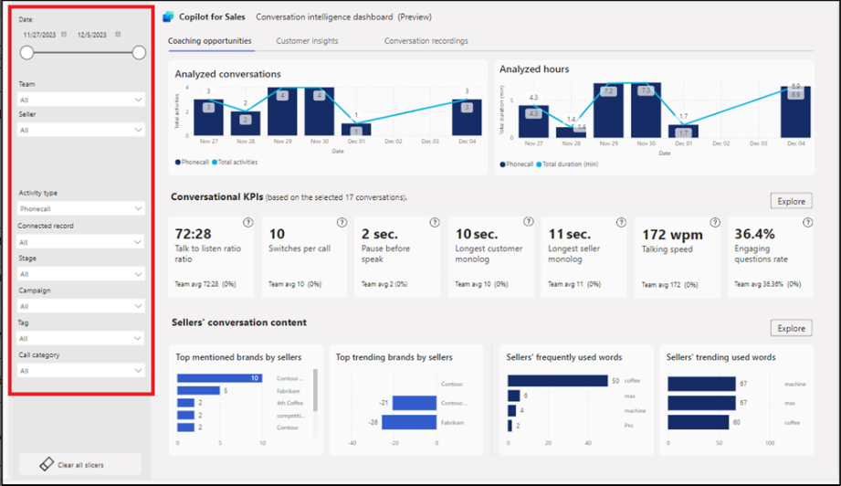
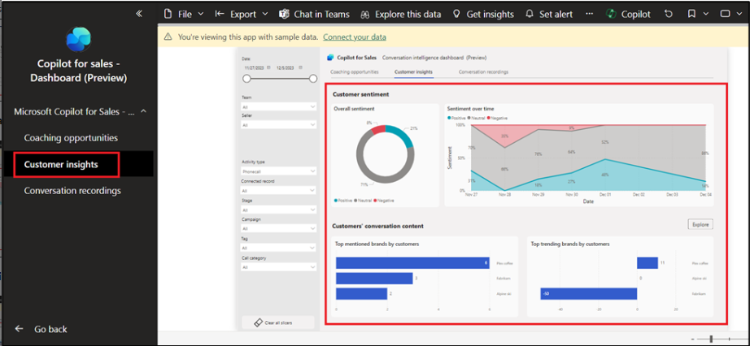

# Lab 10: Using Microsoft Copilot for Sales app in Microsoft Teams and using conversation intelligence dashboard (preview)

**Note:** You may switch to lab number 11 if the product is not
available. You can perform this lab later based on the availability.

## Exercise 1: Install and pin Microsoft Copilot for Sales in Teams

### Task 1: Create a custom Teams app setup policy

1.  Sign-in to the **Microsoft Teams admin
    center** - [**https://admin.teams.microsoft.com/dashboard**](urn:gd:lg:a:send-vm-keys)

2.  In the left pane, select **Teams apps \> Setup policies**.

3.  On the **Manage policies** tab, select **Add**.

4.  Enter [**Assign Copilot permissions**](urn:gd:lg:a:send-vm-keys) in
    the **Name** field.

5.  Turn on **User pinning**.

6.  Under **Installed apps**, select **Add apps**.

7.  In the **Add installed apps** panel, search for the **Copilot for
    Sales** app. You can also filter apps by app permission policy.

8.  Hover the mouse over **Copilot for Sales** and click on Select.

9.  Select **Add** again to install the listed apps.

10. Under **Pinned apps**, select **Add apps**.

11. In the **Add pinned** apps panel, search for the **Copilot for
    Sales** app. You can also filter apps by app permission policy.

12. Hover the mouse over **Copilot for Sales** and click on **Select**.

13. Select **Add** again to pin the listed apps.

14. Under **App bar** or **Messaging extensions**, arrange the apps in
    the order that you want them to appear in Teams.

15. Select **Save**.

16. Open a new tab in your browse and browse to Microsoft Teams webapp
    using the given link
    - [**https://teams.microsoft.com/\_#/apps/c92c289e-ceb4-4755-819d-0d1dffdab6fa/sections/homeTab**](urn:gd:lg:a:send-vm-keys)

17. Sign-in with your **Office 365 admin tenant** credentials.

18. You can see the **Microsoft Copilot for Sales** app pinned
    in **Teams**.

19. If you don’t see the app pinned, select Apps from left side pane,
    search for Copilot for Sales and select Add.

20. Select **Add**.

## Task 2: Schedule a Microsoft Teams meeting from Outlook

1.  Go to **App launcher**.

2.  Select **Outlook**.

3.  Select **Calendar** from the left navigation pane. Select **New
    event \> Event**.

4.  Give the name to the meeting – [**Sales Copilot Test
    Meeting**](urn:gd:lg:a:send-vm-keys), select current date and select
    time (set it to 10 minutes later from the current time).

5.  In the field of **Invite attendees**, enter your **email id**.
    Ensure that in the field of Search for a room or location, **Teams
    meeting** toggle button is **On**. Now select **Send**.

6.  Now go to the **Teams** app, select **Calendar**. You can see the
    newly scheduled meeting. Click on the meeting.

7.  Select **Edit**.

8.  Select **+** icon from the menu bar at the top.

9.  Select **Copilot for Sales**.

10. Select **Save**.

11. Select **Join** to join the meeting.

12. Select **Join** again.

13. You will get notification from MOD Admin for joining the meeting
    from your Teams app. Select **Join**.

14. Mute the audio and select **Join now**.

15. On the Mod Admin’s Team web app, you will get notification
    that **Waiting in the lobby**. Select **Admit**.

16. Select **More \> Record** and **Transcribe \> Start recording**.

17. You can talk something as MOD Admin to generate transcript.
    (Example - You can explain what is Sales Copilot).

18. Leave the meeting from Mod Admin’s Teams web app and your Teams app.

19. Select **Chat** from left navigation pane then select **Copilot for
    Sales**.

20. Select **Open summary**.

21. You can now see summary generated by Copilot for Sales.

## Exercise 2: Share a CRM record in Teams

1.  Go to the **Outlook** account of the Mod Admin, open an email or the
    scheduled meeting.

2.  Open the **Copilot for Sales** pane. Click **Save email to Dynamics
    365**.

3.  On the **First, turn on server-side sync** dialog, select **Turn
    on**.

4.  On **Connect to a record** page, search for the contact alex using
    the search box.

5.  Select the contact and click **Save**.

6.  Once the email is saved to the record of the selected contact, a
    message is displayed on the **Copilot for Sales** pane.

7.  Select the contact. You will be navigated to the **Contact
    details** page.

8.  On the **Contact details** page, go to the **Opportunities** area
    and hover the mouse over one of the opportunities, for example -- 50
    Café A-100 Automatic, click on more options (... 3 dots),
    select **Teams** and then select **+ Set up deal room**.

9.  Select **Use an existing team**.

10. Select **Test Team** and then select **Next**.

11. Keep the channel as is, select the privacy as **Standard**, check
    the checkbox of **Include shared channel** and then select **Set up
    team**.

12. Go to the Teams app. Select **50 Café A-100 Automatic** channel
    under **Test Team** team. The following screenshot shows an example
    of a deal room team for the 50 Café A-100 Automatic.

13. Click on **Reply** under Copilot for Sales message and then
    select **+ icon** to open actions and apps.

14. Select **Copilot for Sales** app.

15. Type alex in the search box and then select **Alex Baker** contact.

16. Now, click on **send icon** to send the record.

17. Click on View record and you will see contact details.

## Exercise 3: Analyze your sellers' conversation data with Power BI (preview)

### Task 1: Download the Copilot for Sales dashboard app

1.  To download the Copilot for Sales - Conversation intelligence
    dashboard, go
    to [**https://go.microsoft.com/fwlink/p/?linkid=2259835**](https://go.microsoft.com/fwlink/p/?linkid=2259835) Select **Get
    it now**.

2.  You will be navigated to Power BI Apps. Select **Install** on
    'Install this Power BI app' window.

3.  You can see the Copilot for Sales - Dashboard under the Apps list.
    Click on the **Copilot for Sales - Dashboard** to open it.

4.  The following pages are available in your report:

- Coaching opportunities

- Customer insights

- Call recordings

5.  You can use the **Time period filter** and **Data filters** in your
    report.

6.  Select **Coaching opportunities page** from the left navigation
    pane. It displays conversational KPIs and summary charts for the
    selected time period.

7.  Select **Customer insights page** from the left navigation pane. It
    displays customer sentiment and the top brands that your customers
    are talking about.

8.  Select **Conversation recordings** page from the left navigation
    pane. This page helps you listen to call recordings and understand
    the context of the conversation.

### Task 2: Connect the dashboard to your organization's data

When you download Copilot for Sales - Conversation intelligence
dashboard from Microsoft AppSource, it includes sample data. To connect
the dashboard to your own data in Dataverse, follow these steps:

1.  Considering the downloaded Copilot for Sales dashboard is opened
    already, select **Connect your data**.

2.  Enter the following information:

a. **EnvironmentPath**: URL to your Sales trial Dataverse environment.
You must remove the https:// prefix from the environment path URL you
enter. (To get URL, go to Power platform admin center. Select
Environments from left navigation pane, click on Sales trial and copy
the Environment url)

b. **CRM type**: Type of CRM you're using -- **Dynamics**.

c\. Select **Next**.

3.  Select an authentication method - **OAuth2** and privacy level
    settings - **None** for your data source. Select **Sign in and
    connect**.

4.  After the dashboard is connected successfully to the organization's
    data, you can edit the report and publish it.

** **
