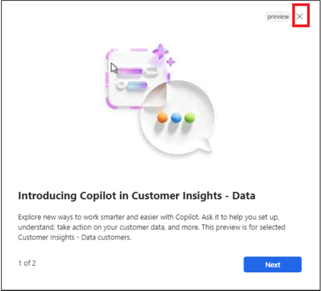
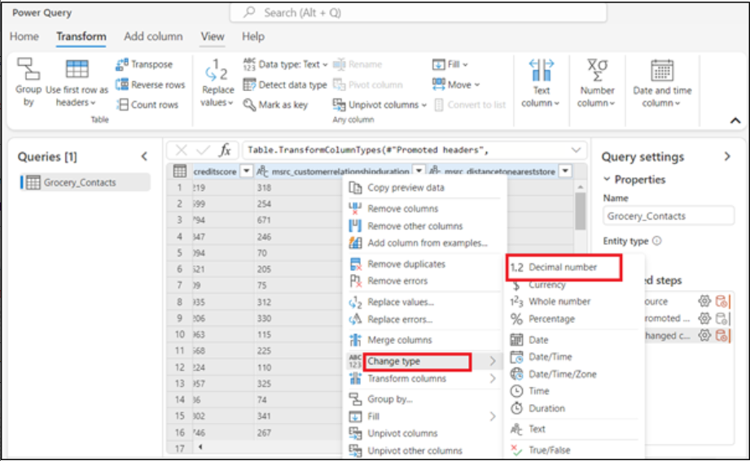

# Laboratório 11: Criando segmentos com o Copilot para Customer Insights - Data (pré-visualização)

## Exercício 1: Adicione seus dados

1.  Acesse seu ambiente do **Customer Insights - Data** usando o link
    fornecido **https://home.ci.ai.dynamics.com/**. Na navegação à
    esquerda, selecione **Data** \>  **Data sources**.

Observação: feche a janela pop-up - apresentando o Copilot in Customer
Insights - Data.

2.  Selecione **Add a data source**.

3.  Selecione **Microsoft Power Query**.

4.  Digite **GroceryContacts** no campo **Data source Name** para a
    fonte de dados e selecione **Next**.

5.  Na página **Choose data source**, selecione **Text/CSV**.

6.  Na página **Connection settings**, selecione **Upload file** e, em
    seguida, selecione **Browse**.

7.  Selecione **Grocery_Contacts.csv** em **C:\LabFiles** em sua **VM**
    do laboratório. Em seguida, selecione **Open**.

8.  Selecione **Sign in,** para fazer login em sua conta.

9.  Insira suas credenciais do **Office 365 admin tenant.**

10. Selecione **Next**.

11. Na página **Preview file data**, selecione **Transform data**.

12. Na página **Transform data**, vá até a faixa de opções **Transform**
    e selecione a opção **Use first row as headers \> Use first row as
    headers**.

13. Clique com o botão direito do mouse na coluna **birthdate**, vá até
    **Change type** e selecione **Date** .

14. Selecione as seguintes colunas mantendo pressionada a tecla **Ctrl**
    no seu teclado:
    **annualincome**, **msrc_creditscore**, **msrc_customerrelationshipduration**
    e **msrc_distancetoneareststore**.

15. Quando essas colunas estiverem destacadas, clique com o botão
    direito do mouse em uma delas, vá até **Change type** e selecione
    **Decimal number**.

16. Em **Properties**, no lado direito, altere o **Name** para
    **contact** e, em seguida, pressione a tecla **Enter** no seu
    teclado.

17. Selecione **Next**.

18. Na página **Refresh settings**, selecione **Refresh manually**. Em
    seguida, selecione **Save**.

19. Aguarde até que a fonte de dados seja adicionada com com sucesso.

20. Na página **Data sources**, selecione **Add a data source**.

21. Selecione **Microsoft Power Query**.

22. Digite **GroceryTransactions** no campo **Data source Name** para a
    fonte de dados e selecione **Next** .

23. Na página **Choose data source**, selecione **Text/CSV**.

24. Na página **Connection settings**, selecione **Upload file** e, em
    seguida, selecione **Browse**.

25. Selecione **Grocery_transaction.csv** em **C:\LabFiles** em sua
    **VM** do laboratório. Clique em **Open**.

26. Depois que o arquivo for carregado, selecione **Next**.

27. Na página **Preview file data**, selecione **Transform data**.

28. Como antes, vá até **Transform** e selecione **Use first row as
    headers \> Use first row as headers**.

29. Role até a coluna **msrc_transactiontimestamp** e selecione-a.
    Clique com o botão direito do mouse na coluna, selecione **Change
    type** e, em seguida, selecione **Date/Time**.

30. Pressione e mantenha pressionada a tecla **Ctrl** no teclado para
    selecionar as colunas **msrc_transactionamount** e
    **msrc_discountappliedamount**. Clique com o botão direito do mouse
    em uma das colunas, vá para **Change type** e selecione **Decimal
    number**.

31. Selecione **Next**.

32. Na página **Refresh settings**, selecione **Refresh manually**. Em
    seguida, selecione **Save**.

33. Aguarde até que a fonte de dados seja adicionada com sucesso.

# Exercício 2: Unifique seus dados

1.  Em **Customer Insights - Data**, expanda **Dados** no painel de
    navegação esquerdo e selecione **Unify**.

2.  Selecione **Get started** na área de **Customer data**.

3.  Na página **Describe the customer data to be unified**, selecione o
    botão **Select tables and columns**.

4.  Selecione as tabelas **Contact** e **Grocery_transaction** e, em
    seguida, selecione **Apply**.

5.  Selecione a tabela **contact** e, em seguida, selecione
    **contactid** como a chave primária.

6.  Selecione a tabela **Grocery_transaction** e, em seguida, selecione
    **msrc_transactionid** como chave primária. Selecione **Next**.

7.  Na página **Define deduplication rules**, clique em **Next**.

8.  Na página **Define matching rules**, configure as tabelas na
    seguinte ordem: **contact** e **Grocery_transaction**.

9.  Certifique-se de que a caixa de seleção **Include all records**
    esteja marcada para todas as tabelas.

10. Selecione **+ Add rule** ao lado da tabela **Grocery_transaction**.

11. Selecione **contacttid** e **msrc_customerid** e, em seguida, nomeie
    a regra como **contacttransactions**. Selecione **Done**.

12. Selecione **Next**.

13. Revise e edite como os dados de origem são combinados nos campos de
    cliente unificados na página **Unified data view**. Clique em
    **Next**.

14. Na página **Review and create customer profiles**, selecione
    **Create customer profiles**.

15. Esse processo levará alguns minutos para ser concluído.

16. Revise os campos **Customer data**, **Deduplication
    rules**, **Matching rules**, and **Unified data view** na página
    **Unify**.

## Exercício 3: Criar segmentos com o Copilot para Customer Insights - Data (pré-visualização)

1.  Em **Customer Insights - Data,** acesse **Insights** \> 
    **Segments** e selecione + **New segment** para criar um segmento.

2.  Selecione o ícone do Copilot para abrir o painel do **Copilot**.

3.  Digite uma descrição de seu segmento ou escolha um dos prompts
    sugeridos. Por exemplo, selecione **Customers who have a loyalty
    membership.**

4.  Selecione **Use** para aplicar o resultado a uma regra.

5.  Selecione **Run**.

6.  Na página **Review details**, digite **Loyalty membership** no campo
    **Name** e, em seguida, selecione **Run**.

7.  O segmento **Loyalty membership** foi criado.

**Observação**: Se o segmento resultante contiver múltiplos
[***relationship
paths***](https://learn.microsoft.com/en-us/dynamics365/customer-insights/data/relationships),
ele usará por padrão o caminho mais curto. **Edit** o segmento para
alterar o o caminho da relação.
