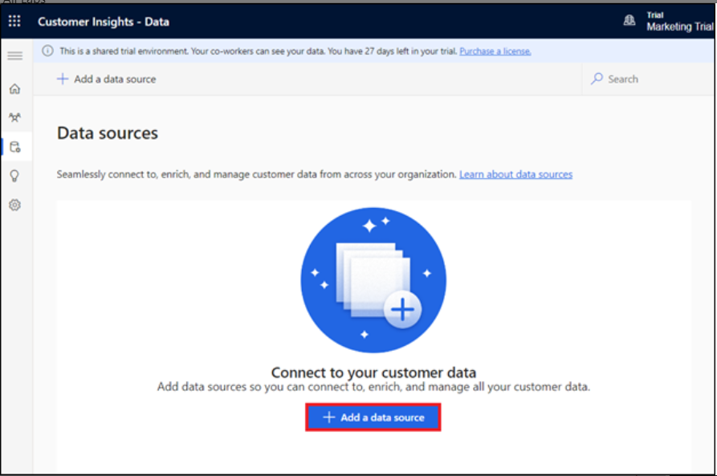
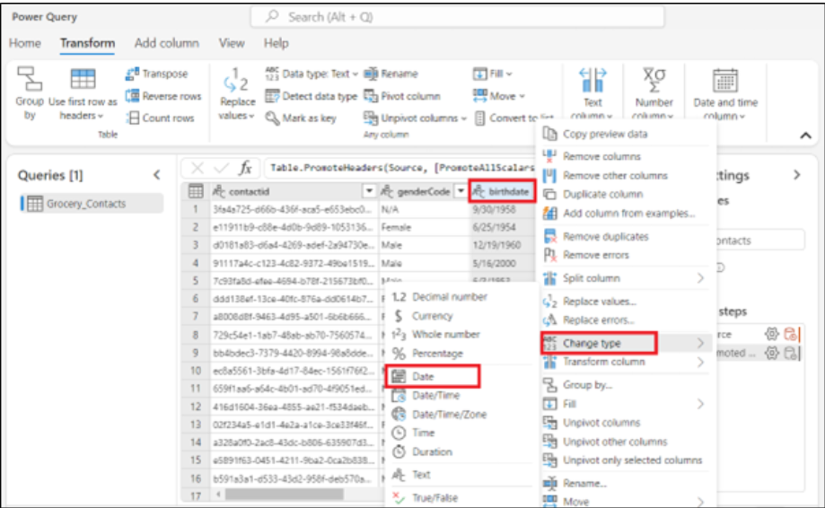

# 实验 11：使用 Copilot for Customer Insights 创建细分 - 数据（预览）

## 练习 1：添加数据

1.  使用给定的链接 [**https://home.ci.ai.dynamics.com/**](urn:gd:lg:a:send-vm-keys)访问您的
    **Customer Insights - Data** 环境。 从左侧导航栏中，选择 **Data \>
    Data sources**。

注意：关闭弹出窗口 – 在 Customer Insights – 数据中引入 Copilot。

2.  选择 **Add a data source**（添加数据源）。

3.  选择 **Microsoft Power Query**。

4.  在数据源的 **Data source Name** 中输入 **GroceryContacts**，然后选择
    **Next**。

5.  在 **Choose data source** 页面上，选择 **Text/CSV**。

6.  在 **Connection settings** （连接设置） 页面上，选择 **Upload file**
    （上传文件），然后选择 **Browse** （浏览）。

7.  从实验室 **VM** 的 **C：\LabFiles** 中选择
    **Grocery_Contacts.csv**。选择 “**Open**” 。

8.  选择 **Sign in**（登录），以登录您的帐户。

9.  输入您的 **Office 365 管理员租户**凭据。

10. 选择 **Next**（下一步）。

11. 在 **Preview file data** （预览文件数据） 页面上，选择 **Transform
    data** （转换数据）。

12. 在 **Transform data** 页面上，转到 **Transform** 功能区，然后选择
    **Use first row as headers \> Use first row as headers** 选项。

13. 右键单击 **birthdate** 列，转到 **Change type**
    （更改类型），然后选择 **Date** （日期）。

14. 按住键盘上的 **Ctrl**
    键选择以下列： **annualincome**, **msrc_creditscore**, **msrc_customerrelationshipduration**,
    和**msrc_distancetoneareststore**.

15. 突出显示这些列时，右键单击其中一列，转到 **Change type**
    （更改类型），然后选择 **Decimal number** （十进制数）。

16. 在右侧的 **Properties** 下，将 **Name**
    更改为 [**contact**](urn:gd:lg:a:send-vm-keys)，然后按 **Enter**
    键盘上的键。

17. 选择 **Next**（下一步）。

18. 在 **Refresh settings** （刷新设置） 页面上，选择 **Refresh
    manually** （手动刷新）。选择 **Save** （保存）。

19. 等待 Data source 添加成功。

20. 在 **Data sources** （数据源） 页面上，选择 **Add a data source**
    （添加数据源）。

21. 选择 **Microsoft Power Query**。

22. 在数据源的 **Data source Name**
    中输入 [**GroceryTransactions**](urn:gd:lg:a:send-vm-keys)，然后选择**Next**。

23. 在 **Choose data source** 页面上，选择 **Text/CSV**。

24. 在 **Connection settings** （连接设置） 页面上，选择 **Upload file**
    （上传文件），然后选择 **Browse** （浏览）。

25. 从实验室 **VM** 的 **C：\LabFiles** 中选择
    **Grocery_transaction.csv**。单击 **Open**。

26. 上传文件后，选择 **Next**。

27. 在 **Preview file data** （预览文件数据） 页面上，选择 **Transform
    data** （转换数据）。

28. 与以前一样，转到 **Transform** 并选择 **Use first row as headers \>
    Use first row as headers**。

29. 滚动并选择 **msrc_transactiontimestamp** 列。右键单击该列，选择
    **Change type** （更改类型），然后选择 **Date/Time（**日期/时间）。

30. 按住键盘上的 **Ctrl** 键以选择 **msrc_transactionamount** 和
    **msrc_discountappliedamount** 列。右键单击其中一列，转到 **Change
    type** （更改类型），然后选择 **Decimal number** （十进制数）。

31. 选择 **Next**（下一步）。

32. 在 **Refresh settings** （刷新设置） 页面上，选择 **Refresh
    manually** （手动刷新）。选择 **Save** （保存）。

33. 等待 Data source 添加成功。

# 练习 2：统一数据

1.  在 **Customer Insights - Data** 中，展开左侧导航窗格中的
    **Data**，然后选择 **Unify**。

2.  在 **Customer data** （客户数据） 区域选择 **Get started**
    （开始）。

3.  在 **Describe the customer data to be unified** 页面上，选择
    **Select tables and columns** 按钮。

4.  选择 **contact** 和 **Grocery_transaction** 表，然后选择 **Apply**。

5.  选择 **contact** 表，然后选择 **contactid** 作为主键。

6.  选择 **Grocery_transaction** 表，然后选择 **msrc_transactionid**
    作为主键。选择 **Next**（下一步）。

7.  在 **Define deduplication rules** 页面上，单击 **Next**。

8.  在 **Define matching rules** 页面上，按以下顺序设置表：**contact**
    和 **Grocery_transaction**。

9.  确保为所有表选中 **Include all records** 复选框。

10. 选择 **Grocery_transaction** 表旁边的 **+ Add rule**。

11. 选择 **contactid** 和
    **msrc_customerid**，然后将规则命名为 [**contacttransactions**](urn:gd:lg:a:send-vm-keys)。选择
    **Done**。

12. 选择 **Next**（下一步）。

13. 在 **Unified data view** （统一数据视图）
    页面上查看和编辑如何将源数据合并到 Unified customer fields
    （统一数据视图） 中。单击 **Next**。

14. 在 **Review and create customer profiles**
    （查看并创建客户配置文件） 页面上，选择 **Create customer profiles**
    （创建客户配置文件）。

15. 此过程需要几分钟才能完成。

16. 查看 **Customer data** （客户数据）、 **Deduplication rules**
    （重复数据删除规则）、**Matching rules** （匹配规则） 和 **Unified
    data view** （统一数据视图） **Unify** 页面上的字段。

## 练习 3：使用 Copilot for Customer Insights 创建客户细分 - 数据（预览）

1.  在 **Customer Insights - Data** 中，转到 **Insights \> Segments**
    ，然后选择 **+ New segment** 以创建细分。

2.  选择 Copilot 图标以打开 **Copilot** 窗格。

3.  输入区段的描述或选择建议的提示之一。例如，选择 **Customer who have a
    loyalty membership**（具有忠诚度会员资格的客户）。

4.  选择 **Use** 将结果应用于规则。

5.  选择 **Run** （运行）。

6.  在 **Review details** （查看详细信息） 页面上，在 **Name** （名称）
    字段中输入 **Loyalty membership**，然后选择 **Run** （运行）。

7.  现在已创建 **Loyalty membership** 段。

**注：** 如果生成的区段包含多个 [***relationship
paths***](https://learn.microsoft.com/en-us/dynamics365/customer-insights/data/relationships)，则默认情况下会使用最短路径。**编辑**区段以更改关系路径。
